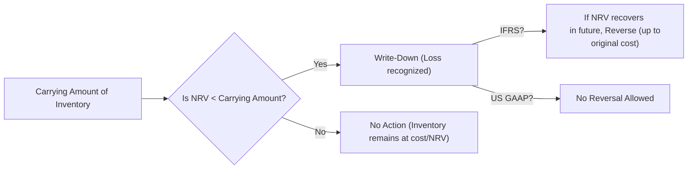

## Overview and Key Concepts

There’s an old saying in the retail business: “Bad inventory is like a hole in your boat.” You might not notice the damage for a while, but sooner or later, that hole starts to sink the ship. If you’ve ever managed a warehouse or even tried to sell personal items online, you’ve probably felt the pain of that leftover (and unsellable) stock. In Financial Statement Analysis, we capture that “pain” through inventory write-downs, write-offs, and, under certain accounting standards, reversals.

In this section, we’ll walk through the mechanics and implications of reducing inventory from its recorded (or “carrying”) amount to a new, lower value—sometimes down to zero—and, in rare cases, bringing it back up again. We’ll cover the main differences between IFRS and US GAAP, explore best practices, highlight potential pitfalls, and provide real-life examples to illustrate how this accounting process can significantly affect a company’s bottom line.

## Defining the Terms

### The Basics of Inventory Valuation
Inventory is initially recorded at cost—this might be the purchase price, conversion costs, and any other directly attributable expenses needed to get the inventory ready for sale. Over time, if the market changes or the items become obsolete, that initial cost may no longer reflect reality. Let’s remind ourselves of a few basics from earlier in this chapter (particularly Section 5.1 “Inventory Measurement and Valuation”):

• Under IFRS (IAS 2), inventory is valued at the lower of cost and net realizable value (NRV).  
• Under US GAAP (ASC 330), inventory is often valued at lower of cost or market, with market defined in a manner similar to replacement cost (although it’s typically constrained by NRV ceilings and floors).  

Regardless of whether you’re under IFRS or US GAAP, if inventory’s value to the business (the amount it can be sold for, net of finishing and selling costs) drops below the recorded cost, you have an impairment situation.

### Write-Downs
A write-down is a partial reduction in the carrying amount of inventory. Think of it like a discount in your accounting records. You realize, “Well, I can only sell these gadgets for $5 each, but I’ve been carrying them at $10 on the books.” So you reduce that $10 carrying amount to, say, $5 or $4, depending on what you think you’ll recover (net of selling costs).

• Typically recognized as an expense (“Loss on inventory write-down”) on the Income Statement.  
• Reduces your reported net income in the period of the write-down.  
• Also reduces inventory on the Balance Sheet.  

This partial loss in value can happen for many reasons: changes in consumer trends (remember when everyone rushed for fidget spinners?), new technology rendering your product outdated, or even poor forecasting of demand.

### Write-Offs
A write-off is essentially the “no going back” scenario for your inventory. It’s when you remove the asset from your books because it has zero future value. For example, maybe the entire batch of bananas in your grocery store warehouse rotted, or your high-tech microchips became completely obsolete thanks to a superior competitor product. If a write-down is a cautionary step (reducing value), a write-off is the final recognition that there’s absolutely no salvage value left.

From an accounting perspective, a write-off can look like a “100% write-down,” but practically speaking, it signals that management has completely given up on selling or even using the inventory. This also hits the Income Statement as an expense.

### Reversals (IFRS Only)
Under IFRS, if circumstances change and previously impaired inventory regains its value—maybe a supply shortage suddenly makes your old stock valuable again—then you’re allowed to reverse that earlier write-down. This typically cannot exceed the original carrying amount of the inventory before impairment.

Under US GAAP, such reversals are not permitted. Once you’ve taken an impairment, you can’t write inventory back up. This difference often surprises folks new to cross-border financial statement analysis and can cause comparability issues, especially for companies that adopt IFRS in markets where product prices can rebound significantly.

Here’s a simple flow diagram that captures the process:

## Reasons for Impairment: Why Do Write-Downs Occur?

• **Physical Deterioration:** Perishable goods like food and beverages have a limited shelf life.  
• **Obsolescence:** Technology evolves. A cool gadget from two years ago might be a relic today.  
• **Market Price Declines:** Commodity price drops or expensive competitor offerings might drive down the net realizable value.  
• **Overestimation of Demand:** If you thought you’d sell 10,000 units but only sold 4,000, you may be stuck with inventory that’s gathering dust.  
• **Damaged Goods:** Anything from poor handling to accidental spills can render inventory unusable.

From a management perspective, frequent write-downs can be an indicator of sloppy inventory management or poor demand forecasting. As an analyst, it’s worth paying attention if you see recurring write-downs over several quarters. There’s no shame in the occasional realignment for market changes, but repeated large impairments might raise red flags about operational efficiency or the reliability of management’s forward-looking statements.

## Accounting Treatment Under IFRS vs. US GAAP

### IFRS (IAS 2)
1. **Measurement:** Inventory is carried at Lower of Cost or NRV.  
2. **Write-Downs:** If NRV < Cost, the asset is written down, with a corresponding loss in the Income Statement.  
3. **Reversals:** If the reason for the write-down no longer exists or if NRV has increased, you can reverse the write-down (but not above the original cost). The reversal is recognized in the same Income Statement line item where the original write-down was recognized, usually as a gain (reducing cost of goods sold or reported as a separate inventory-related gain).

### US GAAP (ASC 330)
1. **Measurement:** Often measured at Lower of Cost or Market (though “market” typically approximates a constrained replacement cost—no higher than NRV and not lower than NRV less a normal profit margin).  
2. **Write-Downs:** The difference between the carrying amount and the new market-based measure is taken as a loss.  
3. **Reversals:** Prohibited. Once you write inventory down, you’re stuck with that new basis.  

Given these differences, IFRS statements can show inventory as an asset with a somewhat bounce-back effect if market conditions improve. US GAAP statements, however, follow a one-way street. For comparability, especially if you’re analyzing two global companies side by side, be sure to keep a keen eye on these rules.  

## Implications for Financial Statement Analysis

### Profitability
If you’ve spent hours analyzing profit margins and then the company announces a massive write-down—boom, net income plunges. This can affect all sorts of ratios, from gross margin to net profit margin, and might even violate certain debt covenants if it’s large enough.

### Liquidity and Solvency 
Write-downs decrease current assets, which can have knock-on effects for current ratios and quick ratios. A company with borderline liquidity might find itself in a tougher spot after booking a big impairment.

### Earnings Quality
Frequent or large write-downs call into question the reliability of management’s estimates. Sure, sometimes unforeseen circumstances happen (like a global pandemic shutting off supply chains), but repeated episodes of overvalued or obsolete inventory can suggest that a company or industry is in persistent trouble—or that management is using these adjustments to smooth earnings in certain periods.

### Red Flags for Analysts
• **Timing:** Are write-downs recorded at unusual times (e.g., right before a merger or management change)?  
• **Magnitude:** Is the size of the write-down unusually large compared to comparable firms?  
• **Frequency:** Are write-downs happening quarter after quarter?  
• **Reversals Under IFRS:** Is the company reversing write-downs frequently? Investigate how the new NRV was determined.  

## Real-World Example

Let’s say you’re analyzing a consumer electronics company called “TechNova.” Last year, TechNova introduced a new tablet, expecting it to become the market leader. They produced 50,000 units, but it turned out nobody liked the design. Now they’re stuck with 30,000 tablets in backstock. The original cost per tablet was $180, so the total cost is $5.4 million. Suddenly, TechNova realizes it can only sell these at $100 each (net of shipping and marketing). So, the net realizable value is $3 million (30,000 × $100).

• If they value the inventory at cost ($5.4M), that’s clearly overstated.  
• Under both IFRS and US GAAP, they’d need to reduce inventory to $3M and record a $2.4M loss ($5.4M − $3M).  

In the next quarter, imagine that TechNova partners with a streaming company to preload software on those tablets, and it’s able to sell them for $120 each. Now, under IFRS, TechNova might be allowed to reverse part of the write-down if the new net realizable value is indeed reliable. Let’s say the reversal can’t exceed the original cost, so TechNova can’t exceed $180 per tablet. In this scenario:
- The new carrying value would be $3.6M (30,000 × $120).  
- Partial reversal is $600,000 ($3.6M − $3.0M).  
- That reversal (a gain) flows through the Income Statement.

Under US GAAP, there’d be no such party. Once you’ve recognized that $2.4M loss, you cannot reverse any of it. TechNova’s inventory stays at $3M.

## Inventory Write-Downs in Practice (Personal Anecdote)

I remember a time early in my career when we had to write down a massive batch of electronic toys that were, let’s say, not as popular as the marketing team had forecast. We’d produced way beyond actual demand, and these items just sat in our warehouse collecting dust. I spent hours preparing the justification for management, breaking the bad news that we’d have to record a multimillion-dollar loss. Of course, I was nervous—I knew how it would look on our quarterly earnings.

But you know what? Sometimes transparency and a clear explanation of the root causes can actually build investor trust. We walked our shareholders through the demand mismatch and the steps we were taking to avoid similar mistakes in the future. After all the gloom around the write-down, we ended up reinforcing confidence by showing that we recognized our errors and were willing to correct them ahead of time.

## Practical Guidance and Best Practices

1. **Set Robust Inventory Policies**: Use technology like real-time inventory management systems and robust forecasting models (see also Chapter 16 on building forecasting models).  
2. **Perform Regular Assessments**: Continuous monitoring of sales trends and market conditions can help you identify potential impairments earlier.  
3. **Be Consistent in Methodology**: If IFRS allows reversals, treat them carefully and consistently across all product lines.  
4. **Enhance Disclosures**: Provide clarity on your methodology for write-down calculations, the assumptions made in determining NRV, and the rationale for any reversals.  
5. **Watch for Earnings Management**: Sometimes managers might “take a bath” in a bad year by writing off lots of inventory, artificially boosting future years’ profits when sales pick up again.  

## Illustrative Numeric Example

Below is a concise numeric example demonstrating the impact of a write-down under US GAAP vs. IFRS (assuming a possible future reversal for IFRS):

|                       | Day 1: Original Cost | Day 60: Revaluation | Day 180: Reversal (IFRS) |
|-----------------------|----------------------|---------------------|--------------------------|
| Inventory (units)     | 1,000               | 1,000               | 1,000                    |
| Cost per unit         | $50                 | –                   | –                        |
| Total cost            | $50,000             | –                   | –                        |
| NRV per unit          | –                   | $40                 | $45                      |
| Carrying Value        | $50,000             | $40,000             | $45,000 (IFRS only)      |
| Write-Down            | –                   | $10,000             | –                        |
| Write-Down Reversal   | –                   | –                   | $5,000 (IFRS only)       |
| Final NRV recognized  | –                   | $40,000             | $45,000 (IFRS only)      |

Observations:

- At Day 60, both IFRS and US GAAP recognize a $10,000 impairment (from $50,000 to $40,000).  
- By Day 180, under IFRS, if the new NRV is $45,000, the inventory is written back up by $5,000. Under US GAAP, there’s no change—inventory remains at $40,000.  

## Impact on Financial Ratios

• **Gross Margin:** Write-downs are often included in Cost of Goods Sold (COGS). Thus, the gross margin can drop significantly during the period of the impairment.  
• **Inventory Turnover:** If you reduce average inventory, the turnover ratio might artificially appear more favorable. It’s important to examine footnotes to see if a big write-down impacted these calculations.  
• **Current Ratio (Current Assets ÷ Current Liabilities):** Because current assets decrease after a write-down, the current ratio declines.  
• **Debt Covenants and Loan Agreements:** Sudden drops in net income and changes in key ratios can put a company in breach of certain lending covenants.

## Exam Relevance and Tips

As you prepare for the CFA exam, keep in mind:

• **Cross-Comparisons:** Be ready to identify how IFRS vs. US GAAP differences in inventory reversals can affect ratio analysis.  
• **Scenario Applications:** Contextual clues in item-set vignettes might point you to ongoing operational issues.  
• **Written Responses:** In short-answer or essay-style questions, highlight both immediate accounting impacts and broader implications for financial analysis.  
• **Time Management:** When you see complex scenarios involving inventory valuation, streamline your approach by focusing on the key difference: IFRS might allow reversals, GAAP won’t.  

## Conclusion

Inventory write-downs, write-offs, and reversals might sound like technical inconveniences, but they have real ramifications for a company’s reported performance and financial health. They offer insights into operational efficiency, management forecasting capabilities, and potential red flags for analysts on the lookout for earnings manipulation. By carefully understanding (1) how these adjustments arise, (2) why the differences exist between IFRS and US GAAP, and (3) how to interpret them when performing ratio analysis, you’ll be better equipped to evaluate a company’s true economic picture. After all, we never want to ignore that potential hole in the boat.

## References and Additional Reading

• International Accounting Standard (IAS) 2: Inventories  
• US GAAP (ASC 330) on Inventory  
• CFA Institute, “Financial Reporting and Analysis,” Official Curriculum  
• “Interpretation and Application of Generally Accepted Accounting Principles” by Wiley  
• For a closer look at advanced inventory management systems, see our discussion in Chapter 16 on data analytics in forecasting.  

------------------------------------------------------------------------------------

## Test Your Knowledge: Inventory Write-Downs, Write-Offs, and Reversals



### Which of the following statements best describes an inventory write-down?

- [ ] It is the complete removal of inventory from the Balance Sheet.  
- [x] It is a partial reduction in the recorded value of inventory.  
- [ ] It is the increment of the listed cost of inventory.  
- [ ] It is an adjustment only allowed under US GAAP.  

> **Explanation:** A write-down reduces the carrying amount of the inventory on the Balance Sheet when its net realizable value falls below cost; it’s considered a partial reduction.  

### Under IFRS (IAS 2), when is reversal of an inventory write-down permitted?

- [ ] Reversals under IFRS are never permitted.  
- [x] A reversal is permitted if the market value of the inventory recovers, but only up to the original cost.  
- [ ] Reversal can occur as long as the new fair market value exceeds the inventory’s historical cost.  
- [ ] A reversal is permitted but cannot exceed any previously recorded revaluation surplus.  

> **Explanation:** IAS 2 allows a write-down reversal if the new NRV has increased, with the limitation that the new carrying amount cannot exceed the original cost of the inventory.  

### Which of the following is true about a write-off?

- [x] It typically removes the inventory entirely from the books.  
- [ ] It is tracked as a minor expense increase with no Balance Sheet impact.  
- [ ] It can be reversed under US GAAP.  
- [ ] It always involves transferring costs to a Capital Expenditures account.  

> **Explanation:** A write-off usually signals the inventory has no remaining value, so it’s eliminated from the Balance Sheet.  

### How does a write-down affect the financial statements?

- [x] It decreases both the Balance Sheet asset value (inventory) and net income.  
- [ ] It increases the current assets and net income.  
- [ ] It is only disclosed in footnotes and has no impact on the primary statements.  
- [ ] It typically leads to an increase in equity.  

> **Explanation:** A write-down reduces the carrying value of inventory and is recognized as an expense on the Income Statement, thus reducing net income.  

### Why might frequent or large inventory write-downs be a warning sign to analysts?

- [x] They may indicate poor inventory management or recurrent overestimation of demand.  
- [ ] They suggest future guaranteed inventory reversals.  
- [x] They can reflect potential earnings management methods, such as “big bath” accounting.  
- [ ] They typically indicate no change in operational efficiency.  

> **Explanation:** Frequent write-downs can signal chronic overproduction, demand misalignment, or management’s strategy to smooth earnings.  

### What is net realizable value (NRV) in the context of inventory valuation?

- [x] The estimated selling price in the ordinary course of business, less estimated costs to complete and sell.  
- [ ] The historical cost of inventory on the date of acquisition.  
- [ ] A book value set by the Board of Directors.  
- [ ] A legal minimum set by government regulations.  

> **Explanation:** NRV is determined by taking the expected selling price and subtracting estimated completion and disposal costs.  

### Under US GAAP, once an inventory write-down is recorded, can it be reversed in subsequent periods?

- [x] No, inventory write-downs are permanent under US GAAP.  
- [ ] Yes, inventory write-downs are reversed if there is at least a 10% increase in market price.  
- [x] No, unless a third-party appraisal is obtained.  
- [ ] Yes, but only if the inventory is still unsold after 12 months.  

> **Explanation:** US GAAP does not allow the reversal of previously recognized inventory write-downs.  

### In what way can a significant write-down affect a company's liquidity ratios?

- [x] It decreases current assets, which may lower the current ratio.  
- [ ] It increases current assets, making the current ratio rise.  
- [ ] It has no effect on liquidity ratios.  
- [ ] It only affects long-term assets, not current assets.  

> **Explanation:** Because a write-down reduces the value of current assets (inventory), it typically lowers liquidity ratios such as the current ratio.  

### What factor would most justify a write-off rather than a write-down?

- [x] The inventory is completely worthless, with no potential for sale.  
- [ ] There is the potential for partial resale.  
- [ ] The inventory has an estimated net realizable value of 75% of cost.  
- [ ] The inventory is considered fully hedged with derivatives.  

> **Explanation:** A write-off is recorded when there is no future economic benefit (zero value) for the inventory.  

### True or False: Under IFRS, an inventory write-down can be reversed to any amount as long as it's below original cost.

- [x] True  
- [ ] False  

> **Explanation:** IFRS allows reversing an inventory write-down, as long as the carrying amount after reversal is not above the original cost.


