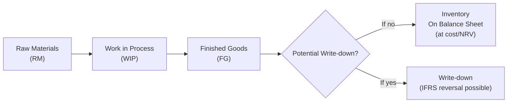

## Overview

When you pop open a company’s financial statements—especially if you’re just casually skimming—you might be tempted to skip all those dense notes at the back. But, um, if we talk about inventory, those footnotes are actually gold. The footnotes to financial statements reveal vital data on how a firm values its inventory, any adjustments (like write-downs or reversals), and the breakdown of inventory categories (raw materials, work in process, finished goods). All these details can significantly affect ratio analysis, earnings quality, and your overall opinion on the firm’s financial health. 

Below, we’ll explore what’s commonly disclosed, how to interpret it, and why it matters for an analyst looking to dig deeper into the reality behind the numbers. We’ll also toss in a few real-life tidbits, some best practices for analysis, and a short discussion of IFRS vs. US GAAP differences for completeness.

## Common Disclosures in the Footnotes

### Valuation Method
Companies typically state whether they use FIFO (First-In, First-Out), LIFO (Last-In, First-Out), weighted average cost, or specific identification. They also mention if different product lines are valued under different methods. For instance, it’s not unusual for a company to use:
• LIFO for a stable commodity with rising prices, potentially lowering reported taxable income under US GAAP.  
• FIFO for perishable goods or a separate product line.  

Under IFRS (IAS 2), LIFO isn’t permitted. That’s already a big difference from US GAAP, where LIFO is still allowed (though less common internationally). Seeing a shift from LIFO to FIFO could meaningfully increase or decrease reported inventory values.

### Write-Downs and Potential Reversals
Footnotes also reveal the amount of any inventory write-down recognized during the period—plus the reasons behind it. Maybe there was an unexpected drop in market prices or some obsolescence that management discovered. Under IFRS, companies can reverse write-downs if the market recovers and certain conditions are met. Meanwhile, under US GAAP, once you write down inventory, you typically can’t reverse it. 

It’s crucial to examine these disclosures. A large or recurring inventory write-down might indicate a pattern—perhaps your firm is consistently overestimating demand or it’s losing track of older product lines. And if the company keeps reversing write-downs in subsequent periods under IFRS, you might wonder if management is playing games with timing.

### Classification of Inventory
The footnotes generally break out inventory into:
• Raw Materials (RM)  
• Work-in-Process (WIP)  
• Finished Goods (FG)  

Seeing a big jump in WIP might indicate that production is ramping up (good sign) or that there are operational bottlenecks (less good). A large portion of finished goods could mean the company is all set for a big holiday season push—or it might mean demand is faltering, and the firm is stuck with unsold stock. Reading this classification year-over-year can really illuminate a company’s operational trends.

### Additional Segment or Geographic Breakdowns
Multinational or multi-line businesses often give a more granular perspective: how much inventory each division or region holds, whether segments rely on different valuation methods, or if certain regions have disproportionate write-downs. If, say, an electronics segment consistently posts higher write-downs than a furniture segment, that might confirm that the electronics side is more prone to obsolescence.

### Justification and Management Assumptions
Footnotes often touch on management’s estimates, like anticipated selling prices, expected costs of completion, or how quickly inventory will sell. These assumptions feed directly into calculations for net realizable value (NRV). You want to look for any changes in assumptions, especially if they significantly shift the carrying value of inventory from one period to the next.

## Why These Disclosures Matter for Analysis

### Impact on Profitability and Ratios
Inventory is a huge asset for manufacturing and retail firms. If it’s overstated, the company’s profitability might look artificially high. If it’s understated (due to a big LIFO reserve, for example), the profitability might appear lower than comparable peer firms. You’ll see the effect on:
• Gross Margin and hence Net Income  
• Inventory Turnover (COGS / Average Inventory)  
• Days Inventory on Hand  

A sudden shift in inventory valuation assumptions can distort these metrics. That’s why each one of these disclosures is like a puzzle piece that helps you see the bigger picture.

### Comparability across Periods
Footnotes show you changes in inventory accounting policies—maybe they switched from FIFO to weighted average, or changed the approach they use to estimate obsolescence. By reading the details, you can restate historical data or at least note the difference so you can do an apples-to-apples comparison. For instance, if a change from LIFO to FIFO artificially boosted reported net income, you’ll know to watch out for an inflated performance trend.

### Red Flags
• Frequent manipulation or reversing of inventory write-downs under IFRS.  
• Substantial changes to inventory valuation policies without transparent justification.  
• Sudden decline in inventory turnover that conflicts with management’s positivity in earnings calls.  

## A Visual Look at Inventory Flows

Below is a simple Mermaid diagram illustrating how inventories progress from raw materials to finished goods—and the branching step where a write-down or reversal can occur:



This might seem straightforward, but each of these steps can be profoundly influenced by the valuation method, demand assumptions, and corporate policies spelled out in the footnotes.

## Year-to-Year Comparison and Trend Analysis

Comparability is key. When reading footnotes, ask yourself:
• Has the firm consistently used the same valuation method across periods?  
• Why did any changes occur, and how did that affect net income or retained earnings?  
• Are the percentages of RM, WIP, and FG in line with industry peers? If not, is there a valid explanation?  

For instance, I once bumped into a manufacturing firm that disclosed a big jump in finished goods inventory in Q4 and attributed it to strong seasonal demand. Yet, in the audited annual report, the footnotes revealed actual Q1 sales were slow, leaving them with unsold stock. They had to discount heavily to clear goods in Q2, which hammered their margins. Had you not read the footnotes, you’d have missed that early sign.

## Practical Python Snippet

If you’re feeling adventurous, you might parse a company’s footnote disclosures automatically from XBRL data. Here’s a very simplified snippet showing how one could read in a CSV file containing footnote tags for an “InventoryDisclosure” item. Obviously, in the real world, footnote parsing is more complicated, but this snippet offers a tiny taste of how you might get started automating data collection:

```python
import csv

footnotes_data = []
with open('inventory_footnotes.csv', 'r') as f:
    reader = csv.DictReader(f)
    for row in reader:
        if 'InventoryDisclosure' in row['concept']:
            footnotes_data.append(row['value'])

for note in footnotes_data:
    print(note)
```

Maybe it’s nerdy, but such automation can save a lot of time if you’re analyzing multiple companies.

## Industry Norms and Gathering Insights

It’s smart to compare the disclosed information with typical industry expectations. For example:
• High-end fashion might require bigger obsolescence reserves because trends shift so quickly.  
• Commodity-driven industries might see more consistent inventory turnover but also higher sensitivity to price fluctuations.  
• Tech hardware might show quick inventory turnover but also frequent write-downs for older models.  

Feel free to do a peer comparison by reading competing firms’ footnotes. If a competitor’s footnotes detail less variation in write-downs, but your firm’s footnotes show large swings, that could prompt further investigation.

## IFRS vs. US GAAP: Key Differences

• IFRS (IAS 2) disallows LIFO, while US GAAP permits it.  
• IFRS allows for a reversal of an inventory write-down if subsequent conditions warrant it; US GAAP does not.  
• Under both systems, you’ll see footnotes that outline the chosen cost formula and any changes in policy.  

These differences can lead to significantly different inventory values and cost of goods sold (COGS), so a simple cross-jurisdiction note in the footnotes can have big performance implications.

## Exam Relevance and Final Tips

In a CFA exam context, especially if you’re facing item set questions involving inventories, keep these points in mind:

• Footnote Disclosures: Expect a question about analyzing changes in policies or how a write-down affects the financial statements.  
• Impact on Ratios: You might be asked to recast a firm’s ratios under a different valuation method or to assess how a write-down or reversal influences gross margin.  
• Comparability: A typical question might show two firms—one using LIFO, another using FIFO—and ask which adjustments are needed to make a valid comparison.  

And a final bit of exam-day advice: read not just the main body of the financial statements but also any additional notes, particularly those referencing inventory. The understated details in the footnotes often carry the big “Aha!” moments that the exam might want you to catch.

## References

• White, G. I., Sondhi, A. C., & Fried, D. (2020). Analysis of Financial Statements.  
• PCAOB guidance on inventory and related disclosures: https://pcaobus.org/  
• IAS 2, Inventories, IFRS Consolidated without early application (Your IFRS standards library)  

---

## Inventory Disclosures and Analytical Insights Practice Quiz



### 1. Which statement regarding LIFO under IFRS is most accurate?

- [ ] LIFO is allowed, just not preferred.  
- [ ] LIFO is recommended for durable goods.  
- [x] LIFO is prohibited.  
- [ ] LIFO is only allowed for small private firms.  

> **Explanation:** Under IAS 2 (IFRS), the LIFO method is explicitly disallowed.  

### 2. When a company discloses significant inventory write-downs, what is most likely the analyst’s primary concern?

- [x] That management’s inventory forecasting may be too optimistic.  
- [ ] That the company has overstated its accounts receivable.  
- [ ] That the firm’s capital structure is too leveraged.  
- [ ] That intangible assets exceed physical assets.  

> **Explanation:** Large or continual inventory write-downs can suggest that the firm consistently overestimates demand or holds obsolete products.  

### 3. An analyst observes that a company reversed part of its prior-year inventory write-down. Under IFRS, what condition most likely justifies this action?

- [ ] The board of directors authorized it.  
- [ ] The chief financial officer changed the cost method.  
- [x] The selling price of previously written-down items recovered.  
- [ ] The company filed for bankruptcy protection.  

> **Explanation:** IFRS allows a reversal of inventory write-down if the net realizable value has genuinely recovered.  

### 4. If a US GAAP reporter decides to switch from LIFO to FIFO without thorough explanation in the footnotes, which red flag might be raised?

- [x] The possibility of earnings management to increase reported profits.  
- [ ] The firm is using an appropriate method allowed under IFRS.  
- [ ] The company recognized a large intangible asset.  
- [ ] The firm’s audit opinion is automatically disclaimed.  

> **Explanation:** Changing from LIFO to FIFO can increase reported net income and inventory balances, potentially raising earnings management concerns if poorly explained.  

### 5. All else being equal, which inventory valuation method generates the highest reported COGS during a period of rising prices?

- [ ] FIFO.  
- [x] LIFO.  
- [ ] Weighted average cost.  
- [ ] Specific identification.  

> **Explanation:** Under US GAAP, LIFO assumes the most recent (more expensive) costs are recognized first, leading to higher COGS in a rising-price environment.  

### 6. A firm discloses a large Work-in-Process balance. Which scenario is least likely?

- [ ] The firm might be ramping up production for a major seasonal demand.  
- [ ] There could be mechanical/operational bottlenecks.  
- [ ] The firm is experiencing a labor strike in the final assembly process.  
- [x] The firm’s intangible assets are worthless.  

> **Explanation:** A large WIP doesn’t implicate intangible asset quality directly. It typically indicates production is underway or there might be supply chain or operational delays.  

### 7. Which of the following best explains why IFRS or US GAAP requires separate disclosures for raw materials, WIP, and finished goods?

- [x] The mix of inventory types can provide insight into production processes and potential future sales.  
- [ ] It is purely a legal requirement for tax returns.  
- [ ] It is only relevant for small private companies.  
- [ ] It always increases reported net income.  

> **Explanation:** Breaking down inventory types helps stakeholders understand operational efficiency and gauge how soon inventory will turn into revenue.  

### 8. Under IFRS, an inventory write-down is measured by comparing:

- [ ] Historical cost to replacement cost only.  
- [ ] Market value to salvage value.  
- [x] Carrying amount to net realizable value.  
- [ ] Present value of future cash flows to salvage value.  

> **Explanation:** IAS 2 states that inventories are carried at the lower of cost or net realizable value (NRV).  

### 9. Which factor is most important to consider when analyzing a firm’s year-to-year inventory footnote disclosures?

- [ ] Changes in the tax rate.  
- [x] Changes in valuation assumptions or methods.  
- [ ] The inclusion of intangible assets on the balance sheet.  
- [ ] The issuance of new equity shares.  

> **Explanation:** Adjustments to valuation assumptions or changes from one method (e.g., LIFO) to another (e.g., FIFO) can significantly impact reported financials, so they require careful analysis.  

### 10. True or False: Under US GAAP, a previously recognized inventory write-down can be reversed if the market price recovers.

- [ ] True  
- [x] False  

> **Explanation:** US GAAP does not allow inventory write-down reversals once taken.  


