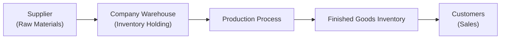

## Overview

Inventory management might seem like a straightforward topic—just keep track of what you have and make sure you don’t run out. But, trust me, it’s often more complicated than that. A few years ago, I sat in on a meeting with a small manufacturing firm that was unintentionally sitting on half a year’s worth of raw materials. We looked at the firm’s financial statements, and you could practically see the stress on their liquidity. They were spending so much cash on holding costs that it was chipping away at their margin. And you know what’s funny? They didn’t even realize how deeply this was impacting both their profitability and their short-term solvency ratios until we walked them through the numbers. 

Below, we’ll explore the multifaceted ways that inventory management influences a company’s profitability, liquidity, and cash flow. We’ll also examine how large inventory write-downs can affect leverage and solvency ratios. Finally, we’ll wrap up with some real-world observations and best practices. If you want to dig deeper into specific inventory valuation methods under IFRS or US GAAP, you might check out Section 5.2 in this volume, which covers the details of FIFO, LIFO, and weighted average cost assumptions.

## Linking Inventory to Profitability

### Lowering Holding Costs and Enhancing Margins
Inventory mismanagement—like overstocking, failing to track expiry dates, or ignoring changing consumer demand—can inflate carrying costs (storage, insurance, risk of obsolescence). This translates directly into reduced margins. For instance, if a retailer significantly overestimates demand for a new clothing line, they eventually face markdowns or, worse, total write-offs, which cut into their gross profit.

On the other hand, tight control over inventory levels and turnover can boost profitability. An ideal scenario is where a company balances having enough stock on hand to meet demand (and not lose sales) while minimizing the cost of holding excess goods. When you see strong inventory turnover, it often indicates that a firm is selling its products quickly and profitably.

A classic ratio to watch here is the Inventory Turnover ratio:

(1)  

\text{Inventory Turnover} = \frac{\text{Cost of Goods Sold}}{\text{Average Inventory}}


A higher turnover ratio typically suggests efficient inventory management—less money just sitting on the shelves. But one caveat: extremely high turnover could mean the company risks stockouts, which may turn away customers. 

### Write-Downs and Impact on Net Income
Another aspect of profitability is the risk of inventory becoming obsolete or worth less than its carrying cost. If that happens, under IFRS, you have to write the inventory down to net realizable value. US GAAP has similar guidelines—especially if the inventory is considered compromised, outdated, or otherwise unsellable at normal prices.

Such write-downs flow through the income statement and reduce net income. In industries where product cycles are fast (e.g., consumer electronics), you might see write-downs appear regularly. This can erode margins and create uncertainty for investors and creditors. From a profitability perspective, you don’t want these write-downs to become a habit—analysts and examiners typically see persistent write-downs as a sign of either weak demand forecasting or sloppy inventory management.

## Liquidity Effects of Inventory Management

### Working Capital and the Cash Conversion Cycle
Working capital, which is current assets minus current liabilities, reflects a firm’s capacity to cover its short-term obligations. Inventory is an essential part of current assets for many companies. If you carry too much inventory, you’re tying up funds that could otherwise be used for expansion, debt repayment, or something else with immediate returns.

The Cash Conversion Cycle (CCC) is often used to understand the time it takes a firm to convert inventory into sales and, ultimately, collect cash:

(2)  

\text{CCC} = \text{Days Sales Outstanding (DSO)} + \text{Days Inventory on Hand (DIOH)} - \text{Days Payables Outstanding (DPO)}


The DIOH portion of this formula:

(3)  

\text{Days Inventory on Hand} = \frac{\text{Average Inventory}}{\text{Cost of Goods Sold}} \times 365


A high DIOH indicates that the firm is sitting on goods for a longer time, delaying the ability to turn those goods into cash. In other words, if your inventory is piling up, your working capital may be locked in unsold products. This can hamper your whole operation’s liquidity, making it tough to pay near-term bills or seize new investment opportunities.

### Storage and Financing Costs
Carrying substantial inventory can create additional costs like warehousing and insurance. Companies occasionally finance their inventory purchases with short-term or revolving debt. If the firm’s inventory levels are very high, the associated interest expenses can weigh on liquidity. Think of it this way: each additional box in the warehouse may literally represent a cost to borrow the money used to buy that box in the first place.

## Cash Flow Implications

### Over-Investment in Inventory
Over-investment in inventory ties up cash, reduces free cash flow (FCF), and in some cases forces firms to seek external financing. This can affect not only short-term liquidity but also yield increased financial risk if interest rates rise or creditors tighten lending conditions. 

Let’s say you have a manufacturing company that has a 100-day lead time for sourcing a critical raw material. These guys might be tempted to stock up on it to avoid supply chain disruptions. But if demand is volatile, there’s a real possibility that a chunk of this raw material could remain unused or be used far later than originally planned. That scenario impacts the company’s net operating cash flow because cash is spent long before the product is sold.

### Shorter Cash Conversion Cycle, Stronger Liquidity
In an ideal environment, you want to match payables and receivables so you’re not forking out large sums of money prematurely. A shorter CCC helps ensure that your firm has enough liquidity at any given time. If your inventory stays too long in your hands, you can’t turn it into cash quickly, and that can mean potential trouble—whether it’s difficulty making payroll, handling interest payments, or meeting loan covenants.

## Leverage and Solvency

### Inventory Write-Downs and Shareholders’ Equity
Large write-downs don’t just dent profits; they also eat away at the equity section of your balance sheet. If you reduce inventory values, your total assets go down, and if liabilities remain unchanged, your retained earnings (and thus equity) will also shrink. When equity falls, leverage ratios such as Debt-to-Equity (D/E) can spike:

(4)  

\text{Debt-to-Equity Ratio} = \frac{\text{Total Debt}}{\text{Total Shareholders' Equity}}


All of a sudden, your capital structure might look riskier to lenders and rating agencies. In more extreme cases, consistently large or repeated write-downs could trigger covenant violations, higher interest rates, or additional collateral requirements.

### Interest Coverage and Creditworthiness
For many firms, interest coverage (Operating Income / Interest Expense) is a key solvency measure. If inventory mismanagement leads to decreased profitability, you might have a harder time covering interest obligations comfortably. Over the long term, if the market perceives that you have poor inventory management, you might see an uptick in your cost of debt or face tough negotiations with banks.

## Optimizing Inventory Levels

### Balancing Reorder Quantity and Timing
One approach to optimizing inventory is the Economic Order Quantity (EOQ) model, which tries to minimize total inventory costs by balancing ordering costs (like shipping fees or setup costs) with carrying costs:

(5)  

\text{EOQ} = \sqrt{\frac{2 \times \text{Annual Demand} \times \text{Ordering Cost}}{\text{Carrying Cost per Unit}}}


While EOQ can be a theoretical model, it offers a good starting point for figuring out how frequently to reorder. Many companies also integrate just-in-time (JIT) principles to keep minimal inventory on-site, though this demands robust supplier relationships and consistent quality checks.

### Inventory Control Systems
Real-time inventory management systems and enterprise resource planning (ERP) software enable firms to monitor stock levels, forecast demand, and automate reorder triggers. These technologies help keep the conversation between sales forecasts, production, and purchasing open and immediate.

Inventory control can also be quite nuanced. Let’s say you run a chain of boutique bakeries known for your fresh pastries. You probably want to keep minimal raw materials on hand for perishable items (like certain fillings). But for flour, which has a longer shelf life, you might leverage your bargaining power with suppliers to order in bulk. It’s a constant balancing act.

### Visualizing Inventory Flows
Below is a simple Mermaid diagram illustrating how inventory flows from suppliers to the company’s production line and ultimately to customers, highlighting key points where costs and timing decisions can affect profitability and liquidity.

In each stage (A to E), the firm must weigh timing and costs. Too much raw material or finished goods inventory in B or D can lead to higher carrying costs and inefficiencies.

## Analytical Approaches and Key Metrics

### Days Inventory on Hand (DIOH)
Days Inventory on Hand is a finer-grained measure of how efficiently a firm is turning inventory into finished products and sales. You might compare DIOH across the same sector or watch how it evolves over time for a single company. If it’s climbing significantly faster than industry peers, you’ll want to investigate the cause.

### Trend Analysis and Benchmarking
From an analyst’s perspective, you might compare a company’s inventory turnover or DIOH to its closest peers. If you notice a big discrepancy, dig into the details. Maybe the firm’s product mix is very different (longer shelf life vs. shorter shelf life), or maybe the firm is simply less efficient. Any shortfall in efficiency tends to show up eventually in the financial statements.

### Sensitivity Analysis
Because inventory can be a big chunk of current assets, slight changes in how it’s managed can ripple through to net income, working capital, and solvency ratios. Scenario or sensitivity analysis can help you see how changes in demand forecasts, lead time, or product mix might influence the company’s ratio profile.

## Strategies, Pitfalls, and Real-World Situations

• Over-Reliance on Forecasts: Demand forecasting is not always accurate. If a firm consistently overestimates demand, they’ll accumulate dead stock.  
• Neglected Product Lifecycle: Firms with seasonal or short-lifecycle products (e.g., electronics, fashion) risk big write-downs if they can’t move items quickly.  
• JIT Vulnerabilities: While JIT can minimize carrying costs, any disruption (natural disaster, labor strike) can cause raw material shortages and stall production.  
• Poor Coordination: Even with advanced ERP systems, inadequate communication between sales, procurement, and production can result in misaligned inventory.

## Conclusion and Final Exam Tips
Inventory management plays a starring role in shaping a firm’s profitability, liquidity, and solvency. You want to keep an eye on metrics like Inventory Turnover, DIOH, and the CCC. And remember, if you see large or frequent inventory write-downs, that’s a potential red flag—especially when analyzing a company’s long-term reliability and creditworthiness.

In a Level I exam scenario, you might face multiple-choice questions where you’re asked to calculate or interpret DIOH. At more advanced stages, you could see case-based questions requiring you to assess the impact of a firm’s inventory policy on both the balance sheet and the income statement. Here are some essential tips for exam preparation:

• Be comfortable with the formulas for Inventory Turnover, DIOH, and the Cash Conversion Cycle.  
• Know how inventory adjustments feed into net income, retained earnings, and solvency ratios.  
• Understand the interplay between inventory accounting methods (as discussed in Section 5.2 of this volume) and financial ratios.  
• Think critically about how real-world events (like supply chain disruptions) can affect inventory flows.

## References
• Muller, M. (2011). Essentials of Inventory Management. AMACOM.  
• Articles on working capital optimization strategies in Harvard Business Review.  
• IFRS (IAS 2): Inventories.  
• US GAAP (ASC 330): Inventory.  

## Test Your Knowledge: Inventory Profitability and Liquidity



### Which statement best describes the consequence of excessive inventory levels?

- [ ] It automatically enhances a company's profitability.
- [ ] It shortens the cash conversion cycle.
- [x] It ties up working capital and can reduce liquidity.
- [ ] It leads to reduced carrying costs over time.

> **Explanation:** Excessive inventory ties up cash in products that are not immediately converting into sales, which can reduce a firm’s liquidity and raise carrying costs.

### When a company writes down inventory due to obsolescence, which financial statement is most directly affected?

- [ ] Statement of Cash Flows
- [x] Income Statement
- [ ] Statement of Changes in Equity
- [ ] Auditor’s Opinion

> **Explanation:** A write-down is recognized as an expense on the Income Statement, which directly reduces net income.

### A higher inventory turnover ratio generally implies:

- [x] The company is selling inventory more efficiently.
- [ ] The company is likely overstocking.
- [ ] The company’s cash conversion cycle is necessarily longer.
- [ ] The company’s carrying costs are likely increasing.

> **Explanation:** High turnover typically indicates that the firm is rotating its inventory quickly, suggesting efficient management. Though extremely high turnover may bring risks of stockouts, it usually signals effective inventory control.

### Which ratio would an analyst look at to gauge short-term liquidity impacted by inventory levels?

- [ ] Debt-to-Equity Ratio
- [x] Current Ratio
- [ ] Gross Profit Margin
- [ ] Return on Equity

> **Explanation:** The Current Ratio focuses on the ability to meet short-term obligations with current assets, of which inventory is often a major component.

### What effect can large inventory write-downs have on a firm’s solvency ratios?

- [x] They can increase leverage ratios by decreasing equity.
- [x] They can cause lenders to reassess credit terms.
- [ ] They have no effect on solvency ratios.
- [ ] They improve interest coverage ratio.

> **Explanation:** When write-downs reduce the carrying value of inventory, total assets decrease and shareholders’ equity may also decline, which can worsen leverage ratios and raise credit concerns.

### Why is the Economic Order Quantity (EOQ) model used?

- [x] To minimize the total cost of ordering and holding inventory.
- [ ] To manage supply chain disruptions.
- [ ] To forecast revenue.
- [ ] To file regulatory reports more efficiently.

> **Explanation:** EOQ helps determine the optimal order quantity that minimizes ordering costs and carrying costs, aiming for maximum cost-effectiveness in inventory management.

### Which of the following best captures the main function of the Cash Conversion Cycle (CCC)?

- [x] It measures how long it takes to convert inputs into cash flows from sales.
- [ ] It tells investors the firm’s cost of capital.
- [x] It shows the interplay between inventory, receivables, and payables.
- [ ] It determines the maximum capacity of production.

> **Explanation:** The CCC calculates how long each net input dollar is tied up in the production and sales process before it is converted into cash received from customers.

### A firm with an extremely high inventory turnover ratio could be at risk of:

- [x] Stock-outs that lead to lost sales.
- [ ] Excessive carrying costs.
- [ ] Elevated days inventory on hand.
- [ ] Having leftover obsolete inventory.

> **Explanation:** A very high turnover ratio means the firm is quickly selling inventory but may run the risk of not having enough goods on hand to meet unexpected demand spikes.

### In analyzing liquidity, an abnormally high DIOH (Days Inventory on Hand) compared to industry peers may indicate:

- [x] Inefficient inventory management or potentially slow sales.
- [ ] A successful just-in-time program.
- [ ] A high demand forecast accuracy.
- [ ] A typical best practice in the industry.

> **Explanation:** If a company’s DIOH is significantly higher than competitors, it may suggest oversupply, underperforming demand, or poor cycle management.

### True or False: Large inventory build-up without corresponding sales usually enhances free cash flow.

- [ ] True
- [x] False

> **Explanation:** Increased inventory generally ties up cash, reducing free cash flow.  


