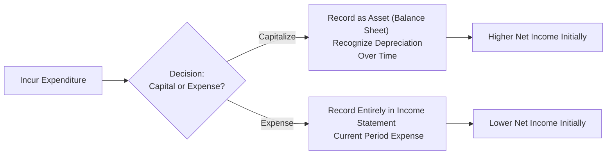

## Understanding the Fundamental Trade-Off

Let’s say you’re analyzing a company’s annual report—maybe you’re sipping your coffee and flipping through the notes to the financial statements—and you stumble across an interesting detail: the firm spent a hefty amount on new equipment. Or perhaps it did a major overhaul of an existing machine. Now the question is: should it recognize the entire cost as an expense right now (oof, that hits net income!), or should it capitalize the cost on the balance sheet (which spreads the impact over time)? Well, that’s the big idea behind capitalization vs. immediate expensing.

Though the concept might sound pretty straightforward, the implications can be massive. From the perspective of financial analysis, how a company treats large expenditures can change its short-term profitability, its long-term asset structure, and even the path of its future earnings. There is also an element of judgment (some might say “opportunity for creativity!”). So we’ll walk through the main criteria, common examples, possible red flags, and a few ways to keep an eye on companies’ capitalization policies.

## Key Criteria for Capitalizing Costs

When a firm decides to capitalize a cost, it essentially says: “This cost is going to deliver measurable benefits beyond this accounting period.” In other words, it’s not just for the immediate month or quarter. Under IFRS (specifically IAS 16) and US GAAP (ASC 360), there are broadly similar requirements for deciding whether to capitalize:

• The expenditure must be necessary to get the asset ready for its intended use.  
• It must be directly attributable—things like the purchase price, delivery and handling fees, installation costs, and site preparation.  
• If an outlay significantly enhances or extends the life of an existing asset (many folks like to call these “betterments,” “upgrades,” or “major overhauls”), it can also be capitalized.  
• Routine repairs and maintenance, on the other hand, generally do not qualify. They are typically expensed right away because they simply maintain the asset’s current performance but don’t improve or extend it.

Imagine you buy a new piece of production equipment for a manufacturing facility. That purchase price looks huge (and hey, so do the customs fees, shipping costs, and installation). Under IFRS and US GAAP, all of those items can be included in the capitalized cost if they are directly attributable to getting the equipment up and running.

### A Quick Example

Suppose Company A invests US$100,000 in a new machine plus an extra US$5,000 to deliver and install it. Under normal circumstances, the total US$105,000 is capitalized. If that same machine needed routine maintenance of US$1,000 every few months, that routine maintenance is just an expense. There is no future benefit from that US$1,000; it merely keeps things running at the previously established capacity.

## Immediate Expensing: The Short-Term Hit

Now let's talk about immediate expensing. This is pretty straightforward: an outlay is immediately recognized in the income statement as an expense in the period it’s incurred. This approach lowers current net income (sometimes significantly if the cost is large). After all, you’re pushing the entire cost onto the books right now. But once the cost is recognized, there’s no additional depreciation or amortization expense in future periods.

Why might a firm choose immediate expensing when a cost is borderline? Potentially, they could be engaging in a bit of income “smoothing.” Sometimes managers prefer to take a big hit in a period that’s already “bad” so they can set the stage for stronger reported earnings in the future—although the official standards are not about picking and choosing at whim, we know in practice that managers sometimes interpret certain rules in ways that might be beneficial for short-term optics.

## The Impact on Financial Statements and Ratios

### Balance Sheet Effects

• Capitalization: When you capitalize a cost, you debut it as an asset on the balance sheet. Over the coming periods, that asset is gradually reduced by depreciation or amortization. This approach “inflates” the asset base in the earlier years because you haven’t recognized all the cost upfront.  
• Immediate Expensing: There is no recognition on the balance sheet of anything new. Essentially, the company’s assets remain lower (or unchanged) compared to if those same costs had been capitalized.

### Income Statement Effects

• Capitalization: By deferring the cost and spreading it over time, the company’s current period expenses can be lower, leading to higher net income in the short run. However, subsequent periods will see depreciation or amortization, which reduces net income in those periods.  
• Immediate Expensing: More expense is recognized right away, which lowers current earnings—and ironically, can make future earnings look better since there’s no ongoing depreciation expense related to what’s already expensed.

### Cash Flow Statement Effects

A sneaky effect, but important for analysts:  
• If costs are capitalized, they typically appear as an outflow in the “Investing Activities” section of the cash flow statement (for property, plant, and equipment).  
• If they are expensed, you might notice the outflow in “Operating Activities” when the expense is recognized (depending on whether it’s a pure operating cost or an intangible R&D type cost with special rules).

### Ratio Analysis

Ratios like Return on Assets (ROA), Asset Turnover, and EBITDA margin can be influenced by the firm’s capitalization strategy. For instance:

• Capitalizing large costs inflates total assets on the balance sheet while deferring expenses, possibly boosting the current period’s net income. This can make ROA seem better in the short run because the denominator (total assets) might go up marginally, but the numerator (net income) can be significantly higher if major expenses are postponed.  
• Meanwhile, if a company expenses a larger chunk immediately, the short-term net income might drop, adversely impacting profitability ratios. Over time, though, the asset base doesn’t become as large, which might help certain turnover ratios.

## Quick Mermaid Diagram to Visualize the Flow

Below is a simple mermaid diagram illustrating how a cost flows through the statements under the two different treatments:

When the decision is to capitalize, the expense is spread over multiple periods. When the decision is to expense, the entire cost is recognized right away.

## Analytical Considerations (and Some Pitfalls)

If you’re an analyst, you’ll want to pay special attention to a company’s policies on capitalization, especially if you see unusual spikes in the volume or nature of costs capitalized. A few thoughts:

• Aggressive Capitalization: Companies might capitalize expenditures that arguably should be expensed (like routine maintenance) to boost short-term profits. This might mislead investors about profitability trends.  
• Industry Norms: Different industries have different typical capitalization rates vs. expensing. For instance, many software companies historically struggled with deciding whether to capitalize certain development costs.  
• Trend Analysis: Keep an eye on how capital expenditures evolve over time relative to the company’s scale, revenue, or capacity expansion. A sudden jump might reflect new product lines—or it might reflect a shift in accounting strategy.

One personal anecdote: years ago, I was looking at two retail companies. Both had big “store remodel” initiatives. Company X capitalized nearly everything from signage to painting, while Company Y was very conservative and expensed them outright. On the surface, Company X looked significantly more profitable. But it turned out they were just spreading their costs out over several years. When you adjusted for their accounting approach, the performance gap wasn’t nearly as large as their reported net incomes suggested.

## IFRS vs. US GAAP Perspectives

Both IFRS and US GAAP require that capitalized costs reflect expenditures necessary for the asset’s intended use or that enhance the asset’s future economic benefits. In IFRS, standards like IAS 16 (Property, Plant and Equipment) and IAS 38 (Intangible Assets) lay out the nitty-gritty. Under US GAAP, you’ll see similar guidelines in ASC 360 (for tangible assets) and ASC 350/730 (for certain intangible assets and R&D). The broad principle is the same, though details differ in certain areas (e.g., development costs for intangibles are more commonly capitalized under IFRS, while US GAAP usually expenses them unless they fall under specific software development guidelines).

## Real-World Example: Major Overhauls

Picture an airline upgrading aircraft with brand-new engines that extend the plane’s life by seven years. Under IFRS or US GAAP, it’s typically acceptable to capitalize the cost of this engine overhaul—assuming the upgrade extends the plane’s economic life well beyond normal repair. Over time, you’d depreciate the overhaul cost, often aligning with that new seven-year extension. Meanwhile, minor routine engine checks and part replacements are likely expensed immediately.

## Best Practices for Financial Analysis

• Understand the Company’s Policy: If you see “Capitalization of software development costs” or “Capitalization of overhauls” in the notes, figure out the thresholds or criteria the firm uses.  
• Adjust, if Needed: Some analysts recast the financial statements for comparability. For instance, if a company’s expense recognition is unusual, you might want to reclassify or approximate depreciation to see the “true” effect on earnings.  
• Watch for Shifts Over Time: A change in capitalization policy can drastically affect year-over-year comparisons. Sometimes it’s a clue that management is under pressure to report certain results.

## Illustrative Example with (Hypothetical) Numbers

Let’s do a short case to see how immediate expensing vs. capitalization can affect reported numbers:

Company B invests US$1,000,000 in a special production line. It either:  
1. Capitalizes and depreciates it evenly over 5 years (straight-line depreciation, no salvage value).  
2. Expenses the entire cost all at once.

Under scenario (1) for the first year, the depreciation expense is US$200,000 (1,000,000 ÷ 5). So net income is reduced by US$200,000 in Year 1, plus any other normal operating costs. The balance sheet includes the net book value of the equipment (US$800,000 after first-year depreciation).

Under scenario (2), net income is reduced by the full US$1,000,000 in Year 1. But from Year 2 onward, there’s no depreciation related to the initial outlay.

Year 1: 
• Scenario 1 net income is obviously higher than scenario 2, because it only records US$200,000 as expense. But scenario 1 also shows an asset of US$800,000 on the balance sheet.  
• Scenario 2 net income is lower (down by the full US$1M), but in Year 2, there’s no depreciation expense from this outlay. The balance sheet is smaller.

If you were analyzing these two scenarios in isolation, you’d see quite different pictures of profitability and asset base, even though the total cash flow is identical. Over time, total cost recognized in the income statement will be the same, but the timing difference can be huge.

## Exam Relevance and Constructed-Response Possibilities

In a CFA® context—whether you’re looking at exam questions at Level I, or bridging to more advanced scenario-based analysis at Level II or III—capitalization vs. expensing matters a ton for ratio analysis and for assessing earnings quality. You might get asked:

• How do you adjust an income statement when a previously capitalized cost should have been expensed?  
• In a scenario describing management’s policies, which line items are impacted by a shift from capitalization to expensing?  
• How do the changes in depreciation rates affect net income, ROA, and equity?

If you see a question that says, “Company X changed its policy this year from expensing major repairs to capitalizing them. Estimate the effect on net income and total assets,” you can walk through the logic we just discussed. Remember, the best approach is often to carefully reexamine the footnotes, figure out how big the shift is, and then recast the statements if needed.

## Practical Tips for the Exam

• Understand Definitions: Make sure you’re 100% clear on which costs can be capitalized and why.  
• Don’t Forget Depreciation Schedules: Once something is capitalized, it will normally flow through depreciation or amortization.  
• Look Out for Red Flags: Large jumps in capitalized costs from previous years might indicate an attempt to manage earnings.  
• IFRS vs. US GAAP Nuances: Be ready for a question that might highlight subtle differences, especially around intangible assets.  
• Practice Item Sets: Expect to see item sets or vignettes that give you footnotes describing partial capitalization. Then they’ll ask, “How does it affect Operating Cash Flow? Net income? Etc.”  
• The Big Picture: Constantly tie back to how capitalizing vs. expensing changes the next few years’ financial statements, not just the current year.

## References and Further Reading

- CFA Institute Level I Curriculum, Financial Reporting and Analysis.  
- IAS 16 – Property, Plant and Equipment (IFRS Foundation):  
  https://www.ifrs.org/issued-standards/list-of-standards/ias-16-property-plant-and-equipment/  
- FASB Accounting Standards Codification (ASC) 360 – Property, Plant, and Equipment:  
  https://fasb.org/  
- Kieso, Weygandt, and Warfield, “Intermediate Accounting,” for comprehensive coverage.  

## Test Your Knowledge: Capitalization vs. Expensing



### Under what circumstance is a cost most likely capitalized under IFRS or US GAAP?

- [ ] When the expenditure only benefits the current reporting period and does not enhance the asset's useful life.
- [ ] When the cost is for routine repairs or maintenance.
- [x] When the expenditure extends the useful life or significantly improves the asset.
- [ ] When the cost has no future economic benefit.

> **Explanation:** Costs should be capitalized if they extend the asset’s economic life or enhance its functionality beyond the original scope. Routine maintenance, which simply keeps the asset in working condition, is typically expensed.

### How does capitalizing a cost instead of expensing it affect the current period’s net income?

- [x] It typically increases current net income.
- [ ] It typically decreases current net income.
- [ ] It has no effect on current net income.
- [ ] It depends on interest rates in the borrowing market.

> **Explanation:** By deferring the expense over multiple periods (via depreciation), capitalizing costs usually leads to less expense in the current period, thus boosting net income compared to immediate expensing.

### Which statement is true regarding the impact on future periods if a cost is capitalized?

- [x] Future periods will have higher depreciation or amortization expenses, reducing net income in those periods.
- [ ] Future periods will not be affected because the cost has been recorded fully on the balance sheet.
- [ ] Future periods will have no additional expense related to the capitalized cost.
- [ ] Future periods’ net income is always higher than if the cost had been expensed.

> **Explanation:** When a company capitalizes a cost, the asset is depreciated or amortized over time, creating an expense that reduces net income in each subsequent period.

### What might an analyst infer if they observe a sudden large increase in capitalized costs for routine maintenance?

- [ ] The company has found a new, more efficient way to maintain assets.
- [ ] The company’s assets have an unexpectedly longer useful life.
- [x] The company may be inflating earnings by aggressively capitalizing costs that should be expensed.
- [ ] The company is simply adhering to IFRS 15 or ASC 606 on revenue recognition.

> **Explanation:** A sudden increase in capitalized costs for routine maintenance could signal a shift toward more aggressive accounting—potentially to boost profits.

### Which ratio is typically overstated if a company capitalizes costs rather than expensing them in the current period?

- [x] Return on Assets (ROA)
- [ ] Debt to Equity Ratio
- [x] Operating Margin
- [ ] Inventory Turnover

> **Explanation:** By capitalizing costs, the firm lowers current expenses and therefore increases net income. This boosts profitability metrics such as ROA or Operating Margin in the short term.

### Which is MOST likely to be recognized as an immediate expense (instead of capitalized) under IFRS?

- [x] A routine engine check on a plane that does not extend its useful life.
- [ ] The purchase of delivery equipment.
- [ ] Major structural improvements that substantially increase asset capacity.
- [ ] The cost to develop intangible software with future economic benefits.

> **Explanation:** Routine checks that do not extend the useful life of an asset or improve it beyond its original standard are expensed immediately.

### In analyzing financial statements, why is it important to review the footnotes regarding capitalized expenditures?

- [x] Footnotes can reveal changes in accounting policy that affect comparability.
- [ ] Footnotes only inform about dividends and share structure, not capitalized costs.
- [x] The notes might highlight unusual capitalizations that distort reported earnings.
- [ ] The footnotes are optional disclosures not required for IFRS or US GAAP.

> **Explanation:** By paying attention to footnotes, analysts can discover how management is treating costs, possibly identifying aggressive accounting practices or changes in policy.

### What is the primary effect on the cash flow statement when a cost is capitalized instead of expensed?

- [x] The cash outflow appears under Investing Activities rather than Operating Activities.
- [ ] The cash outflow is reduced by half.
- [ ] It has no effect on the total cash flow.
- [ ] Cash inflows from operations are increased.

> **Explanation:** Capitalizing the cost typically classifies the cash outflow in “Investing Activities,” whereas expensing it can place the outflow in “Operating Activities.” The total cash flow is unchanged in total, but the classification differs.

### When would a company potentially prefer to expense costs immediately instead of capitalizing them?

- [x] In a year with already poor earnings, to “clean house” and reset for future profitability.
- [ ] In a year of record profits, to boost net income even further.
- [ ] When the cost extends the asset’s life beyond the originally assessed standard.
- [ ] When a cost is not directly attributable to asset acquisition.

> **Explanation:** Sometimes, if managers expect a low earnings period, they might prefer to expense more items immediately (though official standards do not allow arbitrary choices). This sets the stage for less expense in future periods.

### Capitalizing costs during asset acquisition means which of the following?

- [x] True
- [ ] False

> **Explanation:** Capitalizing asset acquisition costs means these costs are recorded on the balance sheet as part of the asset’s value and are depreciated or amortized over its useful life, rather than hitting the income statement entirely in the current period.


