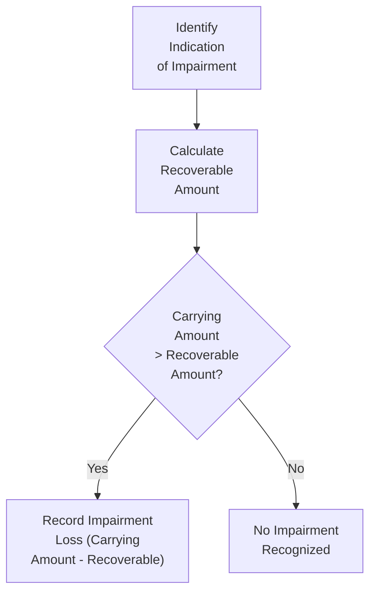

## Overview

Long-lived assets often form a major part of a company’s balance sheet. Whether they’re physical (like manufacturing equipment) or intangible (like patents), these resources need systematic expense recognition over time. Managers, investors, and analysts all rely on understanding depreciation, amortization, and impairment because these processes can significantly affect reported earnings and asset values. It can be a lot to take in—especially if, like me, you once struggled to recite all the IFRS references in a single sitting. But let’s tackle these topics step by step. By understanding the methods, assumptions, and financial implications, you’ll be better equipped to evaluate a firm’s profitability, risk profile, and overall financial health.

## Depreciation of Tangible Assets

### The Rationale Behind Depreciation
Depreciation is all about allocating the cost of a tangible asset over its useful life. For instance, imagine you purchase a machine you believe will churn out products for five years. Instead of taking the entire cost as an expense in year one, depreciation spreads the cost across multiple reporting periods. Under both IFRS (IAS 16) and US GAAP (ASC 360), firms must periodically review—and potentially update—the useful lives, residual values, and depreciation methods they employ. Typically, these regular reviews reflect changes in technology, production capabilities, or market conditions.

### Common Depreciation Methods
There are many ways to depreciate an asset, each with its own effect on the pattern of expense recognition. Here are some of the most common:

• Straight-Line: Under the straight-line method, the same depreciation charge is recognized each period over the asset’s useful life. It’s simple, transparent, and favored for assets whose economic benefit is realized fairly evenly.

• Declining-Balance (such as Double-Declining Balance): This approach accelerates expense recognition by allocating a larger portion of cost in the earlier years. It’s handy for assets like certain tech equipment that degrade or become obsolete faster at the beginning of their life.

• Units-of-Production: This method is tied to the actual usage of the asset. For example, you measure depreciation per unit of output or per hour of operation. It aligns the depreciation charge with the asset’s actual benefit to the company.

Choosing a depreciation method that aligns with how an asset generates economic benefits is crucial. Some managers select more accelerated methods to reduce taxable income in the asset’s earlier years (where permitted by tax regulations), while others choose methods that keep net income steadier across periods.

### Example of Depreciation Methods
Let’s say you purchase a delivery truck for $120,000, expecting it will have a $20,000 residual value after five years. Under the straight-line method, you might simply do:

Depreciable amount = Cost – Residual value = $120,000 – $20,000 = $100,000  
Annual depreciation = $100,000 ÷ 5 = $20,000  

But if you decide to use double-declining-balance depreciation, you’d initially calculate:

Double-declining rate = 2 × (1 ÷ Useful life) = 2 × (1 ÷ 5) = 40%  

So in the first year, your depreciation expense is:

First-year depreciation = 40% × $120,000 = $48,000  

You then reduce the carrying amount by $48,000 for the second year’s calculation, and so on. As you might guess, the net income hit in the early years will be more significant with an accelerated method.

### Regulatory Requirements Under IFRS and US GAAP
According to IAS 16 (IFRS) and ASC 360 (US GAAP), companies must:

• Assess the useful life of each asset.  
• Estimate any salvage or residual value.  
• Review these estimates periodically for changes in technology, market demand, or other factors affecting the asset’s economic usefulness.  
• Disclose methods used and provide significant judgments or estimates that impact depreciation.

## Amortization of Intangible Assets

### What Is Amortization?
Amortization is conceptually similar to depreciation but applies to intangible assets. Think of patents, software licenses, or even a purchased customer list. Under IFRS (IAS 38) and US GAAP (ASC 350), intangible assets with finite lives are amortized, whereas intangible assets with indefinite lives—like certain brands or trademarks—are not amortized. Instead, indefinite-lived assets undergo periodic impairment testing.

### Methods of Amortization
Amortization typically mirrors the same approaches we see for tangible assets:

• Straight-Line Amortization: The easiest and most prevalent method, applying a constant annual expense over the asset’s useful life.  
• Declining-Balance or Other Accelerated Methods: Used if there’s evidence the intangible’s economic benefits are consumed more rapidly in the early years.  
• Units-of-Production (Less Common in Practice): Could apply if usage patterns are measurable.

### Example of Patent Amortization
Let’s say your company acquires a patent for $50,000, and you expect it to yield economic benefits for 10 years. Under straight-line amortization:

Annual amortization expense = $50,000 ÷ 10 years = $5,000  

Again, keep track of any possible residual value or changes in the patent’s legal or economic life. Under IFRS and US GAAP, firms must also reassess intangible assets periodically to ensure the chosen amortization method still matches the consumption of benefits.

## Asset Impairment

### When Does Impairment Occur?
Impairment happens when an asset’s carrying amount exceeds its recoverable amount (IFRS) or fair value (US GAAP, assuming a test indicating the carrying amount is not recoverable). Various factors can trigger an impairment assessment:

• Sudden obsolescence due to technological advancements.  
• Market downturns reducing demand for a product or service.  
• Legislation changes affecting the cash flows an asset can generate.

Under IAS 36 (IFRS), the recoverable amount is the higher of:  
• Fair value less costs to sell.  
• Value in use (present value of expected future cash flows from the asset’s continued use).

If the carrying amount is greater than the recoverable amount, the asset is written down and an impairment loss is recognized—affecting net income immediately.  

Under US GAAP, the process for a long-lived asset (excluding goodwill) typically involves:  
• Step 1: Compare the carrying amount with the sum of the undiscounted future cash flows expected from the asset’s use.  
• Step 2: If the carrying amount exceeds those undiscounted cash flows, the asset is impaired. Write it down to fair value (often determined by discounted cash flow or market price).

### Flowchart of IFRS Impairment Testing



This diagram gives a simplified view of how IFRS identifies and measures impairment: you only do a write-down if the carrying amount is higher than the recoverable amount.

### Reversals of Impairment
Under IFRS, if conditions that caused an impairment no longer exist, firms may reverse some or all of that impairment loss (except for goodwill). US GAAP is typically more restrictive: impairment reversals are not permitted for most assets, except in very narrow circumstances involving inventory or certain intangible assets held for sale.

### Effects on Financial Statements
An impairment loss can severely dent net income. Future depreciation or amortization also declines because the asset’s carrying amount is reduced. Investors and analysts often pay close attention to large impairment charges, as they signal that management’s previous assumptions about an asset’s cash-generating ability were overly optimistic—or that an industry downturn is severe enough to wipe out asset value.

## Impact on Financial Analysis and Valuation

### Earnings Volatility
Accelerated depreciation or high impairment losses can cause wild swings in a company’s short-term profitability. By contrast, smooth straight-line depreciation keeps short-term fluctuations smaller. But the economic reality of the underlying assets may be lost if a method is chosen for window-dressing.

### Ratio Analysis
Depreciation, amortization, and impairment can dramatically affect many ratios:

• Return on Assets (ROA): Higher depreciation or impairment expense reduces net income, lowering ROA. Over time, though, the asset’s book value might also fall—impacting the denominator.  
• Debt-to-Equity: A significant impairment write-down reduces total assets and equity, thereby affecting leverage ratios.  
• Interest Coverage: Lower earnings from a heavy depreciation or impairment charge could make interest coverage look weaker in the short run.

If you’re comparing two companies that differ only in how they calculate depreciation, the one using an accelerated method will show lower earnings in the early years. That might make it appear less profitable—at least temporarily.

### Management Discretion and Earnings Management
Managers have considerable flexibility in choosing depreciation methods and in forecasting asset lives and residual values. They can also be strategic about recognizing impairments. Analysts often watch for “big bath” scenarios—when a company reports a massive impairment or write-down to clear the decks of future expenses and hopefully boost future earnings. This practice may not always be in line with the principle of faithfully representing the asset’s economic value.

## Practical Examples and Python Snippet

Let’s say you have data on an asset’s cost, residual value, and useful life, and you want to compute straight-line depreciation for multiple years. You might quickly automate it. Here’s a simple Python snippet:

```python

cost = 300000
residual_value = 50000
useful_life = 5

depreciable_amount = cost - residual_value
annual_depreciation = depreciable_amount / useful_life

for year in range(1, useful_life + 1):
    print(f"Year {year} Depreciation: ${annual_depreciation:,.2f}")
```

This code snippet calculates the same annual depreciation over five years. Of course, for a real-life scenario, you’d track partial year usage, changes in estimates, or disposal adjustments, and then incorporate IFRS or US GAAP compliance.

## Best Practices and Challenges

• Stay Consistent with Chosen Methods: While a firm can change depreciation or amortization techniques, those changes—particularly midstream—may raise questions around earnings manipulation.  
• Regularly Review Market Conditions: Technology evolves quickly. If an asset’s economic life is significantly shorter than originally forecast, continuing to use the same depreciation schedule can lead to inflated asset values.  
• Document (and Disclose) Major Assumptions: IFRS and US GAAP require that management’s critical judgments be disclosed, especially for impairment tests and intangible asset valuation.  
• Watch for Big Bath Accounting: A suspiciously large and sudden impairment charge might signal an effort to manage earnings expectations.

## Diagrams and Visual Summaries

Below is a compact table summarizing key aspects of depreciation, amortization, and impairment under IFRS versus US GAAP.

| Aspect                               | IFRS                                               | US GAAP                                            |
|--------------------------------------|----------------------------------------------------|----------------------------------------------------|
| Main Standard                        | IAS 16, IAS 38, IAS 36                             | ASC 360 (PPE), ASC 350 (Intangibles), ASC 360-10   |
| Depreciation/Amortization Methods    | Straight-Line, Declining-Balance, Units-of-Production; must match benefit pattern | Similar range of methods allowed                  |
| Impairment Trigger                   | Indication that asset may not be recoverable       | Carrying amount > undiscounted future cash flows   |
| Measurement of Impairment Loss       | Carrying amount – Recoverable amount (higher of fair value less costs to sell or value in use) | Carrying amount – Fair value (if step 1 indicates impairment) |
| Reversal of Impairment               | Allowed (except on goodwill)                       | Not allowed except in rare cases                  |

## Exam Tips

• Know the Difference Between Methods: Be prepared for constructed-response questions asking you to compute depreciation or amortization under different techniques.  
• Identify Earnings Management Clues: A new exam scenario might show a sudden change in estimate or an unusual impairment charge. Be prepared to discuss possible motivations and the effect on ratios.  
• Don’t Overlook Disclosures: IFRS and US GAAP both mandate consistent disclosure about asset valuation, impairment tests, and method changes. Any exam question might require analyzing footnotes to spot red flags or to interpret how management arrived at a particular impairment.  
• Integrate with Other Sections: Chapter 13 on ratio analysis closely ties to how depreciation or impairment decisions can affect solvency, liquidity, and profitability ratios. Similarly, intangible asset issues (Chapter 3) and reevaluation of intangible assets after a business combination (Chapter 10) often rely on the fundamentals discussed here.  

Ultimately, understanding depreciation, amortization, and impairment is key to seeing the big picture of a firm’s long-term asset management and performance. Perhaps you’ll recall a personal anecdote—like how I used to think double-declining-balance was just a fancy way of showing off at parties. Turns out, these decisions genuinely matter.

## References and Further Reading

• IAS 36 – Impairment of Assets:  
  https://www.ifrs.org/issued-standards/list-of-standards/ias-36-impairment-of-assets/  

• IAS 16 – Property, Plant and Equipment:  
  https://www.ifrs.org/issued-standards/list-of-standards/ias-16-property-plant-and-equipment  

• IAS 38 – Intangible Assets:  
  https://www.ifrs.org/issued-standards/list-of-standards/ias-38-intangible-assets/  

• ASC 350 (Intangibles—Goodwill and Other) & ASC 360 (Property, Plant, and Equipment):  
  https://fasb.org/  

• CFA Institute. “Financial Reporting and Analysis.” CFA Program Curriculum.  
• CFA Institute Code of Ethics and Standards of Professional Conduct.

--------------------------------------------------------------------------------

## Test Your Knowledge: Depreciation, Amortization, and Impairment



### A company under IFRS believes one of its manufacturing assets has become obsolete. How would it measure the asset’s impairment?

- [ ] Compare carrying amount to undiscounted cash flows
- [ ] Compare carrying amount to the intangible’s fair value only
- [x] Compare carrying amount to the higher of (fair value less costs to sell) and value in use
- [ ] Compare carrying amount to the lower of depreciable cost and net realizable value

> **Explanation:** Under IAS 36, an asset’s recoverable amount is the higher of fair value less costs to sell or value in use. If the carrying amount exceeds this recoverable amount, the asset is impaired.

### Which of the following statements is most accurate regarding depreciation?

- [x] Accelerated methods recognize a larger portion of asset cost in early years
- [ ] Straight-line methods always produce equal net income over an asset’s life
- [ ] Declining-balance methods produce lower total depreciation expense across all years
- [ ] Units-of-production methods are not permitted under IFRS

> **Explanation:** Accelerated depreciation, such as double-declining balance, allocates a higher proportion of the asset’s cost in earlier years versus later years. Straight-line does spread out the total cost evenly, but that doesn’t guarantee net income will be identical because other factors can shift net income.

### Under US GAAP, a company is testing a machine for impairment. What is the first step in the impairment testing procedure?

- [ ] Immediately write down the asset to fair value
- [x] Compare the carrying amount with the undiscounted future cash flows
- [ ] Calculate present value of future cash flows
- [ ] Obtain an external independent valuation

> **Explanation:** The two-step approach under US GAAP first compares the asset’s carrying amount with the sum of its undiscounted cash flows. Only if that comparison indicates impairment does the company measure the loss by writing the asset down to fair value.

### A company purchases an intangible asset with a definite life of 10 years for $100,000 and expects no residual value. Using straight-line amortization, how much will it recognize in amortization expense each year?

- [ ] $5,000
- [ ] $8,000
- [x] $10,000
- [ ] $20,000

> **Explanation:** The annual amortization under the straight-line method is $100,000 divided by 10 years, or $10,000 per year.

### Which of the following would not directly trigger a tangible asset impairment test?

- [x] Company’s shares trading at a 52-week high
- [ ] Evidence of obsolescence
- [x] Management’s decision to significantly reduce production using an asset
- [ ] Decrease in market demand for products manufactured by the asset

> **Explanation:** A high market share price alone does not indicate a need to impair specific assets. However, evidence of obsolescence, prolonged decreases in demand, or any major operational changes could indicate that an asset’s carrying amount may not be recoverable.

### Under IFRS, if a previously recognized impairment loss (not goodwill-related) is reversed, which of the following statements is correct?

- [x] The asset may be written up to its revised recoverable amount, capped at the carrying amount that would have existed had no impairment occurred
- [ ] The asset is written up to its original cost
- [ ] The asset is written up to the revaluation surplus
- [ ] Reversals of impairment are never allowed under IFRS

> **Explanation:** IFRS allows impairment reversals (except for goodwill). However, the increased carrying amount may not exceed the carrying amount that would have been determined had no impairment loss been recognized in prior periods.

### Which accounting standard under IFRS primarily governs impairment of long-lived assets?

- [x] IAS 36
- [ ] IAS 16
- [x] IAS 38
- [ ] IFRS 9

> **Explanation:** IAS 36 deals specifically with impairment of assets. IAS 16 addresses property, plant, and equipment, and IAS 38 deals with intangible assets, but impairment rules fall under IAS 36.

### What is a “big bath” scenario in the context of impairment?

- [x] Recording an unusually large impairment to reduce future expenses
- [ ] Switching from straight-line to units-of-production depreciation
- [ ] Reducing intangible asset lives to incur minimal expenses early
- [ ] Reversing large impairment losses to show higher net income

> **Explanation:** A “big bath” typically refers to taking a very large impairment charge or write-down in one period to clean up the balance sheet and potentially inflate future profit.

### For tangible and intangible assets with finite lives, which method ensures the cost of the asset is proportionally recognized based on usage?

- [ ] Double-declining-balance
- [x] Units-of-production
- [ ] Straight-line
- [ ] Revaluation model

> **Explanation:** The units-of-production method ties depreciation or amortization to actual usage or output, which can be especially useful for assets whose viability depends explicitly on their production capacity.

### True or False: US GAAP generally allows reversal of impairment losses for intangible assets whenever the underlying conditions improve.

- [x] True
- [ ] False

> **Explanation:** This is somewhat tricky. While US GAAP typically prohibits reversing impairment for most long-lived assets, certain intangible assets (e.g., those held for sale) might be reversed to fair value if specific conditions are met. Thus, in rare circumstances, it could be permitted. Generally, though, the standard rule is that impairment reversals are disallowed except for those unusual cases.


