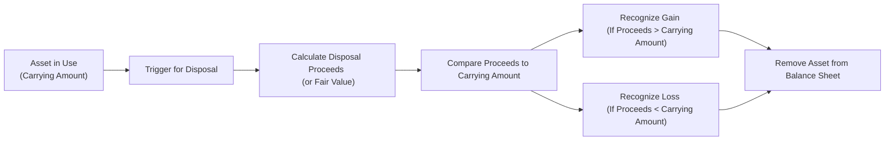

## Overview of Derecognition and Disposal

It’s funny: the first time I encountered “derecognition” of a fixed asset, I thought someone was describing amnesia—like we’d just erase it from our memories. But in accounting, derecognition is a perfectly normal procedure that happens when an asset is removed from a firm’s balance sheet. Typically, this occurs because the asset is sold, scrapped, or abandoned, or because it stops giving us any benefit for future earnings. 

When derecognition happens, the net book value (also called the carrying amount) of the asset is taken off the balance sheet, and any resulting gain or loss is reported in the income statement. Considering how easily a big gain on asset disposal can inflate net income—or how a large loss can dent it—this process attracts plenty of attention from analysts. The next sections explore key insights, real-world examples, ratio impacts, and common pitfalls.

## Fundamental Concepts

### Key Terminology

• Derecognition  
  When you remove an asset from the balance sheet entirely—essentially, the asset is no longer there for accounting purposes.

• Carrying Amount (Book Value)  
  The value of the asset currently shown on the books (original cost minus accumulated depreciation and any impairment losses). 

• Net Disposal Proceeds  
  The amount you receive from disposing of the asset, minus any direct costs to sell. This might be sales proceeds or fair value in an exchange.

• Gain (Loss) on Disposal  
  The difference between the asset’s net disposal proceeds and its carrying amount. If the proceeds exceed the carrying amount, that’s a gain. If they’re lower, that’s a loss.

• Commercial Substance  
  A concept under IFRS (and similarly under US GAAP) indicating that an exchange transaction causes meaningful changes in future cash flows. If an exchange lacks commercial substance, the gain or loss may be deferred.

## Derecognition Triggers

There are typically three main triggers that prompt asset derecognition:

• Asset Sale  
  The most straightforward disposal method. You sell the asset and compare the sale proceeds with the net book value. A difference arises: if proceeds exceed book value, it’s a gain; if they’re below book value, it’s a loss.  

• Exchange (Non-Monetary Exchange)  
  Suppose you exchange one machine for another. Under IFRS, if this exchange has commercial substance—i.e., the exchange significantly changes those expected future cash flows—then you recognize gains and losses on the difference between fair value and carrying amount. If there’s no commercial substance, IFRS might require you to carry over the old carrying amount, deferring the gain or loss. US GAAP follows similar logic, though the nuances can differ in certain transactions (e.g., exchanges of similar productive assets).  

• Retirement or Abandonment  
  When an asset is simply scrapped or retired—like tossing out an old forklift with no resale value—the entire remaining carrying amount becomes a loss in the income statement.  

## A Simple Example

Let’s say a company purchased machinery for $100,000 five years ago. Depreciation of $70,000 has accumulated, so the carrying amount is $30,000. Now suppose the company sells the machine for $35,000. The difference between the proceeds ($35,000) and the carrying amount ($30,000) is $5,000, which is recognized as a gain in the income statement.

If instead they sold it for $25,000, the difference of ($5,000) would be recognized as a loss. 

So, the next time you talk about “derecognition” with your study group, ignore the jokes about forgetting your assets. What you’re really highlighting is the well-defined moment when the asset leaves your books.

## Visual Flow of Derecognition

Below is a simple Mermaid diagram illustrating a typical workflow for asset derecognition and disposal:

## Non-Monetary Exchanges

Non-monetary exchanges can be tricky. Let’s say you own an old piece of manufacturing equipment. A neighboring firm has a piece of equipment that better suits your needs. In exchange, your neighbor wants your older equipment plus a small top-up in cash.

In IFRS, you must assess if the swap has “commercial substance.” Essentially, will your cash flows, risk profile, timing, or amounts fundamentally change? If yes, measure your new asset at fair value and recognize any difference as a gain or loss. If no, you’ll generally carry the old book value forward and not recognize any immediate gain.

In US GAAP, the concept is very similar—if the exchange has commercial substance, you use fair value and recognize gains or losses. If not, you generally defer them. Careful though, there can be differences in how “monetary” or “non-monetary” is interpreted, so that’s something you might want to confirm with the official guidance (ASC 845 for US GAAP). 

## Impact on Financial Ratios

Any big disposal can influence important ratios:

• Asset Turnover (Revenue ÷ Average Total Assets)  
  Disposing of underutilized or depreciated assets could reduce the denominator (average total assets). Firms might end up looking more efficient if revenue remains constant or grows faster than the reduced asset base. 

• Return on Assets (Net Income ÷ Average Total Assets)  
  Gains from disposal may temporarily boost net income, leading to an inflated ROA. However, this effect might be nonrecurring. Analysts typically watch for unusual gains to see if a ratio improvement is real or just a short-term accounting outcome.  

• Leverage Ratios (Debt-to-Equity, etc.)  
  If you remove a large asset with an associated liability, the disposal might reduce certain leverage ratios. The extent depends on whether the disposal also eliminates part of the debt.  

• Earnings Quality  
  Gains or losses on disposal tend to be one-off items. Sometimes companies “time” disposals to show improved earnings. A prudent analyst will evaluate how often these disposal gains occur and whether they’re overshadowing a weaker core performance.  

## Real-World Anecdote

I once analyzed a manufacturer that sold a piece of specialized machinery right before year-end. The transaction came with a tidy $2 million gain—great news, right? Turns out, the company had been manufacturing at significantly reduced capacity for years, so that “gain” was basically covering up persistent negative operating margins. If I hadn’t realized that disposal was a one-time event, I might have concluded that profitability was rebounding. In reality, the core business was still in the doldrums. 

So, watch out for these sorts of “window-dressing” moves; they can temporarily flatter a company’s financial statements.

## Potential Pitfalls and Best Practices

• Timing the Disposal  
  Companies may time disposals to manage earnings. An unexpected flurry of asset sales near quarter-end might indicate attempts to boost net income with disposal gains. Analysts should keep an eye on the frequency and timing of disposals. 

• Scrapped Assets  
  Sometimes an asset is left on the books at a nominal residual value (say $1). If management scraps it with no salvage value, you might see a small (or potentially big if the residual value was overstated) hit to earnings. Make sure to question unusual disposal patterns.

• Partial Disposals  
  In some industries, a company may retire parts of an asset in stages. Just think of an airline replacing engines on large aircraft. They might treat the replaced engine as a partial disposal. Then the question becomes: how is that partial disposal recognized? This can introduce complexity—and potential for error.

• Disclosures in the Notes  
  IFRS and US GAAP require disclosures about disposals or reclassifications of assets as “held for sale.” These disclosures can contain crucial details about how management values the assets, especially if the fair value is tricky to estimate.  

## Accounting Guidance

• IAS 16 — Derecognition Section  
  Under IAS 16, an entity derecognizes property, plant, and equipment when it is disposed of or when no further economic benefits are expected. Gains or losses on derecognition are included in profit or loss when the item is derecognized.  

• US GAAP: ASC 360-10  
  Similar concept for disposing of long-lived assets. You remove the asset’s carrying amount and recognize any gain or loss in the income statement.  

For more intricate details, check the official IFRS or FASB websites. Or if you really like going down the rabbit hole, have a look at the Illustrative Examples in the IFRS desk manuals.

## Extended Illustration: Exchange with Commercial Substance

Imagine you have a printing press that’s nearly fully depreciated. Its original cost was $200,000, and you’ve recorded $150,000 of depreciation, so book value is $50,000. Another firm has a more advanced press they’re willing to exchange, plus you pay $20,000 in cash to sweeten the deal.

• Fair Value of your old press: $60,000  
• Book Value of your old press: $50,000  
• Additional Cash you pay: $20,000  
• Fair Value of new press: $80,000 (the estimated open-market value)

If the exchange has commercial substance, you’d:  
1. Remove the old press at its book value of $50,000.  
2. Recognize a gain of $10,000 (i.e., $60,000 fair value – $50,000 carrying amount).  
3. Add the new press to your balance sheet at its fair value of $80,000 (the old press fair value plus the cash paid).  

## Encouraging Critical Analysis

Whenever you see an asset disposal, ask yourself a few questions:

• Why now? Is management generating cash or just booking a gain?  
• Is the disposal part of routine business (like a planned asset rotation) or is it opportunistic window dressing?  
• How large is that reported gain (or loss) relative to net income?  
• Are we ignoring a potential future capital expenditure if an asset was essential and now must be replaced soon?

Such questions help you avoid the trap of attributing a one-time disposal gain to ongoing operational improvements.

## Additional Resources

• Official IFRS Standards:  
  – [IAS 16 – Property, Plant and Equipment](https://www.ifrs.org/issued-standards/list-of-standards/ias-16-property-plant-and-equipment/)  
• US GAAP Resources:  
  – [FASB ASC 360-10, on Disposal of Long-Lived Assets](https://fasb.org/)  
• CFA Institute Materials:  
  – “International Financial Statement Analysis” by CFA Institute  
• Accounting Textbooks and Online Articles:  
  – There are many advanced texts and articles detailing special circumstances like partial disposals, intangible asset derecognition, and complex exchange transactions.

----

## Test Your Knowledge: Derecognition and Disposal of Long-Term Assets



### In the context of derecognition, which of the following transactions most commonly triggers removing a long-term asset from the balance sheet?

- [ ] A minor revision of the asset’s depreciation schedule
- [x] A sale resulting in transfer of legal ownership to a third party
- [ ] A revaluation of the asset’s carrying value upwards
- [ ] A reclassification from inventory to property, plant, and equipment

> **Explanation:** Derecognition typically occurs when ownership of the asset is transferred (e.g., via sale) or when the asset no longer provides future economic benefits.

### Under IFRS, when an asset is disposed of, the gain or loss recognized is generally equal to:

- [ ] The net book value of the asset
- [ ] The original cost minus accumulated depreciation
- [ ] The difference between historical cost and fair value
- [x] The disposal proceeds minus the asset’s carrying amount

> **Explanation:** IAS 16 states that the gain or loss is the difference between the proceeds (net of selling costs) and the asset’s carrying amount.

### If an entity scraps an asset with a carrying value of $10,000 and receives zero proceeds, which of the following is correct?

- [ ] No gain or loss is recognized because there are no proceeds
- [ ] A gain of $10,000 is recognized
- [ ] Revenue is recognized for $10,000
- [x] A loss of $10,000 is recognized

> **Explanation:** Because the asset is scrapped (zero proceeds) while it still has a $10,000 carrying value, the entity recognizes a $10,000 loss.

### In a non-monetary exchange with commercial substance, how is the new asset typically measured under IFRS?

- [ ] At the old asset’s net book value
- [ ] At the lesser of the old asset’s net book value or the new asset’s fair value
- [x] At the fair value of the asset given up or the fair value of the asset received, whichever is more reliable
- [ ] At a nominal amount unless cash is also received

> **Explanation:** Under IFRS, if the exchange has commercial substance, you recognize the new asset at fair value and record any gain or loss on disposal of the old asset.

### Which ratio is most likely to temporarily increase if a firm disposes of a fully depreciated asset with no proceeds?

- [ ] The debt-to-equity ratio
- [x] The asset turnover ratio
- [ ] The inventory turnover ratio
- [ ] The interest coverage ratio

> **Explanation:** Removing a fully depreciated asset from the denominator can nudge asset turnover higher, assuming revenue stays the same.

### A company recognizes a substantial gain on disposal of equipment that was no longer needed. Which of the following best describes how an analyst should treat this gain?

- [ ] Treat as recurring operational income
- [x] Classify as a nonrecurring item to adjust in ongoing profit analysis
- [ ] Exclude it entirely from all calculations
- [ ] Combine it with depreciation expense

> **Explanation:** Gains on disposal are typically nonrecurring. Analysts often adjust them out to reflect core (recurring) business performance.

### For an exchange of assets lacking commercial substance under IFRS, which of the following statements is TRUE?

- [ ] Gains must always be recognized in full
- [x] Gains may be deferred and the new asset might be recorded at the old carrying value
- [ ] No deprecation is recorded on any non-monetary exchanges
- [ ] Losses are never recognized

> **Explanation:** When there is no commercial substance, IFRS often requires carrying over the old value, deferring the gain until a future transaction with commercial substance occurs. 

### Under US GAAP, which accounting standard primarily governs derecognition of long-lived assets?

- [ ] ASC 840
- [x] ASC 360-10
- [ ] ASC 606
- [ ] ASC 860

> **Explanation:** ASC 360-10 addresses the impairment and disposal of long-lived assets under US GAAP.

### A firm disposes of an asset for proceeds of $150,000 when the asset’s carrying amount is $200,000. Which of the following is correct?

- [ ] Recognize a $50,000 gain
- [ ] Recognize no gain or loss
- [x] Recognize a $50,000 loss
- [ ] Recognize a $200,000 loss

> **Explanation:** Since the proceeds ($150,000) are less than the carrying amount ($200,000), the firm incurs a $50,000 loss.

### True or False: Gains or losses on the disposal of assets are presented as extraordinary items on the income statement under current IFRS and US GAAP.

- [x] True
- [ ] False

> **Explanation:** Under IFRS and US GAAP, the concept of “extraordinary items” was eliminated. Gains or losses on disposal are shown as part of profit or loss from continuing operations (or discontinued if it meets those criteria). Some older standards referred to unusual or infrequent items as “extraordinary,” but this is no longer recognized in modern reporting.



----

**Final Exam Tips**  
• Keep an eye on whether the disposal impacts recurring or nonrecurring earnings.  
• Investigate management’s rationale for disposing of assets. Sudden disposals can signal ulterior motives.  
• Look for disclosures on how fair values are determined, especially in non-monetary exchanges.  
• Practice walk-through computations where you compare disposal proceeds to carrying amount, then see how that difference affects the income statement and key ratios.

**References**  
• IAS 16 – Property, Plant & Equipment (IFRS)  
• ASC 360-10, Impairment and Disposal of Long-Lived Assets (FASB)  
• “International Financial Statement Analysis,” CFA Institute  
