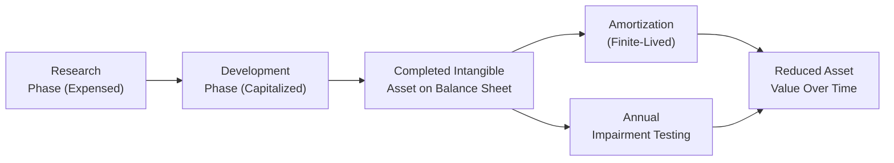

## Overview and Key Concepts

Studying intangible assets can sometimes feel, well, intangible. You know, you can’t exactly walk through the halls of a company and stub your toe on a trademark. Yet these assets—such as patents, brands, and software—can drive enormous value for a business. In this section, we’ll dissect how internally developed intangibles differ from those that are acquired, compare IFRS and US GAAP rules, and examine the analysis implications for financial statement users. 

Perhaps you’ve come across a tech startup with “big ideas,” but minimal physical assets. Most of its value might lie in intangible assets like code, brand, or proprietary algorithms. Analysts must understand how these intangible investments show up (or sometimes don’t) on the balance sheet and how that affects valuation and performance measurement.

## Recognition of Internally Developed Intangibles

### IFRS Approach (IAS 38)

Under International Financial Reporting Standards (IFRS), the accounting for intangible assets is guided primarily by IAS 38 – Intangible Assets. You might recall from earlier sections (such as the discussion on expense recognition in Chapter 2) that IFRS distinguishes between research costs and development costs:

• Research Phase: Costs in this earliest phase are expensed as incurred. The idea is that there’s no “probable future economic benefit” yet because the entity is still exploring feasibility.  
• Development Phase: Once an entity surmounts the initial research stage and can demonstrate technical feasibility, intention to complete the asset, and evidence of future economic benefits, development costs can be capitalized. 

This big IFRS split between research and development can be a game-changer. Let’s say you’re analyzing a pharmaceutical company that invests billions in R&D. Under IFRS, those projects that move from “possible” to “technically feasible” might allow capitalizing development costs. This can boost reported assets and reduce current period expenses.

#### Criteria for Capitalization under IAS 38

1. The technical feasibility of completing the intangible so it can be used or sold.  
2. The company’s intention to complete and use (or sell) the intangible asset.  
3. The company’s ability to use or sell the intangible asset.  
4. Demonstration of how the intangible asset will generate probable future economic benefits.  
5. Availability of adequate technical, financial, and other resources to complete the asset.  
6. The ability to measure reliably the relevant expenditure during development.

These criteria ensure only intangible assets with probable (and measurable) future benefits are recognized on the balance sheet.

### US GAAP Approach

With US GAAP, the story is simpler in some respects for most R&D: it’s usually expensed as incurred. One exception is for certain software development costs:

• Software to Be Sold, Leased, or Marketed (ASC 985-20): After an entity establishes “technological feasibility,” subsequent development costs can be capitalized.  
• Internal-Use Software (ASC 350-40): Similar idea. Certain development-stage costs for in-house software may be capitalized if certain conditions are met, like direct costs incurred after a software project has progressed beyond the preliminary stage.

Most other internally developed intangible assets—like brand creation or early-stage research—are expensed. So you often see a relatively conservative stance under US GAAP, meaning less intangible asset capitalization compared to IFRS, with the exception of software.

## Recognition of Acquired Intangibles

### Acquired in a Standalone Purchase

When an intangible is purchased from another party—think about buying a patent from an inventor—both IFRS and US GAAP generally require you to record it at its fair value on the acquisition date. Because there’s an actual transaction with a presumably reliable purchase price, it’s more straightforward to determine the intangible’s value.

These purchased intangibles might include:

• Patents  
• Copyrights  
• Trademarks  
• Licenses  
• Franchise agreements  

If the intangible has a finite life (like a patent valid for 15 years), it is amortized over its useful life. Companies must assess impairment if there are indicators that its recoverable amount might be lower than its carrying amount on the books.

### Acquired through Business Combinations

When intangible assets are obtained through a business merger or acquisition, IFRS (IFRS 3) and US GAAP (ASC 805) both require the acquirer to measure and recognize the identifiable intangible assets at fair value on the acquisition date. That means you might see intangible assets recognized on the balance sheet that the acquired company never had recorded, simply because it developed them internally and treated them as expenses.

Indefinite-lived intangibles—like certain trademarks—are not amortized but tested for impairment at least annually. Goodwill is also recognized in business combinations, although it’s not an identifiable intangible asset and is discussed separately (see Chapter 3.2 on Intangible Assets and Goodwill and Chapter 10 on Business Combinations).

## Finite vs. Indefinite Lives

Current IFRS and US GAAP guidelines classify intangibles into two categories:

• Finite-Lived Intangibles: Amortized over their useful life and tested for impairment.  
• Indefinite-Lived Intangibles: Not amortized but tested for impairment at least annually (or when indicators arise).

For example, a patent often has a finite life corresponding to its legal protection term, while some brand names are deemed indefinite if they can exist perpetually and continue generating economic benefits. 

## Analytical Implications for Financial Statement Users

### Earnings Management Possibilities

Ah, the classic question: “Are they capitalizing intangible costs to inflate short-term earnings?” Potentially, yes. Companies that capitalize intangible-related expenditures (especially under IFRS) can show higher earnings in the current period by reducing R&D expense. But in future periods, they’ll take ongoing amortization charges—possibly leading to lower earnings. 

From a portfolio manager’s or analyst’s standpoint, if you’re comparing two biotech companies—the first capitalizes development costs while the other expenses them—be aware that near-term profitability metrics might look skewed. Over multiple periods, the differences may even out, but short-term illusions are possible, which is exactly where your diligence as a CFA professional comes in.

### Cross-Company Comparisons

We all love a good apples-to-apples comparison, but intangible asset recognition can throw a wrench into our ratio analyses. Some companies expense nearly all intangible-related costs under US GAAP. Others, under IFRS, might be capitalizing development costs. 

• Profitability Ratios: Return on Assets (ROA), Return on Equity (ROE), and profit margins could all be affected by intangible capitalization practices.  
• Leverage Ratios: Total assets might look higher for a capitalizing firm, while intangible-heavy companies might appear more leveraged if intangible assets are large but intangible intangible is intangible (pun intended!).  
• Price-to-Book Ratios: If intangible assets are capitalized, book value is higher, possibly reducing the P/B ratio.

### Future Impairment Risk

Capitalizing intangible assets offers short-term benefits but also sets the stage for possible impairment. If the intangible’s expected future benefits drop—due to technology obsolescence, for example—the company might be forced to recognize an impairment loss. This can create earnings volatility. 

### Internal-Use Software Illustration

Picture a retail giant developing an in-house inventory management system. During the preliminary project stage, it expenses the brainstorming and planning. Once it’s decided the project is feasible and useful, direct coding and testing costs can be capitalized. Down the line, though, if the system becomes obsolete, they might need to write it down. Analysts have to watch that risk over time, especially if new technologies or competitor solutions overshadow the company’s proprietary system.

## Example: Pharmaceutical Company Under IFRS

Let’s say we have PharmaX, a mid-sized pharmaceutical firm. They spend $50 million exploring a potential new treatment. During early-stage research, IFRS requires them to expense, say, $10 million in research costs. But then they identify a workable formula, prove it can be commercialized, and plan to finish development and eventually license the treatment. At that point, the remaining $40 million of development costs are capitalized, recognized as an intangible asset once IFRS criteria are met.

Initially, net income is lower because they expensed $10 million. But now they’re capitalizing $40 million, which will appear on the balance sheet. Over the drug’s useful life, maybe 10 years, the intangible asset is amortized. Analysts must keep an eye on these transitions because they alter the financial statement profile significantly.

## Example: US Software Startup

Meanwhile, TechStartup Inc., operating under US GAAP, invests heavily in software for external sale. They pass the threshold of “technological feasibility,” so further coding and testing costs are capitalized. That intangible asset eventually shows up on the balance sheet at, hypothetically, $5 million. The intangible is amortized over, let’s say, three years as they sell the software. If the tech becomes outdated, they might record an impairment. Or if it thrives, the intangible might remain on the balance sheet until fully amortized.

## Visual Overview: Lifecycle of an Intangible Asset

Below is a simple Mermaid diagram illustrating how intangible assets (particularly internally developed) move through phases: from research/preliminary stage (often expensed) to development/capitalizable stage, then to ongoing amortization or impairment testing.

In practice, intangible accounting can feel more complex, but this diagram captures the high-level flow. 

## Practical Considerations and Best Practices

• Stay alert to management’s judgment: The line between research and development can be blurry at times.  
• Compare intangible recognition policies across firms in the same industry: This helps you refine comparability.  
• Adjust for intangible intensity: Some analysts add back expensed R&D to get a better read on enterprise value or economic returns.  
• Evaluate relative intangible investment over time: A company with consistent intangible investment may reveal stable or growing innovative capacity.  

## Challenges and Potential Pitfalls

• Rapid Technological Change: Sudden obsolescence can trigger large impairments.  
• Unclear Useful Lives: Guessing a finite intangible’s useful life is tricky, especially for emerging technology or creative industries.  
• Management Incentives: Short-term earnings pressure can lead to more (or fewer) capitalizations.  
• Regulatory Divergence: The IFRS vs. US GAAP difference can hamper cross-border comparisons.

## Exam Tips and Level I Relevance

While intangible accounting becomes more intricate at advanced levels, a strong understanding now sets the foundation for future analysis. For instance, you’ll integrate intangible assets into pro forma statements (see Chapter 16) or factor intangible capital into advanced ratio analysis (Chapter 13). Stay on the lookout for intangible-heavy industries, as they often present questions on how intangible policy choices can influence balance sheets, earnings, and valuation metrics.

## References

• IAS 38 – Intangible Assets: https://www.ifrs.org/issued-standards/list-of-standards/ias-38-intangible-assets/  
• ASC 985-20 (Software—Costs of Software to Be Sold, Leased, or Marketed) and ASC 350-40 (Internal-Use Software): https://fasb.org/  
• “Accounting for Intangibles” (CFA Institute) for deeper case examples and IFRS/US GAAP comparisons.  

## Test Your Knowledge: Intangible Assets: Internally Developed vs. Acquired



### Under IAS 38, which type of cost can be capitalized for internally developed intangible assets?

- [ ] Research-related expenses for new ideas
- [x] Development costs that meet specified criteria (technical feasibility, future economic benefit, etc.)
- [ ] Any advertising and promotional expenses
- [ ] Internally generated goodwill

> **Explanation:** Under IAS 38, only development costs that meet various criteria (like technical feasibility and probable future economic benefits) can be capitalized. Research and most advertising costs are expensed, and goodwill from internal activities is not recognized as an asset.

### According to US GAAP, which statement is true regarding internally developed software for internal use?

- [x] Certain costs after the preliminary project stage can be capitalized
- [ ] All software development costs must be expensed as incurred
- [ ] Capitalization of costs is not allowed unless the software is partially externally funded
- [ ] Only user training costs can be capitalized

> **Explanation:** US GAAP allows capitalization of costs once technological feasibility is established (for software to be sold) or once the project enters the application development stage (for internal-use software).

### Which of the following best describes the accounting treatment for an acquired patent with a 10-year legal life?

- [x] Capitalize at fair value and amortize over its estimated useful life
- [ ] Expense in full immediately upon acquisition
- [ ] Capitalize at cost and perform annual impairment testing only
- [ ] Recognize as an indefinite-lived intangible

> **Explanation:** A purchased patent is recognized at fair value at acquisition and amortized over its useful life—often the remaining legal life—unless there’s reason to believe the economic life is shorter.

### A company capitalized significant development costs under IFRS. What immediate impact does this have on reported net income compared to expensing those costs?

- [x] Higher net income because expenses are deferred
- [ ] Lower net income because amortization has already begun
- [ ] No change in net income
- [ ] Immediately lower retained earnings

> **Explanation:** Capitalizing development costs defers the recognition of expenses, leading to higher net income in the current period compared to an immediate expensing approach.

### Which intangible asset would typically be classified as indefinite-lived under most accounting frameworks?

- [ ] A patent with a 15-year legal life
- [x] A well-established brand with an indefinite renewal option 
- [ ] Licensed software with a 3-year arrangement 
- [ ] Internal-use software still under development

> **Explanation:** Certain trademarks or brand names that can be renewed indefinitely and continue to generate economic benefits are often classified as indefinite-lived under both IFRS and US GAAP.

### Under IFRS, what is the primary reason research costs are expensed rather than capitalized?

- [x] Research phase does not confirm future economic benefits
- [ ] Research is considered administrative in nature
- [ ] Low materiality
- [ ] Cost of capitalizing research is too onerous

> **Explanation:** Research costs generally do not meet the threshold of probable future economic benefits, so they are expensed until technical feasibility and other criteria are satisfied.

### When intangible assets are acquired in a business combination, how are they measured at acquisition date?

- [x] At fair value
- [ ] At the seller’s carrying value 
- [ ] At cost plus any contingent liabilities
- [ ] They are not recorded if previously internally generated

> **Explanation:** Intangibles acquired in a business combination are recognized at fair value, even if the acquiree hadn’t previously capitalized them.

### What is a common criticism of the intangible asset accounting model under either IFRS or US GAAP?

- [x] It can hinder cross-company comparability due to different capitalization policies
- [ ] It is too comprehensive and transparent
- [ ] It rarely involves management judgment
- [ ] It does not distinguish between finite and indefinite assets

> **Explanation:** There’s significant discretion in determining which intangible costs are capitalized, leading to comparability challenges across peers, industries, and jurisdictions.

### Which of the following is a potential drawback for a company that aggressively capitalizes intangible-related expenditures?

- [ ] It diminishes reported earnings in the short run
- [x] It may increase the likelihood of impairment charges in the future
- [ ] It prevents them from recognizing any intangible assets on the balance sheet
- [ ] It immediately reduces total assets

> **Explanation:** While recognizing intangible assets can lift short-term earnings by deferring expenses, it raises the risk of future impairments if the intangible underperforms or becomes obsolete.

### True or False: US GAAP permits the recognition of internally generated goodwill if it can be reliably measured.

- [ ] True
- [x] False

> **Explanation:** Both IFRS and US GAAP prohibit the recognition of internally generated goodwill. Goodwill can only be recognized when purchased in a business combination.


