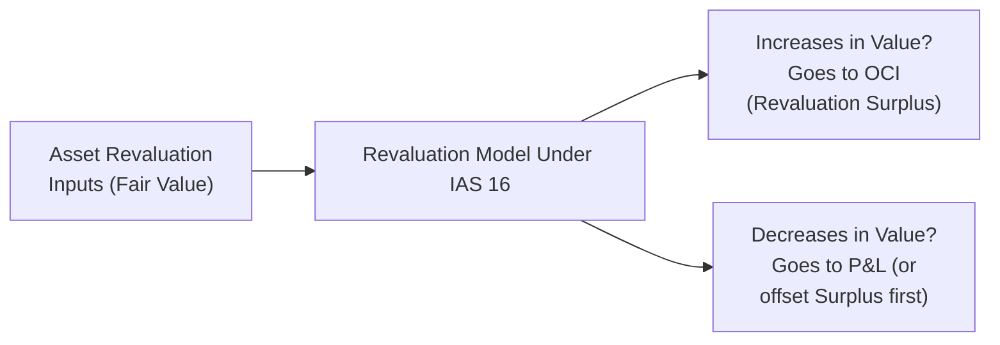

## Introduction

It’s easy to think of a company’s physical assets—like factory buildings, office space, or specialized machinery—as just static items on the balance sheet. But these assets can be real wild cards when it comes to valuation. On one hand, you’ve got the “Cost Model,” which basically says, “Hey, just keep that asset on the books at the price you paid minus its depreciation.” On the other hand, there’s the “Revaluation Model,” which IFRS allows, that periodically updates the value of an asset to something resembling a fair or current market value. Naturally, both approaches have plenty of impact on reported equity, leverage ratios, and the overall story a set of financials might tell.

Perhaps you’ve run into a finance director who’s excited about revaluing property right before year-end to spruce up the balance sheet. I once saw a CFO do precisely this, and you could actually see how it changed investor perception of the company’s solvency. But what’s the big difference between these two models, and why do we even bother having them both? And more importantly, how can this difference show up in financial analysis and portfolio decisions for, say, a global equity manager?

Let’s dig into the details.

## The Cost Model

The cost model is basically your no-frills approach to asset valuation. Under IFRS (IAS 16) and US GAAP (ASC 360), it means you start with your acquisition cost—the historical price you shelled out to obtain that asset—and subtract the accumulated depreciation and any impairment losses over time.

The cost model has a few key characteristics:

• Historical Cost Anchoring:  
  The asset stays anchored to the price you paid, which is usually well documented and verifiable.  
• Straightforward Recording:  
  Because you record depreciation each period, there’s not that much guesswork.  
• Less Volatility in Equity:  
  The net book value moves in a predictable fashion, avoiding big swings that come with sudden revaluations.  

At the same time, critics often say that if asset prices move significantly in the real world, the reported value under the cost model may no longer reflect what the asset is really worth. In that sense, it can become outdated. A property you bought 10 years ago for $1 million might easily command $3 million today—but under the cost model, that $2 million difference doesn’t show up on your balance sheet unless you sell, test for impairment, or do something else that triggers a remeasurement.

### Analytical Observations with the Cost Model

From a CFA perspective (and especially for folks analyzing a company’s financial statements on a global stage), the cost model can have these implications:

• Potential Understatement of Asset Values:  
  If you’re dealing with older assets or appreciating real estate, you might be looking at artificially low asset values relative to market prices.  
• More Stable Ratios:  
  Return on Assets (ROA) or Debt-to-Equity won’t see big fluctuations since the asset side is relatively stable—aside from annual depreciation, of course.  
• Cross-Border Challenges:  
  Comparing a firm using cost model under US GAAP to another firm using IFRS revaluation can lead to confusion unless you adjust for those differences.

## The Revaluation Model

Now, let’s say IFRS (under IAS 16) gives companies the option to measure certain long-term assets (like property, plant, and equipment) at their fair value. That option is known as the revaluation model. In a sense, you periodically “mark to market” the asset by restating it at a revalued amount, usually the fair value at the date of remeasurement.

Some big points:

• Fair Value Updates:  
  The asset is carried at fair value on the balance sheet. Fair value is typically determined under IFRS 13 using Level 1, 2, or 3 inputs, where Level 1 is an observable quoted price in an active market and Level 3 is basically management’s best estimate.  
• Recognition of Gains and Losses:  
  Increases in value go to other comprehensive income (OCI) and accumulate in what’s called the “revaluation surplus.” But if that gain reverses any previous revaluation loss recognized in profit or loss, you can offset that portion in the income statement. Decreases, on the other hand, usually hit profit or loss directly, except to the extent you can offset a prior surplus.  
• Equity Volatility:  
  Because revaluations change the carrying amount of the asset, you can see fluctuations in your equity line item from period to period.  

### How Gains and Losses Move Through Financial Statements

It helps to see the potential flow of these gains and losses. Let’s do a quick diagram.



Under this arrangement:

• If an asset’s fair value goes way up, your balance sheet and equity expand, but the specific uplift enters equity under “revaluation surplus”—so it doesn’t balloon your net income, unless it reverses a prior downward adjustment.  
• If the asset’s value plummets, that revaluation decrease can slice directly into net income (unless there’s a surplus to offset), which might shock your profitability metrics.

## US GAAP versus IFRS

Under US GAAP, you typically can’t just revalue a piece of property upward. US GAAP is partial to the historical cost approach. Sure, you can impair the asset if it loses value, but upward adjustments are generally off-limits unless we’re dealing with intangible assets acquired in a business combination or certain financial instruments. So you won’t find a straightforward “revaluation surplus” line floating around in a US GAAP balance sheet the way you might under IFRS.

This difference can create complexities:

• Cross-Comparisons:  
  Global banks, for example, might have widely different total asset values if one set of statements is prepped under IFRS (with revalued real estate holdings) and another is under US GAAP at historical cost.  
• Ratio Disparities:  
  With IFRS, your equity can be higher from revaluation surpluses, bringing your debt-to-equity ratio down. An IFRS-reporting firm may look less heavily leveraged than a US GAAP-reporting firm—when in reality, part of that difference is purely from a revaluation approach.  
• Potential Impact on M&A Deals:  
  Investors or acquirers trying to assess synergy values or intangible expansions might see IFRS-based balance sheets reflecting more “market-based” valuations of tangible assets, which can lead to different negotiations when consolidating or taking over a US GAAP-based entity.

## Analytical Implications and Ratio Effects

Think about a scenario where a company invests in specialized machinery or real estate. If it uses the revaluation model and the asset’s fair value surges, that upward tick is captured in the revaluation surplus. Now your net assets are higher, meaning:

• Lower Debt-to-Equity:  
  Because equity just jumped.  
• Potentially Lower Return on Assets:  
  Since the denominator (assets) expanded.  
• Contribution to Other Comprehensive Income:  
  Gains appear in OCI, which can obscure the real performance in net income if you’re not reading all the statements carefully.

For a CFA exam or real-world performance evaluation, always watch out for these differences. The same company can show quite dissimilar metrics solely based on the accounting policy. You might ask, “So is their leverage genuinely lower, or is it just an accounting quirk from a revaluation decision?”

## Practical Examples and Case Studies

Imagine Company A (IFRS-based) revalues property from $1 million to $2 million after an independent appraisal. They had no existing surplus and no prior impairments. The $1 million difference goes into OCI, boosting the revaluation surplus. On the balance sheet:

• PPE (Property, Plant, and Equipment): up by $1 million.  
• Equity: up by $1 million (in the revaluation surplus line).  
• Net income: unchanged.  

Next door, Company B (US GAAP) has identical property that’s also worth $2 million in the open market, but the company can’t write-up the asset. So on the financials, it remains at (say) $900,000 net of accumulated depreciation. In a side-by-side ratio analysis:

• Company B’s assets look smaller, yielding a higher ROA if net income is the same, because the denominator is smaller.  
• Company A’s equity is bigger, so they might look less highly leveraged.

Now, ironically, if the real estate market collapses next year, Company A might write down the property and record that impairment steeper than the adjustment from $1 million to $900,000. Meanwhile, Company B, ironically, could appear steadier because of the older, understated carrying value.

## Best Practices and Common Pitfalls

If you’re analyzing a firm:

• Read the Footnotes:  
  The footnotes often indicate whether the company uses cost or revaluation, how often it revalues, and how it calculates fair value.  
• Watch for Revaluation Reserves:  
  Gains might sit in equity without ever “flowing through” net income. So net income might stay stable while equity jumps inadvertently.  
• Evaluate Sustainability:  
  Gains reported in OCI aren’t guaranteed. If the market changes, those surpluses can vanish.  
• Cross-Firm Benchmarks:  
  Normalizing for differences in model choice is essential. You might even recast certain metrics or consider “what if the competitor used revaluation?” to make apples-to-apples comparisons.  

This is especially relevant in industries like real estate or natural resources, where asset revaluations can be substantial.

## Reflecting on Portfolio Management

Some folks may wonder, “How does revaluation actually matter for portfolio managers?” Well, if you’re a portfolio manager holding equities in, say, global markets, you’re comparing P/E ratios, return on capital, or even intangible asset coverage across different companies. The difference in accounting for property, plant, and equipment can drastically alter those metrics. A revaluation approach that inflates the equity base might disguise what might otherwise be fairly high leverage. A cost-based approach might understate underlying asset values, leading a manager to misjudge the company’s real potential or net worth, especially in an inflationary environment.

In the world of advanced portfolio management—and you might see scenario-based questions on the CFA Level III exam—adjusting these metrics for true comparability can be crucial. Sometimes you’ll do your own “adjusted” or “economic” balance sheet to reflect actual market values for cost-model firms, especially if you suspect the fair values are significantly higher than the carrying amounts.

## Additional Technical Considerations

### Impairment Under Both Models
Under both IFRS and US GAAP, you can impair an asset if its recoverable amount (fair value or value-in-use) dips below its carrying value. That’s the easy part. But in IFRS, if you later find the asset recovers in value, you can reverse that impairment (unless it’s goodwill). Under US GAAP, upward reversals of impairments are generally not allowed for long-lived assets (except for certain intangible assets and indefinite-life intangible assets). This difference alone can create further cross-analytical confusion.

### Intangible Assets
IAS 38 allows revaluation of intangible assets if there’s an active market for them, which is quite rare. So in practice, intangible revaluation is not that common. US GAAP, of course, doesn’t allow intangible revaluation except in special circumstances (business combinations, for instance).

### Fair Value Hierarchy
IFRS 13 outlines a fair value hierarchy that’s also mirrored in US GAAP (ASC 820), labeling inputs as Level 1 (quoted markets), Level 2 (observable, but not quoted), or Level 3 (unobservable, top of the guesswork chain). For revaluation, you might see a property or specialized equipment in Level 3, which means the valuation is heavily reliant on assumptions—a big warning sign for analysts, because it can be gamed or can lead to surprising swings if those assumptions change.

## A Quick Demo Calculation

Let’s do a tiny calculation example. Suppose a piece of machinery for a manufacturing firm was acquired for $500,000, and it’s depreciated straight-line over 10 years with zero salvage value. After three years, the carrying amount is:

Carrying Amount₃ = $500,000 – (3 × $50,000) = $350,000

Now, the fair value determined by an appraiser is $400,000. If the company uses cost model, no revaluation—still $350,000. If it uses the revaluation model:

• The carrying amount is adjusted to $400,000.  
• The $50,000 difference forms a revaluation surplus in equity and appears in OCI—assuming no prior deficits.  
• Next year, if that fair value plunges to $300,000, the entire $100,000 difference might go to the income statement, limited by how much surplus is left to offset.  

The net effect for an analyst: Revaluation can produce additional volatility in both the balance sheet and the income statement (in the case of negative movements beyond the surplus).

## Python Snippet for Sensitivity Analysis (Just for Fun)

Here’s a super short Python example that simulates possible fair values for an asset under different market conditions. Obviously, it’s not something you’d do in a typical exam environment, but it can illustrate how quickly valuations can shift.

```python
import numpy as np

np.random.seed(42)
fair_values = 400000 + np.random.normal(0, 20000, 5)  # 5 scenarios

for i, fv in enumerate(fair_values, 1):
    print(f"Scenario {i}: Fair Value = ${fv:,.2f}")
```

In a real-world setting, if these random outcomes came from some market-based assumption modeling, you might see revaluations in each scenario. Under the revaluation model, that’d alter the company’s financials in each period; under the cost model, everything would remain at the historical cost minus depreciation, ignoring short-term fluctuations.

## Exam Tips

• Always identify which model a company uses before you start ratio calculations.  
• Adjust or at least mentally note the difference for cross-firm comparisons.  
• Look at both net income and comprehensive income, especially if the revaluation model is in play.  
• Keep an eye on the revaluation surplus for insight into how much of the equity is from actual operations vs. revaluation adjustments.

## References and Further Reading

- IAS 16 – Revaluation Model:  
  https://www.ifrs.org/issued-standards/list-of-standards/ias-16-property-plant-and-equipment/  
- ASC 360 under US GAAP for long-lived assets and impairment guidance.  
- IFRS 13 for Fair Value Measurement:  
  https://www.ifrs.org/issued-standards/list-of-standards/ifrs-13-fair-value-measurement/  
- Wiley IFRS 2023 Interpretation and Application.

## Revaluation vs. Cost Model: Practice Questions



### Which of the following statements best describes the cost model under IFRS?

- [ ] It allows assets to be routinely carried at their fair value.  
- [ ] It permits recognition of both unrealized gains and losses in OCI.  
- [x] It measures an asset at acquisition cost less accumulated depreciation and impairment.  
- [ ] It treats intangible assets only under the revaluation method.  

> **Explanation:** Under the cost model, assets remain at historical (acquisition) cost adjusted for depreciation and any impairment. Fair value adjustments are not recognized unless there’s an indication of impairment.

### Under the revaluation model (IFRS), how are increases in the fair value of an asset typically recognized?

- [ ] Fully in the profit or loss in the year of revaluation.  
- [x] In other comprehensive income with a corresponding revaluation surplus in equity.  
- [ ] Only recognized if the asset was previously impaired.  
- [ ] They are never recognized; only decreases are recorded.  

> **Explanation:** The standard approach is that any increase in fair value is credited to other comprehensive income (OCI) and accumulates in the revaluation surplus (equity), unless reversing a previously recognized impairment loss.

### Which of the following can occur if a company uses the revaluation model?

- [x] The company’s equity might become more volatile due to changes in asset fair values.  
- [ ] All changes in fair value go directly into net income every time.  
- [ ] The carrying amount can only move downward unless the asset is sold.  
- [ ] The company has fewer disclosure requirements than under the cost model.  

> **Explanation:** Because assets are remeasured at fair value at each revaluation date, the equity can fluctuate significantly over time. Gains go to the revaluation surplus in equity (via OCI), and losses can reduce equity or profit or loss if they exceed prior surpluses.

### Under US GAAP, a company that acquires a building 20 years ago and still uses it has limited ability to:

- [x] Increase its carrying amount from historical cost, unless specific conditions or transactions occur.  
- [ ] Recognize any impairments to lower the carrying amount.  
- [ ] Reverse an impairment loss from prior years.  
- [ ] Depreciate it over the building’s remaining useful life.  

> **Explanation:** US GAAP adheres strictly to the historical cost model, and upward revaluations are generally not allowed unless in certain business combination contexts. The building remains at cost minus depreciation unless there is an impairment, after which the carrying amount cannot be reversed upward.

### Which of the following is an important analytical implication of using the revaluation model?

- [x] Return on assets may be lower if assets are periodically written up.  
- [ ] Net income always increases significantly after a revaluation.  
- [x] The debt-to-equity ratio might appear more favorable due to a higher equity base.  
- [ ] All intangible assets must be revalued each year.  

> **Explanation:** When assets are revalued upward, total asset value increases, potentially causing the ROA to decrease. Also, if equity rises, the debt-to-equity ratio may look healthier, even though nothing real changed in the company’s debt obligations.

### How are negative revaluation adjustments treated under IFRS when the revaluation model is used?

- [x] They are generally recognized in profit or loss until the asset’s carrying value reaches fair value.  
- [ ] They are deferred indefinitely in equity.  
- [ ] They bypass the income statement and always go straight to retained earnings.  
- [ ] They must be offset against future revaluation gains.  

> **Explanation:** Decreases are recognized immediately in profit or loss unless there’s a prior surplus to offset; in that case, the surplus is used first, and any excess decrease goes to the income statement.

### What can happen if a previously recognized impairment loss is reversed under IFRS?

- [x] The asset’s carrying amount can be increased to its recoverable amount, with the reversal going to profit or loss.  
- [ ] The impairment can only be reversed upon sale of the asset.  
- [x] In some cases, the reversal is capped so that the carrying amount doesn’t exceed what it would have been had no impairment been recorded.  
- [ ] No reversal is ever permitted for tangible fixed assets.  

> **Explanation:** IFRS permits impairment reversals for long-lived assets (excluding goodwill), with the new carrying value limited to what it would have been had no impairment occurred. The reversal is reflected in profit or loss.

### One reason cross-firm comparisons become challenging when one entity uses the revaluation model is:

- [x] The equity section might include a revaluation surplus, creating differences in leverage ratios.  
- [ ] Both companies must recognize the same intangible assets.  
- [ ] The cost-model firm can never impair its assets.  
- [ ] Revaluation is prohibited in all IFRS jurisdictions.  

> **Explanation:** A revaluation surplus can artificially inflate equity, affecting ratio comparisons (particularly debt-to-equity). This makes side-by-side firm evaluations complex, especially across different accounting frameworks.

### Under IFRS, intangible assets can be revalued:

- [x] Only if an active market exists for identical or similar assets.  
- [ ] Whenever the entity wants to boost its share price.  
- [ ] Solely if the intangible was originally acquired in a merger.  
- [ ] Even if there’s no observable market, using the revaluation model.  

> **Explanation:** IAS 38 allows intangible assets to be revalued only if there’s an active market. In practice, that’s rarely met except for certain traded licenses or similar items.

### True or False: Under the revaluation model, a company’s net income is always higher than under the cost model.

- [x] True  
- [ ] False  

> **Explanation:** This statement is actually tricky—it’s often assumed but not always true. Because positive revaluation adjustments typically go to OCI (not directly to net income), the revaluation model does not guarantee higher net income. If revaluations later decrease, net income might even take a hit.


