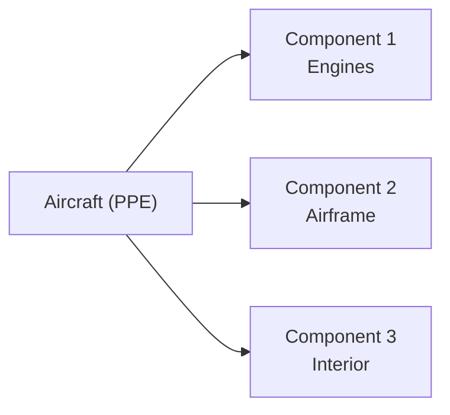

## Introduction

Have you ever looked at a big asset—say, an airplane—and wondered, “Hold on, how do we figure out precisely how it’s depreciating if its engines and airframe don’t wear out at the same rate?” You’re not alone. This is where component depreciation comes into the picture. Under International Financial Reporting Standards (IAS 16), companies must identify each significant part (component) of an asset if those parts have different useful lives (or depreciation patterns). Then, they depreciate each piece separately to achieve a more accurate reflection of how the asset is consumed over time.

In this section, we’ll explore both component depreciation and partial asset retirements (because, let’s face it, parts of an asset don’t always hang around until the entire asset hits its scrap heap). Along the way, we’ll discuss the IFRS emphasis on component accounting, how US GAAP often addresses (or sometimes sidesteps) this requirement, and the potential impact on a company’s financial statements. Let’s get started.

## IFRS Emphasis on Component Depreciation

IFRS (specifically IAS 16) requires an entity to separate and depreciate any significant part of an asset if that part has a useful life different from the rest of the asset. That’s a mouthful, I know. But let’s break it down:

• When you buy a complex piece of equipment—like a commercial airliner—the engines might be expected to last 20,000 hours of flight, while the cabin interior might only be good for half that time before it’s replaced. The airframe may last even longer.  
• Because each part “wears out” differently, IFRS says: depreciate them separately. That’s component depreciation.  
• The rationale is straightforward: it matches the expense (depreciation) with the actual usage or benefit derived from each part of the asset, improving the accuracy of reported profits and asset values.

### Benefits of Component Depreciation

• Improved Accuracy: You don’t overdepreciate or underdepreciate the asset as a whole.  
• Better Decision-Making: Management sees which parts of significant assets consume the most capital over time.  
• Clarity for Investors: It’s clear how certain parts of equipment are performing and whether major overhauls are on the horizon.

### US GAAP Perspective

Under US GAAP, there’s no strict blanket requirement to adopt component depreciation. It’s perfectly allowed, but many companies don’t do it unless industry-specific guidelines require them to (utilities, railways, and certain other specialized industries often do). The result? One company reporting under IFRS might show a slightly different depreciation pattern (and perhaps different net income timing) than a similar company under US GAAP. As you can guess, cross-company and cross-border comparisons can be tricky if one firm does (or does not) adopt this approach.

## Partial Asset Retirements

Now, about that partial retirement issue. Sometimes, you might replace a portion of a building—like the roof—or swap out the interior of an airline cabin. If you’re using component depreciation under IFRS, you’d derecognize (remove from the books) the portion of the carrying value associated with the old component. Then, you’d record the cost of the new component and depreciate it going forward.

Under IFRS, if you can reliably identify or estimate the carrying amount of the replaced part, you remove it. If it’s not reliably measurable, you might use the cost of the new component as a proxy to figure out how much the old piece was worth at the time of retirement.

### US GAAP Considerations

US GAAP, in general, doesn’t mandate component depreciation and thus partial asset retirements can be handled differently. Sometimes, the cost of the new part is just capitalized, and the old remains on the books unless it meets the definition of a separate component. Typically, if a firm doesn’t do component-level accounting, there might be no partial write-off—it’s just a “betterment” or “improvement,” and the old book value of the replaced part is rarely singled out. If you’re analyzing two firms—one under IFRS and one under US GAAP—that do major partial asset retirements, you want to watch for potential mismatches in depreciation expense and subsequent carrying amounts.

## Analytical Considerations and Recordkeeping

Let’s not sugarcoat it: adopting component depreciation can be a recordkeeping headache. You need:

• Separate cost basis for each significant component.  
• Distinct useful life and residual value assumptions.  
• Ongoing vigilance to update assumptions (such as changes in maintenance policies, technology, and expected usage).

Beyond that, partial retirements add even more complexity. If you like everything neat and tidy, well, you’ve got your work cut out for you. But the good news is that this detailed approach yields better adherence to the matching principle, letting users of financial statements see an asset’s lifecycle costs more clearly.

### Common Pitfalls

• Over-Aggressive Componentization: Splitting assets into too many components can create needless complexity.  
• Under-Aggressive Componentization: On the flip side, some companies might lump everything together when IFRS suggests more precise breakdowns, which can understate or overstate depreciation in the short term.  
• Estimation Errors: If you pick the wrong useful life or residual value for a component, your depreciation expense could be off significantly.  
• Inconsistent Application: Some parts are accounted for separately, while others aren’t, leaving the door open for big restatements or diminishing financial statement comparability.

## Visualizing Components: A Simple Diagram

Using an airplane as an example, here’s a quick visual representation of how we might treat major components:



Each of these components can have a distinct useful life—and IFRS requires separate depreciation for each. When the engine is replaced, you’d remove (derecognize) the old engine’s book value (assuming it’s separately tracked) and capitalize the new one.

## Practical Numeric Example

Let’s do a simplified numerical illustration. Suppose you acquire an aircraft for $9 million. You identify three major components:

• Engines: $3 million cost, 30,000 flight hours estimated life.  
• Airframe: $5 million cost, 15 years estimated life.  
• Interior: $1 million cost, 5 years estimated life.

For simplicity, let’s say we’re ignoring residual values. The annual depreciation for each component might look like this:

• Engines: You might depreciate based on flying hours (a units-of-production method). If you estimate 3,000 hours per year, then annual depreciation = (3,000 / 30,000) × $3 million = $300,000.  
• Airframe: Straight-line over 15 years = $5 million / 15 = $333,333 per year.  
• Interior: Straight-line over 5 years = $1 million / 5 = $200,000 per year.

Total annual depreciation in the first year is $833,333. If, after three years, you decide to replace the interior completely at a cost of $1.2 million, you’d derecognize the old interior’s carrying amount (original interior cost: $1 million; 3 years’ depreciation: $600,000, so net book value is $400,000). Out it goes, and you recognize a (potential) loss on that retirement (if there is no salvage). You then capitalize the new interior at $1.2 million and start depreciating it over its new expected useful life (maybe 5 more years).

Below is a quick Python snippet to illustrate a straightforward annual calculation for the interior component:

```python
initial_cost = 1_000_000
useful_life_in_years = 5

annual_depreciation = initial_cost / useful_life_in_years
print(f"Annual Depreciation for the Interior: ${annual_depreciation:,.0f}")
```

## Exam Relevance

In CFA exams (even at Level I), you might see scenario-based questions testing your knowledge of how different depreciation policies affect net income, asset turnover ratios, or return on assets. By understanding the specifics of component depreciation and partial asset retirements, you’ll be able to pinpoint how a firm’s reported earnings could be higher or lower based on the chosen approach.

Key angles to watch for:

• Comparability: Watch out for differences between IFRS adopters (who must do component depreciation) and US GAAP firms (who often do not).  
• Asset Turnover and ROA: More accurate (potentially higher) depreciation in earlier years could mean lower net income and lower ROA initially.  
• Replacement Patterns: Replacing components mid-life might create lumps in capital expenditures and influence the time-series trend of depreciation expense.

## Best Practices and Strategies

• Identify Significance: Focus on major components that have a material cost relative to the asset as a whole.  
• Keep Good Records: Implement robust systems to track costs, useful lives, and depreciation for each component.  
• Adjust Regularly: If usage patterns or technology changes, update your depreciation estimates.  
• Communicate Policy: Companies should clearly disclose their component depreciation approach and any changes to it in the notes to the financial statements.

## Tips for the Exam

• Make sure you understand the IFRS requirement that significant components of an asset with distinct useful lives must be depreciated separately.  
• Know how to treat gains or losses on partial asset retirements (e.g., removing the old interior from the aircraft example).  
• Practice comparing IFRS-based statements with US GAAP statements analyzing what differences might arise from adopting or not adopting component depreciation.  
• Be aware that specialized industries (like utilities) might use group or composite depreciation under US GAAP, which can create confusion regarding partial retirements.  

## References and Further Reading

• IAS 16 – “Property, Plant and Equipment” details the requirements for component depreciation.  
• ASC 360 under US GAAP addresses property, plant, and equipment, although it doesn’t require the same level of component focus (except in specific industries).  
• “Intermediate Accounting IFRS Edition” by Kieso, Weygandt, and Warfield provides comprehensive examples of how IFRS and US GAAP differ on depreciation.  
• For more on partial retirements under IFRS, see IFRS guidelines on derecognition in IAS 16.

## Test Your Knowledge: Component Depreciation and Partial Asset Retirements



### Which of the following best describes component depreciation under IFRS?

- [x] Separately depreciating parts of an asset with distinct useful lives.
- [ ] Averaging an asset’s useful life across all components.
- [ ] Accelerating depreciation of all components together in the first year.
- [ ] Deferring all depreciation until the asset is sold.

> **Explanation:** Under IFRS, each part of an asset with a different useful life is depreciated separately. This helps match costs more closely with benefits.

### A company under IFRS replaces the roof on its factory. To comply with the standard, the company must:

- [x] Derecognize the carrying amount of the old roof and capitalize the new roof.
- [ ] Continue depreciating the original roof but do not record a cost for the new one.
- [ ] Record the entire cost of the new roof as a maintenance expense.
- [ ] Make no accounting entry until the entire factory is retired.

> **Explanation:** When a significant component is replaced, IFRS requires derecognizing the old part’s carrying value and recognizing the new component’s cost on the balance sheet.

### Under US GAAP, component depreciation is:

- [x] Allowed but not strictly required in most industries.
- [ ] Prohibited under all circumstances.
- [ ] Mandatory for all public companies.
- [ ] Required only for intangible assets with indefinite lives.

> **Explanation:** While US GAAP permits component depreciation, it’s generally optional (except for specific industries).

### When a partial retirement occurs (under IFRS) and the carrying amount of the retired component cannot be measured reliably:

- [x] The cost of the new component may be used as a proxy for the carrying amount of the replaced component.
- [ ] Management should estimate a carrying amount five years in advance.
- [ ] No partial retirement should be recognized.
- [ ] A gain or loss must be recognized equal to the total asset’s book value.

> **Explanation:** IFRS allows using the cost of the new component as a proxy if the exact carrying amount of the part replaced is not reliably measurable.

### Which of the following is a major analytical consideration for investors when comparing IFRS and US GAAP financial statements with regards to depreciation?

- [x] Differences in net income timing due to component-level vs. entire-asset depreciation.
- [ ] Differences in whether intangible assets are recognized on the balance sheet at all.
- [x] Potential disparities in cash flows from operations due to depreciation methods.
- [ ] No difference, as both IFRS and US GAAP require component depreciation equally.

> **Explanation:** One must be aware that IFRS requires component depreciation (and partial retirement treatment), which can affect net income and operating cash flow comparisons versus a US GAAP reporter that doesn’t apply component depreciation as strictly.

### The primary objective of component depreciation:

- [x] To enhance the matching of costs with revenues by recognizing the distinct useful lives of significant components.
- [ ] To accelerate tax deductions and reduce tax liabilities.
- [ ] To maximize reported net income for shareholders.
- [ ] To simplify the accounting system.

> **Explanation:** Component depreciation more accurately reflects the consumption of each part of an asset’s economic benefits.

### An airline operating under IFRS notices its passenger seats (interior) wear out much faster than the aircraft’s engines. What must the airline do?

- [x] Depreciate the seats separately from the engines and airframe.
- [ ] Depreciate the entire plane using the longest useful life available.
- [x] Defer all depreciation until the plane is sold.
- [ ] Recognize a contingent liability for seat replacements.

> **Explanation:** IFRS requires separately depreciating components with distinct useful lives. The seats would be treated distinctly from the fuselage and engines.

### If a firm overestimates the useful life of one of its significant components, how does this impact financial statements?

- [x] Depreciation expense is understated, and net income could be overstated until useful life estimates are corrected.
- [ ] Depreciation expense is overstated, and net income is understated.
- [ ] There is no impact on net income, only on cash flow.
- [ ] It only affects disclosures and not the amounts in financial statements.

> **Explanation:** Overestimating the useful life understates annual depreciation, leading to higher net income, at least temporarily.

### How might partial asset retirements impact an entity’s statement of cash flows under the indirect method?

- [x] Noncash losses or gains from disposals may appear as adjustments in operating activities.
- [ ] Partial retirements never affect cash flow statements.
- [ ] The entire carrying amount flows directly through investing activities.
- [ ] Only the capitalized value of the new asset flows through financing activities.

> **Explanation:** Gains or losses on disposal appear as reconciling items under operating activities in the indirect method. The actual cash paid for the new asset is often part of investing outflows.

### True or False: Under IAS 16, companies must always track small, insignificant components separately for depreciation calculations.

- [x] True
- [ ] False

> **Explanation:** Technically, IAS 16 requires “significant” parts to be separately depreciated. However, in practice, some interpret “significant” broadly and choose multiple components. Firms still exercise judgment, so “always track small, insignificant components separately” can be seen as a misguided approach. The question’s statement as “always” can be tricky, and many read it as IFRS being quite firm that any significant part must be separated. Nevertheless, the principle is that immaterial components may be aggregated, but “significant” components must be tracked and depreciated.


