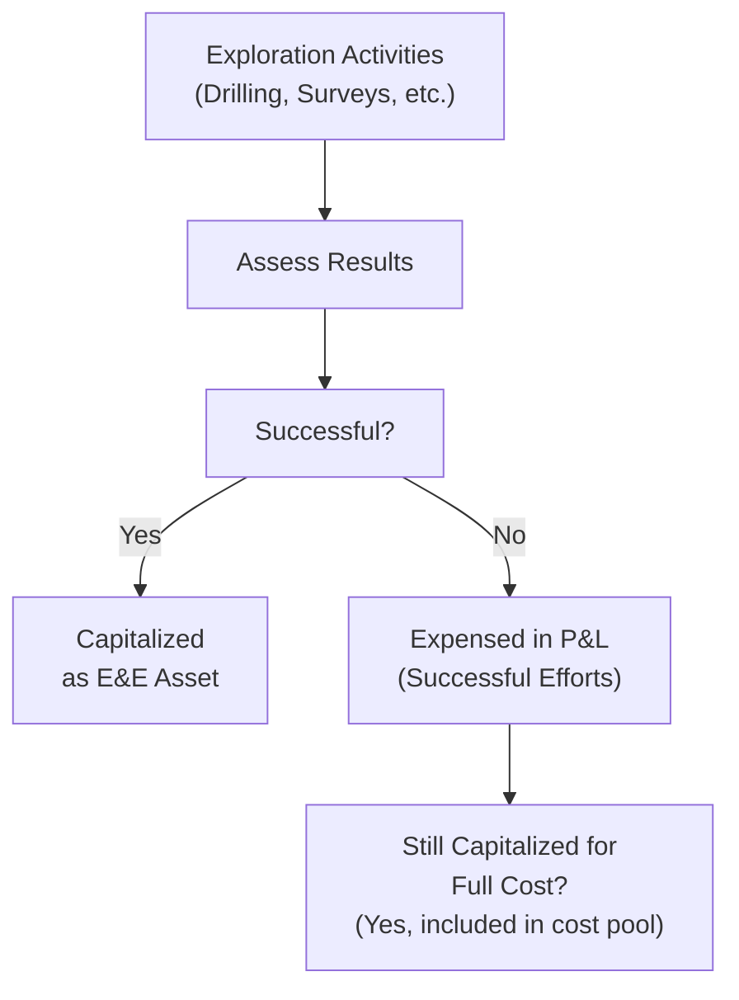

## Overview

If you’ve ever driven through the dusty outskirts of a small oil town or flown over a vast open-pit mine, you might have wondered about the behind-the-scenes accounting that brings these resources to your gas pump or smartphone battery. Exploration and evaluation (E&E) assets in the extractive industry capture the cost of searching for hidden treasures beneath our feet—oil, gas, minerals, and you name it. From an accounting standpoint, it can get, well, complicated. IFRS 6 offers some guidance on how to treat these costs, but it also leaves a fair amount of wiggle room. And that wiggle room can create big differences in financial statements across companies.

In this article, we’ll take a look at how E&E assets typically show up in financial statements under different accounting regimes, including IFRS 6 and US GAAP. We’ll dig into two primary methods—full cost and successful efforts—and see how they can lead to wildly different views of a company’s financial performance. We’ll also explore a handful of real-world analysis challenges, highlight best practices, share a few cautionary tales, and show how you might tackle these issues if you’re faced with them in an exam (or in real life).

## IFRS 6 and the Extractive Industry

International Financial Reporting Standard (IFRS) 6, “Exploration for and Evaluation of Mineral Resources,” specifically addresses how entities involved in the exploration and evaluation of mineral resources record and present these costs. IFRS 6 is unique: it actually grants companies a certain flexibility—an unusual approach in IFRS—on how to account for E&E expenditures, at least until more definitive standards are developed or amended. This interim standard aims to ensure companies provide enough clarity in their reporting while acknowledging that different extractive businesses face differing circumstances.

Within IFRS 6:
• Exploration costs are recognized when they arise from activities aimed at discovering new oil, gas, or mineral reserves.  
• Evaluation costs relate to assessing the technical feasibility and commercial viability of these newly discovered reserves.  

Under IFRS 6, many entities continue to use the same accounting policies they adopted prior to IFRS transition. As a result, you’ll sometimes see local GAAP policies carried forward. One large Canadian mining firm might have a policy to capitalize certain exploration drilling costs, while another might expense them outright. Both might arguably be IFRS-compliant provided they disclose these policies properly. All this can be frustrating for an analyst who hopes to compare apples to apples.

## Full Cost Method

Let’s say you’re heading out on an exploration drilling campaign. You drill 10 wells. You find commercially viable reserves in two of them, but the other eight come up dry. Under the full cost method (common in certain US GAAP contexts, and permissible in some IFRS regimes under transitional provisions):

• All exploration costs are lumped together into a “full cost pool.”  
• This includes successful drills, duds, overhead, and even certain administrative costs if they can be linked to the exploration activities.  
• Once reserves are proven, the next step is depletion or amortization. The carrying amount of that full cost pool is amortized based on the ratio of production during the period to total estimated proved reserves in that pool.

### Key Characteristics of the Full Cost Method

• Potentially higher initial reported assets: Because unsuccessful well costs are capitalized, the balance sheet can appear more robust.  
• Smoother earnings: By capitalizing nearly everything, short-term expenses are lower. Costs are recognized over time through depletion.  
• Risk of overcapitalization: If many wells in a pool are unsuccessful, the carrying value could exceed the real economic value of the underlying assets. That’s especially possible when commodity prices tank or resource estimates drop.  

In practice, the full cost method can make net income look steadier. The cost of that stability is that you might have a “bloated” balance sheet if the exploration success rates are low. If you’re analyzing these companies, you’ll often turn to cash flow measures (like CFO or free cash flow) to piece together what’s really going on operationally.

## Successful Efforts Method

By contrast, the successful efforts method capitalizes only those costs directly attributable to wells or mineral exploration activities that actually turn out to be successful. Everything else—dry holes, nonproductive exploratory drilling, and unfruitful geological surveys—gets expensed immediately in the income statement.

### Key Characteristics of the Successful Efforts Method

• More volatile earnings: Because unsuccessful costs are written off right away, you can see significant swings in reported net income if a drilling campaign hits a rough patch.  
• Potentially lower total assets: The carrying value on the balance sheet might be lower than under full cost, because unsuccessful expenditures aren’t capitalized.  
• Closer alignment with the matching principle (arguably): Costs that lead to future economic benefits are capitalized, while those that do not create future benefits are expensed.

### Simple Example

Imagine you’re analyzing two hypothetical oil firms—Big Driller Co. (which uses full cost) and Sharp Explorer Inc. (which uses successful efforts). Both spend $100 million in exploration this year, but only $20 million results in a successful find.

• Under Big Driller’s full cost approach, the entire $100 million is capitalized. Let’s say they expect 100 million barrels of production from the proven reserves they discovered. They’ll deplete that $100 million over the total lifetime production. The net effect? A large capital asset is recognized now, while the expense is spread out.  
• Under Sharp Explorer’s successful efforts approach, only that $20 million for the successful find is capitalized, and the other $80 million is charged straight to expense in the current year. Next year, if they have no big expenditures, net income might jump.  

From a ratio analysis perspective, Big Driller’s asset base is bigger, and short-term net income might be higher (because less is expensed immediately). Sharp Explorer’s asset base is smaller, and near-term net income might take a hit from all the dry-hole costs. Any attempt to compare these two firms must factor in these accounting differences—or you could be comparing apples to pineapples.

## Reporting and Analysis Challenges

### Reserving Methods

Reserves are critical. The depletion calculation or unit-of-production method for depreciation depends heavily on how many barrels, cubic feet, or metric tons of resource are considered “proved” or “probable.” Proved reserves are typically the basis for depletion in many accounting regimes, but the techniques for estimating reserves vary widely, and they’re subject to re-evaluation as new geological data come up.

A tiny revision in the estimate of total proved reserves can change the depletion schedule significantly, which trickles through to reported net income and asset values. Analysts often look to the notes for estimated reserve quantities and compare them to prior periods. If there’s a consistent pattern of downward revisions, you begin to question the reliability of management’s estimates.

### Comparability Across Companies

Comparability is the big headache here. One junior exploration mining company might expense nearly all E&E expenditures until a feasibility study is complete, while another might capitalize them at a much earlier stage. Under IFRS 6, both might effectively check the compliance box if they apply their approaches consistently and disclose them. As an investor or a CFA candidate analyzing those statements, you have to be vigilant, making adjustments when you want a true like-for-like comparison.

### Earnings Volatility

The successful efforts method tends to produce more volatility in net income, which might startle some who glance at the annual income statement without delving into the footnotes. On the flip side, the full cost method can understate volatility. Some analysts prefer the successful efforts method for its straightforward reflection of the real “hit or miss” nature of exploration. Others argue that resource extraction is fundamentally an integrated process, so the full cost method better reflects the fact that each well is part of a broader exploration strategy.

### Goodwill and Impairment

If a firm acquires another exploration entity, or if it has intangible assets related to exploration rights, you might see additional layers of complexity in the financial statements. Impairment testing under IFRS might be triggered if commodity prices drop or operational results disappoint. Under the full cost method, if the capitalized pool is significant and commodity prices crash, you might see a big write-down that hits net income in one shot.

## A Flow of Costs: Visual Overview

Below is a simple Mermaid diagram illustrating how exploration costs might flow differently under the full cost vs. successful efforts method. Note that this diagram is simplified for demonstration purposes:

As you can see, under successful efforts, a “no” result means immediate expense. Under full cost, we might still capitalize the cost, grouped in a large cost pool.

## Practical Example: Dry Holes vs. Gushers

Let’s work through a simple numeric illustration:

1. Company A (Full Cost) explores 5 fields. It spends $10 million each, total $50 million. Only one field is successful, and that success leads to an estimated 500,000 barrels of proven reserves.  
2. At year’s end, Company A capitalizes $50 million. Assume in the next year it produces 25,000 barrels. Using a straight unit-of-production approach, the annual depletion would be:  
   
   Depletion = (Production / Proved Reserves) × Capitalized Cost  
   Depletion = (25,000 / 500,000) × $50,000,000 = $2,500,000  
   
3. Company B (Successful Efforts) does the same. It also spends $50 million in total and sees a similar one-field success. At year’s end, it capitalizes $10 million (for the successful field) and expenses $40 million in the current period for the four dry holes.  
4. Company B’s depletion on the $10 million capital base, with the same production ratio, is:  
   
   Depletion = (25,000 / 500,000) × $10,000,000 = $500,000  

Now, if you look at net income in Year 1, Company B is going to take a $40 million hit right away, while Company A defers it. Next year? Company B might look more profitable because many unsuccessful costs are already expensed. Meanwhile, Company A continues to carry that bigger cost pool in its balance sheet, incurring higher depletion going forward.

## Impact on Key Ratios

• Return on Assets (ROA): Under full cost, the asset base is inflated, potentially lowering ROA. Under successful efforts, you might see a smaller asset base but a bigger hit to net income early on.  
• Debt to Equity (D/E): If a firm finances its exploration, a bigger asset base could keep the D/E ratio lower in the short run (because equity may appear higher if costs aren’t expensed).  
• Earnings Volatility: If you rely on net income, be prepared for swings under successful efforts. Full cost could create a smoother pattern.  
• Cash Flow Ratios: Operating cash flow is often seen as a more comparable metric across different methods, since actual cash outlays are unaffected by the chosen accounting treatment.

## Best Practices and Pitfalls

• Consistent Application: A big pitfall is changing policies midstream to manage earnings. IFRS 6 requires consistent application and robust disclosures.  
• Disclosure Quality: Analysts should carefully read the notes on how E&E costs are defined, at what stage they’re capitalized, and when they’re transferred from E&E assets to development assets.  
• Reserve Estimates: Resist the temptation to blindly trust management’s “proved” and “probable” reserves. Look for third-party verifications, and track the firm’s history of adjustments.  
• Monitoring Impairment Indicators: A slump in commodity prices or negative drilling results can trigger impairment under IFRS or US GAAP. Keep an eye on how quickly management recognizes these changes.  
• Segment Analysis: Companies may aggregate multiple geographical regions or resource types in one cost pool (especially under full cost). This can obscure the real performance of specific segments or assets.

## Regulatory and Standards Integration

• IFRS 6: This interim standard allows for diverse approaches, but also requires key disclosures so investors can understand how the entity accounts for its E&E activities.  
• US GAAP: Primarily sees both full cost and successful efforts in practice. The Securities and Exchange Commission (SEC) also issues specialized guidance for the oil and gas industry.  
• Local Regulations: Countries like Canada or Australia sometimes have additional industry guides or definitions that overlay IFRS with local best practices.  
• Ethical and Professional Standards: Under the CFA Institute Code of Ethics and Standards of Professional Conduct, it’s crucial that analysts strive for clarity, objectivity, and due diligence. If you sense an accounting policy is being used manipulatively, that’s a red flag—one you might raise to your audit committee or consider in your recommendation to investors.

## Examination Strategies and Tips

Yes, you might see a question about E&E assets on your CFA exam—especially in a scenario-based item set. Here’s how to prepare:

• Understand both methods: You should be able to outline the main differences between full cost and successful efforts in two or three bullet points, including their impact on financial statements and ratios.  
• Look at the disclosures: If the item set references financial statement footnotes about E&E, you’ll likely see specific language about how the firm capitalizes or expenses. You’ll want to parse that carefully.  
• Adjust for comparability: If you’re asked to compare two companies, be ready to mention that differences in accounting policy might require adjustments to produce apples-to-apples analyses.  
• Don’t forget impairment: Make sure you know how to handle potential write-downs and how they flow through the income statement or other comprehensive income.  
• Timing and partial successes: A single “semi-successful” well might cause partial capitalization and partial write-off. Know how to handle that in a calculation question.  
• Watch those ratio formulas: Could be a quick question about the effect on net income, total assets, or equity.

Finally, try to combine your knowledge of E&E assets with broader topics, like capital budgeting or risk management. The interplay among these can provide deeper insights and might earn you extra credit in an essay-style response.

## References

• IFRS 6 – Exploration for and Evaluation of Mineral Resources:  
  https://www.ifrs.org/issued-standards/list-of-standards/ifrs-6-exploration-for-and-evaluation-of-mineral-resources/  

• SEC Industry Guide for US oil and gas reporting:  
  https://www.sec.gov/divisions/corpfin/guidance/oilgasinterps.htm  

• Wright, C.J., and Gallun, R.A., “Oil and Gas Accounting”:  
  A comprehensive text covering full cost vs. successful efforts with numerical examples and practical industry insights.

• CFA Institute Standards of Practice Handbook:  
  Emphasizes transparency, accuracy, and fairness in financial reporting.

## Test Your Knowledge: Exploration and Evaluation in the Extractive Industry



### Under the full cost method, which of the following is TRUE regarding exploration costs?  
- [ ] Only costs directly related to successful wells are capitalized.  
- [ ] Dry hole costs are recognized as period expenses when incurred.  
- [x] All exploration costs, including unsuccessful ones, are capitalized.  
- [ ] Exploration costs are not recognized until the firm begins production.  

> **Explanation:** The full cost method capitalizes all exploration costs into a cost pool, regardless of whether they ultimately lead to successful reserves.

### Under the successful efforts method, which cost would most likely be expensed in the period it’s incurred?  
- [ ] Drilling costs related to a successful field discovery.  
- [x] Seismic survey costs for a field that does not yield reserves.  
- [ ] Overhead allocated to ongoing production activities.  
- [ ] Depreciation of pipelines used across multiple fields.  

> **Explanation:** Unsuccessful exploration expenditures (like seismic surveys on a dry field) are expensed immediately under successful efforts.

### One major reason for differences in the reported performance of two extractive firms using full cost vs. successful efforts is:  
- [x] The timing of cost recognition in the income statement.  
- [ ] The unit-of-production method required under IFRS.  
- [ ] The intercompany elimination of exploration assets.  
- [ ] The inability of either method to recognize impairment.  

> **Explanation:** Full cost tends to defer costs while successful efforts expenses unsuccessful exploration costs upfront. This difference significantly affects income statement timing.

### When analyzing two extractive companies with different E&E accounting policies, an analyst should primarily:  
- [x] Consider adjusting the financials for comparability.  
- [ ] Disregard the E&E policies as they do not affect cash flow.  
- [ ] Assume the bigger asset base always indicates superior reserves.  
- [ ] Rely exclusively on reported earnings per share (EPS).  

> **Explanation:** Adjustments may be required to ensure that one company’s financials are comparable to another’s, particularly given the differing treatment of exploration costs.

### Which of the following is a potential drawback of the full cost method?  
- [ ] Higher short-term volatility in reported net income.  
- [ ] Lower initial asset values.  
- [x] Overcapitalization of unsuccessful projects.  
- [ ] Immediate expensing of unsuccessful wells.  

> **Explanation:** Under full cost, there is a risk of overcapitalizing costs for projects that do not yield long-term benefits, potentially inflating the asset base.

### Which key factor heavily influences the computation of depletion for hydrocarbon assets once production starts?  
- [ ] The sum-of-the-years’-digits method.  
- [x] The estimate of total proved reserves.  
- [ ] The entity’s depreciation policy on intangible assets.  
- [ ] The net realizable value at each production stage.  

> **Explanation:** Depletion under both full cost and successful efforts is typically calculated using a unit-of-production method, which demonstrates strong dependency on the estimate of total proved reserves.

### A firm capitalizing unsuccessful exploration costs might show:  
- [ ] Lower total assets compared to a successful efforts firm.  
- [x] Higher short-term net income if many wells fail.  
- [x] A potentially understated debt-to-equity ratio.  
- [ ] Immediate expense of all intangible E&E costs.  

> **Explanation:** Capitalizing unsuccessful costs reduces expenses in the current period, which can lead to higher net income (in the near term) and a bigger asset base, possibly resulting in a lower D/E ratio.

### Under IFRS 6, a company continuing its pre-IFRS local GAAP approach to exploration costs must:  
- [x] Disclose its accounting policies clearly and apply them consistently.  
- [ ] Immediately switch to successful efforts for intangible E&E assets.  
- [ ] Stop capitalizing any drilling costs until proven reserves are found.  
- [ ] Use full cost only for onshore drilling.  

> **Explanation:** IFRS 6 allows entities to retain previously adopted accounting policies provided they are applied consistently and adequately disclosed to users of financial statements.

### When comparing the full cost and successful efforts methods, which statement is correct?  
- [x] Successful efforts method may lead to more volatile earnings.  
- [ ] Full cost typically results in a lower depletion charge once production begins.  
- [ ] Both methods require all administrative costs to be expensed immediately.  
- [ ] Both methods ignore abandonment and site restoration costs.  

> **Explanation:** The successful efforts approach capitalizes only successful exploration costs, expensing unsuccessful ones. This can lead to significant earnings volatility in periods with multiple dry holes.

### A high level of unsuccessful exploration costs in one period under the successful efforts method would likely:  
- [x] Decrease net income in that period.  
- [ ] Increase net income in that period.  
- [ ] Have no effect on net income until production starts.  
- [ ] Generate a large asset write-up in that period.  

> **Explanation:** Unsuccessful exploration costs are immediately expensed under the successful efforts method, which decreases net income for that period.


