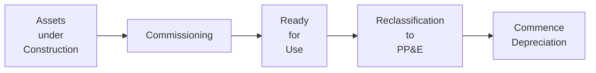

Have you ever walked past a building site and thought, “Wow, they’ve been pouring money into this place for months, but it’s still not open for business?” That’s basically what companies do with Assets under Construction (AUC) — they invest in projects that aren’t yet generating direct revenue or fully functional service capacity. In accounting speak, these are “Construction in Progress” (CIP) costs under US GAAP or simply “Assets under Construction” in many IFRS jurisdictions. Reclassifying these assets once they’re completed might sound like a quick footnote, but it’s a critical step in ensuring accurate financial statements. Let’s dive in a bit deeper and see how it all comes together.

Definition and Overview of Assets under Construction  
Assets under Construction are capital projects that aren’t yet available for the company’s intended use. Think of them as big works in progress—like a new factory line, software platform, or even a piece of heavy machinery that needs custom modifications before it can be safely deployed. During this construction (or development) phase, all the direct and, in many cases, indirect costs pile up in a special “bucket” on the balance sheet. Under IFRS (IAS 16) and US GAAP (ASC 360), companies generally record these expenditures separately from operational assets. 

Why Reclassification Matters  
At some point, that bucket of costs hits the magical “commissioning” stage: the asset can perform as management intended. That’s your cue to ship the cost out of the “work in progress” account and into a relevant property, plant, and equipment (PP&E) account (or intangible asset category if you’re dealing with capitalized software or patents). Now the asset is fair game for depreciation or amortization, which can affect earnings, asset turnover, and other performance metrics. Failing to make this reclassification on time can lead to inflated earnings (because you’re not depreciating a completed asset) or misrepresented asset values. 

Reclassification Steps  
Though the details can get pretty nuanced, here’s a broad outline:

• Confirm completion: Has the asset passed all safety checks, functional tests, or regulatory requirements?  
• Transfer costs: Move the cumulative balance from “Assets under Construction” to the proper category—often a new line under PP&E or intangible assets.  
• Begin depreciation/amortization: Once reclassified, you start counting its useful life and subtracting that value over time.  
• Disclose appropriately: Provide details in the footnotes about the project scope, total capitalized costs, and the start date for depreciation.  

In IFRS, IAS 16 sets out the criteria for when an asset is “available for use,” while US GAAP’s ASC 360 lumps project costs into “CIP.” The underlying principle is the same. The main difference is often in the nuances, such as how overhead or interest costs get allocated.

Below is a simple Mermaid diagram illustrating the flow of reclassification:



Implications for Financial Statements and Ratios  
During the construction phase, you’re not depreciating a single penny of those capitalized costs, so your expenses might look nice and lean. But once the asset is reclassified, depreciation expense kicks in, directly reducing earnings each period. If a giant project remains in AUC for an extended period, your balance sheet can swell with substantial capital investments that aren’t yet matched by a corresponding depreciation or amortization charge.

From an analytical standpoint:  
• Asset turnover might be inflated if large chunks of PP&E are still sitting in AUC (because net fixed assets remain comparatively low).  
• Operating margin can appear rosy until the asset is reclassified—even though it’s fully operational from a practical standpoint.  
• Future expenses may spike once reclassification hits, reducing net income and possibly triggering debt covenant or performance metric issues if not planned.  

Many analysts keep a close eye on the footnotes to see how major capital projects progress over time. It’s a red flag if a project that looks operational remains in AUC indefinitely—this could hint at earnings management or simply poor oversight.

A Quick Personal Anecdote  
I once worked with a company that built a sprawling new manufacturing line. For months, they forgot (or maybe “forgot”) to reclassify the facility. Their profit margin looked fantastic on paper. When the external auditors arrived, well, guess what? They had to fast-track the reclassification, triggering a big jump in depreciation expense that quarter. The CFO wasn’t thrilled to explain the sudden profit drop to analysts on the quarterly call. But hey, accurate financial statements matter in the long run.

Real-World Example: Constructing a Factory  
Imagine you’re analyzing a manufacturing firm called BrightMachinery Inc., which invests $5 million in a new automated production line. During its six-month construction, these costs sit in “Construction in Progress.” Although the line is completed at the end of Month 6, the finance team only reclassifies it at Month 8. This oversight means for two months, they didn’t record any depreciation for a fully functional line. On reclassification, they do a catch-up depreciation expense, recognizing two months of cost in a single period—and that can seriously alter the company’s earnings trend. This abrupt shift might mislead short-term investors if they don’t catch the footnote details.

Key Considerations under IFRS and US GAAP  
Both IFRS and US GAAP standard setters generally agree on the primary principle: once an asset is ready for its intended use, it should move out of the AUC (or CIP) account. But the guidelines do have some subtle differences:

• IFRS (IAS 16): More principles-based. “Available for use” is when the asset is in the location and condition necessary for it to operate in the manner intended by management.  
• US GAAP (ASC 360): Tends to have more prescriptive rules, but the concept of “placed in service” is effectively the same.  
• Interest Capitalization: Under both systems, interest directly attributable to constructing the asset is typically capitalized, but the specifics can differ. Keep that in mind when analyzing total project cost.  

Common Pitfalls  
• Delayed Reclassification: Some entities delay reclassification to keep depreciation expense artificially low.  
• Over-Allocation of Overheads: If overhead or interest costs are capitalized incorrectly, you might inflate the asset’s carrying amount.  
• Unclear Commissioning Criteria: Management might apply vague or inconsistent tests to determine “when” an asset is truly ready.  
• Neglecting Disclosures: Failing to clearly report the reclassification in footnotes can hide important information from investors.

Best Practices for Analysts  
• Track Capital Projects: Look at large capital expenditure line items in the cash flow statement. Identify how those eventually show up in AUC.  
• Monitor Timelines: Compare the business’s public statements about project completion with the actual financial statement treatment.  
• Revisit Depreciation Trends: A sudden leap in depreciation is often connected to reclassification of significant projects.  
• Ask Questions: If you see that an asset is “operational,” but it’s still categorized as AUC, pursue management’s rationale.  

Slight Observational Opinion  
In my opinion, reclassification timing can sometimes be used strategically. I don’t want to say companies do this all the time to manipulate earnings, but there’s definitely an opportunity for managers to shift numbers around. That’s why we, as analysts, stay vigilant.

Example Calculation  
Suppose a company invests $2 million in a specialized piece of machinery. During construction, they capitalize $200,000 of interest over six months. Let’s say at the end of those six months, the asset is ready for use, so the total cost to reclassify is $2.2 million ($2 million + $200,000) into PP&E. If the expected useful life is 10 years, with no salvage value, the annual straight-line depreciation is:

( $2.2\text{ million} ) \div ( 10\text{ years} ) = $220{,}000\text{ per year}

Before reclassification, there’s zero depreciation. Immediately after reclassification, the company’s annual depreciation expense jumps by $220,000. This can have a direct impact on net income and profitability ratios.

Data Visualization Tools  
Some folks like to use python to extract footnote disclosures or parse XBRL data for patterns in how companies handle CIP. For example:

```python
import pandas as pd

data = pd.read_csv("financials.csv")
auc_balances = data["AUC_Balance_QuarterEnd"]
print(auc_balances.describe())
```

This simple script could offer insights into whether a company’s AUC balance is consistently growing, which might indicate repeated delays or expansions in capital projects.

References and Further Exploration  
• IAS 16, “Property, Plant and Equipment.”  
• ASC 360, “Property, Plant, and Equipment.”  
• “Accounting Standards: A Brief Guide for Non-Specialists” (Sample Book).  
• IFRS vs. US GAAP comparison guides from major accounting firms, for additional nuance.  
• Official CFA Institute curriculum readings for long-term assets.

Below are some best practices and cautionary tales regarding reclassification, reminding you that while the idea is simple — move from “construction” to “in service” — the real-world details are often a bit more nuanced.

Now let’s test your understanding.

## Test Your Knowledge: Reclassification of Assets under Construction



### Which of the following best describes why reclassification of Assets under Construction is important for financial statements?

- [x] It ensures that depreciation starts when the asset is ready for use, providing an accurate representation of costs and earnings.  
- [ ] It allows the company to avoid impairments on existing assets.  
- [ ] It eliminates the need to track overhead costs.  
- [ ] It ensures the entire project is expensed immediately.  

> **Explanation:** Reclassification initiates depreciation or amortization on a completed asset, preventing overstated earnings and providing a realistic view of operating costs.

### What is a primary risk if a company delays reclassification of a completed asset under construction?

- [x] Earnings may be overstated due to delayed depreciation.  
- [ ] The company’s operating cash flow will improperly decrease.  
- [ ] The company cannot legally pay dividends.  
- [ ] The auditor is required to restate the entire balance sheet from scratch.  

> **Explanation:** Delayed reclassification leads to understated depreciation expense, inflating profits.

### Under which circumstances do companies typically transfer Assets under Construction to PP&E?

- [ ] When management needs a higher net income.  
- [ ] As soon as cash is disbursed for a capital project.  
- [x] When the asset is ready for its intended use, often called “commissioning.”  
- [ ] After the asset has been fully depreciated.  

> **Explanation:** Reclassification to PP&E happens when the asset is in the condition and location necessary for it to be used as intended by management.

### From an analyst’s perspective, how might a large balance of AUC for an extended period affect ratio analysis?

- [ ] It won’t affect any ratios until the asset is sold.  
- [x] It can temporarily inflate asset turnover and profitability measures if not reclassified in a timely manner.  
- [ ] It usually reduces the company’s current ratio.  
- [ ] It eliminates any need for further capital expenditures.  

> **Explanation:** A substantial AUC balance can distort measures because no depreciation is recorded on those assets, resulting in higher profits and lower net fixed assets than if the asset were reclassified.

### Which detail is most critical for deciding the moment of reclassification under IFRS (IAS 16)?

- [ ] The date management signs off on the purchase.  
- [x] The asset being in the location and condition necessary for it to be operated in the manner intended.  
- [ ] Achieving 90% of the total budget.  
- [ ] The availability of external financing.  

> **Explanation:** Under IAS 16, “available for use” is the key principle, meaning the asset must be ready for operational use.

### A company completes construction of a new manufacturing line but waits two months to reclassify it. Which of the following is a likely impact?

- [x] Depreciation expense is recorded later, temporarily overstating net income.  
- [ ] Retained earnings must be restated under IFRS.  
- [ ] The auditor will waive depreciation if reclassification is only two months late.  
- [ ] Operating cash flow must be retroactively increased.  

> **Explanation:** Deferring depreciation for assets that are already in use inflates current earnings, causing potential misrepresentation of the financials.

### In the context of US GAAP (ASC 360), what is a key term used to describe Assets under Construction?

- [ ] “Capital Inventory.”  
- [x] “Construction in Progress.”  
- [ ] “Capital Projects in Service.”  
- [ ] “Developmental PP&E.”  

> **Explanation:** Under US GAAP, CIP (Construction in Progress) is the standard term for AUC.

### How does reclassification of AUC generally impact the cash flow statement?

- [ ] It automatically increases operating cash flows.  
- [ ] It has no effect on the cash flow statement.  
- [ ] It dramatically reduces investing cash flows.  
- [x] It does not change total cash flows, but changes the classification of capital expenses on the balance sheet.  

> **Explanation:** Reclassification is a balance sheet reallocation; the timing of cash outflows is already captured in the investing section when payments occur.

### Which of the following best describes “commissioning” in the context of Assets under Construction?

- [ ] A period in which no costs can be capitalized.  
- [x] The process of testing and confirming an asset is operational for intended use.  
- [ ] A revenue recognition milestone for new machinery.  
- [ ] An SEC-required procedure for large capital projects.  

> **Explanation:** Commissioning is the stage where an asset’s readiness for use is confirmed, triggering reclassification.

### True or False: Once an asset is reclassified from AUC to PP&E, its useful life for depreciation purposes starts at the original date of purchase.

- [ ] True  
- [x] False  

> **Explanation:** The depreciation clock starts when the asset is ready for its intended use, not when the purchase transaction initially occurred.


