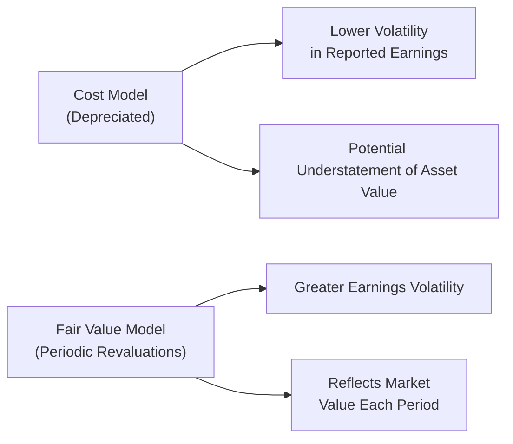

## Context and Overview

Real Estate Investment Trusts (REITs) present perhaps one of the most fascinating niches in the world of long-term asset accounting. Unlike typical corporations that invest in machinery and intangible patents, REITs invest largely in physical properties like shopping centers, apartment buildings, hotels, and office spaces. Those properties, in turn, generate rental income (and potentially capital appreciation) that can be distributed back to shareholders. In my experience, the first time you see the word “REIT,” you might go, “Wait, that’s just a fancy name for a real estate holding company, right?” And you wouldn’t be entirely wrong. But the unique tax, regulatory, and accounting treatments make REITs a special vehicle worth digging into carefully.

Below, we’ll unpack REIT structures, discuss IFRS and US GAAP treatments of real estate assets, explore key analytical measures like Funds from Operations (FFO), Adjusted Funds from Operations (AFFO), and Net Asset Value (NAV), and examine the implications of using different valuation models. We’ll also sprinkle in references to the rest of the chapters to showcase how analyzing REIT assets ties into the broader financial statement analysis framework.

## Nature of REIT Assets

### Key Characteristics of REIT Structures

By structure, a REIT pools investors’ funds to invest primarily in income-producing real estate or real estate-related assets. Different jurisdictions have varying technical requirements (like minimum distribution thresholds or property-type restrictions), but generally:

• REITs must distribute a significant portion (often 90% or more) of their taxable income to shareholders as dividends.  
• REITs often enjoy favorable tax treatments—such as no corporate-level tax—if they comply with certain rules (e.g., ownership requirements, property-holding thresholds).  

From an analyst’s standpoint, REIT assets typically include:

• Commercial and residential properties held for rental income.  
• Development properties slated for future use or sale.  
• Real estate-related investments like mortgage securities in certain specialized REIT structures.  

The focus is usually on such properties’ ability to generate rental revenue and appreciate in value. For more on analyzing property-level performance, refer back to Chapter 3.1 on “Balance Sheet Presentation and Classification,” where we learn about property, plant, and equipment. But keep in mind that for REITs, properties are the entire business, not just a supporting asset.

### Regulatory Considerations

Different countries impose varied restrictions on REITs. For instance, some jurisdictions might allow only specific property segments (office, retail, residential, industrial), while others have more flexibility. The requirement to distribute a large portion of income as dividends directly impacts how much cash can be reinvested in new property acquisitions. Consequently, REITs often raise capital via new share issuances or debt financing.

## Accounting Approaches for REITs

### IFRS Treatment (IAS 40)

Under IFRS, properties held by REITs typically fall under the scope of IAS 40 (Investment Property), which grants two main measurement models:

• Cost Model  
• Fair Value Model  

Under the cost model, the REIT initially capitalizes its real estate at cost and subsequently depreciates it (less any impairment). The carrying amount on the balance sheet may end up being substantially lower than the property’s market value if it appreciates significantly over time.

Under the fair value model, the REIT revalues its investment properties to their fair values at each balance sheet date. These changes in fair value typically flow through profit or loss, though IFRS also allows them to flow through Other Comprehensive Income (OCI) in certain cases (depending on the standard’s specifics and management election). In practice, many REITs favor the fair value approach because it better reflects the underlying economics of real estate holdings. Yet it introduces volatility in earnings, which may or may not sit well with certain investors.

### US GAAP Treatment

By comparison, US GAAP generally requires real estate assets held for rental or investment purposes to be measured at depreciated historical cost (ASC 970, Real Estate—General). Fair value disclosures are often provided only in notes to the financial statements if deemed relevant. If a property is classified as “held for sale,” guidance specific to that classification (ASC 360-10) might apply, resulting in measurement at the lower of carrying amount or fair value less costs to sell.

Some US-based REITs provide supplemental disclosures with their estimate of the “Net Asset Value” (NAV) for their properties. This NAV figure aims to capture the difference between historical cost (book value) and estimated market value. Because these fair values aren’t recognized on the face of the primary financial statements, the disclosures can become critical for any serious REIT analysis. If you want to see another angle on intangible assets or impairment models, take a quick look at Chapter 6.2, “Depreciation, Amortization, and Asset Impairment,” which can also apply in certain REIT contexts.

### Cost Model vs. Fair Value Model: A Quick Visual

Below is a simple Mermaid diagram illustrating the two measurement models. This chart gives a high-level comparison of the cost model and fair value model.

Generally, a REIT operating under IFRS might elect either approach, but the fair value model can make the balance sheet more reflective of market conditions—at the price of more earnings fluctuations.

## Key Analytical Measures

If you’ve ever sat in a meeting with real estate analysts, you’ve probably heard them drop acronyms like “FFO” and “AFFO.” These are not GAAP terms but have become so prevalent in the industry that ignoring them is basically impossible.

### Funds from Operations (FFO)

The National Association of Real Estate Investment Trusts (NAREIT) defines Funds from Operations (FFO) as net income (computed in accordance with GAAP) excluding:

• Depreciation and amortization of real estate assets.  
• Gains or losses from the sale of depreciable real estate.  
• Certain other real estate acquisition expenses.  

The rationale is that real estate—particularly well-maintained, stable properties—may not necessarily lose value according to the often straight-line depreciation that GAAP requires. So an office building in a prime city location might actually appreciate, even as GAAP net income is dragged down by depreciation expense. By adding back real estate depreciation, FFO attempts to capture a more realistic cash flow metric from property operations.

Mathematically, you can think of FFO (simplified) as:

Net Income  
+ Depreciation & Amortization (Real Estate Assets)  
± Gains (Losses) on Property Sales  
= FFO

### Adjusted Funds from Operations (AFFO)

AFFO refines FFO by deducting recurring capital expenditures and maintenance costs that are required to keep the properties producing revenue. Analysts want to see how much cash flow is genuinely available for distribution after the REIT makes the necessary outlays to keep buildings in good shape.

So you could say:

FFO  
– Recurring Capital Expenditures  
= AFFO

Some REITs might also adjust for rent straight-lining effects, tenant improvements, or leasing commissions. The exact definition of AFFO can vary slightly across the industry, so a bit of caution is advised when comparing one REIT’s AFFO to another’s.

### Net Asset Value (NAV)

NAV is somewhat analogous to “book value per share” for a traditional company—except that for a REIT, it’s typically an adjusted figure that updates property values to fair market levels. Many REIT managers or analysts recast the balance sheet by substituting the historical cost of properties with their estimated fair values. After adjusting for liabilities, the result is an estimated net asset value. NAV can serve as an important reference point for pricing REIT shares, as investors often compare the share price to the NAV per share. If shares consistently trade at a steep discount to NAV, that might indicate the market expects future challenges in the property portfolio (or simply that the REIT is out of favor).

## Impact of Valuation Model Choices

### Profit or OCI Volatility

Under the fair value model, upward and downward revaluations appear on the income statement (or sometimes in OCI, depending on local GAAP or IFRS elections). For an office park in a thriving metro area, that might lead to surges in reported income. Conversely, in a downturn, revaluations can deliver painful hits to the bottom line.

A key challenge for REIT management is the reliability of the appraisals underpinning fair value. Mostly external appraisals are required for IFRS-based REITs, but those can be costly and somewhat subjective. Let’s be real: appraising real estate is as much art as science. This is precisely why some REITs choose the cost model (in IFRS) or must use depreciated cost (in US GAAP) and then rely on comprehensive footnote disclosures.

### Understatement or Overstatement Over Time

For cost-based REITs, the longer they hold a property in a market with rising prices, the more likely the balance sheet’s carrying value will be understated relative to actual market worth. That can present interesting buy/sell signals for potential investors who suspect that the real estate is worth substantially more than it’s carried for, even after subtracting the REIT’s leverage. On the flip side, in a declining market, holding property at cost might elevate the risk of value impairment.

### Impact on Financial Ratios

As you’ll recall from Chapter 13, ratio analysis can transform raw numbers into interpretable relationships. For a REIT:

• The cost model can lead to stable (but possibly understated) asset values, which might elevate return on assets (ROA) or reduce the debt-to-equity ratio if the property has appreciated in actual market value.  
• The fair value model can inject volatility into net income and equity, which, in turn, can shake up coverage ratios or leverage metrics from one period to the next.  

To get clarity, many analysts do a “pro forma” restatement of financial statements under the approach not used. For instance, if the REIT is on historical cost, an analyst might adjust the balance sheet and income statement to reflect fair value changes gleaned from footnote disclosures.

## Practical Example: REIT Rental Property Valuation

Imagine a REIT, UrbanSpaces, that owns a portfolio of downtown apartment buildings:

• Under IFRS, UrbanSpaces has elected the fair value model.  
• Each quarter, an independent valuer re-assesses the property portfolio.  
• This quarter, property values rise by 8% due to an improved local market.  

UrbanSpaces recognizes a fair value gain in its income statement, boosting net income. Meanwhile, another REIT with a similar portfolio that uses depreciated cost might only record depreciation expense, resulting in a lower net income figure—despite seeing the real estate appreciate in reality. From an analyst’s standpoint, you’d likely want to compare both REITs on an NAV basis and incorporate FFO or AFFO to smooth out the distorting effects of their chosen models.

## Integrating Concepts with Broader Financial Statement Analysis

Just as we looked at intangible assets (Chapter 6.4) or partial asset retirements (Chapter 6.6), analyzing REIT properties draws on concepts of cost capitalization, impairment, and the interplay between reported numbers and real economic value. Understanding these complexities helps to prevent misinterpretation of reported net income, especially when real estate depreciation, gains on property sales, or revaluation changes come into play.

It’s also wise to evaluate the REIT’s liabilities. Many REITs load up on debt to finance their property purchases—check out Chapter 3.4 on “Noncurrent Liabilities,” or see Chapter 7 for more on “Long-Term Liabilities and Equity,” where we examine different financing structures. Because REITs must distribute such a large portion of earnings, they often rely heavily on external financing for growth. That can increase financial risk, so analyzing their debt ratios becomes essential.

## Best Practices and Potential Pitfalls

• Consistent Valuation Approach: If you’re comparing two or more REITs, try to restate them using a uniform approach if possible.  
• Beware of Subjective Appraisals: Even “fair value” can be guesswork when the market is thin or properties are specialized.  
• Closely Track AFFO: AFFO can be more reliable than FFO for understanding the REIT’s true, recurring cash generation. Not all REITs define AFFO identically—read the footnotes.  
• Understand the Dividend Policy: High dividend yields might be appealing, but they also reduce cash retained for growth, sometimes creating a need for frequent share issuances.  
• Monitor Debt Maturities: REITs dependent on short-term debt rolling can be vulnerable to interest rate spikes and liquidity crunches.  

## Real-World Perspectives

I recall a friend back in Chicago observing REIT earnings announcements quarterly, and how often the “headline FFO” could overshadow the net income figure. In bull real estate markets, it’s all about those new property acquisitions and the rising fair values. Meanwhile, in down cycles, that same approach can bring large losses as property appraisals move sharply downward. So you want to keep your eyes on both—the GAAP net income for compliance and the non-GAAP measures for reality-checks.

## References and Further Reading

• IAS 40 – Investment Property:  
  https://www.ifrs.org/issued-standards/list-of-standards/ias-40-investment-property/  
• NAREIT (National Association of Real Estate Investment Trusts):  
  https://www.reit.com/  
• ASC 970 (Real Estate—General) under US GAAP for specialized real estate accounting guidance.  
• “Real Estate Investment Trusts: A Global Analysis” by David Parker.  
• Chapter 3.1 on Balance Sheet Classification.  
• Chapter 6.2 on Depreciation, Amortization, and Asset Impairment.  
• Chapter 7 on Lease Accounting, Pensions, and Financing Structures.  
• Chapter 13 on Ratio Analysis and DuPont.

## Final Exam Tips

• If the CFA exam question asks you to compare a REIT under the cost model vs. the fair value model—recognize the potential differences in reported net income, equity, and key ratios.  
• Be prepared to adjust for depreciation if the REIT uses the cost model, especially if property values likely increased in reality.  
• When you see “FFO” or “AFFO” in a question, confirm whether the REIT’s definition of these measures lines up with standard industry definitions.  
• Watch for subtle references to intangible items like tenant relationships or brand recognition. While typically overshadowed by the hard assets, they can matter.  
• Time management: The exam still wants clear, concise explanations. Don’t get stuck in the minutiae of property appraisals.  

Now, let’s reinforce your knowledge with a set of interactive questions!

## Test Your Knowledge: Real Estate (REIT) Long-Term Assets



### Which of the following best describes the purpose of Funds from Operations (FFO)?

- [ ] FFO includes all non-operating income and excludes non-cash working capital changes.
- [x] FFO adds back real estate depreciation and excludes gains or losses on the sale of real estate.
- [ ] FFO is purely an IFRS-based metric used to evaluate intangible asset impairments.
- [ ] FFO explicitly includes management fees and taxes that are not reported in GAAP net income.

> **Explanation:** FFO is designed to adjust net income for the distortion caused by real estate depreciation and one-time gains/losses on property sales, offering a more meaningful measure of operating performance for REITs.

### Under IFRS, which standard primarily governs the accounting treatment for investment property?

- [ ] IFRS 9
- [ ] IFRS 15
- [x] IAS 40
- [ ] IFRS 16

> **Explanation:** IAS 40 (Investment Property) provides guidance on classifying and measuring real estate assets held for rental income or capital appreciation, allowing a choice between the cost model and fair value model.

### In practice, which metric provides a more refined view of a REIT's recurring cash flows by subtracting recurring capital expenditures?

- [x] Adjusted Funds from Operations (AFFO)
- [ ] Funds from Operations (FFO)
- [ ] EBITDA
- [ ] Net Asset Value (NAV)

> **Explanation:** AFFO goes beyond FFO by deducting recurring capital maintenance expenditures and leasing costs, giving a truer picture of recurring cash flows.

### What is a potential drawback of the fair value model under IAS 40?

- [ ] It eliminates the need for depreciation.
- [ ] It always underestimates the carrying value of properties.
- [x] It introduces volatility into reported earnings due to periodic market revaluations.
- [ ] It requires only internally generated property valuations.

> **Explanation:** Because property values can fluctuate significantly, regularly revaluing them can cause swings in a REIT’s reported net income.

### How does the choice of cost model vs. fair value model impact financial statements for a REIT?

- [x] The fair value model may show more volatile net income, while the cost model can understate property values over time.
- [ ] Both models produce identical asset values, just classified differently.
- [ ] Only the fair value model is allowed for REITs under IFRS, and cost model under US GAAP.
- [ ] The cost model typically shows high net income because properties are not depreciated.

> **Explanation:** Under cost, the properties are carried at depreciated cost, potentially understating actual market value. Under fair value, revaluations go through net income, increasing earnings volatility.

### If a REIT elects to use the cost model under IFRS, which of the following is likely true?

- [x] The balance sheet may not fully reflect current market values of properties.
- [ ] The balance sheet values will increase in direct proportion to property market appreciation.
- [ ] The REIT cannot provide supplemental NAV disclosures.
- [ ] The REIT is required to recognize all fair value changes in OCI.

> **Explanation:** By using the cost model, the REIT keeps properties at depreciated cost, which may deviate substantially from current market values. Many REITs provide separate fair value disclosures to compensate.

### Which of the following can lead to an overstatement of a property’s carrying value under the cost model?

- [x] A substantial drop in market value with insufficient impairment testing/recognition.
- [ ] An increase in market demand for the property type.
- [x] Inadequate write-down when the property is impaired.
- [ ] Written-down intangible assets continuing to decline in value.

> **Explanation:** If the market value declines and the REIT fails to record an appropriate impairment, the property’s carrying value can become overstated relative to fair value.

### Under US GAAP, if a REIT wants to reflect the fair value of its properties, how is it typically accomplished?

- [x] Through supplemental disclosures in notes to the financial statements.
- [ ] By restating the historical cost on the balance sheet each quarter.
- [ ] By placing the gain or loss directly into retained earnings without income statement impact.
- [ ] By an automatic adjustment in accumulated other comprehensive income (AOCI).

> **Explanation:** US GAAP generally requires depreciated cost for real estate, so any fair value information is commonly reported in footnotes or supplemental schedules, not on the face of the financial statements.

### What is the main goal of NAV (Net Asset Value) analysis in REIT evaluation?

- [x] To approximate the fair market value of the REIT’s properties, net of liabilities.
- [ ] To measure FFO less all operating expenses, net of interest and taxes.
- [ ] To build a basis for intangible asset revaluation focused on brand value.
- [ ] To record the tax basis of all properties for corporate tax computations.

> **Explanation:** NAV is often used by analysts to measure the difference between a REIT’s share price and the fair value of its assets minus liabilities, serving as a crucial benchmark in REIT valuation.

### True or False: AFFO is always standardized across all REITs, requiring no due diligence on the part of analysts.

- [ ] True
- [x] False

> **Explanation:** AFFO methodologies can differ significantly among REITs. Analysts must examine footnotes and disclosures to understand exactly which adjustments are made when computing AFFO.


