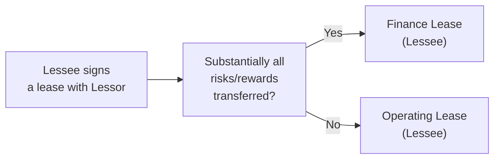

## Overview and Importance

Lease accounting might sound like a dry subject—but believe me, it’s one of those areas that can shift the entire look and feel of a company’s balance sheet and income statement. If you’ve ever wondered how major airlines manage to finance their aircraft or how retailers keep their store properties off their balance sheets, you’ll quickly realize that leases can be the hidden gem (or pitfall) in financial statements. 

In essence, a lease is a contract where the “lessor” owns an asset and gives the “lessee” the right to use it in exchange for periodic payments. Seems straightforward, right? Yet the accounting can get surprisingly tricky. Under older approaches, firms often preferred structuring deals to classify as “operating leases,” thus avoiding showing a large liability on their balance sheets. However, updated standards (IFRS 16, ASC 842) significantly changed the game, aiming to present a more faithful economic picture of lease obligations and the corresponding right to use the leased asset.

This section covers both lessee and lessor perspectives. We’ll dig into IFRS 16 and US GAAP (ASC 842) approaches, referencing any underlying concepts that matter most for day-to-day analysis and the Level 1 exam. By the end, you should not only understand how these transactions are booked, but also how to interpret the disclosures and apply them in financial analysis. Let’s get started.

## Key Principles

Before diving into specifics, let’s quickly outline the most important concepts you should keep in mind:

• The “right-of-use” (ROU) asset sits on the lessee’s balance sheet, reflecting its right to use the underlying asset.  
• A corresponding “lease liability” is recognized, capturing the obligation to pay lease rentals over time.  
• The classification (finance vs. operating lease) determines whether the lessee recognizes interest and depreciation separately—and how the lessor records income over the lease term.  
• Updated standards generally require lessees to report nearly all leases on the balance sheet (subject to certain exceptions like short-term or low-value leases), so that “off-balance-sheet” financing is drastically minimized compared to older approaches.  

## Lessee Accounting Under IFRS 16

IFRS 16 introduced a single methods approach for lessee accounting. Essentially, every lease leverages this method—except for short-term leases (under 12 months with no purchase option) and leases of low-value assets (think small office equipment or laptops).

• Initial Recognition:  
  - At the start (commencement date), the lessee records:  
    (1) A right-of-use asset (ROU) representing its right to control the asset.  
    (2) A lease liability, typically measured as the present value (PV) of future lease payments.  

• Measuring the Lease Liability:  
  - The standard calls for discounting future lease payments at the interest rate implicit in the lease if available, or otherwise the lessee’s incremental borrowing rate.  
  - Present value calculations can be thought of like a typical bond or loan: you forecast the stream of mandatory lease payments and discount them back to the commencement date.  

• Subsequent Measurement of ROU Asset and Liability:  
  - The lease liability is unwound every period through the payment of principal plus recognition of interest expense. So, imagine your typical amortizing loan schedule.  
  - The ROU asset is typically depreciated over the shorter of the asset’s useful life or the lease term. On the income statement, you’ll see two common line items: depreciation of the ROU asset, and interest expense on the lease liability.  

### Impact on Financial Statements (Lessee under IFRS 16)

1. Balance Sheet:  
   The ROU asset raises total assets, and the lease liability raises total liabilities. This can increase leverage ratios (like debt-to-equity).  
   
2. Income Statement:  
   Expenses shift from a single operating lease expense (under older rules) to (i) depreciation on the ROU asset, and (ii) interest on the lease liability. This can boost EBITDA (because depreciation and interest aren’t included in EBITDA). However, net income could be similar over the total life of the lease—although the pattern of expense recognition tends to be more front-loaded under a finance method.  
   
3. Cash Flow Statement:  
   Under IFRS 16, lease payments are generally split between principal repayment (financing outflow) and interest (operating or financing, depending on policy choices—IFRS allows certain classification choices).  

## Lessee Accounting Under US GAAP (ASC 842)

ASC 842 introduced updates similar in spirit to IFRS 16 but maintains a dual classification for operating versus finance leases. The difference affects how expenses are presented on the income statement.

• Operating Lease (US GAAP Lessee):  
  - Both a right-of-use asset and lease liability are recognized (just like IFRS 16).  
  - Subsequent measurement collapses the depreciation and interest into a single “lease expense” line, typically recognized on a straight-line basis over the lease term.  
  - On the cash flow statement, the lease payment is split between interest (operating) and principal (financing), or it might be combined in operating—the standard is flexible, but typically interest is in operating and principal in financing if companies choose consistency with IFRS.  

• Finance Lease (US GAAP Lessee):  
  - Again, ROU asset and liability recognized.  
  - On the income statement, the lessee recognizes depreciation for the ROU asset and separate interest expense on the lease liability (just like IFRS 16’s single model).  
  - The overall expense pattern is more front-loaded, because interest expense is highest in the earlier years.  

So, from the lessee’s vantage point, IFRS 16 offers basically one approach (besides a few short-term or low-value exceptions), while US GAAP keeps two. In practice, though, both frameworks get the asset and liability on the balance sheet, which was the main objective of the revisions.

## Lessor Accounting Under IFRS 16

From the lessor’s perspective, IFRS 16 keeps the older approach:

• Finance Lease (IFRS Lessor):  
  - The lessor derecognizes the underlying asset and recognizes a “net investment in the lease,” measured as the present value of lease payments plus any residual value guarantee.  
  - Over time, it recognizes interest income on this net investment, typically using the effective interest method (similar to how a fixed-income instrument is amortized).  

• Operating Lease (IFRS Lessor):  
  - The asset remains on the lessor’s balance sheet.  
  - Lease income is generally recognized on a straight-line basis (or another systematic basis if that better represents the benefits).  
  - The lessor continues depreciating the asset in its own books.  

## Lessor Accounting Under US GAAP

ASC 842 similarly divides lessor accounting into:

• Sales-Type Lease:  
  - Typically arises when the lease effectively transfers control of the asset to the lessee.  
  - The lessor removes the asset from its books and recognizes a net investment in the lease, plus possible selling profit or loss if relevant.  

• Direct Financing Lease:  
  - Similar to a finance lease, but with specific conditions about third-party residual value and no selling profit or loss. The lessor records a net investment in the lease. Over time, interest income is recognized.  

• Operating Lease:  
  - The lessor keeps the asset on its balance sheet, recognizing straight-line lease income.  

In all these lessor models, your real job as an analyst is to see if the lessor is bearing significant residual value risk (operating lease) or if the risks/rewards are transferred to the lessee (finance, sales-type, or direct financing).

## Analytical Considerations and Ratio Impacts

One reason we obsess over lease accounting is its effect on key metrics and comparability:

• Leverage Ratios:  
  - Under older rules (e.g., IAS 17, legacy US GAAP), operating leases were off-balance-sheet, artificially lowering a firm’s debt-to-equity. Now, many operating leases appear on the balance sheet, so reported leverage is higher, offering a more transparent risk assessment.  

• Profitability Ratios (EBIT, EBITDAR, etc.):  
  - The shift from a single operating lease expense to (i) depreciation and (ii) interest can artificially inflate EBITDA (since depreciation and interest are excluded). Analysts often reclassify lease interest as an operating expense in certain contexts to get a better view of operational efficiency.  

• Cash Flow Measures:  
  - Under IFRS, the principal portion of lease payments is a financing outflow, while interest might appear in operating or financing. Under US GAAP, interest usually appears in operating. This can boost operating cash flow in certain circumstances, so cross-border or cross-standard comparisons require some caution.  

• Comparability Adjustments:  
  - Particularly important for analyzing industries heavy on leasing (e.g., transportation, retail, or airlines). A big chunk of those future lease obligations might remain hidden if the company has short-term or variable lease arrangements. Experts often adjust the balance sheet by capitalizing any off-balance-sheet leases, using discount rates to approximate the present value.  

If you’re analyzing a company, you’ll want to read the lease disclosure footnotes in detail. See how the firm classifies leases, check maturity schedules of the lease liabilities, and assess any significant variable lease payments or renewal options that could blow up in later years.  

Sometimes you might see references to “implicit rates” in lease disclosures—these are the discount rates used to measure the present value of lease payments. A lower discount rate can inflate the recognized lease liability, and a higher discount rate does the opposite. Keep an eye out for the company’s rationale behind those assumptions.

## Real-World Example

Let’s see a simplified illustration:

• Company A signs a five-year lease for an item of machinery, paying an annual lease payment of $10,000. The agreement states that the implicit interest rate is 6%. The present value (at the commencement date) of these annual payments is about $42,124.  

Under IFRS 16 or US GAAP (ASC 842) for a finance lease, Company A records:

Right-of-Use Asset (ROU): $42,124  
Lease Liability: $42,124  

Over the life of the lease, the lease liability is amortized based on the effective interest method:

1st year interest = $42,124 × 6% = $2,527 (interest expense).  

Meanwhile, the entity depreciates the right-of-use asset over five years (assuming no big residual value). So that’s $42,124 / 5 = $8,425 depreciation expense each year, recognized on the income statement as well.  

If it’s an operating lease under US GAAP, the total expense might show as a single lease expense line. But in the background, the asset and liability remain on the balance sheet, and the expense is usually a straight-line total cost (~$10,000 per year, subject to discounting rules).  

## Practical Tips and Best Practices

• Evaluating risk: Conversion of older operating leases to finance leases or ROU asset accounting can transform a company’s reported leverage. Keep that in mind when looking at debt covenants or interest coverage tests.  
• Industry nuances: Airlines, shipping, big-box retailers, and hospitality often have huge lease liabilities. Even small changes in discount rates or lease renewal assumptions can drastically change the recognized liability.  
• Watch for short-term leases: These might remain off the balance sheet or require limited disclosure. Sometimes management might structure deals to classify them as short-term leases, which can again reduce recorded liabilities.  
• Comparability across standards: IFRS and US GAAP differ in how operating lease expenses are portrayed, especially for the income statement. Always standardize or reclassify if you’re comparing entities under different frameworks.

## Mermaid Diagram of Lessee Decision Flow

Below is a quick visual showing the basic flow of lessee decision-making for lease classification. It’s a simplified depiction but should help you see how one might decide if it’s a finance lease or an operating lease (for US GAAP). IFRS 16 lumps nearly all on-balance-sheet, so think of the decision here mostly in a US GAAP setting:

## Exam Tips

• Remember that IFRS 16 requires a single on-balance-sheet model for leases (apart from short-term and low-value exemptions).  
• Under US GAAP ASC 842, a lessee might still classify the lease as finance or operating, although it will typically be recognized on the balance sheet either way.  
• Watch out for how lease liabilities affect solvency and coverage ratios (debt-to-equity, interest coverage, etc.).  
• Make sure to read footnotes for variable lease payments, renewal options, and discount rates. These can drastically change the recognized liabilities and net income patterns.  

## References and Further Reading

• IFRS Foundation: https://www.ifrs.org/  
• Financial Accounting Standards Board (FASB) for ASC 842: https://www.fasb.org/  
• Kieso, Weygandt, and Warfield, “Intermediate Accounting” (US GAAP analysis).  
• PwC, “Manual of Accounting—IFRS 16 Leases” for deeper insights.  
• Official CFA® Program Curriculum (latest version) for concise coverage of lease classification, footnotes, and ratio adjustments.

---

## Test Your Knowledge: Lease Accounting Essentials



### Under IFRS 16, which of the following statements about lessee accounting is most accurate?

- [x] Almost all leases must be recognized on the balance sheet unless they meet short-term or low-value exemptions.
- [ ] Leases are expensed entirely in the income statement with no asset or liability recognition.
- [ ] Only finance leases are recognized as an asset, while operating leases are fully off-balance-sheet.
- [ ] All leases are recognized as off-balance-sheet arrangements.

> **Explanation:** IFRS 16 generally requires on-balance-sheet treatment for all leases except those considered short-term (under 12 months) or low in value.

### A lessee under US GAAP has an operating lease for specialized equipment. How would the lease expenses typically appear?

- [x] As a single lease expense recognized on a straight-line basis over the lease term.
- [ ] Interest expense and depreciation expense separately listed each year.
- [ ] Only reported in the disclosures, without income statement impact.
- [ ] Deferred until the end of the lease term.

> **Explanation:** Under ASC 842, an operating lease still results in a single expense recognized typically straight-line over the term. This is different from finance leases, which require interest and depreciation reported separately.

### In analyzing a firm’s leasing activities, you note they have a significant volume of short-term leases (less than 12 months). Under IFRS 16, which is correct?

- [ ] They are required to capitalize the leases unless it’s disclosed as a finance lease.
- [ ] They always have to put the assets on the balance sheet, without exception.
- [x] They can choose to expense this on a straight-line basis without recognizing an ROU asset or lease liability.
- [ ] They must amortize the lease expense over the entire useful life of the underlying asset.

> **Explanation:** IFRS 16 allows practical expedients for short-term and low-value leases, letting companies expense them without recording a lease asset or liability.

### A lessor classifies a lease as operating under IFRS. Which of the following is true?

- [x] The lessor retains the underlying asset on its balance sheet and recognizes depreciation.
- [ ] The lessor removes the asset from the balance sheet and recognizes a net investment.
- [ ] The lessor cannot recognize any rental income during the lease term.
- [ ] The lessor immediately recognizes all rental income at lease commencement.

> **Explanation:** Under an operating lease, the lessor keeps the asset and depreciates it, recording rental income over the lease term.

### Which statement is most accurate regarding the impact of a newly capitalized finance lease on a lessee’s financial ratios?

- [x] It will generally increase the debt-to-equity ratio and reduce return on assets in early years.
- [ ] It reduces both debt and equity, lowering overall leverage.
- [x] It defers all expenses to the end of the lease and inflates early profitability.
- [ ] It moves all cash outflow from operating to investing on the statement of cash flows.

> **Explanation:** Capitalizing a lease as finance typically raises liabilities, so debt-to-equity goes up. The addition of a right-of-use asset also increases total assets, which can reduce return on assets especially in the early phase when expenses (interest + depreciation) may be front-loaded.

### Under US GAAP’s ASC 842, a lessee’s lease is classified as a finance lease. Which combination of lease-related expenses appears on the income statement?

- [x] Depreciation expense on the ROU asset and interest expense on the lease liability.
- [ ] Only a single straight-line lease expense.
- [ ] Amortization of the net investment in the lease and lease revenue.
- [ ] No expense recognized until the end of the lease.

> **Explanation:** A finance lease under ASC 842 requires separate reporting of depreciation and interest.

### If a company wants to manage its debt-to-equity ratio without issuing more shares or borrowing new funds, which of the following leasing approaches might it have preferred under older accounting rules?

- [x] Operating leases (to keep the lease liability off the balance sheet).
- [ ] Finance leases (to highlight the lease liability immediately).
- [x] Capital lease classification, but with no ROU asset.
- [ ] Full disclosure of every lease in the footnotes, ignoring classification.

> **Explanation:** Under older IAS 17/legacy GAAP, companies often chose operating leases to keep liabilities off the balance sheet, thereby managing leverage. Today’s rules have curtailed that strategy.

### Which of the following is an advantage to users of financial statements under IFRS 16 and ASC 842, compared to historical standards?

- [x] Enhanced transparency of a company’s true obligations.
- [ ] Greater ability to hide liabilities.
- [ ] No more disclosure requirements.
- [ ] Decreased comparability across industries.

> **Explanation:** The new standards are designed to give more transparent information about lease commitments on the face of the financial statements rather than burying them in footnotes.

### A retailer has numerous multi-year property leases. From an analytical viewpoint, which adjustment might an analyst make to improve comparability if the firm classifies them as operating leases under ASC 842?

- [x] Reclassify the lease to a finance lease and capitalize it to compare against IFRS-based peers.
- [ ] Remove the lease liability from the balance sheet to reduce leverage.
- [ ] Recognize all lease expenses in financing cash flows.
- [ ] Ignore the footnotes and rely purely on recognized interest expense.

> **Explanation:** Analysts often capitalize operating leases to align them with finance leases (or IFRS 16’s single approach), ensuring consistency in leverage and profitability ratios.

### True or False: Under both IFRS 16 and US GAAP ASC 842, lessors have effectively eliminated off-balance-sheet handling of assets, so they never retain the asset on their balance sheet.

- [ ] True
- [x] False

> **Explanation:** Lessor accounting still distinguishes operating leases (where the lessor keeps the asset on its balance sheet) from finance/sales-type leases (where the asset is removed). So, the statement is false.


