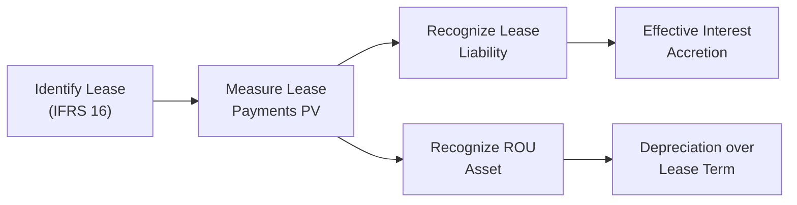
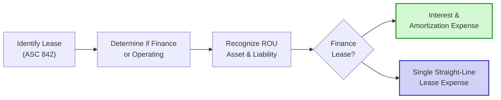

## Introduction and Background

I remember the first time I encountered the new lease standards, I thought, “Wait, how do I handle a plain old office printer lease?” It was a bit of a shock when IFRS 16 ushered in rules that required just about every lease to find its way onto the balance sheet. If you’ve ever spotted those big changes in your favorite company’s financials—like a sudden jump in assets and liabilities—there’s a good chance it was because of IFRS 16 or ASC 842.

In this section, we’ll walk through the fundamentals of each standard, highlight the major differences in recognition and measurement, and show you why these aren’t just small footnotes. From an analyst’s perspective, understanding lease accounting is crucial because it can dramatically alter financial ratios (see Chapter 13, “Financial Analysis Techniques”) and debt covenants. You’ll also see residual echoes of earlier chapters on intangible assets and liabilities (Chapter 3 and Chapter 7 sections), particularly concerning how the right-of-use (ROU) asset is presented.

## IFRS 16 and ASC 842: A Quick Overview

Under earlier standards, many companies classified leases as “operating” if they met certain criteria, effectively keeping them off the balance sheet. IFRS 16 changed this game for companies reporting under International Financial Reporting Standards (IFRS). Meanwhile, the US GAAP approach (ASC 842) still offers a dual model for lessees—operating vs. finance—though both must be recognized on the balance sheet.

• IFRS 16 (effective since 2019 for most IFRS reporters):  
  – Virtually all leases go on-balance-sheet for lessees.  
  – A right-of-use (ROU) asset is recognized, along with a lease liability.  
  – Lessees generally follow one method, treating all leases as finance leases (with a few exceptions).  

• ASC 842 (US GAAP):  
  – Requires ROU asset and lease liability recognition for both finance and operating leases.  
  – Expense recognition differs between these two classifications.  
  – Operating leases typically show a straight-line expense, while finance leases have separate interest and amortization expenses.  

## The Lessee Perspective

### IFRS 16: One Model for Lessees
IFRS 16 removes the operating lease classification for lessees (with limited exceptions like short-term or low-value leases). You get a single model, meaning all leases typically appear on the balance sheet, creating:

1. A Lease Liability:  
   This represents the present value of future lease payments.  
2. A Right-of-Use (ROU) Asset:  
   Reflects the lessee’s right to use the leased asset over its lease term.

The “low-value asset” exception allows firms that lease small equipment—like a low-cost photocopier or coffee machine—to expense them rather than capitalize. Also, “short-term” leases (less than 12 months) can be kept off the balance sheet. These carve-outs help reduce administrative burdens for trivial items.

#### Recognition and Measurement
• Initial Measurement:  
  – Record the lease liability at the present value of lease payments, discounted at the implicit rate (or the lessee’s incremental borrowing rate if the implicit rate is not readily determinable).  
  – Record the ROU asset at cost, which typically mirrors the amount of the lease liability plus any initial direct costs.  

• Subsequent Measurement:  
  – The lease liability is accreted using the effective interest method.  
  – The ROU asset is depreciated (amortized) over the lease term (or the asset’s useful life if ownership transfers).

Here’s a quick snapshot in Mermaid to visualize the IFRS 16 process from a lessee’s point of view:

For the income statement, you typically see two charges—depreciation of the ROU asset and interest expense from the unwinding of the lease liability. Together, these can create a front-loaded expense pattern compared to older off-balance-sheet approaches.

### ASC 842: Two-Class Model for Lessees
While US GAAP also mandates an on-balance-sheet approach, it preserves two distinct types of leases for the lessee:

1. Finance Lease:  
   – Similar to IFRS finance lease treatment.  
   – The income statement reflects both amortization of the ROU asset and an interest expense on the lease liability separately.  

2. Operating Lease:  
   – On-balance-sheet recognition of ROU asset and lease liability as well.  
   – However, the lease expense is typically a single straight-line expense over the lease term. This approach results in a more constant expense pattern, rather than front-loading.  

#### Recognition Steps
Under ASC 842, the main difference from IFRS 16 is how expense gets recognized:

• Initial Measurement (Finance vs. Operating):  
  – Regardless of classification, record the lease liability as the present value of future lease payments.  
  – Recognize the ROU asset at a value roughly equal to that liability, adjusted for prepayments and direct costs.  

• Subsequent Measurement:  
  – Finance Lease:  
    ▪ Interest method on the lease liability.  
    ▪ Straight-line amortization on the ROU asset.  
  – Operating Lease:  
    ▪ Single lease cost recognized on a straight-line basis in the income statement.  
    ▪ The lease liability is still accreted, but the expense is presented as a single operating item.

Below is a simplified flowchart showing the ASC 842 approach for lessees:

## The Lessor Perspective

Interestingly, IFRS 16 keeps a dual approach on the lessor side—financing leases vs. operating leases—somewhat similar to the previous IAS 17 structure. Lessors under ASC 842 also use a dual approach with finance and operating lease classifications, guided by whether the arrangement effectively transfers control and benefits/risks of ownership. The key difference remains on the lessee side, where IFRS uses a single model and US GAAP retains two.

## Impact on Financial Statements and Ratios

### Balance Sheet Implications
Under both IFRS 16 and ASC 842, total assets and liabilities increase for many companies that previously kept operating leases off the balance sheet. You’ll see:
• Higher reported leverage ratios (see Chapter 13).  
• Potential shifts in capital structure and debt covenant calculations.  

### Income Statement Implications
• IFRS 16: A single finance-type model typically leads to accelerated expense recognition (interest + depreciation).  
• ASC 842: Operating vs. finance lease differences can result in different timings and patterns of expense recognition.  

### Cash Flow Statement
No major differences in classification under IFRS 16 vs. ASC 842 from a net cash flow perspective, but the presentation of paid interest (operating vs. financing outflow) can vary, particularly under IFRS (see Chapter 4, “Analyzing Statements of Cash Flows”).

## Disclosure Requirements

Both standards require robust disclosures, including:
• Maturity analysis of lease liabilities by time buckets.  
• Reconciliation of beginning and ending balances of the lease liability.  
• Qualitative details about significant judgments, variable lease payments, and discount rate assumptions.  

As an analyst, you should read these carefully to see how the liability might grow (or shrink) over time, understand any embedded escalation clauses, or identify whether a discount rate is suspiciously low or high.

## Practical Examples

Let’s say you have a company, GreatTech Solutions, that leases its office building for five years, with monthly payments of $10,000. Under IFRS 16, the entire arrangement is treated almost like a financed purchase:
1. Right-of-use asset recognized.  
2. Lease liability recognized.  
3. Income statement shows depreciation and interest expense.

Under ASC 842, you’d do nearly the same thing—recognize an ROU asset and a lease liability. But if it meets finance lease criteria (e.g., the lease term covers a major portion of the economic life of the asset or there’s a transfer of ownership option, etc.), you record interest and amortization. If not, it’s an operating lease, and the monthly payments primarily show up as a single lease expense. Yet, from a purely on-balance-sheet perspective, the results might look surprisingly similar.

## Common Pitfalls and Best Practices

• Forgetting Low-Value and Short-Term Lease Exceptions in IFRS 16:  
  Many new practitioners forget they can apply these exceptions to reduce administrative burden. Double-check the thresholds.  

• Misclassification Under ASC 842:  
  A big error is to incorrectly classify a lease as operating when it meets the criteria for finance. This changes the pattern and classification of expenses in the income statement.  

• Inconsistent Discount Rates:  
  Getting the discount rate right is tricky. Sometimes companies default to their incremental borrowing rate, but the standard wants lessors’ implicit rates if determinable.  

• Not Updating the Asset or Liability for Reassessments:  
  If lease terms or variable payment conditions change, the ROU asset and liability should be remeasured.  

## Exam Tips

1. Identify IFRS vs. US GAAP differences quickly. The exam might present a scenario with subtle hints about how the lease expense is recognized.  
2. Watch for how the problem states the discount rate—if the rate is not explicitly given, you might be expected to recall the incremental borrowing rate concept.  
3. In essay questions (constructed response), show the steps clearly: measuring the lease liability, measuring the ROU asset, then how the income statement is affected.  
4. Don’t forget to consider the effect on profit margins, leverage ratios, and coverage ratios.  A seemingly small lease can have a big effect on key performance metrics.

## Additional Resources

If you’d like to see detailed side-by-side comparisons, check out the official references:  
• IFRS 16 “Leases”: <https://www.ifrs.org/issued-standards/list-of-standards/ifrs-16-leases/>  
• FASB ASC 842 (through FASB): <https://asc.fasb.org/>  
• KPMG “Lease Accounting Guide” and other Big Four publications often have great charts and practical examples.  

These references offer deeper dives into transition methods, retrospective application, and real-life implementation stories, so you can glean how companies are dealing with the new standard over time.

---

## Lease Accounting Under IFRS 16 and ASC 842: Quiz



### Under IFRS 16, how are most leases treated for lessees?

- [ ] They can choose between operating and finance leases freely.
- [ ] They do not capitalize any leases on the balance sheet.
- [ ] They only capitalize leases that exceed five years in duration.
- [x] They generally treat all leases as finance leases, recognizing both a lease liability and right-of-use asset.

> **Explanation:** IFRS 16 primarily removes operating leases for lessees. The default is a single finance lease model, subject to certain short-term or low-value exceptions.

### Under ASC 842, the expense pattern for an operating lease is recognized how?

- [x] Straight-line expense over the lease term.
- [ ] Front-loaded expense due to interest and amortization.
- [ ] Based on adjustments to other comprehensive income only.
- [ ] As a one-time expense in the period of lease inception.

> **Explanation:** ASC 842 retains two classifications: finance leases have both interest and amortization expense, while operating leases feature a single straight-line expense.

### Which of the following exceptions is allowed under IFRS 16 and not specifically addressed in the same manner under ASC 842?

- [x] Low-value asset exception.
- [ ] Short-term lease exception.
- [ ] Finance lease exception.
- [ ] Sublease exception.

> **Explanation:** IFRS 16 allows lessees to keep certain low-value assets off the balance sheet, such as small office equipment. This specific threshold is not a formal part of ASC 842.

### Under ASC 842, which item is reported separately for a finance lease compared to an operating lease?

- [x] Interest expense.
- [ ] Operating expense.
- [ ] Deferred tax asset.
- [ ] Intangible goodwill asset.

> **Explanation:** Finance leases break out interest expense and amortization of the ROU asset. An operating lease under ASC 842 is recognized as a single lease expense in the income statement.

### True or False: Under IFRS 16, lessees can choose to expense a short-term lease (less than or equal to 12 months) rather than capitalize it.

- [x] True
- [ ] False

> **Explanation:** IFRS 16 gives the short-term lease exemption, allowing off-balance-sheet treatment if the lease term is 12 months or less (and includes no purchase option).

### Under both IFRS 16 and ASC 842, how is the lease liability initially measured?

- [x] Present value of future lease payments based on the implicit or incremental borrowing rate.
- [ ] Fair value plus a markup for day-one gains.
- [ ] Sum of undiscounted lease payments over the lease term.
- [ ] Average of lease payments made in the first and last months.

> **Explanation:** Both standards require discounting lease payments at either the implicit rate or the lessee’s incremental borrowing rate if the implicit rate is not determinable.

### Which type of information do both IFRS 16 and ASC 842 require in the notes to the financial statements?

- [x] Maturity analysis of lease liabilities.
- [ ] Probability-weighted approach for uncertain tax positions.
- [x] Qualitative descriptions of variable lease payments.
- [ ] Name and background of the external audit team.

> **Explanation:** Both standards mandate broad disclosure of lease maturity schedules, reconciliations of lease liabilities, and qualitative explanations of lease terms, including variable payment details.

### Under IFRS 16, where is the amortization of the right-of-use asset typically presented?

- [x] Depreciation or amortization expense in the income statement.
- [ ] Other comprehensive income (OCI) only.
- [ ] As a contra-asset in the balance sheet.
- [ ] Directly as a reduction to equity.

> **Explanation:** The ROU asset is amortized in the same manner as other non-financial assets, typically reported in depreciation or amortization lines on the income statement.

### Under ASC 842, the classification of a lease as finance or operating generally depends on which factor?

- [x] Whether the lease effectively transfers ownership or a major part of the economic risks and rewards.
- [ ] The stock price volatility of the lessee at the lease inception.
- [ ] The nature of the leased asset being intangible vs. tangible.
- [ ] The lessor’s credit rating.

> **Explanation:** ASC 842 classification is guided by specific criteria to determine if the lease transfers “substantially all the risks and rewards” of ownership (finance lease) or not (operating lease).

### Under ASC 842, which of the following is correct about operating leases’ balance sheet treatment?

- [x] Right-of-use asset and lease liability are recognized on the balance sheet, but expense is recognized on a straight-line basis.
- [ ] No balance sheet recognition for operating leases.
- [ ] Only the lease liability is recognized, not the ROU asset.
- [ ] The entire arrangement is recognized as intangible goodwill.

> **Explanation:** ASC 842 requires both types of leases (operating and finance) to be recognized on the lessee’s balance sheet, with different income statement expense patterns.



---

**References**  
• IFRS 16: <https://www.ifrs.org/issued-standards/list-of-standards/ifrs-16-leases/>  
• FASB ASC 842: <https://asc.fasb.org/>  
• KPMG Lease Accounting Guide: <https://home.kpmg/xx/en/home/services/advisory/lease-accounting.html>  

This concludes our exploration of IFRS 16 vs. ASC 842 for lease accounting. By knowing the details of how these standards differ—and where they converge—you’ll be able to read and interpret financial statements more effectively, catch potential red flags, and ace those exam questions. Good luck!
