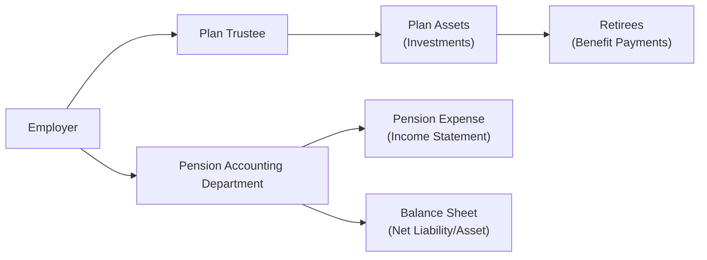
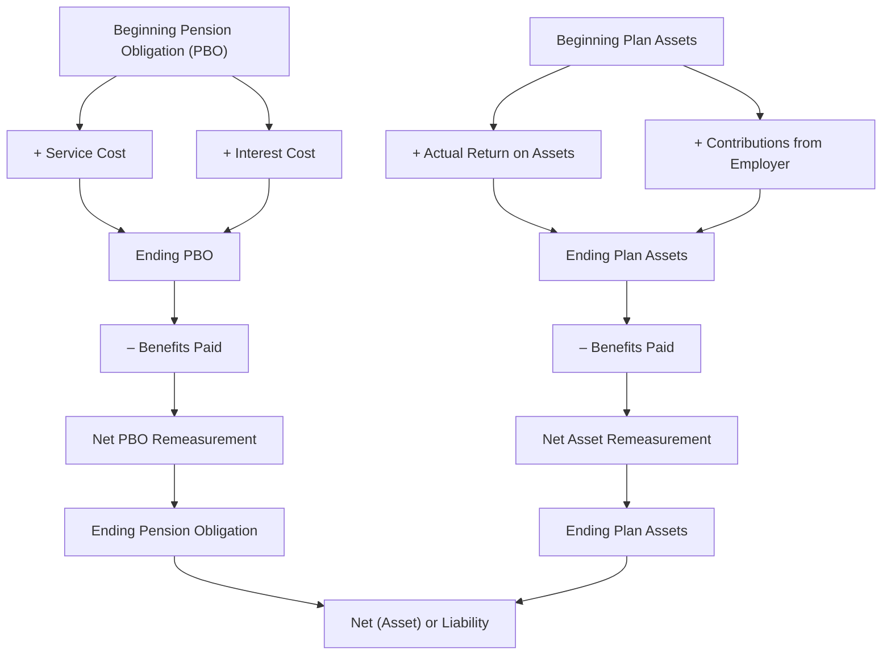

## Overview and Importance
Pension and Other Post-Employment Benefits (often called OPEB) are commitments that organizations make to employees for their retirement years. If you’ve ever chatted with a parent or a friend who’s looking forward to a pension, you’ll know how important these benefits can be. Anyway, from an analyst’s viewpoint, pensions and OPEB can have massive implications for a company’s long-term obligations, cash flow forecasting, and risk profiles. 

In practice, these plans come in two major flavors:

• Defined Contribution (DC) Plans  
• Defined Benefit (DB) Plans  

And although DC plans are comparatively straightforward—just toss in the promised employer contributions and you’re done—DB plan accounting can get a little tricky. Let’s walk step by step (well, maybe more like a brisk hike) through the key concepts, focusing on how they appear in real financial statements under IFRS and US GAAP.

## Defined Contribution Plans
### Key Characteristics
In a Defined Contribution plan, the employer’s responsibility is simply to make fixed (or formula-based) contributions to employee accounts—sort of like paying into a savings account that the employee invests. Once that contribution is made, the employer is generally off the hook. The big risk for the employee is investment performance: if the assets in the pension plan tank, the employer doesn’t pay extra to make up the shortfall. 

This means accounting for DC plans is usually simpler than for DB plans. The company’s expense each year is just the contribution amount. That expense is recognized in the income statement, and no long-term liability (beyond unpaid contributions) typically shows up on the balance sheet.

### Presentation and Analysis
• Under IFRS and US GAAP, the annual expense for DC plans is recognized in the period employees render service.  
• Disclosures are relatively minimal compared with DB plans.  

From an analyst’s perspective, DC plans do not usually cause big concerns about hidden liabilities. The risk is wholly (or mostly) carried by employees, so the company’s statements remain fairly transparent on that front.

## Defined Benefit Plans
### Key Characteristics
Defined Benefit plans guarantee employees a particular benefit in retirement, often expressed as a formula tied to years of service and final salary. The rub is that the employer has to make the promise good, no matter what. The employer is, in effect, on the hook for:

1. Funding the plan so that promised benefits are actually available.  
2. Managing the investments (directly or indirectly) in the plan trustees’ portfolio.  
3. Bearing the actuarial (longevity, salary growth, discount rate) risk—if employees live longer, or if discount rates drop, or if the plan assets perform poorly, the company may need to pony up extra.  

### Actuarial Assumptions
A major component of DB accounting is based on the smartest guesses (actuarial assumptions) about how long plan participants will live, how fast salaries will grow, and the expected return on plan assets. Under IFRS, you might not see an “expected return on plan assets” item in expense calculations as a separate line, because IFRS typically uses the same discount rate for interest on the liability and interest on the assets. Meanwhile, US GAAP explicitly shows an expected return on plan assets as a separate component in pension expense.  

Here’s a quick reminder of some key terms (and yes, you might have come across them in practical contexts if you’ve ever asked an HR manager about how pension numbers get crunched):

• Projected Benefit Obligation (PBO) / Defined Benefit Obligation (DBO):  
  The present value of future retirement benefits earned by employees up to the current date.  
• Fair Value of Plan Assets:  
  The market value (or estimate of such) of the assets set aside to meet pension promises.  
• Net Funded Status:  
  Fair value of plan assets minus the present value of the pension obligation.  

A negative funded status means the plan is underfunded, which can be a huge red flag if you’re analyzing a company’s long-term solvency or ability to meet future obligations.

### How It Shows Up on the Financial Statements
Under IFRS and US GAAP, the net pension asset or liability (essentially “Plan Assets – PBO/DBO”) is reported on the balance sheet. Let’s see a generic structure:

• Service Cost: The additional benefits earned by employees due to working that extra year. This typically goes to operating expenses in the income statement.  
• Interest Cost: The increase in the present value of the obligation due to the passage of time (the discount unwinds each year).  
• Remeasurements/Actuarial Gains and Losses: These might be thought of as “plan experience different from what was assumed,” or changes in assumptions. IFRS typically puts them in Other Comprehensive Income (OCI), while US GAAP also uses OCI but might allow certain smoothing approaches (such as the corridor method).  

Here’s a simple diagram of how these items connect in a DB plan:

In this diagram, you see that the employer contributes to a trust, which invests in various plan assets. The investment returns can offset future pension costs, but if the assets underperform, the pension obligation might grow relative to the assets. Then the net difference (obligation minus plan assets) flows into the employer’s balance sheet (liability if underfunded, asset if overfunded). 

### Example of DB Accounting
Suppose at the end of Year 1, an employer calculates:

• Defined Benefit Obligation (DBO): $1,000,000  
• Fair Value of Plan Assets: $900,000  

The net funded status is –$100,000 (underfunded). Let’s say in Year 2:

• Service cost is $30,000  
• Interest cost is $50,000 (assuming a discount rate and the passage of time)  
• Actual return on plan assets is $40,000 but the expected return (US GAAP approach) is $45,000  
• Contributions during Year 2 are $25,000  
• Benefits paid are $20,000  

Under IFRS, you might see a single net interest approach, but ignoring that detail for the example, the ending DBO (before remeasurement items) would be around $1,080,000 (1,000,000 + 30,000 + 50,000 – benefits paid portion that reduces the obligation). Meanwhile, plan assets might become $945,000 (900,000 + actual return 40,000 + employer contribution 25,000 – benefits of 20,000). The new net status is –$135,000. Any difference between actual and expected returns plus changes in assumptions might appear in Other Comprehensive Income.

These calculations can get complicated, fast, especially as we incorporate changes in discount rates or wage growth assumptions. But the gist is: for your analysis, keep the net liability (or asset) in the corner of your eye, because it might tilt your view of the company’s capital structure and risk.

## Other Post-Employment Benefits (OPEB)
### What Are OPEB?
OPEB covers healthcare, life insurance, or other benefits not strictly classified as pensions but given during retirement. If your friend tells you, “My company still pays part of my regular health insurance even after I retire,” that’s a typical OPEB scenario. 

From an accounting perspective, OPEB obligations are measured similarly to pension obligations: estimate the present value of the future benefits, measure plan assets (if any are set aside), and record the net difference. However, there’s an extra twist: healthcare costs can be super volatile (rising medical bills, changing usage patterns, or reforms to insurance laws). This can make OPEB obligations more uncertain than the typical DB pension.

### IFRS vs. US GAAP Treatment
Both IFRS (IAS 19) and US GAAP (ASC 715, specifically for postretirement benefits) apply conceptually similar approaches:

1. You measure the present value of the OPEB obligation, typically calling it something like the Accumulated Postretirement Benefit Obligation (APBO) under US GAAP.  
2. You measure any plan assets at fair value.  
3. The difference becomes your net liability (or asset), recognized on the balance sheet.  

Where IFRS and US GAAP differ often lies in specifics of recognizing remeasurements, the healthcare cost trend assumptions, and certain disclosures. But the high-level principle—like DB pensions—stays consistent: an employer is making a long-run promise, so you better measure it carefully every year.

### Sensitivity to Healthcare Cost Trend
OPEB calculations are exceptionally sensitive to the “healthcare trend rate,” which is basically a guess at how fast medical costs might rise in the future. If you think inflation in healthcare is going to be moderate, you get a smaller liability; if you assume double-digit percentage increases, the liability quickly balloons. As an analyst, you want to see how the company’s making these assumptions because small changes can produce huge differences in the obligation.

## Financial Statement Implications
### Impact on the Balance Sheet
Under IFRS and US GAAP, the net funded status is the number to watch. A net pension or OPEB liability that’s large compared with shareholders’ equity can signal a significant future cash outflow. In other words, the company might have less “room to maneuver” because it’s on the hook for bigger promised benefits.

### Impact on the Income Statement
You’ll often see multiple components:

• Service Cost: Part of operating expenses.  
• Net Interest or Interest Cost: Often recognized in finance cost or part of pension expense.  
• Remeasurements of Gains/Losses: Typically go to OCI (the corridor or smoothing approach might apply under US GAAP, though many companies also adopt immediate recognition in OCI).  

Additionally, if the plan invests in riskier assets and the return assumptions prove too rosy, you could see a mismatch between expected and actual returns. That mismatch can flow into the net funded status and either gradually or immediately appear as an actuarial gain/loss in the statements.

### Impact on Cash Flows
The actual contributions a firm makes to its pension plan or OPEB plan appear as operating or financing cash flows depending on the strategy and local rules. Typically, though, they’re recognized in operating cash flows under US GAAP. The rules can differ, so an analyst might want to confirm how these contributions are classified because it can affect the interpretation of operating cash flow quality.

## Analytical Considerations for Pensions and OPEB
### Assessing the Quality of Earnings
Because pensions and OPEB can be huge, the assumptions chosen by the company’s actuaries can tilt the reported expense up or down. A change in the discount rate from 5% to 4% might drastically increase the present value of the obligations. Meanwhile, a higher expected return on plan assets (US GAAP) can lower reported pension expense. Analysts often watch out for:

• Out-of-line discount rates relative to market benchmarks  
• Overly optimistic expected return on assets (US GAAP)  
• Morbidity and mortality assumptions for OPEB that might not match industry standards  

### Reviewing Disclosures
Both IFRS and US GAAP require a bundle of disclosures for DB pension plans and OPEB. This typically includes:

1. A breakdown of plan assets by category (equities, bonds, etc.)  
2. Discount rates and other key actuarial assumptions  
3. Assumptions on future salary or healthcare cost increases  
4. Sensitivity analyses: e.g., the effect on the DBO or PBO if the discount rate changes by 1%.  

We recommend scanning these sensitivity disclosures carefully. Companies sometimes hide big future risks in plain sight. For instance, what if a 1% change in discount rate lifts the pension liability by 20%? That means the company’s results can swing widely with small market shifts.

### Cross-Reference to Other Chapters
In Chapter 3 (Balance Sheets), we discuss how large liabilities can impair solvency ratios. Also, in Chapter 13 (Financial Analysis Techniques), you’d see how net pension obligations factor into overall leverage analysis or affect key profitability metrics when pension expense is large. When building a company forecast model (see Chapter 16), you might want to factor in stable or even increasing contributions to keep plan obligations under control.  

## Common Pitfalls and Best Practices
### Pitfalls
1. Overlooking the Impact on Ratios: Adjusting financial ratios for underfunded pension obligations is often necessary for an apples-to-apples comparison.  
2. Focusing Only on Pension Expense: Don’t forget the cash funding needed for the plan. Even if pension expense is small in the income statement, the firm might face large cash contributions well into the future.  
3. Ignoring OPEB Volatility: Healthcare cost assumptions and persistently rising medical expenses can lead to wide swings in the OPEB liability.  

### Best Practices
1. Sensitivity Analysis: Always re-check management’s assumptions. A quick “What if the discount rate changes by 1%?” can reveal big swings.  
2. Use Consistent Pension Adjustments for Comparisons: Rival companies might have different discount rates or smoothing policies. It’s often wise to standardize them when doing side-by-side analyses.  
3. Watch External Environment: Interest rate changes, changes in pension fund regulation, or new tax laws can quickly reshape a firm’s liability profile.  

## Brief Personal Anecdote
Years ago, I watched a CFO friend wrestle with new accounting rules for pensions. He told me, “If I tweak the discount rate by just 0.5%, the entire net income changes drastically!” He was half-joking—obviously you don’t tweak it just to manage earnings—but it showed me firsthand how deeply these assumptions can sway reported results. Fair or not, a single line item like interest cost or remeasurement can overshadow all other business operations.

## Diagram: Overview of Pension Accounting Flows
Here’s another diagram to illustrate how the overlap among different accounts, assumptions, and the final statements might look:

## Summary of IFRS vs. US GAAP
1. IFRS lumps the return on plan assets together with interest expense using a single discount rate. US GAAP typically breaks out expected return on assets separately.  
2. Remeasurements under IFRS go straight to OCI (and stay there). Under US GAAP, remeasurements also go to OCI, but you might see corridor or other smoothing approaches.  
3. OPEB is measured similarly under both frameworks, but keep an eye on the reported assumptions for healthcare costs, as the two sets of standards may differ slightly in presentation or certain disclosures.

## Practical Example: Healthcare OPEB
Imagine a manufacturer who promises retirees free dental insurance for life. The company does not set aside any assets, so the plan has a $0 fair value of plan assets. The present value of future dental costs is estimated at $500,000. That’s an immediate $500,000 liability recognized on the balance sheet. Each year, new employees earn additional vesting in the plan, so you’ll see a service cost. Meanwhile, the existing liability grows! If the discount rate is 5% this year but next year the actuaries say, “We better use 3.5%,” that liability might shoot up in the remeasurement section. This can cause big headaches if you’re not paying attention.

## Examination Relevance and Tips
On a CFA exam—especially at Level III—scenario-based questions might ask you to interpret how changes in pension assumptions affect the financial statements and, ultimately, equity valuation or creditworthiness. For instance:

• A question scenario might say, “XYZ Corp. reduces its discount rate by 1%. How does that affect pension expense, the balance sheet, and coverage ratios?” You’d be expected to know that a lower discount rate increases pension and OPEB obligations, leading to an increased liability and potentially higher periodic pension expense.  
• You may also face an item set describing the composition of pension assets, asking you to evaluate the reasonableness of the expected return. Or maybe you’re asked to recast the statements if the discount rate is changed to a “market-based” assumption.  

Ensuring you understand the interplay between IFRS and US GAAP is crucial. The principle is mostly the same, but the mechanical differences can alter how you interpret the results in an integrated, multi-asset portfolio context.

## Final Thoughts
Pension and OPEB analysis can feel like a labyrinth: so many assumptions, so many lines in the statements—how does one keep it all clear? My curated advice is to keep a cheat sheet of the net liability calculations, service costs, interest costs, and remeasurements. Then check the footnotes for the discount rate, healthcare cost trend, and expected returns. Consistency is the name of the game: whenever you’re analyzing two or more companies, adjust or at least note the differences in their assumptions. That helps you see who’s actually better positioned for the future, and who might be quietly stashing a big liability off to the side.

## References and Further Reading
• IAS 19, “Employee Benefits,” available on the IFRS Foundation website.  
• FASB Accounting Standards Codification Topic 715, “Compensation—Retirement Benefits.”  
• “Fundamentals of Private Pensions” by Dan M. McGill and Donald S. Holquist.  
• Chapter 3: Balance Sheets and Chapter 13: Financial Analysis Techniques in this volume for insights on analyzing liabilities and ratio impacts.  

## Checking Your Understanding: Pensions and Post-Employment Benefits



### Which statement best describes the employer's obligation under a Defined Contribution (DC) plan?

- [ ] The employer must ensure that each retiree receives a predetermined monthly benefit amount.
- [x] The employer must make regular contributions according to a specified formula.
- [ ] The employer must guarantee the investment returns on contributions.
- [ ] The employer bears the entire actuarial risk of future benefit payments.

> **Explanation:** In a DC plan, the employer's responsibility is limited to making specific contributions. The employee then bears the investment risk.  

### Under IFRS, which of the following statements is correct about remeasurements of defined benefit obligations?

- [ ] They are expensed immediately on the income statement and reduce net income.
- [x] They are recognized in Other Comprehensive Income (OCI) and remain there.
- [ ] They are always capitalized as a noncurrent asset.
- [ ] They are deferred and gradually recognized through the income statement.

> **Explanation:** IFRS places actuarial gains and losses (remeasurements) in OCI and does not subsequently recycle them through net income.  

### A decrease in the discount rate used to calculate the Projected Benefit Obligation (PBO) will most likely:

- [x] Increase the PBO, thereby increasing the net pension liability if plan assets remain the same.
- [ ] Decrease the PBO, thereby decreasing the net pension liability.
- [ ] Have no effect on the PBO.
- [ ] Only affect the plan’s funded status if the plan is substantially underfunded.

> **Explanation:** The discount rate is inversely related to the present value of future obligations. A lower discount rate raises the present value of future benefits.  

### Why might an analyst adjust a company’s financial ratios to reflect the underfunded status of its pension plan?

- [x] To better capture the company’s true liability exposure and potential future cash outflows.
- [ ] To eliminate the effect of all noncurrent liabilities from the balance sheet.
- [ ] Because IFRS mandates restatement of prior period ratios.
- [ ] Because pension obligations do not affect the income statement under US GAAP.

> **Explanation:** An underfunded pension introduces a real liability that affects solvency. Analysts often include this in their adjusted ratios for a realistic assessment.  

### In a Defined Benefit plan, which party is primarily bearing the investment risk associated with the plan assets?

- [ ] The employee, because the contributions are predetermined.
- [x] The employer, because it must ensure defined benefits are paid regardless of asset performance.
- [ ] The government, as it insures the plan's solvency.
- [ ] Plan participants, who collectively vote on investment decisions.

> **Explanation:** In DB plans, the employer is responsible for meeting future benefit promises, so it bears the investment (and actuarial) risk.  

### Under US GAAP for a DB pension plan, the difference between actual return on plan assets and expected return on plan assets is:

- [ ] Charged immediately to the income statement in selling, general, and administrative expenses.
- [x] Recorded in Other Comprehensive Income as part of actuarial gains/losses.
- [ ] Classified as a financing income item in net income.
- [ ] Not recognized in the financial statements or footnotes.

> **Explanation:** For US GAAP pension accounting, the difference between actual and expected returns is considered an actuarial gain/loss, recognized in OCI (subject to possible corridor amortization).  

### Which of the following assumptions in Other Post-Employment Benefits (OPEB) is typically most volatile?

- [ ] Discount rate
- [ ] Future salary growth
- [x] Healthcare cost trend rate
- [ ] Vesting schedule

> **Explanation:** Healthcare cost trends can be quite volatile over time, especially in environments with rapidly escalating medical costs.  

### In what main financial statement section are actuarial gains and losses typically recorded under both IFRS and US GAAP?

- [ ] Income Statement under operating expenses
- [ ] Income Statement under other expenses
- [ ] Cash Flow Statement under financing activities
- [x] Other Comprehensive Income (OCI)

> **Explanation:** Both IFRS and US GAAP recognize remeasurements (actuarial gains and losses) in OCI, though US GAAP may later amortize them back into earnings.  

### If a plan’s fair value of assets is $2 million and the present value of the defined benefit obligation is $2.5 million, the funded status of the plan is:

- [ ] Overfunded by $0.5 million
- [x] Underfunded by $0.5 million
- [ ] Exactly neutral
- [ ] Impossible to determine without the discount rate

> **Explanation:** $2 million – $2.5 million = –$0.5 million, which indicates the plan is underfunded by $0.5 million.  

### Under IFRS, remeasurements recognized in Other Comprehensive Income:

- [x] Remain in OCI permanently and are not recycled through the income statement.
- [ ] Are reclassified to net income once the plan is fully funded.
- [ ] Must be reclassified to net income on a straight-line basis.
- [ ] Are reported as financing activities in the statement of cash flows.

> **Explanation:** IFRS does not recycle remeasurements from OCI back into the income statement. They remain in OCI.  


