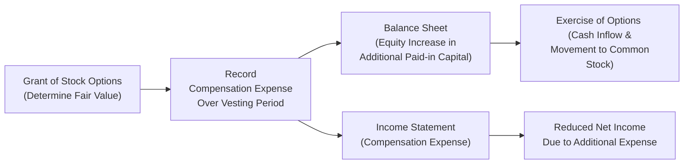

## Introduction

Have you ever noticed how many companies—especially tech start-ups—offer their employees shares or options as a form of compensation? I remember when I was first hired at a small software firm. They said, “We can’t pay you a big salary, but we’ll give you some stock options!” Back then, I felt like I was being handed a winning lottery ticket (though in all honesty, it sometimes felt more like a roller coaster ride than a lottery).

Anyway, that’s what we call stock-based compensation: a way of paying people using the company’s own shares or share-based awards rather than just cash. In a financial reporting context, it all boils down to measuring the fair value of these stock-based awards—like stock options, restricted shares, or performance shares—and then spreading (or “amortizing”) that cost across the period during which employees have to work to earn those shares.

So in this section, let’s talk about how we value these awards, how we reflect them on the financial statements, and how analysts evaluate the assumptions behind them. We’ll go through some examples. We’ll even throw in a small diagram so you can visualize how it flows through the books. And I promise not to bury you in jargon. Ready?

## Why Does Stock-Based Compensation Matter?

From an analyst’s perspective, stock-based compensation has many implications for understanding a company’s cost structure, profitability, and overall valuation. Here’s why it’s so critical:

• It often results in a notable non-cash expense.  
• It dilutes existing shareholders if new shares are issued.  
• The assumptions used to value stock-based awards affect reported expenses.  
• It influences labor cost metrics, operating income, and even how employees behave (in terms of retention or performance effort).

Under international (IFRS 2) and US (ASC 718) accounting standards, companies must record the fair value of stock-based compensation as an expense over the service period. That might sound straightforward, but in practice, you need significant judgments: the expected life of the option, volatility of the shares, interest rates, expected dividends, and so on.

## Common Types of Stock-Based Awards

Let’s talk about the main forms of stock-based compensation you’ll see:

• Stock Options: Employees are given the right to buy shares at a fixed price (the “strike price”) for a certain period. If the share price rises above that strike price, they can exercise and profit.  
• Restricted Shares or Restricted Stock Units (RSUs): Shares granted to employees that vest over time or upon meeting performance conditions. They typically have fewer uncertainties about fair value compared to options because they almost always have positive value as long as the underlying stock remains above zero.  
• Performance Shares: A variation on restricted shares that vest only if certain performance milestones are met (e.g., revenue or earnings targets).  

In my own experience, stock options often feel more exciting (they’re like a lottery ticket if the stock skyrockets), but restricted shares can be more stable because they usually hold value even if the share price goes down (though not if the company collapses, of course).

## Measurement of Fair Value

Let’s focus on the big challenge: measuring the fair value of these awards. Why is this tricky? Well, you can’t just pick a random number; you want a realistic estimate of how valuable those options or shares might be. So, you typically rely on an option-pricing model. Under IFRS 2 and ASC 718, the most common approaches include:

• Black-Scholes-Merton Model: A mathematical model that uses volatility, interest rates, strike price, dividend yield, and time to maturity to estimate the fair value of an option.  
• Lattice Models (e.g., Binomial): These break down the life of the option into discrete periods. They can handle more complex features like vesting schedules, performance triggers, or special “market” conditions.  

For restricted shares or RSUs, you usually measure the fair value of the underlying stock at the grant date. If there’s a performance condition, you might adjust the recognized expense to reflect the probability that the performance criteria will be met.

### Key Assumptions

The biggest difference for many companies lies in the assumptions used, especially for stock options. These assumptions can be found in the notes to the financial statements. Analysts should investigate:

• Expected Volatility: How much the stock price might fluctuate. Typically estimated from historical price movements, but sometimes implied by option markets.  
• Expected Term: How long employees are likely to hold the option before exercising.  
• Risk-Free Rate: Usually the yield on government securities matching the expected term of the option.  
• Dividend Yield: If the company pays dividends, that affects the option’s fair value (lower value if more dividends are paid because those dividends aren’t captured by the option holder).

If you see a company with extremely low or high assumptions in these categories compared to its peers, that might be a red flag that the firm is managing costs aggressively (or possibly just has unique circumstances).

## Expense Recognition and Journal Entries

Under both IFRS and US GAAP, the fair value is recorded over the vesting period:

• Income Statement: A compensation expense is recognized each period based on how much of the service has been “delivered” by the employees.  
• Equity: Typically credited to additional paid-in capital (for an option plan) or to common stock and additional paid-in capital (for shares) once fully vested/exercised.  

No big immediate cash outflow occurs—though the company might receive some cash down the line when employees exercise their options (assuming they have to pay a strike price).

### Simplified Journal Entry (For Options)

Imagine you grant stock options worth $100,000 total, and employees are required to work for two years to earn them. Each year, you’d record:

Dr. Compensation Expense (Income Statement)  $50,000  
Cr. Additional Paid-In Capital (Equity)      $50,000  

After two years, presumably the employees are fully vested. If the employees exercise the options (say the strike price is $30, and the market price is $45, so employees pay $30 per share to the company), then the accounting would reflect the cash inflow and move part of the equity from Additional Paid-in Capital over to Common Stock or something along those lines. But for basic financial analysis, the biggest point is that a $100,000 expense hits your income statement in total across that two-year window, with $50,000 recognized each year.

## Mermaid Diagram of the Process

Below is a simple flow diagram illustrating how stock-based compensation moves through the financial statements. It shows the path from grant to expense recognition to final settlement. Notice how the compensation expense accumulates over the vesting period, then eventually moves to the equity section.

## Dilution and Impact on EPS

One major effect of stock-based compensation is the dilution of existing shareholders’ interests if (or when) new shares are issued. This can affect the earnings per share (EPS) calculation. If the options are dilutive—and many are if the stock price is above the strike price—they’re included in the diluted EPS calculation.

From an investor’s point of view, that means:

• Basic EPS might be higher if it excludes these potential shares.  
• Diluted EPS includes all the “in-the-money” employee stock options.  

Reality check: You might see a big difference between basic and diluted EPS if a company has issued a large volume of stock options or RSUs.

## Restricted Stock and RSUs

Restricted shares (or RSUs) work similarly in terms of expense recognition. However, the fair value is simpler to measure: it’s basically the share price at the grant date. If the RSUs have performance conditions, you still measure the grant date fair value, but you might only record compensation expense if it becomes probable that the performance condition will be fulfilled.

A typical spark of confusion is whether to “true up” the expense if the employee leaves partway through the vesting period or if performance targets aren’t met. In that case:

• Under IFRS and US GAAP, you generally reverse any unvested compensation if the employee forfeits the award.  
• For performance conditions, you adjust the expense to reflect the probability of meeting the performance target.

## Disclosures and What Analysts Should Look For

Companies must disclose the nature and extent of stock-based payments, plus the valuation assumptions for stock options. In the footnotes, you’ll typically see a table summarizing:

• The number of options granted, exercised, and forfeited during the period.  
• Weighted-average exercise price.  
• Weighted-average fair value at grant date.  
• Assumptions about volatility, risk-free rate, dividend yield, etc.  

As an analyst, take a careful look at:

• Comparison against peer companies in the same industry (are the assumptions consistent with market norms?).  
• Fluctuations in share-based compensation expense as a proportion of total operating expenses.  
• Large changes in the number of granted awards or the pace of employee stock option exercises, which can signal employees’ sentiment about the stock’s upside.

## Real-World Example

Picture a fast-growing tech company—call it SoftByte, Inc.—that awards stock options to practically every new recruit. SoftByte recognizes $10 million in stock-based compensation expense annually. This might be 10% of their total operating expenses. If you’re used to an industry norm of 3% to 5%, that’s a sign they might be using equity heavily to compensate employees and preserve cash. As such, the company might appear to have higher operating income margins if stock-based compensation wasn’t recognized, but IFRS 2 and ASC 718 ensure they do.

Now, suppose SoftByte has wild share price fluctuations—like a 40% volatility assumption, while other companies in the same sector use 30%. Could be true that SoftByte’s business is riskier, or maybe they’re choosing a higher volatility input to reflect real market data (thus a higher fair value for options). If you see them changing their volatility assumption drastically from year to year for seemingly no reason, you might suspect some “earnings management.”

## IFRS vs. US GAAP Differences

Overall, IFRS 2 and ASC 718 are very similar in requiring fair value measurement at the grant date, plus expensing it over the vesting period. That said, there are minor differences:

• IFRS 2 sometimes requires more granularity in performance conditions between market conditions (adjust the vesting and fair value) and non-market conditions (only affect vesting).  
• US GAAP may allow slightly different judgments in terms of certain modifications or cancellations of awards.  

But for the big picture—especially for CFA Level 1/Level 2/Level 3 analysis—both sets of standards align on the fundamental principle: stock-based compensation must be recognized in the income statement at fair value over the service period.

## Potential Pitfalls

• Overly Optimistic or Pessimistic Volatility Inputs: If management uses an assumption that’s out of step with reality, it can lead to under- or over-stating expense.  
• Changes in Assumption from Period to Period: If you spot big leaps in the risk-free rate or expected term from year to year, see if there’s a justifiable reason.  
• Ignoring Dilution: If an investor looks only at basic EPS, they might overlook the impact that these awards have on shareholder returns.  
• Performance-Based Awards Not Estimated Properly: Some management teams might systematically underestimate the probability of achieving performance targets to delay expense recognition.

## Best Practices and Common Strategies

1. Compare the footnotes. Look for how assumptions change over time and across comparable firms.  
2. Evaluate the magnitude of stock-based compensation. Is it a high or low percentage of total compensation and total operating expenses?  
3. Understand the vesting conditions. Time-based or performance-based? How realistic are the conditions?  

And in my humble opinion, it always helps to think about the stability of the assumptions. If every year the expected volatility is drastically recalibrated—and the business model hasn’t changed that much—it’s worth digging further.

## Example Calculation

Let’s do a small numerical example:

• Assume a company grants 5,000 employee stock options.  
• Fair value per option at grant date (via Black–Scholes) = $10.  
• Total fair value = 5,000 × $10 = $50,000.  
• Vesting period: 2 years.  
• Each year, the company records $25,000 of compensation expense.

Year 1 journal entry:
Dr. Compensation Expense $25,000  
Cr. Additional Paid-in Capital $25,000  

Year 2 journal entry (assuming no forfeitures):
Dr. Compensation Expense $25,000  
Cr. Additional Paid-in Capital $25,000  

At the end of year 2, all $50,000 is recognized. If employees then exercise their options at, say, $30 per share, the company receives $150,000 in cash (5,000 options × $30 exercise price = $150,000). The equity account is adjusted to reflect the new common stock issuance. Notice how the actual cash flows occur later upon exercise, yet the income statement is already hit by the non-cash expense.

## Conclusions and Exam Tips

Stock-based compensation might seem complicated at first, but it’s manageable once you break it down: figure out the fair value at grant, expense it over the vesting period, and keep an eye on potential dilution. If you can do that, you’re well on your way to mastering the financial statement implications.

When studying for the CFA exam:

• Practice walking through the footnotes of real companies (particularly tech or biotech companies that rely heavily on equity incentives).  
• Compare the assumptions across large peer groups.  
• Look carefully at how changes in those assumptions might influence recognized expense and earnings.  

And do remember, for exam-day success, you may see question vignettes that ask you to calculate the effect on net income or shareholder’s equity from a given stock compensation scenario. If you know the vesting period, grant date fair value, and the shares or options outstanding, you’ll basically be able to slice up the total expense over the relevant years and assess the effect on EPS.

Finally, keep in mind the synergy with other chapters: analyzing diluted EPS (Chapter 2 on EPS) or the equity section of the balance sheet (Chapter 7) ties directly to any stock-based compensation plan. It also shapes the duPont analysis (Chapter 13) because your net margin and shareholder’s equity are affected.

## References and Further Reading

• IFRS 2: Share-based Payment, available at:  
  https://www.ifrs.org/issued-standards/list-of-standards/  
• ASC 718: Compensation—Stock Compensation, available through the FASB codification at:  
  https://asc.fasb.org  
• “Equity Compensation for Tech Companies” by EY (industry-specific guide)  

---

## Practice Questions: Stock-Based Compensation Essentials



### A company grants 10,000 stock options, each with a fair value of $5 at grant date. The service period is two years. How much compensation expense will be recognized in total?

- [ ] $10,000 
- [ ] $25,000 
- [x] $50,000 
- [ ] $100,000 

> **Explanation:** 10,000 options × $5 fair value per option = $50,000 total cost over the entire service period.

### Which of the following is most likely a key assumption in the Black–Scholes valuation model for employee stock options?

- [x] Expected volatility 
- [ ] Company’s free cash flow 
- [ ] Dividend payout ratio for the past 10 years only 
- [ ] Number of outstanding shares in the market 

> **Explanation:** Black–Scholes typically requires input for expected volatility, risk-free rate, option life, current stock price, strike price, and dividend yield. 

### For restricted stock units (RSUs), the fair value at grant is generally based on:

- [x] The market price of the underlying stock on the grant date 
- [ ] A complex option-pricing model 
- [ ] Management’s internal valuation 
- [ ] The carrying amount of equity in the balance sheet 

> **Explanation:** RSUs are typically valued at the market price of the stock on the grant date, rather than an option-pricing model.

### Under IFRS 2 and US GAAP (ASC 718), how is stock-based compensation expense generally recognized?

- [x] Over the vesting/service period 
- [ ] At the time of exercise 
- [ ] Immediately in the year of grant 
- [ ] When the stock price is at its highest level 

> **Explanation:** Both IFRS 2 and ASC 718 require that fair value be computed at grant but expensed over the vesting period.

### What is the primary effect of stock options on earnings per share?

- [x] They can dilute EPS when “in the money.” 
- [x] They may cause firms to present a lower diluted EPS than basic EPS. 
- [ ] They have no effect on EPS. 
- [ ] They only affect cash flow, not EPS. 

> **Explanation:** In-the-money options add to the denominator of the diluted EPS calculation, potentially lowering that figure relative to basic EPS.

### Which of the following approaches is commonly used to value employee stock options?

- [x] Black–Scholes or binomial (lattice) models 
- [ ] Cap rate approach for real estate 
- [ ] P/E multiple valuation 
- [ ] Dividend discount model (DDM) only 

> **Explanation:** The standard approaches for valuing stock options are option-pricing models like Black–Scholes or binomial models.

### How does performance-based vesting differ from time-based vesting for RSUs?

- [x] Expense recognition is contingent upon meeting specific performance targets. 
- [ ] Employees receive higher payouts if they remain with the company longer. 
- [x] Management has no control over performance metrics. 
- [ ] It leads to immediate expensing at grant date. 

> **Explanation:** Performance-based vesting requires certain metrics or goals before vesting occurs. If it’s unlikely the target is met, the expense might be reversed or not recognized.

### In analyzing a company’s financial statements, which note disclosure would be most helpful in assessing the reasonableness of management’s fair value estimates for stock options?

- [x] The footnote detailing option valuation assumptions like volatility and risk-free rates 
- [ ] The footnote on pension liabilities 
- [ ] The statement of retained earnings 
- [ ] The schedule of long-term provisions 

> **Explanation:** Analysts typically look to the footnotes that outline the assumptions used in options valuations, such as volatility and risk-free rates.

### If a firm’s expected volatility assumption decreases from 40% in one year to 20% in the next, which of the following is most likely true?

- [x] The fair value estimate of new stock options granted may decrease, lowering recognized expense. 
- [ ] The company must adjust the prior year’s financial statements. 
- [ ] Employee turnover will automatically rise. 
- [ ] The company’s share price is guaranteed to be less volatile. 

> **Explanation:** A lower assumed volatility typically decreases the fair value of options granted, thus reducing recognized compensation expense.

### Stock-based compensation typically has:

- [x] No immediate cash outflow but an ongoing expense in the income statement 
- [ ] No effect on net income 
- [ ] An immediate cash outflow 
- [ ] No effect on shareholder’s equity 

> **Explanation:** Stock-based compensation does not create a cash outflow at the grant date (though later, upon exercise, the company may receive cash), but it does create a non-cash expense that reduces reported net income (and increases equity via additional paid-in capital).


