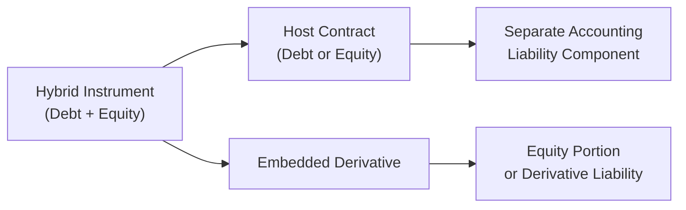

## Introduction

Hybrid financial instruments are like those color-changing keychains you might have seen—at first glance, they look like standard pieces of debt or equity, but once you peel back the layers, their features can morph into something else entirely. If you’ve ever analyzed a convertible bond or a preference share with the option to convert into common stock, you’ve already encountered some form of a hybrid instrument.  

In this section, we’ll explore why it’s crucial to identify, dissect, and properly present hybrid instruments on a company’s balance sheet. We’ll go step by step, from definitions and key concepts like “embedded derivatives” to real-world examples, and then move on to the implications for your analysis.  

## Defining Hybrid Instruments

A “hybrid instrument” is a financial security that blends (almost like a smoothie!) both debt-like and equity-like components—or, at times, an embedded derivative that modifies how the host contract behaves. One of the classic examples of a hybrid instrument is a convertible bond: It starts as a bond, paying interest like any ordinary debt, but offers the “equity-flavored” right to exchange the bond for shares of the issuing company under certain conditions.

### Embedded Derivatives

An embedded derivative is that “secret sauce” inside a non-derivative host contract. For instance, a convertible bond embeds a conversion option allowing bondholders to convert their debt to equity. If you’re under IFRS 9 (Financial Instruments) or ASC 815 (Derivatives and Hedging)—the relevant US GAAP standard—you’re required to evaluate carefully if these embedded features must be separated (or “bifurcated”) from the host contract and valued on their own.  

### Bifurcation Requirements

Bifurcation is essentially the process in which we peel off the derivative portion from the host contract and treat it as a standalone derivative. The conditions for bifurcation typically revolve around:
• The economic characteristics of the embedded derivative not being “closely related” to the host contract.  
• The derivative by itself meeting the definition of a derivative under the applicable accounting standards.  

If these conditions are met, the embedded derivative is measured separately. The host might be accounted for at amortized cost as a liability (assuming it’s a debt-like host), while the derivative portion is often fair-valued through profit or loss (or recognized as an equity component, depending on specific criteria under IFRS or US GAAP).

## IFRS vs. US GAAP Approaches

### IFRS 9 Guidance

Under IFRS 9, you look primarily at whether the embedded derivative has economic characteristics and risks that are closely related to the host. If not, you separate it out. With convertible bonds that meet certain “equity classification” requirements, IFRS typically positions the conversion option in equity (i.e., it won’t be marked to market like a typical derivative).  

A convertible bond under IFRS might thus be split into a liability portion (the bond’s “host”) and an equity portion (the conversion feature). The liability portion is computed by discounting the bond’s contractual cash flows, while the equity portion is the residual (i.e., issue proceeds minus the fair value of the liability portion).

### US GAAP Guidance (ASC 815, Beneficial Conversion Feature Rules)

Laugh if you must, but US GAAP can feel like an obstacle course for embedded derivatives. ASC 815 sets out when and how to separate embedded derivatives. Meanwhile, convertible instruments can trigger beneficial conversion feature (BCF) considerations (under ASC 470-20). Essentially, if the conversion price is “in-the-money” relative to the issuer’s stock price at issuance, the instrument might have a beneficial conversion feature, which you record as an element of equity and as an immediate expense if certain thresholds are met.  

The classification under US GAAP can get trickier if the conversion or redemption terms do not meet “fixed-for-fixed” requirements or if the issuer lacks sufficient authorized shares. In such cases, the embedded conversion may be carried as a derivative liability, measured at fair value through profit or loss.  

## Why Hybrid Instruments Matter for Financial Statement Analysis

Analysts who skip reading the footnotes on hybrid instruments might wind up with a skewed perception of a firm’s leverage and solvency. Here’s why:

• A debt-like instrument with a significant equity component might understate liabilities if accounted for purely as equity or overstate if incorrectly handled.  
• Overlooking a convertible feature can mask future dilution of share capital.  
• Changes in fair value of embedded derivatives can produce volatility in net income or other comprehensive income.  

I still remember my early days analyzing a bond with a convertible feature at a small biotech startup. We initially missed the embedded derivative detail. As soon as we realized it, we had to restate the financial analysis because that embedded conversion option was a substantial portion of the bond’s overall value. Talk about an “ah!” moment.

## Presentation on the Balance Sheet

So, how does all this show up on the balance sheet? Let’s take a practical convertible bond example under IFRS:  

1. Determine the fair value of the liability (bond) portion. Usually, you discount the bond’s expected cash flows using a market yield similar to a comparable bond without a conversion feature.  
2. The difference between the bond’s issue proceeds (or fair value if not issued at par) and the calculated liability portion is allocated to equity.  
3. Record each portion separately on the balance sheet: one in liabilities, the other in equity.  

Under US GAAP, certain convertible preferred shares might show as temporary equity if redemption features are beyond the issuer’s control, or appear as a liability if the shares have a mandatory redemption date. This classification can play a big role in altering a firm’s capital structure metrics.  

## Impact on Key Ratios

Hybrid instruments can twist commonly used ratios, so you have to be vigilant:

• Debt-to-Equity (D/E) Ratio: If the instrument is classified as part equity and part liability, the liabilities remain lower than if it were treated purely as debt, improving the D/E ratio.  
• Interest Coverage Ratios: The interest expense is recognized on the liability portion only, reducing interest expenses relative to a 100% debt classification.  
• EPS Dilution: Convertible instruments can lead to future share dilution. That has immediate implications for calculating diluted EPS (see Chapter 2.4 for a refresher on basic vs. diluted EPS).  

In other words, a firm might appear more “healthy” at first glance, but once you factor in embedded derivatives or conversion features, the leverage and coverage metrics might shift.  

## Mermaid Diagram: Hybrid Instrument Bifurcation

Below is a simple visualization of how we separate the host contract and the embedded derivative in a hybrid instrument:

The key takeaway is that once you identify each piece, you measure it according to its nature: debt, equity, or derivative.

## Valuation Considerations

Valuing each component can be quite a puzzle. Typically, analysts adopt something like this approach:

1. Value the host contract by discounting the expected cash flows at an appropriate market yield or other valuation method (for example, using IFRS 13 or ASC 820 fair value hierarchy if needed).  
2. The embedded component might be valued using an options pricing model (e.g., Black-Scholes if it’s an equity call option) or some binomial approach that accounts for multiple possible outcomes.  
3. Summation or residual approach: If the embedded derivative is recognized as equity (under IFRS convertible rules), you can record the equity portion as the difference between total proceeds (the “issue price”) and the fair value of the liability component.  

Mathematically, you might see something like:


\text{Value of convertible bond} 
  = \text{Value of host debt (liability)} 
  + \text{Value of conversion feature (equity or derivative)}.


In IFRS, you’d measure the liability first and the residual goes to equity. In US GAAP, you might measure both, or you might detect that the conversion feature has a beneficial conversion element recognized in equity and an offsetting credit to additional paid-in capital.

## Disclosure Requirements

Both IFRS and US GAAP demand that entities disclose enough information in the notes to allow a user of financial statements to understand the nature and risks of these instruments. Typical disclosures include:

• Terms and conditions of the host contract.  
• The nature of embedded derivatives (e.g., conversion feature, put/call option).  
• The accounting method used to classify and measure the components.  
• The fair values or carrying amounts of each portion.  
• The effect on net income of changes in fair value for derivatives carried at fair value through profit or loss.  

You might find disclaimers along the lines of “We recognized a derivative liability of $10 million in relation to our convertible notes…” or “The equity component of $2 million was recorded in Additional Paid-In Capital.” You definitely want to check these footnotes if you’re measuring the company’s creditworthiness or the potential dilutive effects on existing shareholders.

## Real-World Application: Convertible Bonds vs. Convertible Preferred Shares

Let’s talk for a moment about convertible preferred shares. They typically pay a dividend, can convert into common stock, and might also carry redemption rights. Under IFRS, if redemption is mandatory at a set date, that portion is treated as a liability, while any embedded conversion that meets certain conditions might land in equity. Meanwhile, in US GAAP, it could be categorized as convertible debt, temporary equity, or permanent equity—depending on the terms.  

From an analysis standpoint, you’d approach them similarly: figure out what portion is truly “debt-like” and what portion is “equity-like,” then evaluate how that classification changes your leverage, coverage, and returns.

## Common Pitfalls

1. Ignoring the Embedded Derivative: Failing to separate the component can lead to misstatements.  
2. Underestimating Dilution: If you skip analyzing how many new shares might emerge from conversion, your diluted EPS projection will be off.  
3. Overlooking Changes in Fair Value: If the embedded derivative is classified as a liability, fluctuations in fair value can swing the income statement.  
4. Confusing IFRS Classification: IFRS classifies the conversion feature as an equity portion only if it meets a strict “fixed-for-fixed” criterion (the number of shares and exercise price are fixed). Otherwise, it’s a derivative liability.

## Best Practices and Exam Tips

• Always read the footnotes—hybrid instruments lurk there.  
• Classify carefully; make sure you know IFRS vs. US GAAP differences in beneficial conversion features and “fixed-for-fixed” tests.  
• Understand the timing of any conversions, redemptions, or calls, as these features can affect how you project cash flows and share counts.  
• Practice scenario analysis—consider what happens if the share price rises (more conversions might occur) or if interest rates fluctuate.  

As for exam strategy, you might be asked to do the following:
• Identify the correct classification of a hybrid instrument given certain terms and conditions.  
• Allocate the proceeds between liability and equity.  
• Calculate the impact on equity ratio or debt-to-equity ratio when the embedded conversion is recognized.  
• Discuss how the beneficial conversion feature might be recorded under US GAAP.  

## Conclusion

Hybrid instruments might feel like that friend who shows up at the party with cookies and brownies—two goodies in one product! They’re neither purely debt nor purely equity, so you have to evaluate them from both angles. Classifying and presenting them accurately is crucial for getting a reliable picture of a company’s balance sheet, leverage, and profitability metrics.

At the end of the day, it all comes down to carefully examining the contract details, applying the accounting standards meticulously, and understanding how the hybrid instrument can potentially morph over time. Once you get the hang of it, you’ll be able to spot the hidden surprises (or treats) in any capital structure.

## References and Further Reading

- IFRS 9, “Financial Instruments.”  
- IAS 32 and IFRS 7 (for presentation and disclosures).  
- ASC 815 “Derivatives and Hedging” (for US GAAP embedded derivative guidance).  
- ASC 470-20, “Debt—Debt with Conversion and Other Options” (for beneficial conversion features under US GAAP).  
- “Hybrid Financial Instruments: A Comparative Study,” published in various accounting and finance academic journals.  

--------------------------

## Test Your Knowledge: Hybrid Instruments in Financial Statement Analysis



### Which of the following best describes a hybrid financial instrument?

- [ ] A debt instrument that carries no equity component.  
- [x] A financial instrument that combines both debt-like and equity-like features.  
- [ ] An instrument that is always classified entirely as equity.  
- [ ] A plain vanilla bond with no embedded features.  

> **Explanation:** Hybrid instruments have characteristics of both debt and equity or contain an embedded derivative.  

### Under IFRS, which of the following statements correctly describes the bifurcation of a convertible bond?

- [x] The liability is measured by discounting the cash flows at a market rate, with the remainder assigned to the equity component.  
- [ ] The entire bond is usually classified as a derivative.  
- [ ] The entire bond is classified as equity if conversion is probable.  
- [ ] Bifurcation is not permitted under IFRS.  

> **Explanation:** Under IFRS, the host liability is valued first, and the residual amount is assigned to the equity portion.  

### Under US GAAP, a beneficial conversion feature (BCF) exists when:

- [ ] The bond price is above par.  
- [ ] The coupon rate exceeds market rate.  
- [x] The conversion feature is in-the-money relative to the issuer’s stock price at issuance.  
- [ ] The bond is trading at a discount.  

> **Explanation:** The BCF is recognized when the conversion feature provides an immediate economic benefit to the holder, typically by being in-the-money.  

### What is the primary impact of a convertible bond’s embedded derivative on the income statement if it is classified as a liability?

- [x] Changes in the fair value of the derivative are recognized in profit or loss.  
- [ ] The entire convertible bond is recognized in OCI.  
- [ ] There is no income statement impact until conversion occurs.  
- [ ] The bond’s coupon payments are entirely capitalized as an asset.  

> **Explanation:** If the embedded derivative is classified as a liability, changes in its fair value flow through the income statement under IFRS 9 or ASC 815.  

### Which of the following ratios is most likely to be affected if a convertible bond is split into debt and equity components?

- [x] Debt-to-equity ratio  
- [x] Interest coverage ratio  
- [ ] Dividend payout ratio  
- [ ] Quick ratio  

> **Explanation:** Splitting the bond into debt and equity changes total liabilities and net interest expense, affecting both the debt-to-equity and interest coverage ratios.  

### Under IFRS, if the convertible feature meets “fixed-for-fixed” requirements:

- [x] The conversion option is classified as equity.  
- [ ] The conversion option is classified as a derivative liability.  
- [ ] The entire instrument is classified as equity.  
- [ ] Bifurcation is disallowed.  

> **Explanation:** IFRS deems the conversion feature an equity instrument if it is a “fixed number of shares for a fixed exercise price.”  

### Which of the following is a typical challenge in valuing embedded derivatives?

- [x] Selecting an appropriate model (e.g., Black-Scholes or binomial) that captures the option’s features.  
- [ ] Identifying the host contract’s nominal value.  
- [x] Estimating volatility, interest rates, and other inputs for the derivative’s fair value.  
- [ ] Using the equity method of accounting.  

> **Explanation:** Option pricing often requires advanced models, and obtaining reliable input estimates (volatility, interest rates) can be challenging.  

### How can hybrid instruments distort a firm’s capital structure ratios if not properly disclosed?

- [x] Some of the liability portion could be “hidden” in equity, leading to understated leverage.  
- [ ] They never affect capital structure ratios.  
- [ ] They always overstate debt and understate equity.  
- [ ] They reduce the firm’s total assets.  

> **Explanation:** If a hybrid component is incorrectly classified in equity when it should be partially or wholly debt, the firm’s leverage ratios can be understated.  

### Which of the following is most critical for an analyst to review when identifying hybrid instruments?

- [x] Footnotes containing details on embedded conversion or redemption features.  
- [ ] The CEO’s salary and bonuses.  
- [ ] The nature of the company’s marketing deals.  
- [ ] Historical stock dividends declared.  

> **Explanation:** Hybrid instruments and their embedded derivatives are usually outlined in footnotes, offering clarity on terms and classification.  

### True or False: A preferred share that is mandatorily redeemable on a fixed date is classified as a liability under IFRS.

- [x] True  
- [ ] False  

> **Explanation:** IFRS treats any mandatory redemption feature at a fixed date as a liability because the issuer has a contractual obligation to deliver cash at maturity.  

  
