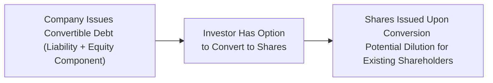

## Introduction

Have you ever come across one of those nifty bond instruments that magically morph into equity at some stage? Convertible debt does just that. It’s like you’re holding a standard bond—but if conditions are right, you get to hop on the stock’s upside by converting that bond into shares. And if that’s not enough excitement, detachable warrants can be an added sweetener, giving investors separate options to buy the issuing company’s shares at set prices. In this section, we’ll dig into these instruments from the perspective of a financial analyst—and yes, talk about the accounting complexities you might face under IFRS and US GAAP. We’ll also walk through how to evaluate potentially dilutive impacts on ratios like earnings per share.

Anyway, let’s jump in.

## Key Concepts and Terminology

Convertible Debt (Bond)  
A bond that carries an embedded conversion option allowing investors to exchange the debt holding for a specific number of shares. Typically, this conversion benefit becomes valuable if the market price of the underlying equity rises above the bond’s conversion price.

Detachable Warrants  
A separate instrument, often issued alongside debt, that grants the holder the right (but not the obligation) to purchase company shares at a predetermined exercise price. Because these warrants are “detachable,” they can be traded independently of the debt.

Conversion Premium  
This is the premium over the current market price at which the holder can convert or effectively acquire the issuer’s shares. If the premium is high, the bond might not be converted unless the stock’s price rises substantially.

Forced Conversion Provision  
An issuer-level provision permitting the company to require conversion under certain conditions, such as the stock price surpassing a specified threshold. It’s basically the company's way of saying: “We’d like you to convert now rather than hold our debt indefinitely.”

## Economic Rationale and Investor Perspective

Sometimes I still remember how exciting I found convertible debt when I first studied it. You have the downside protection of a bond and, if you’re lucky, the upside of equity returns. From an issuer standpoint, convertibles let you raise capital at a lower interest rate than plain-vanilla debt, because holders are willing to accept a lower yield in exchange for an equity “kicker.”

Warrants follow a similar logic: they sweeten the deal for bond investors by giving them an additional piece of the action if the stock rallies. If you’re analyzing these instruments, you’ll want to carefully assess how the combination of guaranteed coupon payments plus equity-like upside can affect both the cost of capital and overall leverage.

## Accounting Treatment under IFRS and US GAAP

The real twist is how the proceeds from issuing such debt are split between liability and equity. Under IFRS (notably IAS 32 “Financial Instruments: Presentation”), convertible debt is bifurcated into:
• A liability component, representing the present value of the future coupon and principal payments.  
• An equity component, basically the residual after you subtract the liability component from the total proceeds.  

US GAAP (ASC 470-20) has historically had similar goals but somewhat different detailed guidance around embedded conversion features, beneficial conversion features, and whether some features should be recognized in equity or sometimes separated as derivative liabilities. The broad strokes are these:
• Identify if the conversion feature is separately accounted for as equity or derivative liability.  
• The bond’s liability component is typically measured at the fair value of similar non-convertible debt.  
• The difference (if recognized) is allocated to equity.  

### Example of Allocation

Suppose a company issues a $1,000 convertible bond at par with a 5% coupon. Comparable non-convertible debt yields 6%. Let’s do a simplified approach:

1. Calculate the Present Value of the bond’s cash flows at a 6% rate (the market rate).  
2. This present value is the “liability component.”  
3. Subtract that liability component from the total proceeds ($1,000).  
4. The remainder is credited to “Equity—Convertible Feature.”  

From the investor’s side, the carrying amount in your financial analysis is not necessarily the same as the par value because of this initial allocation. Keep an eye on interest expense: it will be based on the 6% effective rate for the liability portion (not just the 5% coupon).

## Detachable Warrants

Detachable warrants are accounted for separately from the associated debt instrument. Upon issuance:
• The fair value (or a reasonable proxy) of the warrant is recognized in equity (assuming they meet criteria for equity classification).  
• The remaining proceeds are allocated to the liability (the debt).  

Be aware: If you’re modeling the interest expense, you base it on the portion allocated to the debt. The presence of warrants can reduce the bond’s liability portion because part of the total proceeds is assigned to the warrant. Over time, you still use the effective interest method for the bond liability, just as you would with any other amortized cost approach.

## Potential Dilution and EPS Factors

So, how does all of this complicate life for an analyst? Let’s say you’re evaluating a company’s earnings per share. Convertible debt and warrants can spark dilution if they convert or if the warrants are exercised. Under IFRS and US GAAP:

• If the instrument is “in the money” (e.g., the conversion price is below current market price of shares), you should assume conversion for the purposes of diluted EPS.  
• Even if not currently in the money, IFRS and US GAAP have conditions focusing on whether the number of shares could increase.  

Because convertible debt can swiftly morph into equity, it can drastically change share counts—potentially bumming out existing shareholders concerned about dilution. For that reason, an analyst will often run multiple what-if scenarios to figure out fully diluted EPS and the potential effect on share-based metrics when the conversion event occurs.

## Conversion Triggers and Forced Conversion

If you’ve ever read a convertible bond prospectus, there are pages detailing the conditions under which conversion can be forced or triggered. For instance:
• A forced conversion if the issuer’s stock trades above 150% of the conversion price for a set number of days.  
• Automatic triggers if the issuing company merges or is acquired.  

Why does it matter to you as an investor or analyst? Because forced conversion can accelerate your timeline to switch from bondholder to shareholder—so you’d better be comfortable with the issuer’s equity outlook. Also, from a credit risk perspective, losing your bond status can be detrimental if you still believe the stock prospects are uncertain.

## Example: Allocating Proceeds with Python

Sometimes it helps to see a little code that roughly does the discounting math. Let’s assume you want a quick calculation. This snippet is a simplified approach that calculates the liability portion of a convertible bond at issuance.

```python
import math

def allocate_proceeds(total_proceeds, coupon_rate, market_rate, years, face_value):
    """
    Calculate the liability and equity portions of convertible debt.
    Simplified approach ignoring compounding frequency.
    """
    # Present value of coupons
    coupon_pv = coupon_rate * face_value * (1 - (1+market_rate)**(-years)) / market_rate
    # Present value of redemption
    redemption_pv = face_value / ((1+market_rate)**years)
    
    liability_component = coupon_pv + redemption_pv
    equity_component = total_proceeds - liability_component
    return liability_component, equity_component

lc, ec = allocate_proceeds(total_proceeds=1000000, coupon_rate=0.05, market_rate=0.06, years=5, face_value=1000000)
print("Liability Component:", round(lc, 2))
print("Equity Component:", round(ec, 2))
```

Remember that real-world calculations may need more complexity, including semiannual or quarterly coupon payments.

## Visualizing the Conversion Flow

Below is a simple Mermaid diagram to depict how a convertible bond eventually transforms into equity:



Analytically, keep in mind that the liability portion diminishes if conversion becomes probable, shifting the future capital structure.

## Best Practices, Pitfalls, and Challenges

Best Practices:  
• Model different scenarios: Will the bond be converted early? At maturity? Evaluate how that changes the debt-to-equity ratio and EPS.  
• Investigate forced conversion triggers: Sometimes, these triggers can accelerate the date of conversion.  
• Review disclosures: IFRS requires disclosures about conversion terms and triggers (see IFRS 7 for financial instruments disclosures). US GAAP also demands clarity on conversion features, beneficial conversion analyses, etc.

Common Pitfalls:  
• Underestimating the incremental dilution: If you simply treat the bond as debt until maturity, you might miss the looming share issuance.  
• Overlooking changes in effective interest expense: Splitting the proceeds means the interest expense might exceed the nominal coupon.  
• Failing to treat warrants properly: They might be in the money sooner than the convertible bond feature, so be sure to separate their effects carefully.

Challenges:  
• Identifying beneficial conversion features can be tricky, especially if the conversion price is set below the shares’ market price.  
• Changing market conditions: If interest rates or share prices move, it can affect the perceived benefit of conversion.  

## Practical Application in Financial Analysis

Let’s look at a simple scenario: Suppose your target company just issued $50 million in convertible debt with an embedded conversion. After reading the prospectus, you discover:
• The coupon is 4%, with a market rate for similar debt at 5%.  
• The conversion price is set at 20% above the share price at issuance.  
• There is a forced conversion if the share price trades 30 consecutive days above the conversion price.  

As an analyst, you estimate how likely it is that the forced conversion condition will be met—especially if you’re bullish on the stock. You’d run a sensitivity analysis to see how your EPS gets hammered or boosted under different conversion timelines. Logical? Absolutely. Because the next time the CFO says, “Don’t worry, it’s only 4% debt,” you’ll glance knowingly at your model that shows the prospective share dilution.

## Exam Tips

In the CFA® Program context, you might spot a question that:
• Provides you with partial details of a convertible bond.  
• Asks you to calculate the carrying amount of the debt portion at issuance.  
• Requires you to identify the impact on diluted EPS or to highlight forced conversion triggers.

Take care to:
• Use the correct discount rate (the market rate) when calculating the liability component.  
• Keep track of how any “in the money” conversions drive up diluted share counts.  
• If a question references both IFRS and US GAAP, note the difference in how the equity component might be measured.

## References and Further Reading

• IAS 32 “Financial Instruments: Presentation” (IFRS)  
• ASC 470-20 “Debt with Conversion and Other Options” (US GAAP)  
• “Advanced Accounting” by Hoyle, Schaefer, and Doupnik  
• Chapter 1.4 of this text for IFRS vs. US GAAP developments  
• Chapter 2.12, IFRS 15 vs. ASC 606, for revenue recognition differences (helpful to compare IFRS vs. US GAAP principles)  
• Chapter 13.2 on Ratio Analysis to see how convertible debt affects measurements of leverage and profitability  

## Test Your Knowledge: Convertible Debt and Warrants Quiz



### Which of the following statements best describes the economic rationale behind issuing convertible debt?

- [ ] Convertible debt typically has higher coupons than standard bonds.
- [ ] Convertible debt provides no equity upside for investors.
- [x] Convertible debt allows issuers to offer lower coupon rates due to the embedded conversion option.
- [ ] Convertible debt is more expensive because it always offers guaranteed equity.

> **Explanation:** Because holders can convert their bonds into equity if the stock price appreciates, they accept a lower coupon rate. This results in a cost advantage for the issuer.

### A convertible bond has a coupon rate of 4% and is issued at par. The market rate (for similar non-convertibles) is 5%. Under IFRS, the liability component is measured by:

- [ ] The nominal coupon rate on the bond.
- [x] The present value of future coupon and principal payments discounted at the market rate.
- [ ] The par value of the bond.
- [ ] The total proceeds received from the bond issuance.

> **Explanation:** To identify the liability component, discount the bond’s future payments by the market (5%) rate. Any difference between the proceeds and this present value is the equity component.

### Under US GAAP, if a beneficial conversion feature is identified at issuance, which of the following is true?

- [x] Part of the proceeds is allocated to additional paid-in capital (equity).
- [ ] The entire bond value remains a liability until the bond is converted.
- [ ] No separation is required, because everything remains in the liability section.
- [ ] The bond must be automatically classified as equity.

> **Explanation:** A beneficial conversion feature is a portion of the instrument that is recognized in equity, reducing the initial carrying amount of the liability.

### Detachable warrants issued alongside a bond typically lead to:

- [ ] Higher liabilities on the balance sheet because the bond is recorded at a premium.
- [x] A separate equity component recognized for the fair value of the warrants.
- [ ] A reduction in the bond’s coupon rate with no effect on accounting.
- [ ] No impact on EPS when the warrants are exercised.

> **Explanation:** Detachable warrants are accounted for as a separate instrument in equity (assuming equity classification is appropriate). The bond’s liability portion is reduced by the fair value assigned to the warrants.

### Forced conversion provisions allow the issuer to:

- [ ] Defer interest payments indefinitely.
- [ ] Receive extra coupon payments from the investor.
- [ ] Convert the bond into a warrant.
- [x] Require investors to convert the bond into shares after certain conditions are met.

> **Explanation:** A forced conversion provision states that if certain conditions are met (e.g., the stock price exceeds a specific threshold for a given period), the issuer can force the bondholders to convert.

### When analyzing diluted EPS for a company with outstanding convertible bonds:

- [x] The maximum potential shares from bond conversion are typically included if the conversion is in the money.
- [ ] The convertible bond is always treated as equity from inception.
- [ ] The shares are only added if the company forces conversion the same year.
- [ ] Dilution calculations are irrelevant when the bond is out of the money.

> **Explanation:** In calculating diluted EPS, accounting standards require companies to factor in any in-the-money conversion features that could increase the number of outstanding shares.

### In measuring interest expense under IFRS for convertible debt, which rate is used to amortize the liability component?

- [ ] The convertible bond’s coupon rate.
- [x] The effective interest rate determined by the initial fair value of the liability.
- [ ] The risk-free rate.
- [ ] The dividend yield on common shares.

> **Explanation:** Interest expense is recognized using the effective interest method, based on the discount rate used to value the liability component at issuance.

### In determining the fair value of detachable warrants at issuance, an issuer would typically:

- [x] Apply an option-pricing model or another fair value method.
- [ ] Assign a nominal value of zero to warrants.
- [ ] Treat all warrants as an immediate expense to retained earnings.
- [ ] Ignore the fair value of warrants if not exercised in the first month.

> **Explanation:** Detachable warrants should be measured at fair value, often via Black-Scholes or other pricing models, then recognized in equity (assuming no derivative liability classification).

### Why might an analyst model early conversion of a convertible bond?

- [x] To capture scenarios where share prices rise above the conversion threshold, thus triggering conversion.
- [ ] Because interest rates always decrease substantially right after issuance.
- [ ] Because convertible bonds must convert every six months by regulation.
- [ ] There is never a reason to consider early conversion.

> **Explanation:** If the share price appreciates to a level that makes conversion beneficial, bondholders might convert early, changing the firm’s capital structure and impacting EPS.

### True or False: Under both IFRS and US GAAP, a convertible bond’s entire proceeds are always recorded in the liability section.

- [x] True
- [ ] False

> **Explanation:** This statement is false. Both IFRS and US GAAP generally require bifurcation of the convertible bond into liability and equity (or derivative) components, assuming certain criteria are met.


