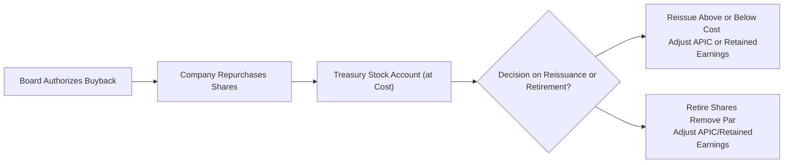

## Overview and Rationale

Treasury stock—sometimes called treasury shares—represents company stock that was previously issued and has since been repurchased by the same company. These shares are held in the company’s treasury and typically carry no voting rights, pay no dividends, and do not count toward shares outstanding in the calculation of per-share metrics such as earnings per share (EPS). While it might look like the company is “investing in itself,” the economics are subtler. Treasury stock is generally shown as a contra-equity account, decreasing total shareholders’ equity.

But why do companies buy back their own shares in the first place? Well, there are plenty of reasons. They might believe the equity is undervalued. They might want to offset dilution from employee stock-based compensation. Or they might simply want to adjust their capital structure by returning capital to existing shareholders. Regardless of motivation, investments in treasury stock can have significant impacts on a firm’s financial statements—particularly on equity, liquidity, and per-share metrics. And, from an analyst’s perspective (especially for the CFA exam), it’s essential to understand precisely how these transactions are recorded and how they might alter a firm’s financial profile.

Below, we’ll break down the major concepts, key accounting workflows, the distinction between cost and par value methods (with a deeper emphasis on the cost method that is far more common), common pitfalls, and advanced analytical insights. Along the way, we’ll add a personal anecdote or two—plus a couple of those subtle “ums” and “you knows” to keep the conversation a bit more relaxed, though we’ll certainly remain thorough.

## Key Characteristics of Treasury Stock

Treasury stock is accounted for differently from typical assets. You won’t generally see it among tangible or intangible assets because the rules are precise that repurchase of a company’s own shares is not an income-producing asset. Instead, these shares are reported within the equity section of the balance sheet as a reduction to total shareholders’ equity. Under US GAAP, authoritative guidance—like ASC 505-30—outlines the specifics. IFRS lumps them under equity as well but does not use the exact term “treasury stock.” Instead, IFRS requires separate presentation within equity for shares repurchased, typically calling them “treasury shares” or something similar. 

What’s the big deal, though? You might ask: “Okay, the firm just took some shares off the market. What changes?” So quite a bit. For starters, the shares outstanding decreases, the pool of shares that are used to compute EPS changes, and depending on how the purchase is funded (often via operating cash or new debt), the capital structure can shift. This, in turn, can affect a company’s solvency ratios, liquidity metrics, and, in some cases, investors’ perception of the stock’s fundamental value.

## Motivations for Share Repurchases

Before we dive deeper into the mechanics, it’s helpful to think about the “why.” Several major motivations typically underlie share repurchases:

• Undervaluation Beliefs: Management sometimes believes the market is underpricing the company’s stock. By repurchasing shares, the firm can signal confidence and potentially enhance the stock price.  
• Capital Structure Adjustments: Companies with ample cash might prefer share buybacks to reduce total equity (and share count), thus increasing leverage ratios in a controlled manner.  
• Offsetting Dilution: Firms frequently have stock-based compensation packages for executives and employees. As these stock options are exercised, new shares are issued, diluting existing shareholders. Treasury shares can be reissued to offset or partially offset this effect.  
• Returning Capital: Share repurchases are an alternative to dividends for returning capital. Some investors prefer buybacks because they can be more tax-efficient, or at least more flexible, depending on local tax laws.  

Anyway, from an analyst’s perspective, the important part is that share buybacks can boost earnings per share by shrinking the denominator. However, the fundamental question remains whether the company is using its economic resources (like cash) in a way that benefits shareholders long-term, or is simply managing short-term metrics.

## Cost Method and Par Value (Stated Value) Method

When you get into the nuts and bolts, US GAAP and IFRS primarily permit two overarching methods of accounting for treasury stock. However, in practice, the cost method is by far the most prevalent:

• Cost Method: The company records treasury shares at the purchase price (the cost of acquiring them). Any reissuance above or below that cost typically affects additional paid-in capital (APIC) or retained earnings.  
• Par Value (or Stated Value) Method: Under this approach, treasury stock is recorded at par value, and any differences must be recognized in APIC or other equity accounts. This method is less common in modern practice, but it’s still worth being aware of for exam and historical reasons.  

Because the cost method is a staple for the CFA exam and real-world practice, let’s really zero in on that.

## Accounting Under the Cost Method

Under the cost method, a treasury stock account is debited at the actual purchase cost. This is a contra-equity account, so it has a debit balance, which decreases total equity. When the treasury stock is later reissued, the difference between its repurchase cost and the reissue price typically flows to an equity account—which might be APIC-Treasury Stock or, if that balance is insufficient, retained earnings. There’s no gain or loss that shows up on the income statement. Let’s detail how that looks in journal entries (slightly simplified, but hopefully enough for you to see the logic).

### 1. Purchase of Treasury Stock

Suppose a company repurchases 1,000 shares at $10 per share. The total cost is $10,000. Under the cost method:

• Debit Treasury Stock (contra-equity) $10,000  
• Credit Cash $10,000  

This presents the straightforward part: the firm expends $10,000 to reduce the number of shares on the open market, thereby decreasing equity.

### 2. Reissuance of Treasury Stock Above Cost

Now imagine those 1,000 treasury shares are reissued at $12 per share, for a total of $12,000. That’s $2 per share above the original cost. The company must remove the treasury stock from its books at the cost ($10,000) and recognize the difference ($2,000) in APIC:

• Debit Cash $12,000  
• Credit Treasury Stock $10,000  
• Credit APIC—Treasury Stock $2,000  

So you see, there’s no “gain” posted to the income statement. It remains squarely within the equity accounts.

### 3. Reissuance of Treasury Stock Below Cost

Conversely, if the reissue price is lower than the cost basis, that difference is recognized as a reduction in APIC—Treasury Stock. If that APIC account lacks enough balance, the difference goes to Retained Earnings. For instance, reissuing the 1,000 shares at $9 per share yields $9,000. The difference of $1,000 must reduce equity:

• Debit Cash $9,000  
• Debit APIC—Treasury Stock (or Retained Earnings) $1,000  
• Credit Treasury Stock $10,000  

If the firm has zero or insufficient APIC—Treasury Stock from previous transactions, the entire $1,000 difference is charged against Retained Earnings, effectively lowering the company’s accumulated earnings.

### 4. Retirement of Shares

Sometimes, a firm permanently retires the repurchased shares. In that case, the shares are canceled. Depending on local laws, authorized share capital might be reduced as well. The accounting entries for permanent retirement can be somewhat more involved, requiring you to remove the par value of shares from common stock and reallocate anything above or below par to APIC or Retained Earnings.

## Mermaid Diagram: Treasury Stock Workflows

Below is a simple flow diagram to visualize the steps involved in a treasury stock transaction, from repurchase to reissuance. It might help you piece things together more systematically:

This is a simplified representation, but it highlights how treasury stock typically moves through the company books.

## IFRS vs. US GAAP Nuances

Both IFRS and US GAAP require treasury shares to be presented as a deduction from equity. However, IFRS, specifically IAS 32, does not define “treasury stock” in the same explicit manner as US GAAP (ASC 505-30). Instead, IFRS generally indicates that repurchased shares must be subtracted directly from shareholders’ equity. Crucially, IFRS also mandates that no gains or losses should be recognized in profit or loss from these transactions—mirroring the principle found in US GAAP.

Because the basic idea is consistent—there’s no net income statement effect, and treasury stock (or “treasury shares”) is recorded as a deduction from equity—analysts can generally interpret the results similarly across the two frameworks. Still, differences in presentation do exist, so it helps to read the notes to the financial statements carefully.

## Implications for Financial Analysis

When analyzing treasury stock transactions, it’s key to remember that buybacks can:

1. Alter EPS Calculations:  
   By reducing the number of outstanding shares, the firm may artificially boost EPS. As a refresher, the standard EPS formula can be stated in KaTeX as:  
   
   \text{EPS} = \frac{\text{Net Income}}{\text{Weighted Average Shares Outstanding}}
     
   A big buyback means fewer shares in the denominator. That can make the company’s EPS look stronger, but possibly at the cost of using up cash or taking on debt.

2. Influence Liquidity Ratios:  
   Purchasing shares can drain valuable cash from the business. Analysts frequently question if that cash could have been used for capital investments or strategic acquisitions instead. The immediate effect might be a less robust current or quick ratio.

3. Modify Debt-Equity or Leverage Metrics:  
   If the share buyback was financed with debt, the debt-to-equity ratio goes up. Even if financed with cash on hand, the total equity shrinks, possibly affecting leverage ratios. This can be strategic, but it can also be risky if the firm over-leverages.

4. Affect Market Perceptions:  
   Share repurchases often signal management’s confidence in the company’s prospects, but if excessive, they may also signal a lack of better projects (i.e., an inability to invest capital in growth opportunities).

### Example: EPS Impact

Let’s illustrate with a practical scenario. Suppose your buddy’s company, Quick-Serve Inc., had net income of $200,000 and 100,000 shares outstanding all year, giving an EPS of $2.00. If the firm repurchases 10,000 shares near the end of the year, the weighted average shares for the year might drop to 95,000, depending on the timing. That’s a new EPS of $\frac{200,000}{95,000} \approx 2.11$. Looks like the company became more profitable on a per-share basis, but no additional net income was produced—just fewer shares.

## Repurchase Methods: Open Market vs. Tender Offer

While not strictly an accounting matter, the manner in which a company repurchases shares can be relevant:

• Open Market: The company buys shares from the open market like any investor. The price fluctuates based on demand and supply, and these purchases are spread out over days or weeks. The average repurchase cost can vary.  
• Tender Offer: The firm might make an offer to shareholders to buy back a certain number of shares at a specified price—often a premium over the current market price. This approach can be more controlled but may be more expensive initially.  

Analysts often read the footnotes to see if the repurchase was made in the open market or via a tender offer, so they can interpret the firm’s strategy and possible share price effects.

## Real-World Anecdote: Tech Giant Buybacks

One of the largest technology companies globally—no names needed, but you can probably guess—spent hundreds of billions of dollars on share buybacks over the past decade. If you track that firm’s EPS growth, some portion is genuinely from operational success, but a noticeable chunk arises from the massive reduction in share count. You can see a direct line in their equity statements: “Treasury stock purchased,” which soared year after year. Some puzzle over whether the repurchases were the best use of capital, whereas others argue it was the ideal way to return cash to long-term shareholders.

## Common Pitfalls and Potential Red Flags

• Excessive Buybacks with Borrowed Funds: If a company repeatedly finances buybacks with debt at higher interest rates, it might be artificially pumping up EPS at the cost of long-term solvency. That can be precarious, especially if interest rates climb or if the credit market turns sour.  
• Inadequate Disclosures: Some firms are not transparent about the timing, purpose, or even the extent of their share repurchases. As an analyst, you should scrutinize the statement of cash flows (financing section) and equity footnotes for clues.  
• APIC Balance Issues: When reissuing treasury stock below cost, the negative difference hits APIC—Treasury Stock. If that runs out, retained earnings are next. This can cause negativity among shareholders if the reissuance is done at a deep discount.  
• Window Dressing: Scheduled buybacks near the end of a reporting period might give the illusion of improved EPS or ROE. Once again, review timing in footnotes.

## Analytical Approaches

For those preparing for the CFA exam, particularly at advanced levels, you want to interpret treasury stock transactions in context:

• Adjusted EPS: Some analysts factor in the potential new shares if the firm decides to reissue treasury stock. They consider the possible dilutive effect that might occur if these shares are used to fulfill employee stock compensation.  
• Free Cash Flow Dynamics: Look at the consistency between a firm’s operating cash flow and its buyback activity. If a company with stagnant cash flow is going big on share repurchases, it might be signaling lack of reinvestment or potential risk in liquidity management.  
• Trend Analysis in Equity Statement: Evaluate how the company’s equity has evolved over multiple periods, focusing on changes from share repurchases vs. net income retention vs. dividend payments.  

## Practical Case Study

Meet Nova Industries, a hypothetical manufacturing company. Over the past three years, Nova repurchased partial blocks of shares:

1. Year 1: Bought 5,000 shares at $20 each  
2. Year 2: Reissued 2,000 shares at $25 each  
3. Year 3: Retired 3,000 shares (permanently canceled)  

Let’s quickly see the main entries:

• Year 1 Purchase (Cost Method):  
  – Debit Treasury Stock = $100,000  
  – Credit Cash = $100,000  

• Year 2 Reissue (Above Cost):  
  – Debit Cash = $50,000 (2,000 x $25)  
  – Credit Treasury Stock = $40,000 (2,000 x $20)  
  – Credit APIC—Treasury Stock = $10,000  

• Year 3 Permanent Retirement: If the 3,000 shares have a par value of $1 and were acquired at $20, the company removes $3,000 from Common Stock (3,000 x $1) and $57,000 ($20 - $1 = $19; 3,000 x $19 = $57,000) from the relevant equity account (APIC—Treasury Stock or other).  

Across these steps, Nova’s shares outstanding, capital structure, and overall equity mix changed. An analyst would see a smaller share count (assuming no new issuance). Meanwhile, the net effect on the firm’s financial statements might give an appearance of improved profitability per share.

## Best Practices and Exam Tips

• Thoroughly Understand Journal Entries: The CFA exam might require you to propose or interpret how buybacks and reissuances are recorded in the equity section. Practice these entries in your spare time.  
• Read Footnotes for Additional Clarity: Many subtle details—like the reason for repurchases or the presence of any share retirement strategy—are found in footnotes.  
• Watch For Changes in Weighted Average Shares Outstanding: On the exam or in real-life analysis, ensure your share count is updated for partial-year repurchases or reissuances.  
• Distinguish Between Gains/Losses in Equity vs. Income: There’s never an income statement gain or loss from treasury stock transactions under US GAAP or IFRS, so if you see an “income gain” mention in a question, that’s likely a trap.  
• Combine with Ratio Analysis: Evaluate how the buyback affects EPS, ROE, and liquidity. The interplay among the statements (Balance Sheet, Statement of Cash Flows, Income Statement) is crucial.

## Conclusion

In short, treasury stock transactions are an important facet of financial statement analysis, particularly if share buybacks figure prominently in a company’s capital management strategy. The cost method is the go-to approach, requiring you to debit a contra-equity account that lowers total equity. Any future reissuances above or below cost adjust APIC or retained earnings. The net effect never flows to the income statement. IFRS and US GAAP follow broadly consistent principles—though IFRS generally labels them simply as deductions from equity, without using the specific “treasury stock” terminology in the codified sense.

Look out for how buybacks alter EPS and shape market perceptions. It’s all about balancing the short-term cosmetic benefits (fewer shares outstanding) against the firm’s use of valuable cash. For the exam—and your real-world career—it’s critical to understand precisely how these transactions are recorded, how they show up in the notes, and how they might change the firm’s risk and return profile.

## References for Further Study

• FASB ASC 505-30: Treasury Stock (US GAAP)  
• IAS 32: Financial Instruments—Presentation (IFRS)  
• CFA Institute Program Curriculum—Financial Reporting and Analysis (2025 Edition)  
• Brealey, Myers, and Allen, Principles of Corporate Finance  
• Company Annual Reports (especially footnotes on Share Repurchase Programs)

------------------------------------------------------

## Self-Test: Recording and Analyzing Treasury Stock Transactions



### Which of the following best describes the balance sheet classification of treasury stock for a US-based company?

- [ ] An asset listed under noncurrent assets
- [ ] A liability listed under noncurrent liabilities
- [x] A contra-equity item reducing total shareholders’ equity
- [ ] A separate line item under other comprehensive income

> **Explanation:** Treasury stock is recorded as a contra-equity account under US GAAP (ASC 505-30). It’s not considered an asset or liability.

### When treasury stock is reissued at a price higher than its cost under the cost method, the difference is generally:

- [ ] Credited to a revenue account
- [x] Credited to additional paid-in capital
- [ ] Debited to interest expense
- [ ] Credited to a gain on the income statement

> **Explanation:** Under the cost method, any difference between reissue price and cost goes to an equity account, typically APIC—Treasury Stock. No revenue or gain is recognized on the income statement.

### A company reissues treasury stock below its original repurchase cost, and APIC—Treasury Stock does not have a sufficient balance to absorb the difference. What is the impact?

- [ ] The difference is reported as a loss on the income statement
- [ ] The difference is deferred until APIC—Treasury Stock has a credit balance
- [x] The difference is charged against retained earnings
- [ ] The difference is recognized as an extraordinary item

> **Explanation:** If APIC—Treasury Stock has no balance or an insufficient balance, then the difference is deducted from retained earnings under the cost method.

### Under IFRS, treasury shares must be presented:

- [x] As a deduction from total shareholders’ equity
- [ ] As a current liability
- [ ] As temporary equity
- [ ] As other comprehensive income

> **Explanation:** IFRS requires that repurchased shares be shown as a reduction of equity. Gains or losses from reissuance do not go through the income statement.

### Which of the following is a likely motivation for companies to repurchase shares?

- [x] Signaling that management believes the stock is undervalued  
- [x] Offsetting dilution from stock-based compensation  
- [ ] Meeting short-term cash needs  
- [ ] Funding a major acquisition

> **Explanation:** Common motivations include signaling undervaluation and offsetting dilution. Conversely, meeting near-term cash needs would typically involve raising capital, not using cash for buybacks.

### If a firm repurchases its shares on the open market and holds them as treasury stock, which of the following statements is correct?

- [ ] The purchase creates a realized gain or loss on the income statement
- [ ] The total number of authorized shares is reduced
- [x] The total number of outstanding shares is reduced
- [ ] The reissue of shares mandates recognition of an expense

> **Explanation:** Repurchased shares reduce the outstanding share count but do not affect the authorized share count unless the shares are formally retired.

### Suppose a company’s net income remains constant, but it executes large repurchases of common stock. All else being equal, which ratio is most likely to increase?

- [x] Earnings per share (EPS)  
- [ ] Current ratio  
- [x] Return on equity (ROE)  
- [ ] Fixed charge coverage ratio

> **Explanation:** Reducing the denominator of total shares outstanding—in the context of stable net income—will increase per-share metrics like EPS. Meanwhile, equity decreases, potentially boosting ROE (though the effect on ROE also depends on retained earnings, capital structure, and other factors).

### What should an analyst note when a company consistently repurchases shares with significant borrowed funds?

- [ ] The firm is guaranteed to increase its market value
- [ ] The firm will violate IFRS regulations
- [x] It may expose itself to higher leverage risk
- [ ] It indicates the firm has abundant liquidity

> **Explanation:** Funding buybacks with debt increases a firm’s leverage, and while it might boost EPS, it also heightens financial risk.

### Which of the following statements is true regarding treasury stock transactions under both IFRS and US GAAP?

- [x] Gains and losses from treasury stock reissuance are not recognized in the income statement  
- [ ] Gains and losses from treasury stock reissuance are recognized immediately in other comprehensive income  
- [ ] IFRS requires treasury stock to be recorded as noncurrent asset  
- [ ] US GAAP prohibits treasury stock transactions  

> **Explanation:** Both IFRS and US GAAP consider treasury share transactions an equity matter, so no income statement gains or losses are recognized.

### True or False: Under the cost method, if a company has insufficient APIC—Treasury Stock at reissuance, the difference is reported as other income or expense.

- [ ] True
- [x] False

> **Explanation:** No income or expense is recognized. If APIC—Treasury Stock is insufficient, the difference is debited to retained earnings.


