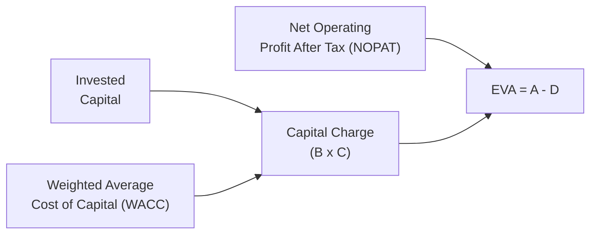

## Overview

I remember stumbling upon the concept of Economic Value Added (EVA) during my first corporate finance project. We had these fancy names for everything, but EVA struck me as something more down-to-earth—it asked a question that felt almost personal: “Did we really earn more than our cost of capital?” EVA is all about ensuring a company’s net operating profit after tax (NOPAT) is high enough to cover the weighted average cost of capital (WACC). This measure captures the true, or “residual,” wealth created for shareholders.

In this section, we’ll explore how to calculate EVA, interpret it for equity analysis, and integrate it with broader financial reporting topics—like intangible assets, R&D, or strategic investments. We’ll also talk about some practical tips and pitfalls. By the end, hopefully you’ll feel far more comfortable evaluating a company’s performance using EVA and spotting whether management is delivering real value.

## Key Concepts of EVA

EVA is essentially a measure of economic profit, meaning the profit remaining after we account for the full cost of capital. It helps answer a key question: Is the firm generating returns above (or below) the opportunity cost of the capital invested?

Typical EVA equation:

$$
\text{EVA} = \text{NOPAT} - (\text{WACC} \times \text{Invested Capital})
$$

• NOPAT: Net Operating Profit After Tax, which is operating income adjusted for cash taxes and typically excludes interest expenses and other financing effects.  
• WACC: Weighted Average Cost of Capital, which blends the required returns on debt and equity.  
• Invested Capital: Often the total capital employed in the business, i.e., the sum of debt and equity, possibly adjusted for items like intangible assets or R&D.

If such “capital charge” (WACC × Invested Capital) is higher than NOPAT, your EVA will be negative—indicating that returns do not cover your overall cost of funding. Conversely, a positive EVA signals the company generated more than enough profit to repay the opportunity cost of capital. When analyzing equity specifically, we often pay close attention to how well management invests equity contributions and whether the cost of equity is appropriately captured in WACC.

## How EVA Relates to Equity

From an equity perspective, EVA is especially insightful because it tells you if the company is creating residual return—above what investors expect given the firm’s risk profile. If I’m an equity investor, I want to know: am I fairly compensated for the risk I’m taking, or could I do better putting my money someplace else?

• Cost of Equity: Part of WACC is the cost of equity, which can come from the Capital Asset Pricing Model (CAPM) or other models—like a Dividend Discount Model or the bond-yield-plus-risk-premium approach.  
• Equity Value and EVA: Positive EVA over time generally boosts the intrinsic value of a company’s equity, whereas persistent negative EVA suggests the firm is destroying equity value.  
• Intangible Assets: If Chapter 6 gave us anything, it’s a heads-up that intangible assets (like brand value or research & development) can distort net operating profits if they’re improperly expensed or not recognized. Adjusting for these items—capitalizing R&D, for example—can refine the calculation of both NOPAT and the invested capital base. That means your (NOPAT – WACC × Capital) result could change significantly once intangible investments are factored in.

## Diagram: EVA Calculation Flow

Here’s a quick flowchart to see how we get from operating profit to EVA:



## Calculating NOPAT

NOPAT begins with operating income (EBIT) and then subtracts cash taxes. In practice, you’ll see some adjustments:
• Adding back noncash charges (if they were incorrectly expensed and belong in capital).  
• Removing unusual gains or losses that do not reflect ongoing operating performance.  
• Ensuring that intangible asset expenditures, if we consider them part of “capital,” are added back to NOPAT over their useful economic life.

Some folks like to tweak definitions, but the idea remains the same: focus on the sustainable, cash-based operating profit that the business generates, ignoring financing choices.

## Weighted Average Cost of Capital (WACC)

WACC sets the hurdle rate that NOPAT must clear. It’s typically defined as:

$$
\text{WACC} = \left( \frac{E}{E + D} \right) r_e + \left( \frac{D}{E + D} \right) r_d (1 - t)
$$

• E and D represent market values of equity and debt, respectively.  
• \\(r_e\\) is the cost of equity, which typically reflects risk-free rate + equity risk premium ± other risk factors.  
• \\(r_d\\) is the cost of debt, and \\(t\\) is the marginal tax rate.

In the EVA world, these capital costs become your “price tag” for employing resources. If your business invests $100 million at 8% WACC, then your capital charge is $100 million × 8% = $8 million per year. Any other usage of that money—like an alternative investment or returning it to shareholders—would require a similar promised return.

## Adjusting Invested Capital

Adjusting the capital base might trip you up on exams. One major challenge is intangible assets. Under certain accounting standards, intangible assets might be expensed right away. But from an economic standpoint, they often have lasting effects. So, to measure EVA properly:

• If R&D was fully expensed, add it back over its useful economic life.  
• If intangible assets are written off but still generate future benefits, consider them part of the capital base.  
• If IFRS allows revaluation of intangible assets or if US GAAP has a more conservative approach, your capital base might differ, especially for internationally diversified companies (see Chapter 6 for deeper analysis).  

One thing you might see in advanced practice is reclassifying big advertising or brand expenditures from operating expenses to intangible investments, if they truly create durable brand equity. Then you systematically amortize them over the brand’s utility period.

## EVA in Action

Let’s walk through a quick scenario. Suppose:

• NOPAT = $200 million.  
• Invested Capital = $1,500 million (book + intangible adjustments).  
• WACC = 12%.  

Capital charge is $1,500 × 12% = $180 million. Then EVA = $200 million – $180 million = $20 million. Not bad—that means $20 million in economic profit. Management is creating additional wealth. If the scenario were reversed—say, NOPAT of $150 million—then EVA would be negative ($150 – $180 = –$30 million), and you’d wonder if that capital could earn more if allocated differently or if strategic changes are needed to push NOPAT up.

Another quick method if you’re feeling the code itch:

```python
def eva(nopat, wacc, invested_capital):
    return nopat - (wacc * invested_capital)

my_eva = eva(200_000_000, 0.12, 1_500_000_000)
print(f"EVA: ${my_eva:,.0f}")
```

## Common EVA Adjustments

• Leases: Under new lease standards (IFRS 16 or ASC 842), operating leases often appear as lease liabilities on the balance sheet. For EVA, ensure these are either included in invested capital (plus adjusting NOPAT for depreciation instead of rent).  
• Restructuring Expenses: If they are truly one-time, you might exclude them. If you suspect repeated “one-time” charges, be wary—some managers can manipulate these.  
• Incentive Compensation: Executive stock options or share-based compensation might reflect a significant cost of capital, especially if it dilutes existing shareholders.  
• Goodwill Impairment: Under IFRS or US GAAP, goodwill impairments may reduce reported earnings, but you might not reduce capital if the underlying assets remain in use. Always double-check the nature of impairment.

## Benefits of Using EVA for Equity Analysis

• Focus on Value Creation: Traditional metrics like net income can be misleading if you don’t factor in the cost of capital. EVA helps you home in on wealth creation.  
• Encourages Capital Discipline: EVA frames capital as having a real cost. Management becomes more critical in deciding which projects truly earn a premium over WACC.  
• Aligns Managerial Decision-Making with Shareholder Interests: Tying management bonuses to EVA can reduce short-term manipulations in reported net income.  
• Comparable Across Projects & Periods: Because cost of capital is standardized, you can easily compare different business segments or measure the same segment across time.

## Challenges and Pitfalls

• Estimating WACC can be tricky: The cost of equity, especially, depends on your chosen model and assumptions about risk.  
• Complex Adjustments: Some intangible or strategic investments are difficult to classify. Should that big marketing campaign be capitalized or expensed? Judgment can vary widely.  
• Short-Term Fluctuations: If you keep adjusting for certain items, you might obscure real performance or hamper transparency.  
• Implementation Cost: Tracking EVA requires thorough record-keeping, especially when itemizing intangible or reclassified expenditures.

## Best Practices and Exam Tips

• Evaluate Sensitivity: On the exam, watch for how small changes in cost of equity or intangible asset treatment can swing EVA from positive to negative.  
• Watch for Underlying Accounting Policy Shifts: If the company changes how it classifies R&D, it might alter your capital base.  
• Show Your Work: On essay (constructed response) questions, demonstrate each step in the NOPAT and WACC calculation, and be clear about intangible asset adjustments.  
• Time Management: Keep your calculations concise. The exam often expects a summary of why you included or excluded specific items from NOPAT or capital.  
• Ethical Considerations: Tying compensation to EVA sometimes motivates managers to inflate or deflate intangible asset values or obscure reoccurring charges as “one-offs.” Remember your ethics from the CFA Institute Code and Standards.

## References

• Stern Stewart & Co.: Early popularization of the EVA framework.  
• McKinsey & Company: “Valuation: Measuring and Managing the Value of Companies.”  
• CFA Program Curriculum Readings on Corporate Finance, especially sections covering Residual Income and EVA.  

## Test Your Knowledge: Economic Value Added (EVA) for Equity



### Which formula best depicts how we typically calculate EVA?

- [x] EVA = NOPAT – (WACC × Invested Capital)
- [ ] EVA = EBIT – (WACC × Invested Capital)
- [ ] EVA = Net Income – (After-Tax Cost of Debt × Total Debt)
- [ ] EVA = EBITDA – Depreciation
> **Explanation:** EVA uses NOPAT minus the capital charge (WACC × Invested Capital).

### What is the primary purpose of calculating EVA?

- [x] To measure economic profit after accounting for the cost of all sources of capital
- [ ] To calculate profit solely from debt financing
- [ ] To refine the GAAP-based net income figure to reflect only cash flows
- [ ] To eliminate intangible assets from consideration in profitability
> **Explanation:** EVA focuses on whether the company’s returns exceed the overall cost of capital.

### Which component of WACC is most subject to estimation and debate in practice?

- [ ] Cost of Debt
- [x] Cost of Equity
- [ ] Marginal Tax Rate
- [ ] Risk-Free Rate
> **Explanation:** Determining the cost of equity involves assumptions about market risk premiums, beta, and other variables, making it more subjective.

### How does EVA incorporate intangible assets like R&D expenses?

- [ ] EVA simply ignores all intangible assets.
- [x] EVA often capitalizes them and amortizes them over their useful life to reflect true invested capital.
- [ ] EVA always expenses them as incurred.
- [ ] EVA writes them off at the end of each reporting period.
> **Explanation:** EVA typically capitalizes intangible assets like R&D to include their economic benefit in both NOPAT and the invested capital base.

### A positive EVA indicates what about the company’s performance?

- [x] The company is generating returns above its total cost of capital.
- [ ] The company’s free cash flow is negative.
- [ ] The company has the lowest possible cost of equity.
- [ ] The company is overcapitalized relative to its market value.
> **Explanation:** A positive EVA means the company is creating excess returns over the full cost of capital.

### If a company’s EVA turns negative, which of the following is typically the most urgent concern?

- [x] The company may not be covering its full cost of capital, implying potential value destruction.
- [ ] The company automatically violates its debt covenants.
- [ ] The firm must reduce its intangible assets.
- [ ] The firm has no recourse but to issue more equity.
> **Explanation:** A negative EVA signals that the firm’s returns are insufficient, prompting a discussion on capital reallocation or strategic changes.

### Which of the following best describes NOPAT?

- [x] Operating income adjusted for cash taxes, ignoring financing costs
- [ ] Net income plus dividends paid
- [ ] Profit before tax minus interest expenses
- [ ] EBITDA adjusted for interest expense
> **Explanation:** NOPAT is post-cash-tax operating income, disregarding financing decisions.

### Under EVA analysis, how are one-time restructuring charges usually treated?

- [x] If they are truly nonrecurring, they may be excluded from NOPAT for EVA purposes.
- [ ] They are always included in full.
- [ ] They are always removed from the invested capital base.
- [ ] They must be accelerated as amortization over 5 years.
> **Explanation:** Nonrecurring items are often excluded to isolate recurring operating performance, though analysts must be cautious with “one-off” items repeated over time.

### Which scenario best exemplifies management alignment with EVA principles?

- [x] Incentivizing managers to take on projects only if the expected return exceeds WACC
- [ ] Using net income as the sole performance metric
- [ ] Prioritizing year-end stock price over fundamental cash profits
- [ ] Minimizing R&D spending to keep short-term profits high
> **Explanation:** EVA encourages managers to select projects that surpass the cost of capital, aligning decision-making with shareholder value creation.

### True or False: It is appropriate to tie executive compensation exclusively to EVA results, with no other metrics considered.

- [x] True
- [ ] False
> **Explanation:** While some companies rely heavily on EVA for compensation, there are debates around balancing EVA with other performance measures. In practice, many use a combination (though some indeed tie almost everything to EVA).




