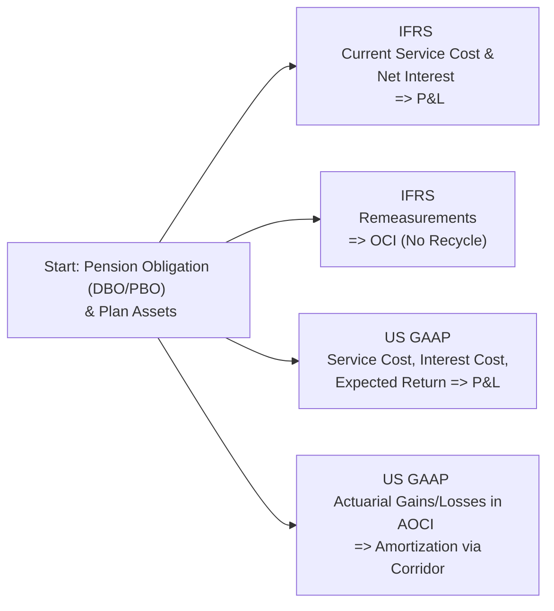

Imagine you’re sipping coffee with a friend who’s super curious about how pension liabilities pop up on financial statements. You might say, “Well, you know, the big difference is where certain costs go—profit and loss (P&L) versus other comprehensive income (OCI).” They might ask, “So, is that the only difference?” And you’d smile, realizing there’s so much more to it. Let’s dive into these complexities in a slightly informal but detailed way, focusing on how IFRS and US GAAP handle pension accounting differently.

## Introduction

Pension accounting can feel daunting at first—especially when it’s a direct collision of actuarial assumptions, discount rates, and rules that define whether certain expenses land in net income or somewhere buried in OCI. If you’re wondering why this matters for your CFA® 2025 Level 1 exam (and your broader financial analysis toolkit), just imagine how an underfunded pension plan might reshape a company’s balance sheet and profitability metrics. Understanding the differences in IFRS vs. US GAAP is crucial not only for exam success but also for real-world financial analysis and investment decisions.

So, let’s break it down: IFRS largely hinges upon IAS 19 (Employee Benefits), while US GAAP consolidates guidance in ASC 715 (Compensation—Retirement Benefits). Each framework shares the goal of measuring the net pension asset or liability, but the rules differ—especially when we talk about:

• Where current service cost, interest cost, and remeasurements are recognized.  
• How and when actuarial gains and losses hit income or other comprehensive income.  
• The discount rates used to value future obligations.  
• The measurement date and disclosure nuances.  

Along the way, we can also chat about typical pitfalls, best practices, and exam tips. Because, hey, it’s not just about memorizing lines from the standards—it’s about appreciating how these differences can drastically alter reported earnings, leverage, and solvency in global companies.

## IFRS Overview (IAS 19)

Under IAS 19, the net pension liability (or asset) is measured as the present value of the defined benefit obligation (DBO) minus the fair value of plan assets. The approach aims to offer a snapshot of the shortfall or surplus in the pension plan. Key points:

• Current service cost: This is the cost of the benefits earned by employees during the current period. IFRS requires this to be recognized immediately in the income statement.  
• Net interest expense (or income): IFRS calculates the net interest component on the opening net defined benefit liability (or asset) using the discount rate used to measure the DBO.  
• Remeasurements: These include actuarial gains/losses, return on plan assets (excluding the net interest component), and any changes in the effect of the asset ceiling. These are recognized in OCI and never reclassified to P&L. 

In simpler terms, IFRS lumps only the current service cost and net interest cost into P&L. Everything else that is expected to fluctuate from market conditions, assumptions, or plan performance goes straight to OCI. Or as a friend of mine once said, “IFRS basically says, ‘Hey, keep the unpredictable stuff out of the income statement, please.’”

## US GAAP Overview (ASC 715)

US GAAP under ASC 715 also measures the net funded status of a pension plan—similarly comparing the projected benefit obligation (PBO) against the fair value of plan assets. But you’ll notice more potential complexity in the way certain components are recognized:

• Service cost: Reported in the income statement (similar to IFRS).  
• Interest cost on the PBO: Also included in pension expense.  
• Expected return on plan assets: US GAAP uses an “expected” long-term rate of return to determine the plan asset component recognized in P&L. Differences between expected and actual returns may lead to recognized actuarial gains/losses (unless the firm immediately recognizes them in P&L).  
• Actuarial gains/losses: Often recognized initially in other comprehensive income (AOCI), then amortized into P&L over time if they exceed a “corridor” (10% of the greater of the PBO or plan assets). This corridor approach is one of the stark differences from IFRS, which never reclassifies actuarial impacts out of OCI.  

In practice, US GAAP can accelerate or delay the impact of changes in assumptions, market returns, or discount rates on the income statement, thanks to this corridor method. Many analysts frown upon the complexity, because it sometimes means the real economic cost is hidden or smoothed over multiple periods.

## Comparison in a Nutshell

Below is a simplified diagram that helps visualize the flow of pension costs under IFRS vs. US GAAP. Don’t let the lines overwhelm you; it’s just to show you the key differences in chart form.



Under IFRS, the portion that goes to OCI (i.e., remeasurements) remains there—no recycling or future shifting into the income statement. Under US GAAP, items such as actuarial gains/losses or prior service costs often first wind up in accumulated other comprehensive income (AOCI), but then they might be amortized (filtered) back into the income statement over time.

## Discount Rate Differences

One subtle topic is the discount rate used to calculate the present value of the pension obligation:

• IFRS: Typically, companies use the yield on high-quality corporate bonds (in countries where a deep market of high-quality bonds exists).  
• US GAAP: Usually references the yield on high-quality corporate bonds as well, but some differences can arise in certain regions regarding the reference point (e.g., “lowest-risk” or “AA-rated” corporate bonds).  

Sometimes folks get confused because a small variation in discount rates can significantly shift the present value of the pension liability. If a multinational firm follows IFRS in Europe and US GAAP in the United States, the different reference rates alone could lead to a mismatch in reported obligations.

## Measurement Date and Presentation

IFRS typically requires measurement of plan assets and the DBO at the end of the reporting period. US GAAP does too, but there used to be more flexibility in prior years. Now, both frameworks strongly encourage (or require) alignment with the company’s fiscal year-end. Still, differences arise in how certain items are disclosed or presented in footnotes:

• IFRS: Emphasizes disclosures around the sensitivity of the DBO to key assumptions and the breakdown of the remeasurement components recognized in OCI.  
• US GAAP: Provides more detail around the composition of net periodic pension cost, the corridor method details, and how long any corridor-based amortization might extend.

## Corridor Method Under US GAAP

The corridor method is one of those features that students (and practicing analysts) often find tricky. Here’s a sample formula in KaTeX to show how the corridor threshold might be computed:


\text{Corridor Threshold} = \max \bigg(\text{PBO}, \text{Fair Value of Plan Assets}\bigg) \times 10\%


Any net cumulative unrecognized actuarial gain or loss that exceeds this threshold must be amortized over the average remaining service life of employees. While many companies choose faster recognition or even immediate recognition of actuarial gains/losses, the corridor method remains an accepted approach. IFRS, on the other hand, does not allow this kind of “smoothing.”

## Practical Example: Multinational Manufacturer

Imagine a hypothetical multinational manufacturing firm, GlobalWheels Inc., with a major pension plan in the U.S. (reported under US GAAP) and a European subsidiary (reported under IFRS). The CFO complains that consolidated earnings look inconsistent year over year because the parent’s US GAAP statements show amortized prior service costs leftover from changes in plan benefits five years ago, whereas IFRS quickly recognized an equivalent cost in OCI back then—never to hit the income statement again.

When analysts compare total pension costs across the group, they must dive into footnotes to reconcile the differences. IFRS remeasurements might have no ongoing effect on P&L, while US GAAP’s corridor approach might require incremental hits or credits to net income each year. This mismatch can lead to confusion if someone only skims the consolidated statements without checking footnotes for bridging details.

## Analytical Considerations and Best Practices

• Read the Footnotes: Pension footnotes are often dense, but you’ll learn how the firm is applying corridor amortization, discount rates, expected returns, and so on.  
• Compare OCI vs. P&L: IFRS lumps remeasurements permanently in OCI; US GAAP might reclassify them over time. Keep track of these amounts if you want to see the “true” economic cost in any given year.  
• Evaluate Funding Status: Is the plan overfunded or underfunded? Consider both IFRS and US GAAP treatments if analyzing a firm with cross-border operations.  
• Watch Out for Assumptions: Changes in discount rate, mortality tables, or expected return on assets can drastically alter the reported obligations.  
• Corridor Method Impact: If analyzing a US GAAP firm that uses the corridor method, be cognizant that large actuarial gains or losses might take years to filter into net income.

## Common Pitfalls

• Ignoring Cash Flow Consequences: Sometimes newbies to pension accounting focus purely on expense recognition, forgetting that actual funding requirements can differ from recognized expense.  
• Overlooking AOCI: Items stuck in AOCI may accumulate over time, masking the real economic cost. IFRS’s no-recycle rule and US GAAP’s corridor method both complicate how quickly these amounts expire from equity.  
• Misreading the Discount Rate: A small mismatch in discount rate assumptions can drastically change the net liability, especially in a low-interest-rate environment.  

## A Quick Python Example of Corridor Calculation

If you’d like to do a quick corridor threshold check, here’s a small snippet:

```python
pbo = 120000000  # Projected benefit obligation
plan_assets = 100000000
actuarial_gains_losses = 25000000  # Unrecognized net gains/losses
remaining_service_life = 10        # average remaining service

corridor_threshold = 0.10 * max(pbo, plan_assets)

excess = max(0, actuarial_gains_losses - corridor_threshold)

amortization = excess / remaining_service_life if excess > 0 else 0

print("Corridor threshold:", corridor_threshold)
print("Excess Actuarial Gains/Losses:", excess)
print("Annual Amortization:", amortization)
```

In the example above, if the unrecognized actuarial amounts exceed the “10% corridor,” you spread that difference over the average remaining service period. This is an oversimplified approach, but it shows how you’d quickly approximate corridor-based amortization under US GAAP.

## Conclusion

Pension accounting might not dazzle like the latest AI-driven business acquisitions or new fintech gizmos, but it’s a bedrock of corporate financial statements. Understanding how IFRS vs. US GAAP approaches differ can save you from misreading a firm’s true financial health—especially when it has significant pension obligations.

By now, you (and your hypothetical friend) should see that these rules shape the geography of expense recognition. IFRS insists on sending all the juicy remeasurements directly to OCI (and leaving them there). US GAAP allows corridor smoothing and reclassifications over time. For your CFA® 2025 Level 1 exam, keep these differences top of mind because they play directly into ratio analysis, forecasting, and even M&A due diligence when comparing targets across borders.

May your new skill set help you breeze through exam questions and real-world analysis alike. And if you ever feel momentarily overwhelmed, just remember that the best place to unravel the puzzle is always the footnotes!

## Further Reading

• IAS 19 “Employee Benefits” – IFRS Foundation  
• ASC 715 “Compensation—Retirement Benefits” – FASB Codification  
• Deloitte’s “IFRS and US GAAP: A Pocket Comparison” – Summaries and side-by-side examples  
• For more details on ratio implications, see Chapter 13 (Financial Analysis Techniques) in this volume  

## Final Exam Tips

• Highlight Key Components: Clear up how IFRS vs. US GAAP classify service cost, net interest, and remeasurements.  
• Memorize the No-Recycle Rule for IFRS Remeasurements: They stay in OCI forever.  
• Master the Corridor Concept: Know the 10% threshold and how the amortization is computed under US GAAP.  
• Distinguish DBO vs. PBO Terminology: IFRS uses Defined Benefit Obligation (DBO), while US GAAP typically uses Projected Benefit Obligation (PBO).  
• Practice Calculations: Try small examples of corridor thresholds, discount rate impacts, or how changes in plan assets’ actual vs. expected returns get recognized.

--------------------------------------------------------------------------------

## Test Your Knowledge: IFRS vs. US GAAP Pension Accounting Quiz



### Which of the following statements best describes the primary difference in how IFRS and US GAAP handle actuarial gains or losses?

- [ ] Under IFRS, actuarial gains/losses are always recognized immediately in P&L.  
- [ ] Under IFRS, actuarial gains/losses may be amortized using the corridor method.  
- [x] Under IFRS, actuarial gains/losses go through OCI and are never recycled to P&L.  
- [ ] Under US GAAP, actuarial gains/losses are recorded solely in the balance sheet and never affect P&L or OCI.  

> **Explanation:** IFRS places actuarial gains/losses in OCI outright without reclassification. US GAAP, on the other hand, may amortize or accelerate their recognition in P&L.

### Under US GAAP, which method might allow for the delayed recognition of certain actuarial gains/losses?

- [ ] Straight-line method.  
- [ ] Immediate recognition method.  
- [x] Corridor method.  
- [ ] Revaluation method.  

> **Explanation:** The corridor method under US GAAP allows companies to defer these gains/losses until they exceed a certain threshold (10% of the greater of PBO or plan assets) and then amortize the excess portion over time.

### Under IAS 19 (IFRS), which component of pension cost is reported in profit or loss?

- [x] Current service cost.  
- [ ] Remeasurement gains from plan assets.  
- [ ] All actuarial gains/losses.  
- [ ] None of the above.  

> **Explanation:** IFRS requires that the current service cost and net interest on the net defined benefit liability/asset go through P&L. Remeasurements are parked in OCI.

### Which discount rate is typically used for measuring defined benefit obligations under both IFRS and US GAAP (assuming a deep market exists)?

- [ ] The company’s own borrowing rate.  
- [ ] The risk-free rate (e.g., government bonds).  
- [x] High-quality corporate bond yield.  
- [ ] The weighted average cost of capital (WACC).  

> **Explanation:** Both IFRS and US GAAP generally use high-quality (often AA-rated) corporate bond yields, where available and appropriate, for discounting future pension obligations.

### Which of the following items is amortized under the US GAAP corridor method?

- [ ] Interest cost on the PBO.  
- [x] Actuarial gains/losses exceeding the corridor threshold.  
- [ ] Current service cost.  
- [x] Prior service cost not immediately recognized.  

> **Explanation:** Under US GAAP, actuarial gains/losses beyond the 10% corridor and certain prior service costs can be amortized through the income statement over time.

### In IFRS, how are remeasurements relating to actuarial gains or losses reflected?

- [ ] They are recognized in net income immediately.  
- [x] They are recognized in OCI and remain there.  
- [ ] They are recognized in retained earnings.  
- [ ] They are recognized in OCI but fully recycled to P&L in subsequent periods.  

> **Explanation:** IAS 19 requires that remeasurements of the defined benefit obligation (including actuarial gains or losses) be recognized in OCI and never reclassified to P&L.

### When analyzing a multinational company that reports pension plans under both IFRS and US GAAP, what should analysts pay special attention to?

- [x] Footnotes explaining differences in measurement and classification.  
- [ ] Only the US GAAP statements, as IFRS is considered supplementary.  
- [x] Existence of corridor amortization or immediate recognition policies.  
- [ ] None of the above.  

> **Explanation:** Analysts should carefully review footnotes to reconcile the differences in how each jurisdiction calculates and presents pension costs, including corridor amortization or other methods.

### Under IFRS, which components of net pension cost directly impact the income statement?

- [x] Current service cost and net interest cost.  
- [ ] Actuarial gains and losses only.  
- [ ] Expected returns on plan assets.  
- [ ] None of the above, as IFRS recognizes everything in OCI.  

> **Explanation:** IFRS breaks down net pension cost so that current service cost and net interest cost affect the income statement, while remeasurements flow through OCI.

### Which of the following is a potential effect of using a higher discount rate for pension obligations?

- [x] Lower present value of the defined benefit obligation.  
- [ ] Higher present value of the defined benefit obligation.  
- [ ] No effect on the defined benefit obligation.  
- [ ] Immediate reduction of plan assets in the financial statements.  

> **Explanation:** A higher discount rate reduces the present value of future payments, thus lowering the reported defined benefit obligation.

### True or False: US GAAP never allows companies to report actuarial gains or losses immediately in P&L.

- [ ] True  
- [x] False  

> **Explanation:** While the corridor method is common, some companies can choose to immediately recognize actuarial gains or losses in P&L, though it’s less common than the smoothing approach.


