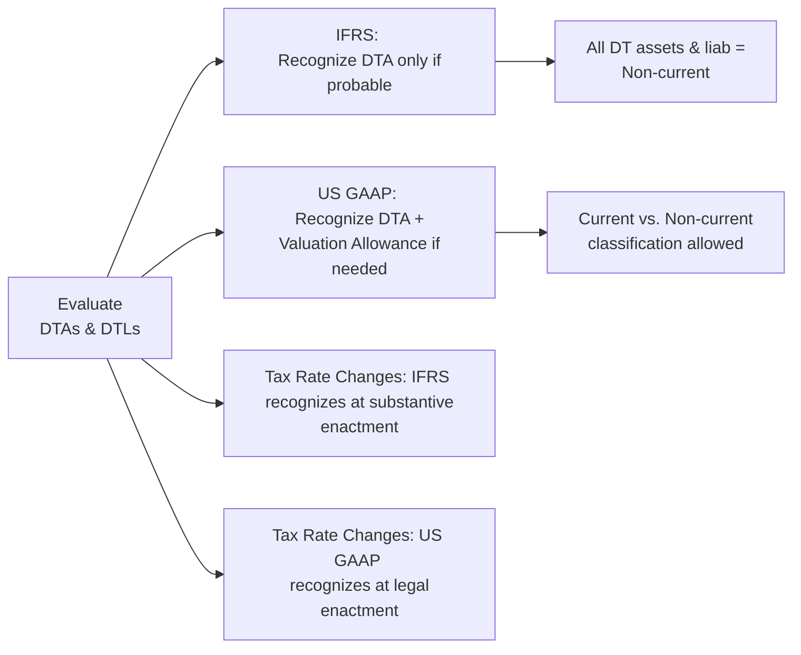

## Introduction

Picture this: you’re working as a junior financial analyst at a company that operates both in the United States and in Europe, and your CFO politely hands you two sets of financial statements—one prepared under IFRS and the other under US GAAP. Now you’re asked to compare the effective tax rates, deferred tax assets, and, oh yeah, those “uncertain tax positions,” and then figure out why the numbers don’t match. You might be thinking: “Wait, taxes are complicated enough—why do we have two different sets of rules?” Well, IFRS and US GAAP share a broadly similar theoretical foundation (the balance sheet approach), but in practice, they can diverge in some surprising ways.

In this section, we’re going to walk through the key differences between IFRS (mainly IAS 12, with guidance from IFRIC 23) and US GAAP (ASC 740) when it comes to income tax accounting. We’ll also talk about how these differences can affect financial statement analysis, how to interpret disclosures, and how you might handle these issues in an exam or real-life scenario. Let’s break it down step by step.

## Foundational Similarities Under IFRS and US GAAP

Before we jump into the differences, let’s remind ourselves of the high-level similarities. Both IFRS and US GAAP adopt a balance sheet–oriented model, comparing an asset or liability’s carrying amount in the accounting records to its tax base. The difference between these two values often creates a “temporary difference,” leading to either a deferred tax asset (DTA) or deferred tax liability (DTL). Both frameworks require recognition of DTAs and DTLs unless a specific exception applies (think certain indefinite-life intangibles, initial recognition exemptions, or other specialized circumstances).

In other words, at their core:

• Both frameworks aim to match the tax effects of events to the periods in which those events are recognized in the financial statements.  
• Both frameworks emphasize the deferred tax approach rather than focusing merely on the current tax payable or receivable.

For many topics (e.g., how to calculate current tax expense), IFRS and US GAAP are practically the same. However, once we get into issues like whether or not a deferred tax asset is going to be realized, classification rules, or how to measure uncertain tax positions, the road can get bumpy.

## Recognition of Deferred Tax Assets

One of the biggest disparities you’ll come across is how IFRS and US GAAP approach the recognition of deferred tax assets:

• Under US GAAP (ASC 740), a deferred tax asset is recognized in full, then a valuation allowance is established if “it is more likely than not” that some or all of the DTA will not be realized. In simpler terms, you start by booking every possible tax benefit, and then you scale it down if you think you can’t use it.  
• Under IFRS (IAS 12), you only recognize a deferred tax asset if it is “probable” that there will be sufficient taxable profit to use the benefit. Although “probable” might seem similar to “more likely than not,” in many practical cases IFRS may be interpreted slightly more conservatively. You often see a bit more caution about booking a DTA in IFRS-based statements.

### Example on Valuation Allowance vs. Direct Recognition

Imagine a start-up with substantial net operating loss (NOL) carryforwards. Under US GAAP, the start-up might record a full DTA for the NOLs, then set up a valuation allowance if it concludes the company probably can’t use, say, 50% of those NOLs in the future. This might show a partial net DTA on the balance sheet.

Under IFRS, that same start-up might not even book the portion of the DTA that it is not confident about realizing in the near future. Instead, IFRS-based financials might report a smaller or no net DTA unless the startup can demonstrate probable future taxable income.

This difference can lead to temporary or even persistent discrepancies in the reported net deferred tax assets. When you’re analyzing cross-border companies, pay special attention to their disclosure about how they decide on the probable portion of these DTAs—because it can drastically change the bottom line.

## Uncertain Tax Positions

Tax laws aren’t always black and white, and companies might interpret ambiguous tax codes in ways that support their strategies. That’s where accounting for uncertain tax positions (UTPs) comes in:

• Under US GAAP, we have ASC 740-10 (often just called “FIN 48” style guidance), which applies a two-step test:  
  1. “Recognition” of a tax benefit only if it is “more likely than not” to be sustained upon examination.  
  2. “Measurement” of the tax benefit based on the largest amount of benefit that is more than 50% likely of being realized upon settlement.  

• Under IFRS, IFRIC 23 provides guidance. IFRS commonly uses either an expected-value approach or a most-likely-outcome approach. While the logic is often similar (not booking overly aggressive tax benefits), the measurement approach can differ slightly from US GAAP. IFRS does not directly use the “more likely than not” threshold for the recognition step, though in practice, many IFRS filers end up with fairly similar results.

### Short Anecdote

I once sat in on a meeting where a multinational CFO described uncertain tax positions in the US entity as “slightly nerve-wracking” under ASC 740 because the tax department had to constantly reassess the more-likely-than-not threshold. Meanwhile, their European subsidiary’s IFRS-based statements took a broader approach using an expected-value model. The CFO joked, “We’re basically telling the same story, but using two different cameras to shoot the scene.”

## Presentation and Classification of Deferred Taxes

Another area that can trip you up is how deferred taxes get presented on the balance sheet:

• Under IFRS, deferred tax assets and liabilities are typically classified as non-current. IFRS doesn’t permit separate classification as current vs. non-current.  
• Under US GAAP, you might see deferred tax amounts broken down into current and non-current components, depending on what the underlying asset or liability is.

This is important for ratio analysis. If you’re used to reading IFRS statements where all deferred taxes are non-current, you might see a different current ratio or working capital figure for a similar firm that applies US GAAP. So, keep your eyes open for these classification details when doing cross-company or cross-border analysis.

## Rate Changes and Revaluation

Changes in tax rates aren’t always a stroll in the park. Governments can enact new laws at various stages in the legislative process. These timing differences can lead to distinct recognition dates under IFRS and US GAAP:

• IFRS (IAS 12) bases recognition of new tax rates on the concept of “substantive enactment” (i.e., the legislature has approved the measure, and the remaining steps are virtually guaranteed).  
• US GAAP uses the date of “enactment.” That means the president/prime minister/governor has actually signed it into law, or it’s otherwise officially on the books for real.

In practice, these different definitions of “enactment” vs. “substantive enactment” can mean that IFRS-based financial statements might reflect a future tax rate a bit earlier than US GAAP statements would. This doesn’t affect the total tax expense long term, but it can shift the period in which that expense flows through, potentially altering year-over-year comparisons or short-term effective tax rates.

## Putting It All Together: A Visual Snapshot

Below is a simple mermaid diagram to summarize some of the main divergences:

While this is, of course, a big oversimplification, it’s a quick cheat sheet for remembering some of the core differences.

## Impact on Financial Statement Analysis

From the analyst’s standpoint, these variations can significantly (and sometimes unpredictably) affect the income statement and balance sheet:

• Valuation of DTAs: A more lenient approach in one framework might mean a higher reported asset figure. Conversely, a stricter approach leads to lower reported assets and possibly higher volatility in future periods if circumstances change.  
• Timing of tax expense: Slight differences in when tax rates or uncertain tax positions are recognized can create short-term noise. If you’re analyzing effective tax rates year-to-year, be mindful that IFRS and US GAAP might record the effect of a legislative change in different quarters or even different fiscal years.  
• Classification effects: IFRS lumps all deferred taxes into the non-current bucket, whereas US GAAP may split these into current and non-current. This can throw off your current ratio or quick ratio analysis if you’re not cautious.  
• Footnote disclosures: IFRS’s approach to uncertain tax positions can appear less formulaic than under US GAAP. As an analyst, you may need to dig deeper into the narrative disclosures in IFRS-based financials to gauge the level of aggressiveness (or conservatism) in the company’s tax positions.

## Harmonization Trend

Over the years, the IFRS Foundation and the FASB have engaged in numerous convergence projects. While we’ve seen some narrowing of differences, there hasn’t been a true unification of IFRS and US GAAP income tax rules. If and when that changes, you’ll certainly see announcements and updates, but for now, these differences remain important for cross-border comparisons and you’ll want to keep them in mind.

## Analytical Approach for Cross-Border Firms

Here are a few pointers on analyzing companies that might report under IFRS vs. US GAAP:

• Read the footnotes carefully. Look for explicit disclosures about the recognition threshold for deferred taxes, the use of valuation allowances, and how uncertain tax positions are measured.  
• Pay attention to differences in classification. When you see that a company’s entire deferred tax balance is non-current, remember that might be IFRS. On the other hand, if you see both current and non-current line items, you’re likely dealing with US GAAP.  
• Ask yourself about the “timing mismatch.” If a government just passed a new corporate tax rate, IFRS statements might show that new rate earlier if “substantive enactment” was achieved before the official legal ratification used by US GAAP.  
• Don’t forget the big performance metrics. Effective tax rate, return on equity, and net profit margins can all be influenced by differences in deferred tax recognition. Adjust if necessary to enable apples-to-apples comparisons.

## Practical Example

Let’s say Company X is dual-listed, providing two separate sets of financial statements—one set prepared under IFRS for its European listing, and another set prepared under US GAAP for its SEC filing in the United States. In the IFRS statements, the annual report notes:

• “Management recognized a deferred tax asset for net operating losses amounting to €50 million in total, consistent with the expectation that the losses will be utilized in the near future.”  
• “No separate line item for valuation allowance appears within the statement.”  

In the US GAAP statements, the same company might show:

• “Net operating losses of $120 million gave rise to an initial deferred tax asset of $25 million. A valuation allowance of $10 million was recorded based on uncertainty of full realization within five years.”  

You see that the net DTA recognized is $15 million under US GAAP but might be €50 million (converted, perhaps $55 million) under IFRS. This difference can confuse an unwary analyst. It’s not that the company is trying to manipulate results; it’s simply applying two sets of rules. One uses a direct recognition approach (IFRS), the other uses a full recognition offset by a valuation allowance (US GAAP).

## Common Pitfalls and Strategies

• Overlooking the threshold differences (“probable” vs. “more likely than not”) when comparing IFRS vs. US GAAP: This can lead to big differences in net DTAs.  
• Confusing classification: If you assume that IFRS splits deferred taxes between current and non-current, you might incorrectly compute working capital.  
• Timing mismatches with legislative changes: Knowing exactly when a new tax law is “substantively enacted” vs. “officially enacted” can be tricky. You might incorrectly forecast next quarter’s effective tax rate if you don’t confirm the correct date.  
• Minimal or incomplete footnote analysis: Relying purely on recognized figures without reading the notes on uncertain tax positions or changes in local tax law can lead to inaccurate conclusions about a firm’s real tax situation.

## Key Takeaways

• Both IFRS and US GAAP share the balance-sheet approach to measuring deferred taxes.  
• IFRS’s “probable” threshold can be slightly stricter than US GAAP’s “more likely than not” approach, especially regarding deferred tax asset recognition.  
• IFRS requires non-current classification for deferred taxes, whereas US GAAP may classify them as current or non-current.  
• Timing of recognition for tax rate changes can vary between the two sets of standards.  
• Read footnotes diligently, especially for uncertain tax positions and valuation allowances, to get a full picture of how taxes might affect your valuation and ratio analysis.

## References and Further Reading

• IFRS.org: IAS 12 (Income Taxes) and IFRIC 23 (Uncertainty over Income Tax Treatments)  
• FASB.org: ASC 740 (Accounting for Income Taxes)  
• PwC. “IFRS and US GAAP: Similarities and Differences — Income Taxes”  
• CFA Institute, 2025 Curriculum, Level 1, Volume 4: Financial Statement Analysis  
• KPMG’s “IFRS compared to US GAAP” for in-depth side-by-side analysis  

-------------------------

## Test Your Knowledge: IFRS vs. US GAAP Differences in Income Tax Accounting



### Which of the following best describes the primary difference between deferred tax asset recognition under US GAAP and IFRS?

- [ ] IFRS requires a valuation allowance if it is “more likely than not” that the asset will not be realized.
- [ ] US GAAP allows recognition of deferred tax assets only if it is “virtually certain” they can be utilized.
- [x] US GAAP requires recognizing the DTA and then reducing it with a valuation allowance if it is “more likely than not” that some or all will not be realized, whereas IFRS only recognizes the DTA to the extent it is “probable” it will be utilized.
- [ ] IFRS mandates immediate expensing of deferred tax assets, while US GAAP capitalizes them.

> **Explanation:** Under ASC 740, DTAs are recognized in full and then offset through a valuation allowance if needed. Under IAS 12, DTAs are recognized only when their realization is considered probable.

---

### When it comes to classification of deferred tax assets and liabilities, which of the following is true?

- [x] IFRS classifies DTAs and DTLs as non-current, whereas US GAAP may classify them as current or non-current.
- [ ] Both IFRS and US GAAP classify DTAs as current and DTLs as non-current.
- [ ] IFRS and US GAAP both specifically prescribe current classification for all DTA/DTLs.
- [ ] IFRS provides more detailed current vs. non-current splits compared to US GAAP.

> **Explanation:** IAS 12 treats all deferred tax items as non-current, while US GAAP can classify them as current or non-current depending on the nature of the underlying items.

---

### A company has uncertain tax positions. Under US GAAP (ASC 740), what is the threshold for recognizing a tax benefit?

- [ ] It must be probable that the tax benefit will be realized.
- [x] It must be “more likely than not” the tax position will be sustained upon examination.
- [ ] It is “virtually certain” that the company will be audited.
- [ ] The threshold is the same as at least 10% chance of success upon examination.

> **Explanation:** ASC 740 uses a “more likely than not” standard (i.e., greater than 50% chance) for recognizing an uncertain tax benefit.

---

### Under IFRS (IFRIC 23), which measurement approach can be utilized for uncertain tax positions?

- [ ] The “two-step” approach found in US GAAP’s FIN 48 framework.
- [x] An expected-value or a most-likely-amount approach.
- [ ] A threshold of “virtually certain” for the entire tax position.
- [ ] A single approach known as the “risk-based method.”

> **Explanation:** IFRS allows either expected-value (probability-weighted) or most-likely-amount approaches, depending on which method better predicts the outcome of the uncertainty.

---

### Which statement regarding changes in tax rates is accurate?

- [x] IFRS recognizes changes when the rate is substantively enacted, while US GAAP recognizes them upon actual enactment.
- [ ] IFRS does not allow for changes in tax rates until the next reporting period.
- [ ] US GAAP recognizes changes in rates only after at least one year of application.
- [ ] IFRS and US GAAP both require immediate recognition once the rate is proposed.

> **Explanation:** IAS 12 prescribes recognition once “substantive enactment” has taken place, whereas ASC 740 requires that the law be fully enacted to recognize the changes in financial statements.

---

### How do differences in deferred tax asset recognition thresholds between IFRS and US GAAP potentially affect net income?

- [ ] Under both frameworks, net income is unaffected because deferred taxes only appear on the balance sheet.
- [x] They can result in varying amounts of deferred tax expense or benefit recognized, thereby shifting net income.
- [ ] There is no difference; both frameworks use the same thresholds, so net income does not vary.
- [ ] IFRS always reports higher net income due to stricter recognition criteria.

> **Explanation:** Different thresholds for recognizing deferred tax assets can lead to different amounts of deferred tax expenses or benefits, which in turn can affect net income reported in each period.

---

### Why might an IFRS-based financial statement reflect a new tax rate before a US GAAP-based statement?

- [ ] IFRS only waits for public announcements, while US GAAP needs private rulings.
- [x] IFRS recognizes the rate upon “substantive enactment,” which can occur earlier than the formal enactment date required by US GAAP.
- [ ] US GAAP has no concept of rate changes and defers them indefinitely.
- [ ] IFRS always anticipates future rate changes and books them upfront.

> **Explanation:** IFRS uses the concept of substantive enactment, which can precede the actual legal passage required by US GAAP, thus leading to earlier recognition of a new tax rate.

---

### Which of the following best describes the treatment of valuation allowances under IFRS?

- [x] IFRS does not typically use a separate valuation allowance account; it only recognizes DTAs if realization is probable.
- [ ] IFRS requires that valuation allowances be shown in the notes but not on the face of the balance sheet.
- [ ] IFRS mandates a valuation allowance if the DTA meets the “more likely than not” threshold.
- [ ] IFRS prohibits the use of valuation allowances entirely, even if no income is expected.

> **Explanation:** Under IAS 12, DTAs are recognized only when probable; thus, there is no separate “valuation allowance” account. If future profits are not probable, the DTA is simply not recognized.

---

### How can an analyst best compare the tax positions of two companies when one follows IFRS and the other follows US GAAP?

- [ ] Convert both sets of statements to local GAAP to ensure lower IFRS compliance costs.
- [ ] Focus only on the income statement and ignore balance sheet footnotes.
- [ ] Assume both sets of statements are the same after adjusting for currency exchange rates.
- [x] Thoroughly review disclosures for valuation allowances, thresholds for DTA recognition, and treatment of uncertain tax positions.

> **Explanation:** When comparing cross-border firms, examining footnote disclosures about DTAs, DTLs, valuation allowances, and uncertain tax positions is critical to achieving an apples-to-apples analysis.

---

### Under IFRS, a deferred tax asset is recognized when it is “probable” that sufficient taxable profits will be available to utilize the tax benefit. True or False?

- [x] True
- [ ] False

> **Explanation:** IAS 12 explicitly states that a deferred tax asset is recognized only if it is “probable” that there will be future taxable profits to absorb the available deductible temporary differences.


