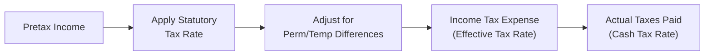

## Introduction

“Wait, how can a company’s ‘tax rate’ be so different from what’s written in the tax code?” That might be your first reaction when you compare a firm’s reported tax numbers to its country’s published tax rate. Don’t worry—you’re not alone in finding this a little puzzling. In fact, companies often show surprisingly low or high tax rates on their financial statements compared to the legally mandated rates. These discrepancies can arise from permanent differences (like tax-exempt income), temporary differences (leading to deferred tax assets/liabilities), or even just the timing of actual cash payments to tax authorities.

In this section, we’ll explore three critical tax measures:  
• Statutory Tax Rate (the official rate imposed by law)  
• Effective Tax Rate (the tax expense reported on the income statement relative to pretax income)  
• Cash Tax Rate (the actual tax paid relative to pretax income, viewed from a cash flow perspective)

We’ll delve into how these rates fit into the broader context of corporate financial statements and how they influence our analysis as financial professionals and CFA candidates. 

## Differentiating the Three Tax Rates

### Statutory Tax Rate

The statutory tax rate is the legally imposed rate in the jurisdiction where a company operates. If you’ve ever looked at a government tax schedule or bracket, that’s essentially the statutory rate you see. For corporations, this might be a flat 21% in one country, 30% in another, or even a progressive rate structure in others. 

Of course, in real life it’s never as simple as just one rate: global firms might operate in multiple countries with different statutory rates. The more diverse the company’s geographic footprint, the more complicated this part gets. One subsidiary might be taxed at 25%, another at, say, 15% in a lower-tax country. Combined, the company ends up with a “blended” or “weighted-average” statutory rate across all operations.

### Effective Tax Rate

The effective tax rate is often described as the ratio of income tax expense (from the income statement) to pretax income. In formula form:


\text{Effective Tax Rate} = \frac{\text{Income Tax Expense}}{\text{Pretax Income}}


This rate can differ significantly from the statutory rate. Why? In short, there are all sorts of permanent differences (such as tax-exempt municipal bond interest) and temporary differences (like accelerated depreciation for tax but straight-line depreciation for financial reporting) that affect the trajectory of how income is taxed.

From an analytical standpoint, the effective tax rate gives us a snapshot of what the firm is actually reporting in its financial statements, based on accounting rules (IAS 12 under IFRS, ASC 740 under US GAAP). It’s the “headline” measure that you see in corporate earnings announcements: “XYZ Corp. reported a 16% effective tax rate, down from 25% a year ago.” When those rates jump around from period to period, that often prompts investors (and analysts) to ask questions—like, “Were there one-time tax credits or losses carried forward from prior years?”

### Cash Tax Rate

If the effective tax rate accounts for expense on the income statement, the cash tax rate focuses squarely on what’s actually flowing out of the company’s bank account. 


\text{Cash Tax Rate} = \frac{\text{Taxes Paid (Cash Outflow)}}{\text{Pretax Income}}


Now, you might wonder: “Shouldn’t the amount the company pays in taxes match what’s on the income statement as an expense?” In an ideal, hypothetical world, yes. But in reality, taxes rarely line up so nicely. Deferred tax liabilities and assets, net operating losses, complex tax planning structures, and timing differences all mean that the tax payment can be drastically different from the expense recognized. 

We’ve all seen cases where a profitable firm barely pays any taxes for years, mainly because of hefty net operating loss carryforwards or other tax deferral strategies. Conversely, sometimes a company pays more in taxes than its current-year expense because of prior-year adjustments or newly expired tax holidays.

## Reconciliation to the Statutory Rate

One of the best places to see all the moving parts of the effective tax rate is in the footnotes. In most financial statements—whether prepared under IFRS or US GAAP—there’s a “rate reconciliation” that walks you from the statutory rate to the effective tax rate. Ever see that little table that starts with the “federal (or main) statutory tax rate” and then has line after line showing how certain credits or differences break the rate up or down? That’s precisely what we’re talking about here.

Common items you might see:  
• R&D tax credits (reducing the effective rate)  
• Foreign rate differentials (maybe you’re paying 20% in one country, 25% in another)  
• Permanent differences (e.g., tax-exempt interest, disallowed expenses)  
• Adjustments for prior-year tax liabilities or uncertain tax positions  

From an analyst’s perspective, it’s super helpful to comb through these footnotes. If you see that something called a “one-time reversal of a deferred tax liability” drastically reduced taxes this period, you’ll know that the lower rate might not last. Or, if you spot repeated R&D credits in the reconciliation, that might indicate a structural advantage that could keep the effective rate low for the foreseeable future.

## Interpretation for Analysis

### Year-to-Year Fluctuations

Here’s a personal anecdote: I remember being surprised when analyzing a tech company that posted a 12% effective rate one quarter, then jumped to 28% the next. I was like, “Wow, that’s quite the roller coaster.” Then I dug into the disclosures and found out the company had booked a large reversal of a deferred tax liability the previous quarter (thus artificially lowering the rate for that single period). Once that effect passed, we saw a reversion to something closer to normal. 

The moral of the story: whenever you see big swings more than a few percentage points, you can almost always expect that something unusual is going on in the background. This is exactly why footnotes and management’s discussion and analysis (MD&A) are so crucial.

### Cash Flow Implications

Now, let’s not forget that investing (and valuing a company) is very much about actual cash flows. If a firm’s effective tax rate is fairly stable at 25%, but you notice they’re paying just 10% in actual taxes (cash basis) for a few years running, well, that’s interesting. It might reflect a huge deferred tax asset or net operating loss from earlier years. It might also indicate some fairly aggressive tax planning that could attract regulatory scrutiny. Either way, as an analyst, keep an eye on whether that “cash advantage” is sustainable or if it’s a short-term benefit that will catch up with them down the road.

### Potential Red Flags

There’s nothing inherently suspicious about a difference among statutory, effective, and cash tax rates. But extreme disparities do deserve a second look. Persistent misalignment between effective and cash tax rates over multiple periods might signal:

• Aggressive tax shelters: The firm creatively decouples reported income from taxable income.  
• Structural tax advantages: Some industries get special tax benefits—like airlines operating in special economic zones or software companies with carefully located IP in low-tax jurisdictions.  
• Improper accounting or incomplete disclosures: This is rarer, but cooking the books does happen.  

CFA exam questions might ask you to interpret these differences and identify potential red flags for an investment thesis.

## Diagram: Flow of Tax Computation

Below is a simplified Mermaid diagram that illustrates how pretax income flows through statutory, effective, and cash tax computations. It’s not a substitute for real-world complexities, but it gives a concise snapshot:

• A represents the accounting pretax income.  
• B calculates taxes simply by applying the main statutory rate.  
• C factors in all the unique permanent and temporary differences.  
• D yields the income tax expense we see on the income statement (effective).  
• E shows the end result of actual taxes paid out (cash tax).  

## Implications for Forecasting

### Selecting the Right Tax Rate

If you’re building a discounted cash flow (DCF) model or forecasting future earnings, you have to decide: do I plug in the statutory, effective, or cash tax rate? The short answer is, “It depends.” If a company has a stable structural reason to keep its tax expense below the statutory rate (for example, it operates heavily in a lower-tax jurisdiction or benefits from ongoing tax credits), then you might use the lower effective rate. But if the company’s advantage is about to expire—say, a special tax holiday is ending—your best bet might be to revert to the statutory rate in your projections.

Furthermore, from a cash-based perspective, if the company has large net operating losses carried forward, you might see minimal actual cash tax payments for a few more years, even if the effective tax rate is “normal.” That’s going to affect your free cash flow forecast, so use the cash tax rate for near-term cash flow analysis while acknowledging the potential shift once those carryforwards run out.

### Volatility and Sensitivity Analysis

I once saw a metals and mining company whose statutory rate was 30%. Their effective rate ran around 20% because of special government incentives. But every couple of years, the incentive needed renewal. If that renewal didn’t come through, their effective rate would jump back to 30%, hammering earnings. So a best practice is to build scenario and sensitivity analyses that assume different future tax regimes—especially if the company’s lower effective rate relies on a single regulation or a friendly local tax policy that may not be permanent.

## International Operations and Blended Rates

Multinational corporations often face a patchwork of statutory rates. Maybe the parent is based in a country with 25% corporate tax, while the subsidiary in another country pays 10%. And if the parent tries to repatriate those subsidiary earnings, there might be additional taxes, or foreign tax credits, or some other intricate cross-border issue. 

So when you see a note that says, “We hold a large portion of our cash offshore,” it might be because bringing that money back home would trigger additional taxes. The effective tax rate that a multinational discloses is thus a product of its various worldwide operations and tax planning choices.

## Practical Examples and Case Studies

### Example 1: R&D Credits and High-Tech Company

Consider TechSolutions Inc., headquartered in a country with a 25% corporate tax rate. They have a big research and development program, earning them a tax credit equal to 10% of their R&D spending. Their effective tax rate might dip down to 18% or so, partly because the R&D expenditures reduce their taxable income, and partly because the credit directly reduces the liability. However, if the government revises or revokes that R&D credit, TechSolutions’ effective rate could shoot up to 25% the next reporting period. Meanwhile, their cash tax rate might be as low as 10%, depending on how quickly they can actually claim the credits or if there are timing differences in recognizing and applying them.

### Example 2: Deferred Tax Assets and Retail Chain

Imagine BestGroceries Corp., which had a couple of unprofitable years resulting in net operating loss (NOL) carryforwards. As they return to profitability, their statutory rate is 30%. Yet, the first couple of profitable years, they use up some of those carryforwards, so they record minimal current tax expense. That means their effective rate can be small, maybe 5%. Meanwhile, the actual cash taxes they pay might be very close to zero because they’re using those NOLs to offset current taxable income. Eventually, the carryforwards will be exhausted, and the statutory/ effective/ cash rates will slowly converge.

## Monitoring, Red Flags, and Best Practices

• Be mindful of changes in laws or tax treaties—especially for companies operating in emerging markets, where tax rates can shift rapidly.  
• Watch for large deferred tax items on the balance sheet. They might be a clue that a significant gap between effective and cash tax rates could persist (or vanish) in the future.  
• Review the footnotes. If the reconciliation shows large permanent items every year in the same direction, that might indicate an ongoing structural preference or avoidance strategy.

## Exam Tips and Pitfalls

For the CFA exam, you might get a question presenting a firm’s statutory rate, plus footnote reconciling items. The question could ask you to calculate the effective rate or to forecast taxes for the next year under certain assumptions. Potential pitfalls:

• Mixing up tax expense and taxes paid. Don’t confuse “cash paid” in the statement of cash flows with the “expense” in the income statement.  
• Not recognizing one-time items. Always check if an item is recurring or just a one-off.  
• Using historical effective rates blindly for future forecasts. If changing regulations or other structural changes are on the horizon, you can’t just assume continuity.

## Additional References

• FASB.org (ASC 740 “Income Taxes”) — Detailed discussion on the computation of effective tax rates under US GAAP.  
• IAS 12 (IFRS.org) — Solid examples on deferred taxes and multi-jurisdiction operations.  
• KPMG “Global Tax Rates and Multinational Tax Guides” — Great resource for exploring statutory rates worldwide.

## Putting It All Together

In a nutshell, the statutory, effective, and cash tax rates offer different perspectives on how a company’s income is taxed. As future financial analysts, we need to interpret these differences with a critical eye. Recognizing whether a favorable rate is truly sustainable or just a timing nuance can be the difference between a solid valuation and a big modeling error.

Let’s conclude with a simple piece of advice: Don’t let a single “tax rate figure” mislead you. Always keep the context—jurisdiction, business specifics, timing, footnotes, and legislative changes—in mind. After all, taxes are rarely straightforward, and that’s part of the excitement in analyzing them.

----------------------------------------------------------------------------------

## Test Your Knowledge: Effective, Statutory, and Cash Tax Rates



### Which of the following best describes the effective tax rate?

- [ ] The tax rate used by the government to collect taxes on corporate profits.  
- [x] The ratio of income tax expense to pretax income, reflecting permanent and temporary differences.  
- [ ] The ratio of total actual taxes paid to total net revenues.  
- [ ] The tax rate determined solely by deferred tax assets and liabilities.  

> **Explanation:** The effective tax rate is calculated by taking the income tax expense from the income statement and dividing it by pretax income, thereby including permanent and temporary book-tax differences.

### A firm has a statutory tax rate of 25%. However, it recognizes a large net deferred tax liability reversal in the current period, causing its effective tax rate to drop to 10%. Which of the following statements is TRUE?

- [ ] The 25% statutory rate no longer applies to this company’s jurisdiction.  
- [x] The effective rate was reduced by the one-time reversal, and it may revert closer to 25% in the future.  
- [ ] The firm will permanently pay a 10% tax rate moving forward.  
- [ ] The 10% rate will always equal the firm’s cash tax rate.  

> **Explanation:** A deferred tax liability reversal affects the effective tax rate in that specific period. It does not necessarily indicate a permanent reduction in the firm’s long-term tax rate.

### Which of the following is most likely a reason why a firm’s cash tax rate might be lower than its effective tax rate?

- [x] The firm is utilizing net operating loss carryforwards.  
- [ ] The firm’s statutory rate is higher than the blended average.  
- [ ] The firm selectively capitalizes expenses.  
- [ ] The firm’s revenue recognition is more aggressive than average.  

> **Explanation:** NOL carryforwards reduce actual taxes paid, potentially making the cash tax rate lower than the expense-based effective rate.

### Under which circumstance might you expect a company’s effective tax rate to align closely with its statutory rate?

- [ ] When the company has significant R&D tax credits.  
- [ ] When the company operates in numerous low-tax jurisdictions.  
- [ ] When the company has large deferred tax assets.  
- [x] When the company has minimal permanent or temporary differences.  

> **Explanation:** If a company has few adjustments—such as permanent or temporary differences—then there is less divergence between the statutory and effective rates.

### Which of the following best illustrates how companies typically reconcile their effective tax rate with the statutory rate in financial statements?

- [ ] They only disclose the final statutory rate in a footnote.  
- [x] They provide a rate reconciliation, listing the statutory rate and key items that raise/lower it.  
- [ ] They summarize changes only if the effective rate differs by more than 10%.  
- [ ] They combine statutory and effective tax rates into a single figure.  

> **Explanation:** Public companies commonly present a rate reconciliation table in their footnotes, explaining how the effective rate compares with the main statutory rate.

### A technology firm has a 30% statutory rate in its home country but reports a 20% effective rate. Which of the following footnote disclosures would most likely explain this difference?

- [ ] Major acquisitions in the prior year.  
- [x] Multiple foreign operations taxed at lower rates.  
- [ ] Inventory write-downs in the current year.  
- [ ] A stock split that diluted earnings per share.  

> **Explanation:** Operating in jurisdictions with lower tax rates often explains why a multinational’s effective tax rate is below the home country’s statutory rate.

### If a company has significant deferred tax liabilities on its balance sheet, which statement about its cash tax rate compared to its effective tax rate is most likely correct?

- [x] The cash tax rate could be lower or higher than the effective rate depending on the timing of the liability settlement.  
- [ ] The cash tax rate is guaranteed to be lower.  
- [ ] The cash tax rate will equal the statutory rate.  
- [ ] The two rates will not differ under IFRS.  

> **Explanation:** Deferred tax liabilities and assets create timing differences that can make the actual cash paid differ from the accrual-based expense in any given year.

### A firm’s statutory rate is 25%. Their effective rate is 10%. Their cash tax rate is 8%. Which of the following factors is most likely contributing to the discrepancy?

- [ ] The firm is capitalizing R&D expenses under IFRS.  
- [ ] The statutory rate changed halfway through the year.  
- [x] The firm carries forward significant tax losses from prior years.  
- [ ] The effective rate includes unrecognized tax benefits.  

> **Explanation:** Net operating loss carryforwards or other structural credits can bring both the effective and cash rate below the statutory rate.

### Which scenario suggests a “permanent difference” rather than a “temporary difference”?

- [x] Tax-exempt municipal bond interest that reduces taxable income.  
- [ ] Accelerated depreciation for tax purposes.  
- [ ] A difference in revenue recognition timing for tax versus accounting.  
- [ ] An NOL carryforward.  

> **Explanation:** Municipal bond interest is permanently excluded from taxable income, whereas accelerated depreciation, revenue recognition timing, and NOLs all create temporary differences.

### A firm’s Form 10-K shows an effective tax rate of 22%, yet it discloses actual taxes paid are 2% of pretax income. Is this discrepancy possible?

- [x] True  
- [ ] False  

> **Explanation:** This often happens due to deferred taxes or credits and carryforwards that minimize the short-term cash outflow even though the income statement reflects a higher expense.



---

**Final Exam Tips**  
• Practice reading footnotes and reconciling the statutory vs. effective rate.  
• Don’t mix up deferred tax items with permanent differences—each has distinct forecasting implications.  
• In scenario questions, always clarify if tax breaks are permanent or if they have an expiration date.  
• Apply sensitivity analysis when a company’s effective rate is heavily reliant on a single jurisdiction’s low tax rate.  

---

**References**  
1. FASB (ASC 740). Detailed guidance on US GAAP accounting for income taxes.  
2. IAS 12, IFRS.org. Discusses accounting treatments for deferred tax assets/liabilities under IFRS.  
3. KPMG “Global Tax Rates” Reports. Comprehensive resource for statutory rates worldwide and cross-border taxation issues.  

---

Remember, the interplay between statutory, effective, and cash tax rates can dramatically shape a firm’s reported earnings and actual cash flows, which in turn influences valuations, risk assessments, and investment decisions. By understanding the nuances of each rate—and by keeping an eye on the disclosures about differences—you’ll be able to capture a more accurate picture of a company’s true tax profile.
