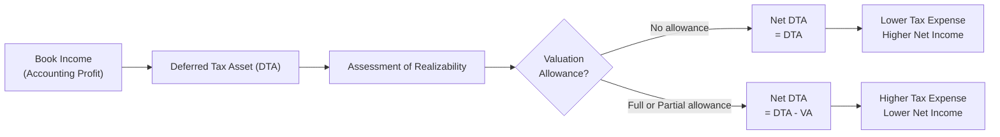

## Introduction
Have you ever stumbled across a footnote in a company’s financial statements referencing a "valuation allowance" on its Deferred Tax Assets (DTAs) and thought, “Wait, what is this really about, and why does it matter?” Yeah, me too. I can still recall my first time seeing a valuation allowance entry while working on a tax engagement. I remember thinking, “This looks like some sort of ‘counterbalance’ to an asset.” Sure enough, that’s essentially what it is. But of course, there’s a bit more nuance involved—especially when we dig into the “more likely than not” threshold and the potential for big swings in reported earnings.

In what follows, we’ll explore the idea behind valuation allowances and why they occupy such an essential place in financial analysis. We’ll talk about how they’re recognized under both IFRS and US GAAP, how they can sway your interpretation of future performance, and a bit about the strategic timing that companies sometimes employ in establishing or reversing them. We’ll also sprinkle in a few real-world scenarios, because sometimes that’s the best way to see how these abstract concepts truly play out in practice.

## Understanding Deferred Tax Assets and the Concept of Valuation Allowances
To make sure we’re on the same page, a Deferred Tax Asset (DTA) is an asset on the balance sheet that represents a future tax benefit. Essentially, think of it as a resource that will reduce taxes payable in later years, typically arising from things like net operating losses (NOLs) that can be carried forward, or from temporary differences where accounting income is recognized earlier (or expenses are recognized later) than tax law dictates.

A “valuation allowance” is the mechanism by which we adjust the value of these DTAs down if we believe there’s a risk we won’t be able to realize the full tax benefit. Both IFRS and US GAAP set a threshold commonly referred to as “more likely than not” (MLTN) (i.e., a greater than 50% chance) that some or all of the DTA will not be realized. Whenever that threshold is triggered, a portion—or all—of the DTA is offset with a valuation allowance.

### A Quick Analogy
If you’re into, say, frequent-flyer miles: Imagine you accumulate an enormous bank of miles that you technically can use for future trips (DTAs). You’re excited, but you also realize that your membership expires if you don’t use these miles within a set time. If you suspect you might not fly enough within that period (i.e., it’s “more likely than not” you won’t fully use them), you might mentally discount (or reduce) the “value” of those miles. In accounting, that’s where your valuation allowance shows up.

## Key Drivers for Recording and Adjusting Valuation Allowances
So, why would you record or adjust a valuation allowance? Let’s explore:

• Insufficient Future Taxable Income: If management expects it won’t generate enough profits going forward, there may not be enough taxable income to absorb the DTA’s benefit.  
• Legal or Regulatory Changes: Shifts in tax rates, laws, or usage limits (like expiration of tax loss carryforwards) can undermine the value of previously recognized DTAs.  
• Changes in Business Strategy: A company might shift its operations to a jurisdiction with different tax rules, or it might sell off unprofitable segments, altering how much net income is realistically expected.  

When it becomes clear that the “benefits” portion of a DTA won’t be realized, an adjustment to the allowance kicks in. That means we see an increase (or decrease) in the valuation allowance account that’s recorded through tax expense, affecting net income.

## Financial Statement Impact
It may sound straightforward at first, but the ripple effects on companies’ reported results can be huge. Here’s why:

• When You Increase a Valuation Allowance: You reduce the net DTA on the balance sheet. At the same time, you increase the company’s income tax expense (on the income statement). This can reduce net income significantly.  
• When You Decrease a Valuation Allowance: This effectively “frees up” more of the DTA to be realized. That means a lower income tax expense, higher net income, and a higher net DTA.  

These changes can swing reported earnings dramatically from period to period. So, if you ever see a company mention big fluctuations in tax expense, the culprit might be an adjustment in the valuation allowance for DTAs.

## Diagram of DTA and Valuation Allowance Flows
Below is a simple Mermaid diagram illustrating the relationship between a Deferred Tax Asset, its Valuation Allowance, and the resulting net effect on tax expense:

In the diagram, you can see how the presence or absence of a valuation allowance directly impacts the net DTA and consequently flows to tax expense and net income.

## Analytical Considerations
Nothing stirs an analyst’s skepticism quite like a big tax adjustment in the footnotes. Some reasons you might perk up when you see a large shift in valuation allowances:

• Management Subjectivity: Deciding on the “more likely than not” threshold for DTA realization can be pretty subjective. If you see a major allowance increase (or decrease), ask: Does it align with management’s public guidance on future profitability? Are they perhaps sandbagging or boosting earnings?  
• Earnings Management Possibilities: A sudden reduction of the valuation allowance can create a one-time windfall in earnings. If a company is trying to show great results—maybe ahead of a stock issuance, acquisition, or a reorganization—this can look suspiciously like earnings management. On the flip side, some companies might use an increased allowance in a “bad” year to lump all the negative hits together, so future periods look better.  
• Concerns About the Future: A big allowance might indicate that management is worried about not generating enough taxable income to use these DTAs. If you see that in the context of negative industry outlooks or repeated operating losses, this can be a strong red flag.  

### Example of a “Contradiction” Scenario
Picture a retail company, SunnyMart, that’s touting big expansion plans and higher future profitability in its earnings call. Meanwhile, the tax footnotes show that they just raised the valuation allowance on their NOL carryforwards, citing “uncertainty of future taxable income.” That’s a pretty clear contradiction. Analysts should question the discrepancy between “We’re bullish on growth” and “We don’t think we’ll be profitable enough to utilize our NOL.” One of these might not be telling the whole story.

## Forecasting and Modeling Implications
If you’re building a forecasting model—especially for equity valuation or credit analysis—watch out for the potential reversal of a valuation allowance:

• Reversals Can Surge Future Earnings: If the economy or a firm’s fundamentals pick up faster than anticipated, companies may reduce valuation allowances. This typically lowers tax expense in that year and can inflate earnings.  
• Non-Recurring Impact: You might want to strip out some or all of that “benefit” in your normalized earnings. Otherwise, you could end up overestimating the firm’s true ongoing profitability.  

## Disclosure Requirements (IFRS and US GAAP)
Under IFRS (IAS 12) and US GAAP (ASC 740), companies must disclose:

• Reasons for setting up or reversing valuation allowances, including the basis for believing that DTAs are (or aren’t) recoverable.  
• The types of temporary differences or carryforwards generating the DTA.  
• Expiration dates for any tax-loss carryforwards.  

Sometimes, these disclosures are buried in a footnote. In my experience, reading those footnotes carefully can feel like rummaging through an attic—you find the most interesting pieces of the story hidden there.

## Strategic Use of Allowances
Even though frameworks require companies to maintain a consistent approach, the timing of establishing or reversing allowances can be somewhat strategic. Some examples:

• Mergers and Acquisitions: Companies may adjust valuation allowances just before or after an acquisition to present a more appealing earnings trajectory.  
• Corporate Restructurings: Large restructuring charges might coincide with changes to the valuation allowance.  
• Partial vs. Full Allowances: Management might opt for a partial allowance rather than a full one, which could indicate they’re hedging their bets on partial utilization of future tax benefits.  

### Case in Point
A mid-size manufacturing firm, let’s call it BoltTek, had posted steady losses for several quarters. Analysts predicted the company would need a large valuation allowance for its growing tax assets. But surprisingly, in its final quarter, right before acquiring a strategic competitor, BoltTek reversed a portion of its previously recognized allowance. The reason? They predicted synergy-driven profits and better capacity utilization. Did those synergies actually materialize? The next few quarters told a mixed story, suggesting a bit of “optimism” in the timing of that reversal.

## Best Practices and Common Pitfalls
• Keep Digging: Don’t take management’s word at face value. Track the company’s historical recognition and reversal decisions to see if there’s a pattern.  
• Consistency with Other Forecasts: Compare the outlook in MD&A or conference calls to the assumptions behind the valuation allowance. Big disconnects can signal potential motivation to manipulate earnings.  
• Be Aware of Recurring vs. Non-Recurring: Large valuation allowances or reversals are typically one-off events. If you’re assessing long-term profitability, it often pays to adjust for these.  

## Practical Illustration
Let’s illustrate how a valuation allowance might affect a company’s earnings with a simplified numeric example:

Suppose Company X has a DTA of $10 million stemming from NOLs. At year-end, management performs its “more likely than not” analysis:

• They estimate they can only utilize $7 million of the NOL because the remaining $3 million might expire unused.  
• Consequently, they record a $3 million valuation allowance.  
• This $3 million allowance reduces the net DTA to $7 million on the balance sheet and increases the company’s income tax expense by $3 million on the income statement.  

If in the following year the firm’s fortunes improve and they realize that actually all $10 million can be utilized, they remove the $3 million valuation allowance. That effectively reduces tax expense by $3 million in that year—even though there’s no direct operational change to the business’s real performance (i.e., the improvement might have happened over time, but the full reversal hits that specific reporting period).

## Conclusion and Exam Tips
Valuation allowances for deferred tax assets can be a powerful lever that significantly shifts reported earnings, net assets, and even managerial incentives. It’s a part of financial analysis that requires careful reading of footnotes, a healthy amount of skepticism, and a willingness to comb through management’s forward-looking statements.

When you’re tackling exam questions—or real-world analysis—keep these points in mind:
• Thoroughly evaluate the rationale behind creating or reversing a valuation allowance.  
• Cross-check the company’s tax disclosures with forward-looking statements.  
• Consider whether the resulting boost or drag on earnings is transitory.  
• Keep an eye out for “timely” or “strategically convenient” changes in allowances during major corporate events.

At the end of the day, whether you’re a budding analyst or a seasoned finance professional, remember that the plain old footnotes sometimes reveal the coolest insights into what’s really happening.

## References and Further Reading
- Grant Thornton. “Valuation Allowances on Deferred Tax Assets: Practical Considerations.”  
- IFRS Foundation. “IAS 12 Income Taxes” and related implementation guidance.  
- FASB Accounting Standards Codification (ASC) 740: “Income Taxes.”  
- Deloitte. “Interpretations of Valuation Allowances for Deferred Tax Assets Under US GAAP.”  

Their detailed discussions and practical guides can give you that extra nuance if you feel like diving deeper into all the complexities of tax accounting.

---

## Strengthen Your Understanding: Valuation Allowances Quiz



### Which of the following statements best describes a valuation allowance for deferred tax assets?
- [ ] It is an additional liability to reflect unpaid taxes. 
- [ ] It represents cash set aside for future tax payments. 
- [x] It is a contra-asset account reducing the carrying value of a DTA. 
- [ ] It is a special reserve for uncertain tax positions.

> **Explanation:** A valuation allowance effectively “nets” against the deferred tax asset to reflect the portion that is more likely than not to remain unused.

### A company determines it may only utilize half its deferred tax assets due to reduced profit forecasts. Which of the following is correct?
- [x] The company records a valuation allowance, increasing income tax expense in that period. 
- [ ] The company recognizes a deferred tax liability to offset half of its DTA. 
- [ ] The company reduces the tax rate used for calculating the DTA. 
- [ ] No adjustment is required until the DTA actually expires.

> **Explanation:** When a firm assesses that it cannot use part of its DTA, it must record a valuation allowance on that portion, thus increasing tax expense right away.

### What is the IFRS/US GAAP common threshold for deciding if a valuation allowance is necessary?
- [ ] Highly probable. 
- [x] More likely than not. 
- [ ] Definitely realizable. 
- [ ] Remote possibility.

> **Explanation:** Both IFRS and US GAAP specify a “more likely than not” threshold (>50%) for deciding whether a valuation allowance is needed.

### How does an increase in a valuation allowance affect the income statement?
- [x] It raises income tax expense in the current period. 
- [ ] It lowers taxable income in the next period. 
- [ ] It increases net DTA and net income. 
- [ ] It has no effect on tax expense.

> **Explanation:** Raising a valuation allowance reduces the net DTA, which in turn increases current tax expense and lowers net income for that period.

### Which scenario may indicate potential earnings management involving valuation allowances?
- [x] A firm announces extremely optimistic growth projections but simultaneously increases its valuation allowance significantly. 
- [ ] A firm revises its tax footnote disclosure in line with new IFRS guidance. 
- [x] A firm reverses a large allowance just before a planned equity offering. 
- [ ] An underestimation of uncertain tax positions.

> **Explanation:** Contradictory signals (optimism vs. higher allowance) or conveniently timed reversals may suggest the firm is managing reported earnings for strategic reasons.

### In forecasting a firm’s performance, how should an analyst best treat a sudden reversal of a valuation allowance that boosts reported earnings?
- [ ] Always ignore the reversal in future earnings projections. 
- [x] Adjust or normalize earnings to avoid overstating sustainable profitability. 
- [ ] Treat it as a permanent increase in the firm’s operating cash flows. 
- [ ] Assume the firm will reverse its DTA again in future periods.

> **Explanation:** A reversal can inflate earnings in a single period but doesn’t necessarily reflect ongoing operational performance, so analysts often make adjustments to avoid overstating profitability going forward.

### Where in the financial statements would you typically find detailed explanations for changes in the valuation allowance?
- [ ] Only on the face of the balance sheet. 
- [x] In the footnotes or notes to the financial statements (usually under income tax disclosures). 
- [ ] In the auditor’s opinion. 
- [ ] In the statement of changes in equity.

> **Explanation:** Companies usually disclose detailed reasons for changes in their tax footnotes, including adjustments to valuation allowances, as required by IFRS or US GAAP.

### A firm with a history of losses claims it will generate sufficient taxable income to utilize its entire DTA in the next two years, yet maintains a full valuation allowance. What might this suggest to an analyst?
- [x] There is a disconnect between management’s profitability claim and its tax accounting assumptions. 
- [ ] The historical losses prove the firm’s DTA is worthless, so the allowance is correct. 
- [ ] The firm is violating IFRS and deserves a financial restatement. 
- [ ] No major concerns; the tax footnote must reflect a stricter set of rules.

> **Explanation:** The discrepancy between optimistic public statements and a full valuation allowance could signal inconsistencies or potential manipulation in earnings reporting.

### When might a valuation allowance be partially reduced rather than fully reversed?
- [x] When management expects only part of the DTA to be utilized. 
- [ ] When management wants to save some of the tax benefits for later use. 
- [ ] When interest rates are rising. 
- [ ] When the firm transitions from IFRS to US GAAP.

> **Explanation:** If forecasts suggest that only a portion of the DTA is realizable, management may reduce the valuation allowance to match that partial realizability, rather than remove it entirely.

### Under IFRS and US GAAP, a DTA is recognized if it is “more likely than not” that the associated tax benefit will be realized. True or False?
- [x] True
- [ ] False

> **Explanation:** Both IFRS (IAS 12) and US GAAP (ASC 740) follow the “probability” guidance for realizing a DTA. If it’s “more likely than not” to be used, then recognizing a DTA is justified, potentially reduced by a valuation allowance.


