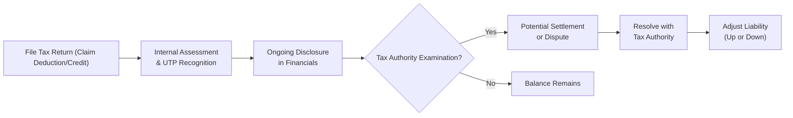

## Background and Overview

Uncertain tax positions (UTPs) come into play when there’s a bit of, let’s call it, “creative tension” between a company’s tax reporting choices and the tax authority’s interpretation of the law. Maybe the company took a deduction that’s perfectly logical in their eyes—but is it “more likely than not” the tax authority will agree? Or maybe there’s a fresh new tax credit regulation that management believes applies to its operations but is still in that gray area. Whenever the outcome can’t be pinned down with certainty, an uncertain tax position arises.

Under US GAAP, the foundational guidance sits in ASC 740 (formerly FIN 48). Meanwhile, IFRS practitioners look to IFRIC 23 for direction. Both frameworks serve the same big purpose: ensure that businesses accurately reflect the liabilities (or reductions in tax assets) if the tax authority ultimately says “Nope, you owe more than you claimed.” If the company expects to pay the tax authority additional amounts, it must recognize those uncertainties as liabilities in the financial statements.

This topic is not just accounting minutiae. For an analyst, it can shape your assessment of a firm’s earnings quality, liquidity, and even management’s tolerance for risk. And from an exam perspective—especially at the advanced level—you’ll see how uncertain tax positions can shift a firm’s overall risk profile. Let’s dig in.

## Recognition and Measurement

Under US GAAP, a company must first decide if it’s “more likely than not” that a particular tax treatment would crack under potential scrutiny. If the firm can’t meet this threshold, the position fails recognition and so must be booked as a liability (or an adjustment to a deferred tax asset, DTA).

If you think about it from a personal standpoint: imagine you’re filing your own taxes, and you’re uncertain if you can claim a brand-new home office deduction. If you suspect the tax authority won’t allow it, you’d better be prepared for the possibility of paying extra tax later. Companies go through a similar thought process, just with a thousand more zeros attached.

Once recognized, the second question is “How big is that liability?” Under ASC 740, the liability is measured as the largest amount of tax benefit that is more likely than not to be sustained upon examination by the tax authorities. IFRIC 23, on the IFRS side, uses either the “most likely amount” or the “expected value” method to measure uncertain tax positions, with the choice typically reflecting which approach better predicts the potential outcome.

### A Simple Python Example

Below is a playful snippet to illustrate the conceptual logic behind uncertain tax positions. It’s definitely not the definitive approach for real-life GAAP or IFRS accounting (so do not rely on this code for your actual tax computations!).

```python
def uncertain_tax_reserve(is_more_likely_than_not, potential_exposure):
    # If position isn't more-likely-than-not, then record the liability
    if not is_more_likely_than_not:
        return potential_exposure
    else:
        return 0.0

positions = [
    (True, 10000),
    (False, 50000),
    (True, 15000)
]

total_liability = sum([
    uncertain_tax_reserve(pos[0], pos[1]) for pos in positions
])
print("Total uncertain tax liability:", total_liability)
```

In this toy scenario, only the “False” entries (not meeting the recognition threshold) generate an accrual. That ends up being an additional hypothetical liability of 50,000. Simple, yes—but it captures the essence of how uncertain tax positions might be recognized.

## Impact on Financial Statements

When a firm records an uncertain tax position, it typically increases its income tax expense in the period of recognition (reducing net income) and sets up a corresponding liability on its balance sheet (or a reduction in any deferred tax asset). This is one of those behind-the-scenes aspects analysts should zero in on, because:

• The footnotes can reveal the nature of these uncertain positions, the potential range of outcomes, and any new developments from ongoing audits.  
• The presence of large or growing UTP balances may signal aggressive tax strategies.  
• Sudden declines in uncertain tax positions might mean either a resolution in favor of the filer or a shift in how the firm classifies them.

Below is a simple diagram representing the flow from an uncertain tax position to its effect on the financial statements:


## Analysis Considerations

When you visit the footnotes of a company’s annual filings, you’ll often spot a section detailing “Uncertain Tax Positions.” There, management might provide subtle clues about risk levels. The nature of the uncertain positions—like cross-border transfer pricing strategies, local tax credits, or legal entity structuring—affects how you, as an analyst, interpret future exposures.

• If the amounts are significant relative to total tax expense, that can signal the firm’s tax strategy is fairly aggressive.  
• Large changes in uncertain tax positions from year to year might imply evolving business strategies or new regulatory scrutiny.  
• Any big lumps of uncertain tax positions can weigh on future liquidity. If the tax authority disallows the position, the firm might have to fork over a big chunk of cash plus possible penalties.

It’s a bit like seeing a small crack in a dam: maybe it won’t ever burst—but if it does, watch out. We want to know if these cracks (uncertain positions) are growing, stable, or being patched up.

## International Complexities

Things get more tangled once you cross borders. At an international level, you have to consider:

• Different tax regimes: Some countries might have stricter “substance over form” rules.  
• Enforcement intensity: A perceived low risk of detection can be overshadowed by a more rigorous tax authority that’s on the hunt for potential revenue.  
• Inter-country treaties: Double taxation treaties can reduce the risk or the total uncertain portion if a position is recognized in one country but not in another.

For instance, I recall a client who operated across five jurisdictions. They felt certain about a particular R&D tax credit in two countries but only “somewhat confident” in the others—resulting in partial accruals under IFRIC 23 for those latter positions. The complexity is real, and as an analyst, you want to see how thoroughly management discloses these multi-country concerns in their notes.

## Disclosure Level

Companies must typically provide a tabular reconciliation of UTPs, beginning with the opening balance and then detailing additions, reductions, and settlements during the period. This can be quite revealing, though some details remain carefully veiled for competitive or legal reasons. Analysts should pay attention to:

• The footnote describing uncertain tax positions and how the company concluded its recognition threshold was met or not met.  
• The effect of new legislation or changing interpretations by local tax authorities.  
• The potential unrecognized tax benefits that could reduce the liability if positions are resolved favorably—but do not forget the reversed scenario (e.g., an unfavorable resolution leading to increased liabilities).

In short, while the disclosures are typically helpful, they’re rarely crystal clear. The “why” behind the numbers can remain fuzzy, but you can glean valuable insights by comparing last year’s uncertain tax positions to this year’s changes.

## Risk Management Approaches

Firms sometimes purchase specialized insurance to mitigate the financial impact of an adverse tax authority ruling. They might also structure certain transactions more conservatively if they foresee an especially big “haircut” on a borderline deduction. In some cases, a preemptive settlement negotiation with the tax authority can help both parties reach a compromise.

Analysts should keep an eye on these risk management strategies. A company’s willingness to buy insurance indicates the recognized possibility of losing a case. Also, if a firm consistently invests in well-known, high-priced tax counsel, it might be a sign that it’s pushing the boundaries on major tax positions. 

## Common Pitfalls and Challenges

• Overlooking the Impact on Liquidity: Even if the uncertain tax position is recognized, an analyst might underestimate how soon that liability could come due. Keep an eye on maturity schedules or probable settlement timelines.  
• Simplistic Ratio Analysis: Ratios like the effective tax rate can be misleading when large uncertain tax positions are lurking in the footnotes. If the firm’s recognized expense is artificially low but they have massive unresolved exposures, the “true” cost could be much higher.  
• Global Coordination Complexity: Transfer pricing disputes can drag on for years and might involve multiple jurisdictions. Don’t assume a single line item in the footnote fully captures the litigation risk.  
• Reliance on Past Resolutions: Sometimes, a firm has historically prevailed in tax disputes, but that doesn’t guarantee future success if the laws or enforcement priorities have shifted.

## Exam Relevance and Tips

For those preparing for a CFA exam, keep in mind that uncertain tax positions can appear as part of a broader question on tax liabilities or footnote disclosures. You might see a scenario describing a multinational firm’s tax situation with partial recognition of certain positions. Key exam strategies:

• Understand the difference in thresholds: “More likely than not” under ASC 740 vs. “most likely amount” or “expected value” approach under IFRIC 23.  
• Be prepared for ratio analysis questions. For instance, “How does an uncertain tax position affect the company’s effective tax rate and liquidity metrics?”  
• Know how changes in uncertain tax positions from one period to another might signal changing business (or management) strategies.  
• When you see the phrase “big difference between the firm’s statutory tax rate and effective tax rate,” it’s often a hint to check for large tax credits or uncertain positions.

You want to stay mindful of the examiner’s perspective: they love to test conceptual understanding—especially whether you can identify how an uncertain tax position might distort typical measures of performance and risk.

## Putting It All Together

Ultimately, uncertain tax positions are more than a footnote item; they can be a barometer of how far management is willing to stretch the boundary of legal interpretation. Are they playing it safe or adopting a frontier approach? As an analyst, your job is to assess whether these positions present a structural risk and whether the firm has appropriate measures in place to deal with them if the tide turns. Keep one eye on the liability as recognized and the other on the hush-hush details that might be swirling beneath the surface.

And remember: just like your personal taxes, if it seems too good to be true, it usually is (at least in the eyes of the taxman). 

## Diagram of Typical UTP Lifecycle

Below is a short depiction of a standard uncertain tax position lifecycle—starting from booking a potential deduction or credit to finally settling (or litigating) with the tax authority:



## Final Exam Tips

• For item sets involving financial footnotes, scrutinize the key changes in uncertain tax positions. A quick tie-back to the statement of cash flows can reveal if actual cash payments are imminent.  
• For constructed responses, be prepared to outline how to apply the “more likely than not” standard in a hypothetical scenario.  
• Practice scenario-based questions where you interpret unusual changes in a firm’s effective tax rate. A big drop might be due to new uncertain tax positions or the resolution of old ones.  
• Don’t forget IFRIC 23 for IFRS-based questions. Understand the difference between “expected value” and “most likely amount” measurement approaches.  

## References and Further Reading

• FASB (Financial Accounting Standards Board). ASC 740: “Accounting for Income Taxes,” and its interpretation for uncertain tax positions.  
• IFRS Foundation. IFRIC 23: “Uncertainty over Income Tax Treatments.”  
• KPMG. “Uncertain Tax Positions: Audit Trends and Disclosures”—a detailed look at real-world negotiation and settlement.  
• Official CFA Curriculum – Level 1, Financial Reporting and Analysis Readings on accounting for income taxes.

--------------------------------------------------------------------------------

## Test Your Knowledge: Uncertain Tax Positions Quiz



### Under US GAAP, when must a company recognize a liability for an uncertain tax position?
- [x] When it is less than “more likely than not” that the position will be sustained.
- [ ] When settlement negotiations with a tax authority have already started.
- [ ] Only if the company has a history of losing tax cases.
- [ ] Only if the position exceeds 5% of total tax expense.

> **Explanation:** Under ASC 740, a firm must recognize a liability for any tax position that fails the “more likely than not” criterion.

### Which of the following statements best describes how IFRIC 23 addresses the measurement of uncertain tax positions?
- [x] IFRIC 23 permits measurement using either the most likely amount or the expected value method.
- [ ] IFRIC 23 requires all uncertain tax positions to be measured at the smallest possible liability amount.
- [ ] IFRIC 23 only applies to current tax liabilities, not deferred tax assets.
- [ ] IFRIC 23 mandates that uncertain tax positions be disclosed in the balance sheet but not the income statement.

> **Explanation:** IFRIC 23 provides two measurement methods, allowing management to select the approach best reflecting the probable outcome.

### A firm discloses a sharp increase in its uncertain tax positions this year. Which of the following could be a valid explanation?
- [ ] The firm won a favorable ruling from a tax authority on a previously uncertain deduction.
- [x] The firm adopted an aggressive new transfer pricing strategy that may be challenged.
- [ ] The local statutory tax rate increased by 5%.
- [ ] The firm reduced its treasury stock to adapt to an equity market downturn.

> **Explanation:** A rapid increase in uncertain tax positions often signals new or more aggressive tax exposures.

### From an analyst’s point of view, which of the following might be a red flag in evaluating uncertain tax positions?
- [ ] The UTP footnote remains unchanged year over year.
- [ ] A significant portion of UTP is resolved favorably for the firm.
- [x] The firm’s UTP liability significantly exceeds prior disclosures without further explanation.
- [ ] The firm’s statutory tax rate is higher than its effective tax rate.

> **Explanation:** A substantial jump in UTP liabilities, especially if unexplained, raises questions about undisclosed risks or newly identified exposures.

### Why might a company purchase tax insurance related to uncertain tax positions?
- [x] To mitigate potential financial losses if the tax authority disallows the position.
- [ ] To reduce the statutory tax rate in its primary operating country.
- [ ] To fully avoid all disclosures in the footnotes.
- [ ] To automatically defer settlement for up to five years.

> **Explanation:** Tax insurance can offset the financial impact if the tax position is overturned upon examination.

### Under the “more likely than not” threshold in ASC 740, what is the approximate probability that needs to be met?
- [x] Greater than 50%.
- [ ] Approximately 25%.
- [ ] Approximately 75%.
- [ ] Exactly 100%.

> **Explanation:** “More likely than not” translates to a probability threshold exceeding 50%.

### Which measurement approach does IFRIC 23 allow when it comes to quantifying uncertain tax positions?
- [x] Most likely outcome or expected value, depending on which approach reliably predicts the final settlement.
- [ ] Minimizing tax expense using the least likely amount.
- [x] Fixed 50% weighting across all identified exposures.
- [ ] Whichever method results in the largest recognized liability.

> **Explanation:** IFRIC 23 endorses two viable measurement methods: the single most likely outcome or a probability-weighted expected value.

### A company decreased its liability for uncertain tax positions from \$1 million to \$0.2 million in the current period. Which scenario would best explain this change?
- [x] The tax authority concluded its audit and the company’s position was largely sustained.
- [ ] The statutory corporate tax rate increased from 20% to 25%.
- [ ] Management identified a new uncertain tax position abroad.
- [ ] The firm’s sales volume declined, lowering overall income.

> **Explanation:** A major decrease in the recognized liability often reflects a favorable resolution of tax uncertainties.

### How might large uncertain tax positions affect a firm’s future liquidity?
- [x] Potential settlement payments can cause sizable cash outflows.
- [ ] They do not affect liquidity unless they are tied to interest-bearing debt.
- [ ] They reduce the carrying value of receivables but have no cash flow impact.
- [ ] They immediately reduce operating cash flow even if the liability is only estimated.

> **Explanation:** If the tax authority ultimately disallows the position, the firm may need to pay additional tax obligations, draining cash.

### True or False: A company may avoid recognizing any liability for uncertain tax positions if it believes the chance of a tax authority audit is minimal.
- [x] True
- [ ] False

> **Explanation:** Under certain interpretations, if it is “more likely than not” that the tax authority will accept the position (including the probability of detection and acceptance), the company might not record a liability. However, auditors and regulators typically expect robust, well-substantiated support for such assumptions.


