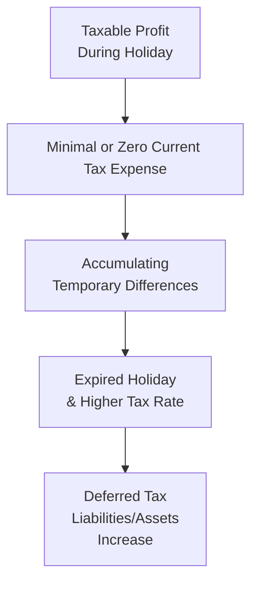

## Introduction
Sometimes governments provide a temporary break from corporate income taxes to incentivize investment. At first glance, having little or no tax bill might seem like a dream come true for a company. But beneath the surface, these so-called “tax holidays” can add real complexity to financial statement analysis, particularly when you’re trying to measure deferred taxes accurately. Believe me, I once worked with a client in the logistics sector whose entire five-year plan hinged on maintaining a particular tax holiday status. The day the holiday expired, they found themselves facing a massive jump in their effective tax rate. That scenario hammered home the importance of projecting and understanding deferred tax implications.

## Definition and Purpose of Tax Holidays
A tax holiday is a government incentive that reduces or eliminates a company’s tax obligations for a specified period. Typically, you’ll see these holidays used to attract or retain businesses in certain regions or industries—think of a new manufacturing plant in an underdeveloped area, or a tech startup zone designed to improve digital infrastructure. During the holiday window, companies might pay zero or significantly reduced taxes, which can strengthen cash flow during a capital-intensive startup phase.

But there’s a flip side. Tax holidays are rarely permanent; eventually, the standard statutory rate returns. This shift from low or no tax to a substantially higher tax rate can cause a sudden remeasurement of deferred tax liabilities (DTLs) or deferred tax assets (DTAs). Understanding those transitions is crucial for both short-term performance assessment and long-term valuation.

## Types of Tax Holidays
Although “tax holiday” is a catch-all term, it’s not one-size-fits-all. Different jurisdictions tailor holiday programs to meet specific policy goals:

• Complete Exemption: A set number of years where a company has a 0% income tax rate.  
• Reduced Rate: Income taxed at a special discounted rate (e.g., 5% instead of 20%).  
• Industry-Specific Incentives: Special deals for industries deemed essential to economic development, such as technology, healthcare, or renewable energy.  

These different structures naturally lead to different accounting implications—especially once you start grappling with deferred taxes under IFRS (IAS 12) or US GAAP (ASC 740).

Below is a quick comparison of how various tax holiday types might shape deferred tax impacts:

| Type of Tax Holiday   | Example                                     | Deferred Tax Impact                                                               |
|-----------------------|---------------------------------------------|----------------------------------------------------------------------------------|
| Complete Exemption    | 5-year total tax break in an industrial zone| Current tax is nearly zero, but once normal rates resume, large DTLs may arise   |
| Reduced Rate          | 5% corporate tax vs. prevailing 20%         | Lower current tax, moderate potential for DTL buildup if timing differences exist|
| Industry-Specific     | 3-year partial exemption for technology firms| Depending on how the law is written, indefinite or partial holiday arrangements   |

## Deferred Tax Implications
From an accounting perspective, the main challenge with tax holidays is identifying and quantifying timing differences that arise under a holiday regime. Whether you use IFRS or US GAAP, you’ll typically see a mismatch between the financial reporting basis of assets (for example, intangible assets or property) and their tax basis. Under a normal tax regime, those mismatches (or timing differences) give rise to deferred tax items.

During a holiday, the statutory tax rate might be zero or near-zero, so the company’s immediate current tax might register at or close to zero. However, the underlying basis differences in assets or liabilities don’t magically vanish. They simply accumulate awaiting the day the holiday ends. Then, all at once, any unrecognized difference may produce significant DTLs (or DTAs) as the tax rate reverts to its standard higher level.

### Remeasurement Trigger
Sometimes, legislation extends or shortens a holiday. For instance, imagine a government that initially grants a 10-year break but then decides to cut it to five years. That abrupt shift can trigger a remeasurement of existing deferred tax balances, because the expected future tax rate changes. Similarly, if a holiday is unexpectedly renewed, you might see a situation where previously recognized DTLs or DTAs need to be derecognized or remeasured downward.

### Diagram: Timeline of a Tax Holiday’s Effect on Deferred Taxes

This illustration shows how a company’s short-term actual tax might be near zero, but the “clock” on temporary differences keeps ticking. Upon expiration, the differences must be recognized at the newly applicable rate.

## Analysis Impact
For financial analysts, projecting the end date (or extension) of a tax holiday is a key step in forecasting the company’s effective tax rate and future cash flows. That big jump in taxes can drastically alter net income trends and might even affect compliance with debt covenants.

• Post-Holiday Effective Tax Rate: If a company’s main operations move from a 0% environment to a 25% environment, that’s a shock to net earnings.  
• Potential Overreliance on Tax Haven Arrangements: If the company has aggressively shifted profits into the holiday jurisdiction, emerging changes in international tax law or local politics could reshape those benefits.  
• Partial Disclosures and Stress Tests: Occasionally, management relies on indefinite renewal assumptions absent firm legislative backing. As an analyst, you want to challenge those assumptions, perhaps using scenario or stress testing to see the financial impact if the holiday ends on time.

## Financial Modeling Considerations
When building multi-year forecasts, incorporate key holiday expiration dates or possible legislative changes:

• Gradual Phase-In vs. Cliff Effect: Some governments phase in the normal tax rate (e.g., 0% for first three years, 10% for the next two, then 25% thereafter). Model each step carefully to avoid surprises.  
• Expansion and Reinvestment Requirements: Many holidays come with strings attached—like maintaining a certain headcount or investing in local infrastructure. Breaking those covenants could trigger immediate holiday revocation and a nasty spike in your effective tax rate forecasts.  
• Transfer Pricing Strategies: Intercompany pricing could shift more income to the holiday jurisdiction. Validate that the company’s approach remains robust under scrutiny, as forced changes can accelerate outside-of-holiday taxation buildup.

Think about how you handle the deferred tax line item in the financial model. Often, you’ll want at least a simple schedule that shows the opening balance, the remeasurement effect at holiday expiration, and the resulting DTA/DTL closing balance.

## Risk Factors
Tax holidays can be powerful tools, but they also come with risk:

• Political Uncertainty: Holidays can be revoked or not renewed if a new government decides it’s no longer beneficial.  
• Legacy Liabilities: Once the holiday ends, a large portion of net income quickly becomes subject to standard rates, generating a bigger tax bill or bigger deferred tax remeasurements.  
• International Tax Reform: With global pressure against “stateless income,” some multinational tax holiday arrangements face heightened scrutiny from regulators.  

Don’t be surprised if rating agencies or equity analysts heavily discount the “extra” profit stemming from a holiday once they factor in the volatility inherent in these breaks.

## Glossary
• Tax Haven: A jurisdiction with very low or zero tax rates, sometimes used by companies to optimize their global tax footprint.  
• Reinvestment Period: The time frame during which the firm must meet local investment or hiring targets to maintain holiday benefits.  
• Rate Remeasurement: Adjusting deferred tax assets or liabilities to reflect a new statutory tax rate.  
• Sunset Clause: A legal stipulation that certain benefits expire on a specific date unless renewed.  
• Transfer Pricing Arrangements: Intercompany pricing strategies that can shift income to lower-tax jurisdictions.

## Conclusion
Tax holidays can be game-changers in terms of short-term tax savings, but they come with a fair amount of concurrency risk and complexity—especially once you factor in the remeasurement of deferred taxes. As a financial analyst, always dig deeper than the “headline” nominal rate. Exercise caution when modeling the end of a holiday period, and be mindful of any changes in legislation or political dynamics that could drastically shift a company’s tax posture. Remember, the real mark of skilled analysis is not just capturing the current benefits but also anticipating how changing rates will affect net income, cash flow, and overall valuation.

## References and Further Reading
- OECD. “Tax Policy Analysis on Special Economic Zones and Holidays.”  
- World Bank. “Investment Incentives and the Use of Tax Holidays.”  
- EY. “Global Tax Guide: Holiday Incentives and Compliance.”  
- CFA Institute. “Financial Statement Analysis,” current curriculum on deferred tax considerations.  
- IAS 12 and ASC 740 for International Financial Reporting Standards (IFRS) and US Generally Accepted Accounting Principles (GAAP) guidance on income taxes.

## Test Your Knowledge: Impact of Tax Holidays on Deferred Taxes



### Which of the following best describes a rationale for granting tax holidays?
- [x] Attracting businesses to stimulate regional development
- [ ] Increasing government revenue in the short term
- [ ] Simplifying the corporate tax system
- [ ] Eliminating the need for transfer pricing
> **Explanation:** Tax holidays are often introduced to stimulate specific industries or geographic regions, not to simplify taxes or produce quick government revenue gains.

### When a tax holiday ends and the statutory rate increases, what is a likely impact on deferred tax items?
- [ ] Deferred tax liabilities disappear entirely.
- [x] Deferred tax liabilities could rise sharply due to higher future tax rates.
- [ ] Deferred tax assets become zero immediately.
- [ ] No change occurs in deferred taxes because only current taxes are affected.
> **Explanation:** A sudden jump in the statutory rate may revalue deferred tax balances, often causing deferred tax liabilities to increase.

### A “rate remeasurement” usually occurs under which condition in the context of a tax holiday?
- [ ] When the business merges with another entity.
- [x] When there is a legislative change altering the applicable tax rate.
- [ ] When management announces a new dividend policy.
- [ ] When foreign currency exchange rates fluctuate.
> **Explanation:** Rate remeasurement happens if the future tax rate changes—most commonly due to legislative changes, including changes to tax holiday provisions.

### How can indefinite renewal assumptions of a tax holiday pose a challenge in financial analysis?
- [x] They might artificially lower future effective tax rate projections.
- [ ] They always eliminate the need for deferred tax recognition.
- [ ] They are typically guaranteed by law.
- [ ] They simplify cash flow forecasting.
> **Explanation:** If management assumes indefinite renewal without strong legislative backing, it can understate future tax obligations and mislead project feasibility.

### Which of the following is a key reason tax holidays may result in significant deferred tax liabilities after the holiday period?
- [x] Timing differences accumulate under a zero or low tax rate but become taxable once standard rates apply.
- [ ] Temporary differences become permanent differences during the holiday.
- [x] Management often accelerates depreciation to avoid future charges.
- [ ] Revenue recognition methods cease to apply when the holiday ends.
> **Explanation:** Under the holiday, few or no offsetting current taxes are recognized, but the differences remain. Once the standard rate applies, those differences convert into deferred tax balances measured at a higher rate.

### Which financial statement item is most directly impacted by the expiration of a tax holiday?
- [x] The effective tax rate
- [ ] Management bonus accruals
- [ ] Inventories
- [ ] Accounts receivable
> **Explanation:** Upon expiration, the higher tax rate directly affects how future taxable income is measured, thereby increasing the effective tax rate and altering deferred tax calculations.

### How might a government’s “sunset clause” in a tax holiday affect a firm’s deferred tax calculations?
- [x] It creates a known end date for applying the reduced tax rate, guiding the timing of remeasurement.
- [ ] It immediately eradicates all deferred tax liabilities upon renewal.
- [x] It eliminates transfer pricing considerations.
- [ ] It extends the tax holiday indefinitely once triggered.
> **Explanation:** A sunset clause prescribes the exact ending date of a holiday, providing a clear pivot point for remeasuring deferred tax balances based on the new or expected tax rate.

### Why should analysts pay attention to the political environment of a tax holiday jurisdiction?
- [x] Political shifts can lead to alterations or cancellations of the holiday.
- [ ] Political changes rarely impact corporate tax laws.
- [ ] Central banks set corporate tax rates.
- [ ] Political considerations don’t affect multinational corporations.
> **Explanation:** If the political stance changes or if a new government decides the holiday no longer serves public interest, the holiday might get shortened, modified, or removed altogether.

### Which of the following is most likely a requirement for a company to maintain its tax holiday status?
- [x] Meeting local employment or investment thresholds
- [ ] Filing an annual intangible asset valuation report
- [ ] Converting debt instruments to equity
- [ ] Submitting consolidated financials under IFRS 10
> **Explanation:** Many tax holidays come with conditions, such as local job creation or capital expenditure commitments.

### True or False: Tax holidays always result in permanent differences rather than temporary differences.
- [x] True
- [ ] False
> **Explanation:** During the holiday, some differences may end up effectively permanent if they never reverse after the holiday period (e.g., if certain preferential treatments become permanent in practice). However, in many scenarios, what appears as permanent at first may morph into a long-term timing difference once legislation changes or the holiday ends.


