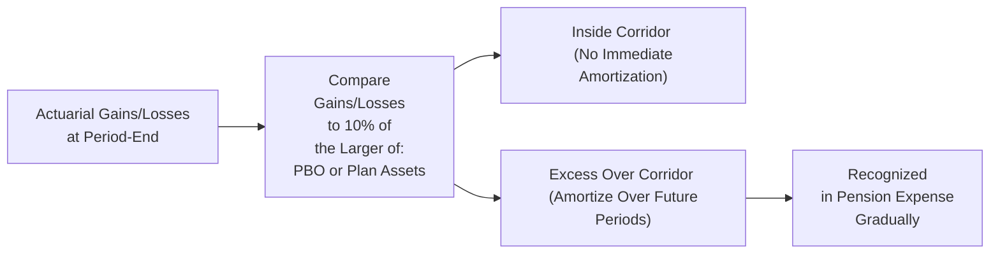

## Introduction and Core Concepts

If you’ve ever tried to guess how long people will live (for pension assumptions) or predict the return on a bunch of invested plan assets, you’ll know it can sometimes feel like dart-throwing. These uncertainties lead to differences between the forecasted pension results and the pensions’ actual outcomes—what we typically call “actuarial gains and losses.” In the context of defined benefit plans (or other post-employment benefits), these differences eventually find their way onto a company’s financial statements. The real question is: when, and how, do they show up there?

In older US GAAP, companies often used the so-called “corridor approach” to manage the volatility of these gains and losses hitting the income statement. IFRS, on the other hand, essentially says, “Nope, just recognize all of these remeasurement differences in Other Comprehensive Income (OCI).” This difference can create all sorts of interesting issues for financial analysts, especially when we’re comparing companies following different sets of standards. On top of that, the timing of recognition can lead to deferred tax assets or liabilities. Let’s walk through the corridor approach, the IFRS alternative, and the big picture for your financial analysis.

## Why These Gains and Losses Happen

Actuarial gains and losses arise from two main sources:

• The difference between the expected and actual return on plan assets.  
• Changes in—and deviations from—actuarial assumptions (like discount rates or participant mortality rates).  

Sometimes, these changes are huge, and the question for standard setters has often been: “Should we drop a massive gain or loss straight into the income statement?” The answer historically has varied between IFRS and older US GAAP rules.

## The Corridor Approach Under Older US GAAP

The corridor approach (part of legacy US GAAP) is essentially about letting the company defer some of those unpredictable swings in pension expense. Under this legacy method, you start by comparing the unrecognized actuarial gains/losses to 10% of (a) the plan’s projected benefit obligation (PBO) or (b) the fair value of plan assets—whichever is greater. If the total unrecognized gains or losses exceed this 10% threshold, that excess has to be amortized into pension expense over time.

Sure, it sounds a bit complicated at first. But the idea is to keep massive, one-time lumps of volatility from startling the unsuspecting user of financial statements. This also means that if you have a big portion of unrecognized losses building up, you get to slowly leak it into net income, which can lead to a future increase in pension expense (and potentially a drag on earnings). Eventually, these amounts either must be recognized or offset by future gains.

### An Illustrative Diagram

Below is a simple schematic showing how the corridor approach works. The corridor is that 10% threshold, and anything beyond it gets amortized into net income:

## IFRS Treatment: No Corridor, Straight to OCI

Under IFRS (aligned with IAS 19), these remeasurements of the net defined benefit liability (or asset) are recognized immediately in Other Comprehensive Income (OCI). This means no corridor threshold or slow drip into the income statement. IFRS sees it as: “Hey, these are remeasurements of the plan. We don’t want that repeated drama in the profit or loss statement every period, but we aren’t going to hide it in some corridor, either.”

As a result, IFRS statements often show less net income volatility compared to a company using older US GAAP corridor rules (assuming the US GAAP group actually hits the corridor threshold). Instead, you might see large swings in the equity section due to remeasurements recognized in OCI.

## Deferred Tax Implications

Let’s say these actuarial gains or losses appear in OCI (under IFRS) or are partially deferred (under older US GAAP). For tax purposes, the timing of when these amounts are recognized can differ. That discrepancy can create a temporary difference and lead to the recording or adjusting of deferred tax assets (DTAs) or deferred tax liabilities (DTLs). Here’s how that might play out:

• Under IFRS: Because these remeasurements go right to OCI, you might end up with recognized gains or losses for accounting right away, whereas for tax, you might not be able to deduct or include them until a future period. This mismatch sets up a DTA or DTL.  
• Under older US GAAP corridor rules: The amortized portion that hits the income statement each year can lead to incremental adjustments in your taxable income in that year versus the full remeasurement in IFRS.  

In either scenario, you’ll want to check the footnotes to see how the company’s tax treatment is playing out. Chances are, the footnotes contain clues about how much of the net liability or net asset might eventually show up in the firm’s tax computations.

## Transitioning Away From the Corridor Method

Over time, US GAAP has evolved. Many companies have adopted an approach more akin to IFRS, or at least recognized that the corridor approach is less common these days. Some have also faced transitions from local GAAP to IFRS when operating internationally. If a firm drops the corridor method in favor of IFRS-like treatment, you might see a one-time remeasurement in the equity accounts. That can come with adjustments in deferred tax positions if the recognition for tax is not immediately triggered.

## An Anecdote: Sudden Shocks in the Pension World

I once chatted with a colleague who was stunned by how big a pension shortfall emerged after a year of poor market returns and updated mortality assumptions. Under the IFRS approach, that shortfall—some $100 million—hit their OCI in one shot and left her CFO scrambling to explain the big change in shareholders’ equity. Meanwhile, her friend at a competitor with a corridor approach (back then) was able to keep most of that shortfall from showing up in net income. In the short term, that difference might seem like an advantage, but eventually, that corridor deferral could come back to bite. In other words, no free lunch in pension accounting.

## Financial Statement Analysis Considerations

1. Volatility in Earnings:  
   Under the corridor approach, current earnings may be smoothed, making the net income figure less comparable with IFRS-based income statements. Watch for any lumps of unrecognized losses waiting in the wings.

2. Equity Fluctuations:  
   Under IFRS, equity can jump around more dramatically due to immediate recognition of actuarial gains/losses in OCI. Keep an eye on the net pension obligation in the footnotes since big changes there might not immediately hit the income statement.

3. Deferred Tax Effects:  
   Large shifts—recognizing big actuarial changes at once—can lead to big changes in deferred tax accounts. Definitely keep track of how and when the firm recognizes the tax impact.

4. Ratio Interpretation:  
   Ratios like Return on Equity (ROE) or Debt/Equity can be warped by sudden hits to equity. If you’re comparing a US GAAP corridor user to an IFRS reporter, be mindful that the corridor user might have hidden gains/losses that eventually appear in the income statement.

5. Pension Plan Disclosures:  
   Both IFRS and US GAAP require robust disclosures on pension plan assumptions, discount rates, and sensitivity analyses. Reviewing these can reveal the potential for future gains or losses.

## Modeling Tips

• If a firm still uses the corridor approach under older US GAAP, you may see stable pension expense in early projections—until the plan’s unrecognized losses surpass the corridor. Then you have to model an additional pension expense that creeps in year by year.  
• Under IFRS, your net income model will be less impacted by these remeasurement swings directly, but your model of OCI and equity changes should reflect them.  
• Evaluate potential changes in the discount rate or mortality assumptions; an abrupt shift can drastically alter the firm’s obligations, which, under IFRS, feed into OCI right away.

## Putting It All Together

Actuarial gains and losses are a natural part of defined benefit pension accounting, but the timing and place of recognition can differ significantly between standards. For analysts, the corridor approach is a reminder that not all liabilities are recognized in the same timeframe; you could find big surprises lurking in footnotes, waiting to move the bottom line in future years. Exploring how companies handle those gains and losses—and the associated tax effects—can help you spot trends, forecast future earnings, and build better risk assessments.

## Common Pitfalls and Best Practices

• Ignoring OCI: Some analysts focus solely on net income. But IFRS demands that these remeasurement differences go right to OCI, so if you ignore OCI, you may miss critical shifts in the firm’s financial health.  
• Forgetting the “Corridor Build-Up”: Under older US GAAP, corporations can sometimes accumulate significant unrecognized losses that eventually come due.  
• Overlooking Subtle Tax Effects: If the pension plan is recognized differently for tax, you can get unexpected changes in deferred tax balances. Keep an eye on that.  
• Not Reading the Footnotes: Trust me, the footnotes about pensions are often long and maybe a bit sleepy, but that’s where the gold is—assumptions, remeasurement amounts, discount rates, etc.

## Additional Resources

• FASB.org: For a comprehensive dive into the legacy corridor approach.  
• IAS 19 (IFRS.org): Official guidance on employee benefits, including immediate recognition of actuarial gains/losses in OCI.  
• PwC Pension Accounting Alerts: Fuller commentary on the shift away from corridor approaches.

## Final Exam Tips

Since the exam might ask you to compare IFRS vs. US GAAP results, keep these corridor rules in mind. You could see a question describing a big actuarial loss and then watch how the IFRS approach whacks equity through OCI, while US GAAP corridor might trickle that loss into income over a decade. Practice reading through sample statements that disclose corridor details—even though the corridor method is less common globally, it’s likely to appear in exam scenarios. Remember to carefully note how the firm’s effective tax rate and deferred tax positions change because of these remeasurements.

---

## References

• CFA Institute. 2025 Curriculum, Level 1, Vol. 4, “Financial Statement Analysis.”  
• FASB.org – Accounting Standards Codification on pension and post-retirement benefits.  
• IAS 19, IFRS.org – “Employee Benefits,” providing IFRS-specific guidance.  
• PwC. “Pension Accounting Alerts: Corridor Approach Eliminations.”  

---

## Corridor Approach and Actuarial Gains/Losses Quiz



### A company's actuarial losses exceed 10% of the larger of the projected benefit obligation or plan assets under older US GAAP. Which of the following is true under the corridor approach?

- [ ] The entire excess is recognized immediately in net income.
- [x] The excess over the 10% threshold must be amortized over future periods.
- [ ] The entire excess is deferred indefinitely.
- [ ] The entire excess is immediately recognized in OCI.

> **Explanation:** Under the corridor method, only the portion above 10% of the greater of the PBO or plan assets is subject to amortization rather than full immediate recognition.

### Which type of pension accounting standard generally requires the immediate recognition of actuarial gains and losses in Other Comprehensive Income?

- [ ] Older US GAAP
- [ ] FASB Codification Pre-2006
- [x] IFRS (IAS 19)
- [ ] US GAAP always requires immediate recognition

> **Explanation:** IFRS (IAS 19) requires actuarial gains/losses to be recognized in OCI immediately, bypassing the corridor approach.

### Under older US GAAP corridor rules, what is the primary objective of using the 10% threshold?

- [ ] To accelerate the recognition of pension expense.
- [ ] To recognize all actuarial gains and losses in net income immediately.
- [x] To reduce short-term volatility in reported pension expense.
- [ ] To harmonize with IFRS remeasurement rules.

> **Explanation:** The corridor approach’s 10% threshold is essentially a smoothing mechanism against large swings in pension expense.

### When actuarial losses are reported in OCI under IFRS, which section of the equity portion of the balance sheet is typically affected?

- [ ] Retained Earnings
- [x] Accumulated Other Comprehensive Income
- [ ] Additional Paid-In Capital
- [ ] Share Capital

> **Explanation:** IFRS requires these remeasurements in Other Comprehensive Income, so Accumulated OCI is adjusted on the balance sheet.

### Which statement best describes the potential deferred tax impact of recognizing actuarial gains/losses in OCI?

- [x] Timing differences between book recognition and tax recognition may create deferred tax assets or liabilities.
- [ ] There is never a tax impact, since OCI items are not taxed.
- [ ] Deferred taxes are recognized only for items recognized in net income.
- [ ] The tax effects always reverse in the current period.

> **Explanation:** If the tax code does not recognize the gain or loss in the same period as the company’s financial statements, a temporary difference arises, creating a DTA or DTL.

### Which of the following scenarios best illustrates how the corridor approach could affect future earnings?

- [x] A company defers a significant portion of its current actuarial losses, causing future earnings to be lower when those losses are amortized.
- [ ] A company recognizes large losses all at once, significantly reducing current earnings.
- [ ] A company shows no actuarial losses in the footnotes at all.
- [ ] A company must convert all losses to IFRS at year-end.

> **Explanation:** Under the corridor approach, unrecognized losses can become future pension expenses once the threshold is exceeded.

### For an analyst comparing two companies, one using older US GAAP corridor method and the other using IFRS, which key difference should be noted?

- [ ] IFRS requires no disclosures for pensions.
- [x] Corridor approach smooths net income volatility, while IFRS records these remeasurements immediately in OCI.
- [ ] There is no difference; both systems require immediate recognition in net income.
- [ ] US GAAP requires immediate recognition in OCI for pension gains/losses.

> **Explanation:** IFRS records actuarial gains/losses right away in OCI, while the older US GAAP corridor system amortizes gains/losses that exceed the 10% threshold.

### Under the corridor approach, how can a large unrecognized actuarial loss affect a firm’s pension expense in subsequent years?

- [x] It could result in higher pension expense in future periods as the loss is amortized.
- [ ] It has no effect unless the firm chooses to adopt IFRS.
- [ ] It must be recognized in full immediately in net income.
- [ ] It is automatically recognized as a prior service cost.

> **Explanation:** The corridor approach defers recognition of the loss unless it rises above the threshold, at which point incremental amounts are amortized into pension expense.

### How might an analyst evaluate the risk of future volatility in earnings related to unrecognized losses under older US GAAP?

- [x] Examine the footnotes to see if the cumulative unrecognized losses approach the corridor threshold.
- [ ] There is no such risk since IFRS replaced corridor rules globally.
- [ ] All companies must immediately recognize all actuarial losses.
- [ ] Unrecognized losses never pose a risk.

> **Explanation:** The corridor system can lead to a buildup of unrecognized losses that eventually trickle into earnings. Footnotes often disclose these amounts.

### Under the corridor approach, companies do not have to amortize actuarial gains or losses if they remain below the 10% corridor threshold.

- [x] True
- [ ] False

> **Explanation:** The corridor approach only requires amortization if the unrecognized gains/losses exceed 10% of the greater of the projected benefit obligation or plan assets.


