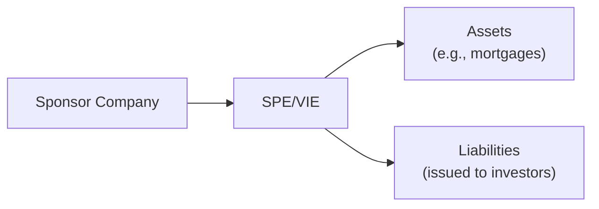

## Introduction

Off-balance-sheet (OBS) arrangements may be one of the most fascinating—and sometimes sneaky—areas of financial reporting. You know, that weird moment when a company’s numbers look too good to be true, yet the official balance sheet doesn’t show any sign of hidden leverage. You might be wondering, “What’s going on here?” Well, let’s dive right in and explore what off-balance-sheet items are, why they matter, and how to spot them.

## Defining Off-Balance-Sheet Arrangements

An off-balance-sheet arrangement refers generally to any form of transaction, agreement, or obligation that, by virtue of specific accounting rules, does not appear as an asset or liability on the face of a company’s balance sheet. If it’s not recorded in the primary financial statements, it’s (by design or otherwise) residing in the footnotes or behind the scenes in some special contractual arrangement.

Traditionally, these items include:

• Operating leases (legacy treatment).  
• Certain guarantees and warranties.  
• Special purpose vehicles (SPVs) or variable interest entities (VIEs).  
• Contingent liabilities (like pending lawsuits or indemnification agreements).  

From a practical standpoint, these structures can mask the true extent of a company’s risks or leverage. When properly used and disclosed, OBS arrangements can serve legitimate business needs, such as risk-sharing or cost management. But when they’re not fully transparent, they can mislead creditors, investors, and other stakeholders about a company’s real financial health.

## Common OBS Arrangements

### Operating Leases (Legacy Approach)

Before recent updates to lease accounting standards (IFRS 16 and ASC 842), most operating leases lived off the balance sheet. Companies rented equipment, office space, vehicles, or other long-term assets but only reported periodic lease expenses on the income statement. This approach allowed them to keep the associated obligations (the future lease payments) off their balance sheets.

A quick personal note: I used to work for a small manufacturing firm that proudly touted its “minimal debt.” But guess what? They were leasing most of their heavy machines with multi-year payment schedules, burying those obligations in the footnotes. The “low leverage” was merely an illusion. These days, new accounting standards (particularly IFRS 16) generally require most leases to appear on the balance sheet. Still, some short-term or low-value leases can remain off the balance sheet depending on the firm’s policies and relevant regulations.

### Special Purpose Entities (SPEs) and Variable Interest Entities (VIEs)

Special purpose entities (SPEs) or variable interest entities (VIEs) are created for specific, narrow business activities—say, to finance a certain project or to securitize assets (like mortgages). Under older accounting rules, these entities weren’t consolidated if control or majority ownership wasn’t clearly established. However, the sponsoring company might still bear significant risks or obligations related to the VIE.

Although consolidation rules have tightened (e.g., IFRS 10 and the updated definition of control), some complex financing arrangements remain partially or entirely off the sponsor’s balance sheet. This can obscure how the sponsor truly shares in the VIE’s risks, thus affecting the company’s leverage or liquidity profile.

Here’s a simple diagram illustrating a relationship between a sponsor company and its special purpose entity. Notice how the SPE’s liabilities might not appear on the sponsor’s balance sheet if it’s structured to remain independent—or so it seems.

In some cases, the sponsor is effectively on the hook if the SPE fails—especially if they’ve provided guarantees. But that risk may not be fully visible in the sponsor’s consolidated statements.

### Guarantees, Warranties, and Other Contingent Liabilities

Another classic form of off-balance-sheet arrangement is a guarantee or any type of indemnification. A giant retail parent might guarantee a subsidiary’s debt. If everything goes fine, the parent never has to pay a dime, so the liability stays off the parent’s balance sheet. But if the subsidiary defaults, the parent is on the hook. The risk, therefore, is very real, though not recognized on the face of the statements until an obligating event occurs.

Likewise, warranties sold with products (especially extended warranties) can sometimes remain off-balance-sheet in certain jurisdictions or under older reporting standards, though many frameworks require an accrual for the estimated warranty expense.

## IFRS vs. US GAAP Approaches

Both IFRS and US GAAP have evolved their standards to reduce the volume of significant off-balance-sheet items, especially in the context of leases. Here are a few differences and similarities you should keep in mind:

• Lease Accounting: IFRS 16 (for IFRS) and ASC 842 (for US GAAP) require lessees to recognize right-of-use assets and lease liabilities for most leases. Short-term and/or low-value leases can still be exempt. Under older rules (IAS 17, ASC 840), operating leases stayed off the balance sheet.  
• SPE/VIE Consolidation: IFRS 10 introduced a robust definition of control, requiring consolidation if a sponsoring company has power over the entity and is exposed to variable returns. Under US GAAP, ASC 810 deals with consolidations, focusing on variable interest entities that must be consolidated if the sponsor is the primary beneficiary.  
• Guarantees and Contingencies: IAS 37 (Provisions, Contingent Liabilities, and Contingent Assets) mandates disclosure (and sometimes recognition) for certain contingencies. US GAAP has rules under ASC 450 (Contingencies). Contingent obligations are disclosed off-balance-sheet unless the probability and potential magnitude of the liability meet specific thresholds for recognition.

## Impact on Leverage, Solvency, and Risk

Observing off-balance-sheet items is essential for analyzing a company’s leverage, liquidity, and long-term solvency. Suppose a manufacturing firm signed a 10-year lease for its critical machinery, but it’s shown nowhere on the balance sheet. If you simply computed the debt-to-equity or other leverage ratios from the facade, it might look like it has minimal debt. But in reality, it has a multi-year payment schedule that functionally mimics debt. The firm’s future liquidity might be compromised if that incoming revenue stream dips for any reason, and it still has to make those lease payments.

Similarly, if a sponsor has a guarantee on a VIE’s liabilities, the sponsor could see a massive unexpected claim if the VIE fails. Such exposures are vital for an analyst to consider:

1. Contingent Obligations: They can materialize overnight, especially under adverse conditions.  
2. Liquidity Requirements: The sponsor may suddenly need cash to fulfill obligations.  
3. Debt Covenants: Some covenants might incorporate recognized debt only, possibly missing these “hidden” obligations. That might affect how near or far the company is to a technical default under certain scenarios.

## Management Incentives to Use OBS Arrangements

Why would management be motivated to push items off the balance sheet? Typically, it comes down to:

• Improving the appearance of financial leverage: By not recognizing a liability, the company’s debt ratio looks better.  
• Meeting covenants: Debt covenants sometimes set maximum debt-to-equity or interest coverage ratios. Structured transactions can help avoid covenant breaches.  
• Enhancing profitability metrics: With operating leases off-balance-sheet (at least under older standards), companies often reported smaller depreciation or interest expenses, thus inflating operational metrics like EBIT.  
• Managing short-term stock price: Some managers believe hiding certain risks or obligations might keep the stock price stable—at least until investors or analysts uncover the truth.  

Of course, standard-setters and regulators have recognized these motivations; hence the push for more transparent rules.

## Investigative Steps and Best Practices

When you’re analyzing a set of financial statements and suspect some off-balance-sheet dealings, here’s a practical approach:

• Read Footnotes Thoroughly: OBS items often hide in the footnotes, especially in sections titled “Commitments and Contingencies,” “Leases,” “Guarantees,” or “Related Party Transactions.”  
• Monitor Management Discussion & Analysis (MD&A): Companies sometimes reveal the rationale, magnitude, and timing of OBS arrangements in the MD&A.  
• Watch for Industry Norms: If a company’s reported leverage is drastically lower than that of peers with similar business models, that’s a sign to investigate potential OBS financing.  
• Pro-Forma Adjustments: Try capitalizing operating lease commitments (or other obligations) on your own. Adjust key ratios, such as debt-to-equity, interest coverage, or ROA, to see how much leverage the company would really have if these items were on the balance sheet.  
• Scenario Analysis: If an SPE or guarantee exists, ask yourself how the sponsor’s finances would look if it had to absorb the entire liability. Run a scenario where the VIE underperforms, or the guaranteed party defaults.  

## Scenario Analysis and Pro-Forma Adjustments

Let’s do a quick hypothetical. Suppose you see a telecommunications firm that (based on the footnotes) is set to make US$200 million in lease payments over the next five years for satellite equipment. Under IFRS 16 or ASC 842, these are likely recognized on the balance sheet, unless they’re short-term or low-value. But let’s imagine they’re still operating under older standards (or local rules) allowing them to remain off-balance-sheet.

1. You collect the future lease payments (or present value) from the footnotes.  
2. You create a pro-forma balance sheet by adding an estimated right-of-use asset and a corresponding liability.  
3. You adjust the income statement for the implied depreciation (instead of rent expense) and interest expense on the liability.  
4. You recalculate the debt-to-equity ratio and see it jump from 0.80× to 1.20×. That’s not a trivial difference!  

This exercise helps you spot significant hidden leverage. After all, lenders, rating agencies, and sophisticated investors often do these same adjustments when evaluating a company’s creditworthiness.

## Conclusion and Exam Tips

Off-balance-sheet arrangements might feel like the hidden corners of financial statements, but you’ll find them more frequently than you expect. It’s essential to keep a skeptical eye and investigate footnotes—especially references to special purpose entities, lease obligations, or contingent liabilities. Here are some quick tips if you’re preparing for exam-style questions or real-world application:

• Always scrutinize the footnotes for commitments, contingencies, and related-party arrangements.  
• Compare leverage ratios before and after you factor in potential off-balance-sheet items.  
• Understand the latest lease accounting standards, particularly IFRS 16 and ASC 842.  
• Remember that managers may have incentives to keep obligations off the official statements, so look for reasonableness and consistency.  
• Provide pro-forma adjustments to demonstrate how a firm’s financial metrics would change if hidden obligations were recognized.  

The ability to identify and adjust for off-balance-sheet items can be the difference between a quick read of the statements and a thorough, reality-based analysis. As you practice for the CFA exams, keep an eye on how standard-setters continue narrowing the window for off-balance-sheet financing—your job is to interpret the rules, not just memorize them.

---

## References for Further Study

• IFRS Foundation:  
  [https://www.ifrs.org](https://www.ifrs.org)  

• Financial Accounting Standards Board (FASB):  
  [https://www.fasb.org](https://www.fasb.org)  

• White, Sondhi, and Fried, “The Analysis and Use of Financial Statements,” Wiley.  

• CFA Institute: CFA Program Curriculum, various readings on Financial Reporting and Analysis.  

• Articles on off-balance-sheet financing in The CPA Journal:  
  [https://www.cpajournal.com](https://www.cpajournal.com)  

---

## Test Your Knowledge: Off-Balance-Sheet Arrangements Essentials



### Which of the following items is most commonly associated with off-balance-sheet accounting under older standards?

- [ ] Finance leases
- [x] Operating leases
- [ ] Capitalized development costs
- [ ] Short-term payables

> **Explanation:** Historically, operating leases were frequently off the balance sheet. Updates to lease accounting under IFRS 16 and ASC 842 require companies to recognize most leases on the balance sheet.

### An analyst notices that a company’s reported debt is significantly lower than its peers, even though they operate in the same industry. Which of the following is a plausible explanation?

- [x] The company has material operating leases that remain off-balance-sheet
- [ ] The company uses the fair value method for asset valuation
- [ ] The company has replaced debt with long-term equity
- [ ] The company disclosed no pension obligations

> **Explanation:** Off-balance-sheet obligations, such as operating leases, can suppress reported debt relative to peers with similar capital structures.

### Under IFRS 16, which of the following is most likely to remain off a company’s balance sheet?

- [ ] A 5-year lease on an expensive drilling rig
- [x] A 5-month lease on a copier machine of low value
- [ ] A 10-year lease on retail storefronts
- [ ] A 7-year vehicle lease for commercial trucks

> **Explanation:** IFRS 16 and ASC 842 generally require all but very short-term or low-value leases to be recognized. A 5-month lease on a low-value asset is a typical exemption.

### A special purpose entity (SPE) used for securitizing mortgages may remain off the sponsor’s balance sheet if:

- [x] The sponsor does not have power over the entity and does not bear significant risks or rewards
- [ ] The SPE is formed under IFRS rather than US GAAP
- [ ] The SPE is funded by sponsors outside the company
- [ ] The SPE holds only intangible assets

> **Explanation:** SPEs (or VIEs) often remain unconsolidated if the sponsor lacks control and isn’t exposed to significant variable returns, according to IFRS 10 and ASC 810 rules.

### When analysts create a pro-forma balance sheet to account for off-balance-sheet leases, they typically:

- [x] Increase both assets and liabilities by the present value of lease obligations
- [ ] Adjust only liabilities but keep assets unchanged
- [ ] Decrease deferred tax liabilities
- [x] Adjust the income statement for depreciation and interest expense instead of standard lease (rent) expense

> **Explanation:** Capitalizing operating leases increases both assets and liabilities. The income statement also shifts from a simple lease expense to a combination of depreciation and interest expense.

### Contingent liabilities, such as product warranties, may remain off-balance-sheet:

- [x] If the probability of future payments is not considered probable
- [ ] Unless the company is audited
- [ ] Only under US GAAP
- [ ] If the market value of the warranties is zero

> **Explanation:** Under IAS 37 and ASC 450, companies disclose contingent liabilities but may only recognize them as liabilities on the balance sheet when they meet certain probability and measurability criteria.

### Which of the following should a keen analyst investigate to assess potential off-balance-sheet arrangements?

- [ ] Cash flow statement only
- [x] Footnotes detailing commitments and contingencies
- [x] Management Discussion & Analysis (MD&A)
- [ ] Prior year’s dividend payments

> **Explanation:** Off-balance-sheet items are often explained in footnotes or MD&A. They might not be clearly visible in the primary statements.

### A motive for management to keep obligations off the balance sheet includes:

- [x] Preserving lower leverage ratios
- [ ] Compliance with IFRS 16
- [ ] Reducing intangible assets
- [ ] Increasing interest expense artificially

> **Explanation:** A lower reported debt-to-equity ratio can be an incentive for management to structure transactions off the balance sheet.

### Which of the following statements about US GAAP consolidation requirements is accurate?

- [x] A variable interest entity (VIE) must be consolidated if the sponsor is the primary beneficiary, bearing the majority of risks and rewards
- [ ] US GAAP permits indefinite off-balance-sheet treatment for all SPEs
- [ ] Under US GAAP, all lease arrangements must remain off-balance-sheet
- [ ] VIEs are only recognized when they generate net income

> **Explanation:** ASC 810 requires consolidation of a VIE if the sponsor is the primary beneficiary. Other statements are incorrect.

### True or False: The move to IFRS 16 and ASC 842 has entirely eliminated off-balance-sheet leasing.

- [ ] True
- [x] False

> **Explanation:** While IFRS 16 and ASC 842 significantly limit the off-balance-sheet leasing category, certain short-term or low-value leases may remain off the balance sheet.


