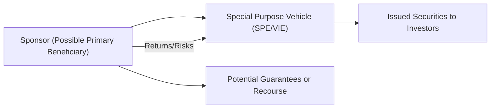

## Introduction

Sometimes, companies set up separate entities that look unrelated on paper, but they actually serve a very targeted role—like securitizing assets, funding massive projects, or isolating certain risks. These are generally known as Special Purpose Entities (SPEs) or, in US GAAP parlance, Variable Interest Entities (VIEs). While their existence may appear harmless, these structures can drastically alter a firm’s risk profile and cause major headaches for anyone analyzing the financial statements.

Perhaps you’ve heard of Enron—yeah, that company notoriously known for using complicated SPEs to hide debt and inflate its profitability. Poring over its footnotes felt like deciphering an ancient text. Although regulations have tightened since that debacle, SPEs (a.k.a. SPVs under IFRS) remain widely used and sometimes absolutely legitimate. Still, as a financial analyst, the overarching question is: “When should the assets and liabilities of these entities appear on the sponsoring company’s balance sheet?”

In this section, we’ll delve into the guiding principles under IFRS and US GAAP, dissect the notion of primary beneficiary, and cover how to spot these structures in disclosures. With all that under our belts, we’ll practice a bit of critical thinking and explore how these details might rear their heads on the CFA exam.

## Key Concepts and Definitions

### Special Purpose Entities (SPEs) and SPVs

Under IFRS, the terms “Special Purpose Entity” (SPE) or “Special Purpose Vehicle” (SPV) describe a separate legal entity established with a specific, narrow purpose, such as:

- Securitizing pools of financial assets (mortgages, credit card receivables, auto loans, etc.).  
- Housing real estate or intellectual property in a tax-efficient manner.  
- Providing research and development financing.  
- Acting as an “orphan” entity to limit sponsor exposure.  

You’ll often see these used for risk management or to improve financing options. However, if a sponsoring company effectively controls (or is exposed to the majority of risks/rewards of) the SPE, IFRS 10 and IFRS 12 may require consolidation.

### Variable Interest Entities (VIEs) Under US GAAP

US GAAP uses the term Variable Interest Entity for these structures. A company (the “primary beneficiary”) must consolidate a VIE if it meets two main criteria:

1. The company has decision-making authority over the VIE’s significant economic activities.  
2. The company bears the majority of expected losses or gains (i.e., effectively has the largest “variable interest”).

In plain English: even if a sponsor’s equity stake is minimal or close to zero, if it’s the one calling the shots and bearing the risk, then that entity can’t just sit quietly off the balance sheet.

### Primary Beneficiary

A big piece of the puzzle is identifying who the “primary beneficiary” is:

- This is the party with the power to direct the activities that significantly affect the VIE’s economic performance.  
- It also must have the obligation to absorb significant losses or the right to significant benefits.  

If the same entity checks both boxes, it’s the sponsor that must bring the VIE’s assets and liabilities onto its books.

### Equity at Risk

“Equity at Risk” is a central concept in the consolidation debate. For a VIE, we look at how much equity it truly has, whether that equity is from independent parties, and how it’s structured. If the equity in the VIE isn’t sufficient to sustain its operations or is not genuine (e.g., it comes with guaranteed returns or has recourse back to the sponsor), the sponsoring company probably has to consolidate.

## Why Do Companies Use SPEs or VIEs?

### Securitization of Assets

One of the predominant uses is securitization: a company might bundle thousands of mortgages and sell them to an SPE, which funds itself by issuing mortgage-backed securities (MBS) to investors. The main idea is to separate the credit risk of the assets from the sponsor’s own credit profile. In principle, that’s a smart approach. But from an analyst’s perspective, you’ll want to assess if the sponsor is truly transferring risk or merely moving it around.

### Isolating Risk

Occasionally, a sponsor sets up SPEs to confine risk to a particular entity—like those “Structured Investment Vehicles” that took center stage during the Global Financial Crisis. If the SIV funds itself with short-term debt (like commercial paper) and invests in longer-term assets, the sponsor might be forced to step in if short-term funding dries up. So even if the SIV is separate on paper, the sponsor might end up having to bail it out.

### Creative Financing

Some deals are purely about raising capital at a cheaper rate. By packaging assets into an SPE, a sponsor might secure financing without showing additional debt on its own balance sheet. This tactic, however, can lead to misrepresentations of leverage or liquidity—a big no-no if the sponsor is basically guaranteeing those obligations.

## IFRS vs. US GAAP: Consolidation Frameworks

### IFRS 10

Under IFRS 10 (Consolidated Financial Statements), investors must consolidate an investee if:

- The investor has power over the investee (decision-making authority).  
- The investor is exposed to variable returns from its involvement with the investee.  
- The investor can use its power to affect those returns.

SPEs (or SPVs) often land here if the sponsor has de facto control or is exposed to the majority of risks/rewards. IFRS 12 expands on disclosure requirements, demanding clarity on “structured entities” or “unconsolidated structured entities.”

### US GAAP: FASB ASC 810

FASB ASC 810 outlines the VIE model. We apply a two-step process:

1. Determine if an entity is a VIE based on equity at risk, financing structure, or arrangement specifics.  
2. If it’s a VIE, identify the primary beneficiary—the party with decision-making rights and the greatest risk or reward profile.

If the sponsoring company is the primary beneficiary, it must consolidate. If not, the sponsor can leave the VIE off its books. Analysts often check an entity’s footnotes to see how the sponsor justifies their stance.

## Indicators of Sponsorship and Control

Even if the sponsor has a small share of the SPE, or none at all, red flags can pop up in the footnotes:

- Does the sponsor guarantee the SPE’s debt or provide liquidity support?  
- Does the sponsor promise to absorb losses if asset performance deteriorates?  
- Are all management functions—like servicing assets—still handled by the sponsor’s employees?  
- Have there been transactions that look a lot like “sales” but still keep the risk with the sponsor?

When those conditions ring true, you may well be dealing with something that belongs on the sponsor’s balance sheet.

## Analyst’s Perspective

### Risk Assessment and Adjusted Financials

From an analyst’s point of view, the scariest scenario is missing hidden liabilities that affect your solvency or coverage ratios. And yes, you do occasionally find footnotes that reveal the sponsor is on the hook. It’s on you to adjust the sponsor’s financial statements or at least note these exposures in your analysis.

Sometimes you’ll see that the sponsor sold its receivables to an SPE to speed up cash flows. But if the sponsor retains significant recourse or surety obligations, then it hasn’t truly offloaded that credit risk. So, you might want to add the securitized receivables (and related funding) back to the sponsor’s balance sheet in your mental model.

### Potential for Fraud

History has taught us that unscrupulous managers can exploit SPEs and VIEs to mask poor business performance or conceal debt. The classic example is Enron, which used a labyrinth of SPEs like LJM partnerships to hide losses and fabricate a bright financial picture. Investigations found that, in many cases, the risk of loss rested with Enron after all, so these “independent” entities deserved consolidation.

### Common Disclosures to Examine

- Management’s Discussion and Analysis (MD&A) for references to structured transactions.  
- Commitments and contingencies footnotes detailing sponsor obligations.  
- Related-party transactions footnotes, especially if the sponsor “sells” or “transfers” assets to the entity or buys them back.  
- Specific references to IFRS 12 or ASC 810, which usually outlines the sponsor’s view on consolidation.

## Visual Representation: Sponsorship and SPE Structure

Below is a simple Mermaid diagram to illustrate the relationship between the sponsor (primary beneficiary) and the SPE. Notice how the sponsor might guarantee or remain exposed to the entity’s risk, necessitating consolidation.



In this depiction, the sponsor invests in or sets up the SPE, the SPE issues securities (like mortgage-backed or asset-backed instruments) to third-party investors, and the sponsor may or may not retain significant exposure to the SPE’s operations.

## Practical Example: Securitizing Receivables

Let’s say ABC Corporation sells $100 million of receivables to a newly created SPV. The SPV issues asset-backed securities to the market, raising $90 million in cash (the other $10 million remains as equity from third-party investors). If ABC has no recourse, no continuing involvement, and no decision-making authority (the SPV is truly independent and has enough capital), the transaction might be accounted for as a true sale off ABC’s books.

But if ABC pledges to buy back any delinquent receivables or invests in 90% of the SPV’s equity, guess what? ABC still bears the majority of the risk. That typically triggers consolidation under both IFRS and US GAAP. A portion of the SPV’s liabilities (the asset-backed securities) would then appear on ABC’s consolidated balance sheet—debt that might significantly affect ABC’s leverage ratios.

## Brief Python Illustration

Here’s a trivial example in Python that simulates potential exposure to losses for a sponsor if default rates spike. It’s obviously an oversimplification, but it shows how you might model or stress-test behind the scenes:

```python
import numpy as np

np.random.seed(42)

receivables = 10000
loan_amount = 1000
default_probability = 0.05  # 5% default assumption

sponsor_guarantee = 0.8

defaults = np.random.binomial(receivables, default_probability, size=1_000_000)

# We'll assume sponsor covers 80% of all defaults
exposure_estimates = defaults * loan_amount * sponsor_guarantee

print(f"Average sponsor exposure in simulation: ${np.mean(exposure_estimates):,.2f}")
print(f"Maximum sponsor exposure in simulation: ${np.max(exposure_estimates):,.2f}")
```

Even in this toy illustration, the point is straightforward: if you’re guaranteeing losses, the risk is on you.

## Considerations for the CFA Exam

On the CFA Level I or II side, questions typically focus on definitions, recognition, and broad concepts of IFRS vs. US GAAP differences. By Level III, expect scenario-based vignettes where you must:

- Identify if a sponsor is the primary beneficiary.  
- Decide whether the entity qualifies as a VIE or not.  
- Discuss how an off-balance-sheet structure might distort the sponsor’s financial ratios.  
- Adjust or restate the balance sheet and income statement for your final valuation or credit analysis.

As you read the footnotes, keep your eyes peeled for words like “control,” “majority of losses,” “equity at risk,” or “guarantees.” These are your signposts—like those neon signs showing you that the sponsor’s hidden exposures might require deeper attention.

## Common Pitfalls

- Overlooking small references in the footnotes that imply consolidation is needed.  
- Failing to notice sponsor-provided liquidity or credit enhancements when they are effectively the backstop.  
- Assuming all SPEs are consolidated without verifying the sponsor’s ownership structure.  
- Dismissing partial interests that still put the majority of risk on the sponsor.

## Final Exam Tips

- Always link the theoretical definitions to the sponsor’s real exposure to risk and reward.  
- Practice identifying primary beneficiary status using numeric or textual cues.  
- Look for unusual recourse arrangements in examples—this is where exam items often hide the relevant detail.  
- Remember: IFRS focuses on “control,” while US GAAP focuses on the notion of a “variable interest” and “primary beneficiary.” They converge in principle—both aim to show the real, underlying risk exposure on the sponsor’s financial statements.

## References for Further Study

- FASB ASC 810: “Consolidation,” which details US GAAP requirements for VIEs.  
- IASB IFRS 10: “Consolidated Financial Statements,” and IFRS 12: “Disclosure of Interests in Other Entities.”  
- Deloitte Technical Library, “Guide to SPEs,” for an in-depth review of consolidation triggers.  
- MH Bowers, “Variable Interest Entities: Accounting and Business Considerations,” Journal of Accountancy.  
- SEC.gov archives on the Enron scandal, showing how SPEs were used misleadingly.  

And if you’re interested, you could also check out academic papers on securitization and structured finance, such as Frank Fabozzi’s work on structured products, for an expanded deep dive into typical VIE structures.

## Test Your Knowledge of Special Purpose Entities (SPEs) and Variable Interest Entities (VIEs)



### Under IFRS 10, which factor most strongly determines whether a sponsor consolidates a Special Purpose Entity?

- [ ] The sponsor’s normal voting thresholds in the SPE.
- [x] The sponsor’s power over the SPE’s significant activities and exposure to variable returns.
- [ ] The existence of nominal sponsor equity in the SPE.
- [ ] The sponsor’s arrangement of the SPE’s day-to-day staffing.

> **Explanation:** IFRS 10 requires consolidation when the sponsor has power over the investee and is exposed to variable returns while also having the ability to use its power to affect the investee’s returns.

### Which of the following best describes a Variable Interest Entity (VIE) in the context of US GAAP?

- [ ] An entity with straightforward ownership and no off-balance-sheet implications.
- [x] An entity in which an investor holds a controlling interest despite lacking a majority voting interest.
- [ ] A consolidated subsidiary that is 100% owned by the parent.
- [ ] A leveraged buyout vehicle in which the sponsor is always the sole financing source.

> **Explanation:** Under ASC 810, a VIE is frequently consolidated not because of voting control but because the sponsor is exposed to the majority of risks or rewards and has decision-making powers.

### Which scenario is most likely to require consolidation of an SPE?

- [ ] The sponsor owns 5% of the SPE’s equity but has no obligation to absorb losses or to provide funding.
- [x] The sponsor owns only 1% of the SPE’s equity but guarantees 90% of its liabilities.
- [ ] The sponsor sells assets to the SPE on a true-sale basis with no recourse.
- [ ] The sponsor occasionally provides marketing services to the SPE on a fee basis.

> **Explanation:** Even a small equity stake can still require consolidation if the sponsor is exposed to the bulk of the entity’s risks—like guaranteeing most of its liabilities.

### From an analyst perspective, which is the biggest concern with off-balance-sheet SPEs?

- [x] Hidden liabilities or risks that distort a company’s real financial condition.
- [ ] A minor footnote disclosure about the SPE’s asset type.
- [ ] Nominal equity ownership by the sponsor.
- [ ] The straightforward nature of IFRS versus US GAAP rules.

> **Explanation:** Off-balance-sheet SPEs can understate a sponsor’s liabilities, making the company look financially healthier than it really is.

### Which of the following is an example of how a sponsor might hide liabilities through an SPE?

- [x] Providing a liquidity backstop for the SPE’s borrowings without formally disclosing that guarantee.
- [ ] Hiring an external audit firm to review the sponsor’s own books.
- [ ] Structuring the SPE’s equity from multiple independent investors.
- [ ] Issuing convertible bonds through the sponsor’s direct balance sheet.

> **Explanation:** Using an SPE to hold debt but secretly guaranteeing it is a common method to keep liabilities off the sponsor's financial statements.

### What is the main intent behind securitizing receivables into an SPE?

- [x] To isolate the assets and reduce the overall risk for the sponsor.
- [ ] To completely remove any credit risk from the global markets.
- [ ] To ensure the SPE is automatically consolidated under IFRS.
- [ ] To guarantee the sponsor has zero involvement in the assets.

> **Explanation:** Securitization typically aims to isolate certain assets and improve financing terms. Yet if the sponsor retains too much risk or control, consolidation is still required.

### If a sponsor is both the decision-maker for an SPE’s critical activities and is entitled to the majority of the SPE’s returns, under US GAAP this sponsor is likely:

- [x] The primary beneficiary required to consolidate the SPE.
- [ ] An agent of the SPE and therefore exempt from consolidation.
- [x] A financial backer with no need to consolidate.
- [ ] A related party with partial control but not required to consolidate.

> **Explanation:** Under the VIE framework, the primary beneficiary is the party with power and exposure to significant returns. That party must consolidate the entity.

### Why did Enron’s SPEs become a notorious example in accounting?

- [ ] They represented a legitimate way of securing low-interest loans.
- [ ] They eliminated Enron’s entire debt load transparently.
- [x] They were used to hide losses and inflate earnings off the balance sheet.
- [ ] They complied fully with then-current accounting standards, with no wrongdoing uncovered.

> **Explanation:** Enron exploited SPEs to bury debt, leading to a major scandal. Eventually, investigations revealed the sponsor (Enron) retained most of the economic risk.

### Which of the following footnote disclosures might lead an analyst to suspect an SPE requires consolidation?

- [ ] A mention that receivables are sold without recourse.
- [ ] A minor reference to intangible asset sales to an external third-party.
- [x] A disclosure that the sponsor backstops all principal and interest for the SPE’s investors.
- [ ] A disclosure that all equity holders in the SPE are unrelated parties.

> **Explanation:** Guaranteeing principal and interest is a strong indication that the sponsor retains the majority of the SPE’s risk exposure.

### True or False: A sponsor that holds 0% equity can still be required to consolidate an SPE under US GAAP.

- [x] True
- [ ] False

> **Explanation:** Under the variable interest model, an entity must consolidate if it is effectively exposed to the majority of the SPE’s risk and/or returns, even with no formal equity stake.


