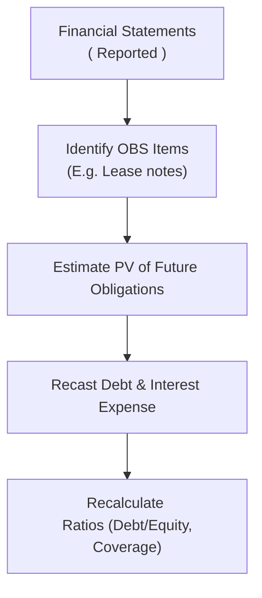

## Overview and Economic Substance

Sometimes companies structure transactions in ways that keep key obligations—like debt and lease commitments—off their balance sheets. Honestly, I once saw a friend who worked at a small manufacturing start-up realize that their biggest lease obligation was nowhere to be found on their financials—turns out they used an affiliated Special Purpose Entity (SPE) to hold the asset. This little “trick” can lead to more appealing leverage ratios, but it also makes your job as an analyst tougher. 

The main takeaway is that off-balance-sheet (OBS) items can mask a company’s true leverage, which in turn can affect how we view solvency, risk, and creditworthiness. Coverage ratios, which look at a firm’s ability to meet its fixed payment obligations, can be just as distorted. If part of a firm’s financing cost is off the official statements, the true interest or lease burden might go unnoticed.

## Why It Matters for Leverage Metrics

Leverage ratios gauge how much debt a company has relative to its capital structure (e.g., Debt-to-Equity) or relative to its operating performance (e.g., Debt-to-EBITDA). By leaving certain obligations in an SPE or other off-balance-sheet structure, the classic formula for leverage might paint a rosier picture:

Let’s illustrate it with the Debt-to-Equity ratio:


\text{Debt-to-Equity Ratio} = \frac{\text{Total Debt}}{\text{Total Equity}}.


If “Total Debt” excludes certain financing obligations that are in an unconsolidated SPE, the ratio looks deceptively low.

### A Quick Case Study

Imagine a retailer that anticipates a large store expansion. The firm sets up a leasing arrangement through an SPE to acquire store buildings. The retailer’s financial statements do not show the associated long-term debt used by the SPE, resulting in:

• Better (i.e., lower) Debt-to-Equity  
• Potentially higher Return-on-Assets (ROA) because the retailer does not record the leased assets  
• Understated liabilities, so liquidity and solvency ratios appear stronger than the economic reality

So, when you only look at the published statements, you might say, “Hey, these guys have really low leverage—sign me up,” while the truth is they have a huge financing burden hidden away. This can be scary.  

## The “Look-Through” Approach

Analysts often conduct a “look-through” analysis to uncover these hidden obligations. Think of it like walking through a house with x-ray glasses to see what’s behind the walls. The details are usually found in the footnotes: maybe the entity discloses minimal details about an unconsolidated partnership or a synthetic lease arrangement. If you see references to recurring minimum lease payments or credit support for a third-party structure, that is your signal to do some detective work.

### Recasting Financial Statements

You can recast the statements by capitalizing the present value of known lease obligations or other financing outlays. Once you include that as “debt” (and possibly recognize the leased asset on the asset side), your Debt-to-Equity ratio changes, and so does your vantage point on the company’s real leverage.

A typical recast for an operating lease might be:

1. Compute the present value of future lease payments as at the current reporting date.  
2. Add that amount to “long-term debt” on the balance sheet.  
3. Recognize a corresponding “right-of-use” asset (similar to IFRS 16 or ASC 842 treatments under the new lease accounting standards) or at least mark a notional asset.  
4. Refigure ratios such as Debt-to-Equity or Debt-to-EBITDA.

A simplified formula for capitalizing lease obligations (assuming a constant discount rate r, and a stream of equal lease payments of L for N years) might look like:


\text{Capitalized Lease Obligation} = L \times \frac{1 - (1+r)^{-N}}{r}.


## Distortions in Coverage Ratios

Coverage ratios measure how comfortably a company can meet its periodic interest or other fixed obligations. Two common ones are:


\text{Interest Coverage Ratio} = \frac{\text{EBIT}}{\text{Interest Expense}},


\text{Fixed-Charge Coverage Ratio} = \frac{\text{EBIT + Fixed Charges}}{\text{Fixed Charges + Interest Expense}},

where “Fixed Charges” might include lease payments or principal amortization.

When certain obligations are off-balance-sheet, both the numerator and the denominator can be misleading. Suppose a company’s operating lease payments are not recorded as debt service in “Interest Expense.” The typical coverage ratio using EBIT/Interest might appear strong. Yet in reality, a big chunk of near-debt payments (lease rentals) lurks off the statements. 

### Example: Operating Lease for a Retail Chain

• EBIT (as reported): $10 million  
• Interest Expense (as reported): $1 million  
• Operating Lease payments per year (off-balance-sheet): $2 million  

The naive Interest Coverage Ratio:


10 \div 1 = 10 \quad (\text{times})


But a “look-through” approach might treat the lease payments as interest-like obligations, so the effective interest expense is $3 million ($1 million of actual interest + $2 million of lease payments). Now the coverage ratio is:


10 \div 3 = 3.3 \quad (\text{times})


Suddenly, the firm is revealed to have a more modest coverage ratio.

## Stress Testing Coverage and Leverage

Because changing the accounting approach (for instance, capitalizing leases under IFRS 16) can shift reported metrics from one period to the next, it’s wise to conduct a stress test. Stress testing involves adjusting coverage and leverage ratios under various consolidation assumptions:

• Full Consolidation Scenario: Assume all off-balance-sheet commitments are consolidated onto the balance sheet and recast interest expenses.  
• Partial Consolidation Scenario: Only bring on certain large SPEs or synthetic leases.  
• Best-Estimate Scenario: Incorporate only those obligations that are reasonably certain to materialize.

You might model changes in discount rates or lease renewal assumptions to see how sensitive the company’s coverage ratio is to interest rate changes and evolving lease terms. If you’re analyzing a cyclical business—like an airline or a hotel chain—the off-balance-sheet lease obligations can be quite large across the economic cycle.

### Mermaid Diagram: Simplified Flow of OBS to Adjusted Coverage Ratio



This flow highlights how you start from the reported numbers, pick out the off-balance-sheet obligations in the notes, convert them into a debt-equivalent, and finally recalculate key ratios.

## Rating Agency Adjustments

Credit rating agencies typically “recast” and “adjust” public statements to address these off-balance-sheet exposures. If you look at a Moody’s or S&P credit report, you’ll see references to “adjusted debt” or “adjusted coverage.” They might note that the Debt-to-EBITDA ratio is 4.5× instead of the 3.0× the company disclosed. That’s because rating agencies see the transaction’s economic substance: a lease is basically a financing arrangement, or that complicated SPE is effectively a subsidiary that holds debt.

Company management is often aware of these rating agency adjustments. Sometimes the impetus for off-balance-sheet financing is tax advantage or specific capital structure goals, but keep in mind, from a credit perspective, that debt never fully disappears. Once you record the present value of these obligations, the real risk of default emerges more clearly.

## Short-Term vs. Long-Term Obligations

Not all off-balance-sheet items are created equal. When you are analyzing the financial risk:

1. Short-Term OBS Arrangements: Some factoring of receivables or certain short-term special purpose entities for seasonal financing might vanish after a few months. They have a limited impact on long-term solvency but could raise liquidity issues.  
2. Long-Term OBS Arrangements: Synthetic leases, multi-year operating leases, or unconsolidated project finance structures can last for years, posing substantial long-term threats to coverage ratios and solvency.

If you spot a large portion of the firm’s operating assets being leased or financed through an off-balance-sheet structure with a 10-year horizon, that’s a big red flag. Even short-term exposures can complicate liquidity measures like the current ratio or quick ratio, so you always want to keep an eye on these details as well.

## Potential Accounting Changes and IFRS 16

Whenever accounting standards change, reported numbers can swing dramatically. IFRS 16 requires lessees to bring most leases on the balance sheet, thereby increasing both assets and liabilities. This significantly affects leverage metrics (like Debt-to-Equity or Debt-to-EBITDA) and coverage ratios once companies adopt the new standard. 

If you’re comparing pre-implementation data (before IFRS 16) and post-implementation data (after IFRS 16), you can see a sudden spike in reported debt. A lessee who used to classify a lease as “operating” must now show a right-of-use asset and corresponding lease liability. That means:

1. The interest expense portion of lease payments becomes visible in the income statement.  
2. The Debt portion from the lease liability surfaces on the balance sheet, raising total debt.  
3. Depreciation on the right-of-use asset replaces the old operating lease expense.

Such changes can cause confusion if you compare a firm’s coverage ratio across reporting periods without adjusting for the before-and-after standard. The same phenomenon happened under US GAAP with the adoption of ASC 842, although the details differ slightly from IFRS 16.

## Example: Simple Python Calculation for Lease Capitalization (Optional)

In practice, you might want to compute the present value of future lease payments for multiple scenarios. A short Python snippet could look like this:

```python
import numpy as np

def present_value_of_lease(annual_payment, discount_rate, years):
    """
    Calculate the present value of a series of equal annual lease payments.
    """
    # The present value of an annuity formula
    pv_factor = (1 - (1 + discount_rate)**(-years)) / discount_rate
    return annual_payment * pv_factor

annual_payment = 2_000_000  # $2 million lease payment per year
discount_rate = 0.06        # 6% discount rate
years = 5

lease_pv = present_value_of_lease(annual_payment, discount_rate, years)
print(f"Capitalized Lease Debt: ${lease_pv:,.2f}")
```

By summing five years of discounted payments, this snippet quickly generates an approximate obligation to add to the balance sheet for your “look-through” analysis.

## Common Pitfalls

• Ignoring Footnotes: It’s surprisingly easy to skip over detailed sections on leasing commitments or factoring arrangements. Footnotes can reveal the real magnitude of commitments.  
• Focusing Only on Short-Term Ratios: Coverage or liquidity metrics might look fine in the coming year, but lurking long-term obligations can cripple the firm in the future.  
• Inconsistent Treatment: When analyzing multiple companies, ensure all off-balance-sheet items are treated consistently, so your cross-company comparisons remain apples-to-apples.

## Exam Tips and Concluding Thoughts

1. Always treat an off-balance-sheet arrangement as suspect until proven otherwise. Even a small footnote about an SPE or unconsolidated entity might hold the key to substantial hidden debt.  
2. Recast or “look-through” the statements whenever you suspect hidden liabilities. This is especially relevant in coverage and leverage calculations, which are easily manipulated by off-balance-sheet transactions.  
3. Stress test your analysis. Consider scenarios where these obligations come onto the balance sheet. If the company’s coverage ratio craters under that scenario, it indicates high financial risk.  
4. Keep an eye on standard-setting developments. A new IFRS or US GAAP pronouncement can shift the entire landscape of what qualifies as an “off-balance-sheet” item.  

In the context of the CFA® curriculum, analyzing the economic substance of transactions rather than their legal form is paramount. These ratios matter for valuation, credit analysis, and peer benchmarking. Remember, if you’re faced with an essay question on the exam, demonstrate the ability to recast financial statements by including these off-balance-sheet obligations and explaining the impact on leverage and coverage.

## References

• Damodaran, A., “Investment Valuation,” Wiley.  
• ICAEW, “Leverage and Coverage Ratios: Best Practices in Analysis.”  
• Moody’s Approach to Assessing Off-Balance-Sheet Debt, Moody’s Investor Service.  
• IFRS 16 “Leases” Implementation Guidance ( https://www.ifrs.org ).

## Test Your Knowledge: Impact of Off-Balance-Sheet Items on Leverage & Coverage



### Which of the following best describes why analysts recast financial statements to include off-balance-sheet items?

- [ ] To comply with IFRS 16 requirements in all cases
- [x] To reflect the economic substance of hidden liabilities in debt and interest expense
- [ ] Because external auditors require it for unqualified opinions
- [ ] So that synthetic lease liabilities can be reclassified as owner’s equity

> **Explanation:** Recasting includes hidden OBS items to show the true leverage and coverage position (i.e., the “economic substance”), not solely as a compliance measure for IFRS or audit opinions.

### From an analyst’s perspective, which ratio is most likely understated if operating leases are kept off-balance-sheet?

- [ ] Current ratio
- [x] Debt-to-EBITDA ratio
- [ ] Return on Equity
- [ ] Gross margin

> **Explanation:** Debt-to-EBITDA can be severely understated if significant debt-equivalent lease obligations are missing from the “Debt” portion of the ratio calculation.

### Which of the following obligations is often overlooked in interest coverage calculations when held off-balance-sheet?

- [ ] Dividend payments
- [ ] Accounts payable
- [x] Lease payment commitments
- [ ] Tax liabilities

> **Explanation:** Lease payment commitments are like interest-bearing debt. If they’re off the balance sheet, they can hide financing costs from the interest coverage ratio.

### Stress testing adjusted coverage ratios involves:

- [ ] Ignoring contingent liabilities
- [ ] Multiplying EBIT by a risk factor
- [x] Evaluating different scenarios for consolidating off-balance-sheet items
- [ ] Calculating free cash flow variations using a one-year projection

> **Explanation:** Stress testing entails modeling various consolidation scenarios (e.g., partial or full consolidation) to see how coverage is impacted if hidden debt appears on-balance-sheet.

### How does IFRS 16 primarily change the reporting of leases for lessees?

- [x] Most leases are capitalized on the balance sheet, increasing reported debt
- [ ] It eliminates finance leases entirely
- [ ] It defers expense recognition until lease maturity
- [ ] It transfers all lease disclosures to the footnotes

> **Explanation:** Under IFRS 16, most leases are brought on-balance-sheet, increasing assets and liabilities and altering the company’s leverage and coverage ratios.

### Which of the following items is more likely to be short-term in nature?

- [x] Factoring of accounts receivable
- [ ] Synthetic leases with a 10-year structure
- [ ] 15-year equipment lease
- [ ] Multi-year sale-leaseback arrangements

> **Explanation:** Factoring arrangements typically cover short-term receivables and expire quickly relative to leases or other long-term financing deals.

### If an airline’s operating leases for aircraft are capitalized, which of the following statements is true?

- [x] The airline’s Debt-to-Equity ratio will likely increase
- [ ] The airline’s EBIT will decrease
- [x] The airline’s interest expense might rise while operating lease expense shrinks
- [ ] The tangible book value decreases without affecting liabilities

> **Explanation:** Capitalizing aircraft leases boosts total debt and typically reclassifies operating lease expense into depreciation and interest expense, thereby increasing reported interest expense and raising leverage.

### Rating agencies typically adjust for off-balance-sheet items to:

- [x] Gain a more accurate picture of a company’s default risk
- [ ] Reduce credit spreads
- [ ] Comply fully with IFRS 16
- [ ] Obtain better underwriting fees

> **Explanation:** Rating agencies are concerned about default risk and recast statements to include obligations that might otherwise be hidden.

### In the “look-through” approach, which of the following is a primary step?

- [ ] Removing intangible assets from the balance sheet
- [x] Converting operating lease obligations into debt equivalents
- [ ] Excluding depreciation expense from EBIT
- [ ] Excluding dividends from the retained earnings calculation

> **Explanation:** The look-through approach aims to capture the real financial burden of off-balance-sheet leases, effectively treating them as debt.

### True or False: IFRS 16’s introduction had no significant impact on companies that previously classified large leases as operating leases.

- [x] True
- [ ] False

> **Explanation:** Under the new lease guidelines, most operating leases have to be brought on-balance-sheet, significantly affecting the reporting of liabilities and related coverage and leverage ratios.


