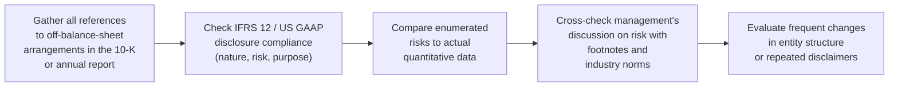

## Introduction

So, let’s talk about the fun stuff in financial statement analysis—when companies try to wiggle around the standard norms by using off-balance-sheet items (OBS) and special purpose entities (SPEs). Perhaps you remember the early 2000s, or you’ve at least heard about it in a cautionary tale from your accounting professors: these structures can shift risks, obligations, or assets away from a company’s primary balance sheet. In some cases, that’s perfectly legitimate. But if a firm isn’t transparent, it might be trying to hide some nasty liabilities.  

In earlier sections—especially 9.1 on "Understanding Off-Balance-Sheet Arrangements" and 9.2 on "Special Purpose Entities and Variable Interest Entities"—we reviewed the mechanics behind setting up these vehicles. Now we’ll look at the important part: how IFRS and US GAAP require these arrangements to be disclosed and what red flags might show up in those disclosures.  

Anyway, I once spoke to a portfolio manager who told me, “Off-balance-sheet disclosures are the first place I look—if I have any suspicion that something’s amiss.” In other words, analysts want to pay close attention to footnotes, cross-references, and subtle disclaimers. Here, we’ll walk through those key considerations and highlight the typical red flags that might raise eyebrows at the next investment committee meeting.

## Core Disclosure Requirements Under IFRS and US GAAP

Both IFRS and US GAAP have specific rules that dictate how off-balance-sheet items and SPEs should be disclosed. When companies have created an SPE, they must discuss the nature of the arrangement, its purpose, the risks involved, the potential financial effect on the company, and any maximum exposure to loss. Being fairly comprehensive is expected—absent clarity, a firm may be in violation of the overarching principle of fair presentation for IFRS or the US GAAP concept of providing decision-useful information.

Under IFRS, particular attention goes to IFRS 12 (“Disclosure of Interests in Other Entities”), which outlines the scope of disclosures for unconsolidated structured entities. Under US GAAP, FASB ASC 460 (“Guarantees”) and other sections on variable interest entities require that companies reveal the extent of their obligations or exposures to potential risks. In both sets of standards, you’ll often see footnote references to “commitments” or “contingent liabilities” that might not be recognized on the balance sheet.

### Nature and Purpose of the Arrangements
Companies should provide a narrative discussion about why the SPE or off-balance-sheet item exists. For instance, is it for tax structuring, risk management, or accessing lower-cost financing? If the explanation feels incomplete or only vaguely states “risk diversification” or “operational alignment,” that might be a sign to dig deeper.

### Maximum Exposure to Losses
In addition to the qualitative details, IFRS 12 and US GAAP expect a quantitative dimension: how much is potentially at stake? Firms should indicate the worst-case scenario. If a company simply states “our maximum loss is immaterial” but provides no actual numbers, that’s a signal to reconsider the entire risk profile.

### Guarantees, Commitments, Contingencies
Companies must also disclose (often in footnotes) if there are financial guarantees or backup liquidity support arrangements with the SPE. A big example might be an agreement to buy back any unsold receivables if certain conditions aren’t met. Such “guarantees” might also include penalty clauses that trigger if underlying cash flows aren’t sufficient. Those clauses might sound small, but they can balloon quickly if the underlying asset or structure doesn’t perform.

## Red Flags in Off-Balance-Sheet Disclosure (and Non-Disclosure)

Sometimes you see the phrase “immaterial exposure” or “routine arrangement.” That language can be perfectly legit. But, if used repeatedly in multiple footnotes without robust data, it might imply the firm is sweeping bigger obligations under the rug. Likewise, repeated disclaimers about “uncertain funding” or “management does not believe these arrangements pose significant risk” can be suspicious if they’re not followed by supporting documentation or quantitative info.

### Frequent Structural Changes
Another big red flag: frequent modifications to an existing SPE or the creation of multiple layered SPEs within a short time. While large organizations may need to adapt to changing markets, repeated entity reorganizations might conceal shifting risk exposures or ongoing attempts to keep liabilities off the main balance sheet.

### Minimalistic Risk Management Commentary
In industries that typically require comprehensive commentary on market, credit, and liquidity risks—like banks or insurers—any short or dismissive discussion of these issues shouldn’t be taken lightly. For example, if a major bank reveals only one or two sentences about its off-balance-sheet exposures but your peer banks disclose pages of details, you might suspect incomplete or inadequate transparency.

### Unusual Related-Party Transactions
A close cousin to SPE complexity is the presence of related-party transactions. Let’s say a company sets up an SPE that shares a mailing address, a CFO, or the same board members. Those relationships call into question the true independence of the SPE and open the possibility that the transaction is primarily structured to obscure risk or shift profits. Whenever you see intangible or intangible-dominated assets being shuffled around these entities, keep your eyes peeled for possible overstatement of intangible values or underreporting of liabilities.

### Aggressive Accounting Treatments
Sometimes, management takes borderline positions on whether an SPE should be consolidated or whether a lease arrangement qualifies as operating instead of finance. When lease classification is borderline—and if you recall from Chapter 7.1 on “Lease Accounting (Lessee vs. Lessor),” the difference between an operating lease and a finance lease can significantly change the balance sheet—this may point to a push for “aggressive accounting.” Such borderline calls might not necessarily be illegal, but they can mislead or at least cause confusion to unsuspecting investors.

### Limited Disclosure in Earnings Calls or Presentations
Finally, if in an earnings call or investor presentation management glosses over the complexities—saying things like: “We’ve done some new off-balance-sheet arrangements, but it’s nothing significant. Let’s move on!”—that might mask hidden exposures. Discrepancies between footnoted details and the official storyline from management can be an alert to revisit the underlying transactions.

## Practical Steps to Analyzing Disclosures

It is one thing to read a footnote, but analyzing it? That’s where the real detective work starts. In my own experience, I like to create a checklist of the sorts of items that typically appear with an off-balance-sheet arrangement, especially in the notes. Let’s visualize a straightforward process you might follow:

Following a solid process ensures you don’t skip steps and that red flags can’t easily hide behind intangible claims or vague disclaimers.

## Key Concepts and Glossary

Before we go further, let’s define some of the major terms we keep referring to:

• Qualitative Disclosure: Non-quantitative information, often narrative or descriptive, explaining the nature and purpose of off-balance-sheet or SPE transactions. This might include risk commentary, discussion of triggers, or describing how an SPE is expected to operate.  

• Quantitative Disclosure: Numerical data showing potential exposures, amounts, or ranges of possible losses or obligations—for example, “Our maximum loss exposure is US $50 million under worst-case scenarios.”  

• Contingent Commitment: An arrangement that kicks in if and when certain triggers occur. For instance, a liquidity backstop where the parent company agrees to buy distressed assets from the SPE if some threshold is reached.  

• Financial Guarantee: A promise to step into a counterparty’s shoes (effectively guaranteeing a liability or a promise to pay) if that party defaults. FASB ASC 460 is the deep-dive standard for US GAAP on this topic.  

• Related-Party Transaction: A business deal in which one party can exercise control or influence over the other, such as a company and its directors or major shareholders. Potential conflict-of-interest situations often arise here.  

• Materiality Threshold: The point at which a misstatement or omission could influence a decision made by a user of financial statements. Both IFRS and US GAAP revolve around materiality judgments.  

• Penalty Clauses: Additional costs or liabilities triggered if certain conditions are not met, sometimes hidden in complex footnotes. These can significantly bump up obligations, so watch carefully for them.  

• Aggressive Accounting: Choices and estimates that push the boundaries of acceptable financial reporting to achieve a particular earnings or ratio objective.  

## Real-World Examples and Case Studies

While it’s tempting to talk exclusively about Enron—a kind of poster child for off-balance-sheet abuse—plenty of modern examples exist. Let’s consider a hypothetical scenario:  

Imagine Billy’s Electronics, a fast-growing consumer electronics distributor, forms an SPE to purchase its idle inventory at year-end. The arrangement with the SPE states that Billy’s Electronics can buy back all unsold units if the SPE fails to resell them within 90 days. On the face of it, the inventory is “sold” and no longer on Billy’s balance sheet. But in the footnotes, you see a line about “guaranteeing the market value of sold inventory.” If you do the math, you realize Billy’s Electronics still bears the risk of unsold inventory. The IFRS or US GAAP footnote disclosure should mention the potential buy-back obligations. A red flag is if the footnotes mention the guarantee but remain ambiguous about maximum exposure or the potential repurchase.  

Or consider a financial institution that sets up multiple shell SPEs, each holding corporate loans. The bank’s official stance in the annual report is “We hold no direct liability for these entities beyond minimal equity contributions.” But in a corner of the notes, you see a small mention: “the bank commits to fund shortfalls up to 20% of the loan principal in each entity.” That’s actually a big deal. If enough of those underlying loans default, the bank is on the hook to replenish the losses. If the management team describes these arrangements as “routine” or “industry-standard” but doesn’t quantify the potential risk, that is absolutely a sign to exercise caution.  

## Monitoring Industry Norms for Disclosure

Industries such as banking, insurance, and real estate typically require more robust disclosure of off-balance-sheet items. In Chapter 14.1, we discuss how banks often have significant off-balance-sheet exposures like letters of credit, unused lines of credit, or credit default swaps. If your bank invests all over the place in structured products and has extremely short disclosures relative to peers, that’s not normal—especially if they’re big in commercial real estate or exotic derivative products.  

Likewise, if we see disclaimers about “our risk management experts continually evaluate the adequacy of reserves” but no specific mention of how those reserves were calculated or what triggers a change, it’s time to start asking questions. The mismatch between the sophistication of the operations and the minimalistic nature of the disclosures is typically a sign that not everything is out in the open.  

## Best Practices for Analysts

• Always read the notes carefully. That might sound obvious, but too often investors skim them. Look for references to contingent liabilities, “immaterial exposures,” or maximum loss exposures.  
• Compare year-over-year changes in footnote disclosures. Did the format or detail change drastically from one annual report to the next? Ask why.  
• Listen to earnings calls with an ear for disclaimers or glossed-over references. A lack of clarity might be a bigger message than what’s actually said.  
• Benchmark disclosures against peer companies. If the entire industry is disclosing volumes of data on a certain type of risk and one firm claims it’s immaterial or not relevant for them, question it.  

## Conclusion and Exam Tips

On exam day, you might get detailed item-set or mini cases that address off-balance-sheet disclosures. They’ll ask you to evaluate whether the disclosures are complete or if more analysis is needed. Perhaps you’re asked about the effect on financial leverage if an SPE were to be consolidated. Or maybe the ethics question: “Does this note meet IFRS or US GAAP requirements for transparent reporting?”  

Always check: Did the company disclose the nature, purpose, and maximum exposure concerning any off-balance-sheet entity? Has management used vague or euphemistic language like “routine arrangement” with no numerical references? And has the firm stuck to standard guidance in IFRS 12 or FASB ASC 460 regarding additional support obligations and guarantees?

Exam Tip 1: In a constructed response, illustrate how you’d connect the footnote disclosures to the broader risk management discussion in the Management Discussion & Analysis (MD&A). Show you can interpret the disclaimers in context.  

Exam Tip 2: For multiple-choice questions, pay attention to answer choices that revolve around “lack of quantitative disclosures” or “management’s repeated emphasis on immaterial exposures.” These are typical signals for an incomplete or suspicious footnote.  

Exam Tip 3: Remember the difference between IFRS and US GAAP in terms of consolidation triggers. You might see a question about when exactly an SPE is consolidated and how that changes the discussion from “disclosure” to “on the balance sheet.”  

Overall, practicing ratio adjustments for potential consolidation scenarios or analyzing footnotes for hidden liabilities is crucial for robust financial statement analysis. If you come across a question that references frequent structural changes or intangible-dominated transactions with a “related party,” you should suspect the possibility of incomplete disclosures.  

## References for Further Study

• IFRS 12 “Disclosure of Interests in Other Entities.”  
• FASB ASC 460 “Guarantees.”  
• SEC Filings Instructions (Regulation S-K) for US companies:  
  (https://www.sec.gov)  
• Albrecht, W. Steve, Albrecht, Conan C., and Zimbelman, Mark. Fraud Examination. Cengage Learning.  

-----

## Test Your Knowledge: Disclosure Requirements & Red Flags



### Which of the following is a key reason for requiring detailed off-balance-sheet disclosures under both IFRS and US GAAP?

- [ ] To reduce the emphasis on footnotes in financial reporting.  
- [x] To ensure transparency around potential exposures and risks.  
- [ ] To allow companies to keep certain liabilities hidden from investors.  
- [ ] To prevent management from discussing future business prospects.  

> **Explanation:** Disclosure requirements aim to provide insight into the nature of OBS items, their risks, and their maximum exposure to potential loss. Both IFRS and US GAAP mandate clarity so investors can accurately assess a company’s overall risk profile.

### A company with an SPE discloses “immaterial exposure” but offers no quantitative details. Which statement best describes how an analyst should approach this disclosure?

- [x] The analyst should seek additional quantitative info to confirm materiality.  
- [ ] The phrase “immaterial exposure” is always sufficient under GAAP.  
- [ ] The phrase “immaterial exposure” meets IFRS 12 requirements and needs no more detail.  
- [ ] Management’s word is assumed accurate if used in the financial statements.  

> **Explanation:** Qualitative statements of immateriality require supporting figures to avoid doubt. Analysts should question or request more info, especially if exposures could be significant.

### Which of the following is a typical red flag in off-balance-sheet disclosures?

- [ ] The company provides explicit numbers for maximum loss exposure.  
- [ ] Management offers a detailed analysis of risk factors.  
- [x] Frequent changes in the structure of special purpose entities without clear explanations.  
- [ ] The footnotes include comprehensive quantitative and qualitative disclosures.  

> **Explanation:** Repeated or abrupt restructuring of SPEs can be used to obscure liabilities or shift them around, raising questions about the company’s real risk exposure.

### A minimal discussion of liquidity risk in a bank’s off-balance-sheet items, especially when peer banks provide extensive disclosures, might indicate:

- [ ] That the bank has no exposure.  
- [x] A red flag indicating potentially incomplete or insufficient reporting.  
- [ ] That the bank is more conservative than its peers.  
- [ ] Compliance with IFRS 12 and FASB ASC 460.  

> **Explanation:** Banks typically face substantial liquidity risk and must disclose it. If a bank’s discussion is unusually short or vague, it may be hiding or underselling possible exposures.

### Which of the following best describes a potential discrepancy between management’s public statements and the footnotes’ discussion of OBS?

- [x] Management glosses over financial guarantees in an earnings call while footnotes indicate significant commitments.  
- [ ] Management discusses the potential for large losses, and the footnotes confirm that no exposures exist.  
- [ ] Both management statements and footnotes agree there are no risks.  
- [ ] The footnotes provide significantly more detail than IFRS 12 requires.  

> **Explanation:** Red flags often appear when management’s public statements are inconsistent with footnote details, signaling a mismatch between the “official line” and the documented disclosures.

### Aggressive accounting in off-balance-sheet arrangements might include:

- [ ] Clear consolidation of an SPE with all risks shown.  
- [ ] No complex layering of entities.  
- [ ] Providing excessive risk disclosures.  
- [x] Borderline classification as an operating lease when it likely meets finance lease criteria.  

> **Explanation:** Reclassifying a finance lease as an operating lease can understate the liabilities on the balance sheet, which may be considered an aggressive or misleading accounting tactic.

### Which action is recommended when analyzing disclosed contingent commitments?

- [x] Cross-check the management’s narrative with any quantitative references to the maximum exposure.  
- [ ] Accept “routine arrangement” language at face value.  
- [ ] Ignore footnotes if the balance sheet shows no liabilities.  
- [ ] Rely solely on peer comparisons without reading the footnotes.  

> **Explanation:** Always verify if the narrative and the numbers align; contingent commitments may significantly alter the company’s true liability profile.

### If financial guarantees for an SPE are mentioned briefly in a footnote but absent from management’s risk discussion, an analyst may conclude:

- [ ] The guarantee is automatically immaterial.  
- [x] There may be inconsistent or incomplete disclosure that warrants further investigation.  
- [ ] Management has resolved the guarantee in the subsequent period.  
- [ ] The footnotes are likely incorrect.  

> **Explanation:** Discrepancies between footnote detail and management’s discussion could signal incomplete or evasive disclosure, prompting deeper inquiry.

### Why are related-party transactions involving intangible assets often viewed with suspicion in off-balance-sheet structures?

- [ ] Because intangible assets cannot be legally owned by SPEs.  
- [x] Because valuing intangible assets can be highly subjective, raising the risk of hidden obligations or overstated asset values.  
- [ ] Because IFRS prohibits intangible assets in related-party transactions.  
- [ ] Because intangible assets must always be reported at fair value.  

> **Explanation:** The valuation of intangible assets can be manipulated more easily than tangible assets, and if a related party is involved, independence and fair value can both be compromised.

### A statement saying “Our maximum exposure to loss is likely zero” when referencing a material support agreement for an SPE is:

- [x] Likely a red flag suggesting the company might be understating real risk.  
- [ ] A typical statement required by IFRS 12.  
- [ ] Acceptable if the SPE is consolidated.  
- [ ] Normal under any conditions.  

> **Explanation:** A material support agreement typically indicates that some loss exposure exists. Claiming it is “zero” or “likely zero” conflicts with the typical risk profile and is therefore a potential red flag.


