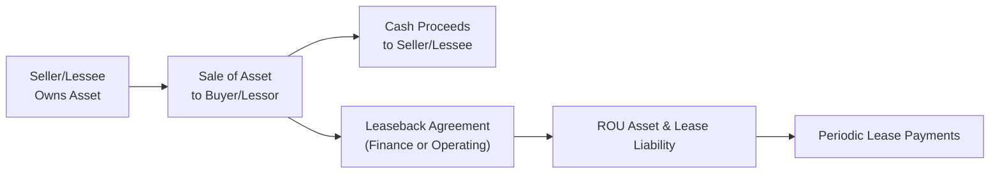

## Introduction

Sale-leaseback transactions can look deceptively simple: A company sells an asset—often something big like real estate, machinery, or even aircraft—and then immediately leases it back from the buyer. If you’re thinking, “Wait, that sounds like borrowing money with extra steps,” you’re not entirely wrong. In many cases, sale-leasebacks are used to obtain liquidity, manage leverage ratios, and continue using the asset without ownership. However, as with many off-balance-sheet structures historically, the real challenge is determining the economic substance and the appropriate accounting under the latest standards.

My first encounter with a quirky sale-leaseback? It happened in a small manufacturing firm that found itself strapped for cash. They owned a large processing plant, so they sold it to a local consortium of investors and signed a 15-year lease to continue operating there. They recognized a hefty gain right away, which made their income statement look amazing—until I started digging deeper into their operating lease commitments and realized they had effectively locked themselves into substantial fixed payments. That moment crystallized for me the importance of carefully analyzing not just the immediate boost in operating cash but also the long-term ramifications on cash flow, leverage, and future earnings.

Below, we’ll dive deeper into how to analyze these transactions from a financial reporting and ratio perspective. We’ll also explore red flags, the difference between operating and finance leases under IFRS 16 and ASC 842, and some tips on adjusting for these transactions in your analysis.

## Why Companies Engage in Sale-Leaseback Transactions

• Liquidity Boost: One major reason is raising funds without incurring new “traditional” debt. Selling an asset for cash and leasing it back can improve the immediate cash positions, which helps management fund new projects or just keep afloat.

• Leverage Management: The older approach to sale-leasebacks was often to keep the lease obligation off the balance sheet (when it was classified as an operating lease under older GAAP). This made the company’s balance sheet look less leveraged, which could help meet debt covenants.

• Potential Tax Benefits: In some tax jurisdictions, companies might enjoy tax benefits or shift risk in ways that reduce overall tax burdens.

• Asset Management Strategy: Sometimes, a firm might not want to tie up capital in a large, depreciating asset. Instead, it may prefer to reallocate that capital to more strategic business opportunities.

On the flip side, these transactions can result in long-term lease obligations that aren’t always fully transparent at first glance. IFRS 16 and ASC 842 have changed the game significantly—there’s now a strong push to include right-of-use assets and lease liabilities on the balance sheet, even for many leases that formerly appeared as operating leases off-balance-sheet. So, let’s step back and figure out how the new rules shape sale-leaseback accounting.

## Economic Substance vs. Legal Form

A core theme in accounting (and a favorite among standard setters) is assessing the economic substance over the legal form. For sale-leasebacks, this means you have to ask: “Is this truly a sale, or is it essentially a financing arrangement disguised as a lease?” Under IFRS 16 and ASC 842:

• True Sale Criteria: The ownership must truly pass to the buyer, and the seller (now the lessee) cannot retain substantially all the risks and rewards of the asset’s ownership. If the original seller is controlling the asset’s residual value, or if the arrangement includes a repurchase option at a locked-in price, it could mean no real risk has passed to the buyer.

• Finance Lease Indications: If the lease substantially transfers the risks and rewards of owning an asset back to the seller-lessee, then it’s classified as a finance lease. In that scenario, you basically record the transaction as if you took on debt for the asset’s usage—recognizing a right-of-use (ROU) asset and a corresponding lease liability.

• Operating Lease Indications: If the lease does not transfer all the risks and rewards, it might be designated as an operating lease. Nonetheless, IFRS 16 and ASC 842 typically still require the seller-lessee to record a right-of-use asset and a lease liability, although the subsequent accounting differs from a finance lease.

## Accounting Treatment Under IFRS 16 and ASC 842

### Recognition of Sale

Under both IFRS 16 and ASC 842, the crucial question to determine if you’ve got a genuine sale is: Does control of the asset transfer to the buyer (now lessor)? If yes, you derecognize the asset from your books and recognize a right-of-use asset plus a lease liability for the leaseback.

If not a genuine sale, you continue to reflect the asset on your balance sheet (no derecognition) and instead recognize the proceeds received as a financing liability. This can be somewhat surprising to folks used to older standards. The asset remains on your balance sheet, and you effectively pay back the cash just like you would for a nontraditional loan.

### Measurement of the Leaseback

Once you’ve determined a genuine sale took place, you measure:
• The right-of-use asset at the proportion of the previous carrying amount that relates to the rights retained.  
• Any gain on sale. However, if the sales price is above fair value, you might have to defer the excess and recognize it systematically over the lease term. If it’s below fair value, you might need to adjust any difference, unless there are reasons such as below-market lease payments that justify that lower selling price.

### Finance Lease vs. Operating Lease

• Finance Lease: You recognize interest expense on the lease liability and depreciation on the ROU asset. It’s pretty similar to owning the asset with some debt attached. For ratio analysis, you treat that lease liability just like any other financing liability.

• Operating Lease: The lease cost is recognized as a single lease expense on a straight-line basis (or another systematic basis) over the lease term. Even so, you still have a right-of-use asset and corresponding liability at the start. Over time, the liability is reduced by the lease payments, and the ROU asset is reduced by the portion of the lease cost allocated as the “reduction” of the asset.

## Deferred Gains (or Losses)

A big area of confusion involves how gains and losses flow through the financial statements. Let’s imagine the sale price is higher than the asset’s fair value. That usually signals that the buyer is effectively granting the seller extra financing—and expects something in return, like higher future lease payments. Standards generally require that excess gain be deferred and recognized over time. This prevents an immediate (and arguably misleading) spike in net income.

Meanwhile, if the sale price is below fair value, you’ll usually have to test whether the discounted lease payments are also below market. If so, you might spread that “loss” over the lease term, adjusting for the beneficial lease pricing. Try not to let the presence of an upfront “gain” or “loss” overshadow the fact that future lease obligations might weigh heavily on the company’s net income.

## Impact on Financial Statements

### Balance Sheet

Before IFRS 16 and ASC 842, sale-leasebacks were often seen as a “clever” way to keep debt off the balance sheet. Now, however, most leases create a right-of-use asset and a lease liability that must be recognized, effectively pulling prior off-balance-sheet items onto the face of the financials. This means:

• The seller-lessee might reduce property, plant & equipment (PPE) by the carrying amount of the asset sold.  
• They’ll recognize a lease liability for the present value of future lease payments.  
• They’ll record a new ROU asset, although its measurement might differ from the original asset’s net book value.

### Income Statement

You might see a gain from the sale in the period the transaction occurs. Beware huge spikes in net income from an apparent “successful” asset disposal. The subsequent depreciation (for finance lease) or lease expense (operating lease) is recognized over the lease term, reducing future net income. Assess the net effect over the longer horizon rather than focusing on one good-looking quarter.

### Cash Flow Statement

Initially, you get a big inflow in investing or operating sections (depending on local classification or the entity’s policy). Over the life of the lease, there will be outflows related to lease payments (part interest, part principal, if it’s a finance lease). Although some portion of those payments might be classified as financing outflows, the classification can vary under IFRS vs. US GAAP. (For a deeper look at IFRS vs. US GAAP operating vs. financing differences, see Chapter 4: Analyzing Statements of Cash Flows.)

## Credit Analysis and Ratio Adjustments

From a credit perspective or when you’re analyzing a company’s solvency, you often need to adjust for these lease obligations as though they’re debt—particularly in a finance lease scenario. A few key ratios to watch:

• Debt-to-Equity: If you skip lease liabilities, you could understate leverage.  
• Debt Service Coverage or Interest Coverage: The lease expense often has an interest component.  
• Return on Assets (ROA): After the transaction, assets might go down. Meanwhile, periodic lease expenses might reduce net income.  
• EBITDA vs. EBITDAR: Sometimes, analysts use EBITDAR (Earnings Before Interest, Taxes, Depreciation, Amortization, and Rent) to remove the effect of operating lease expense. This can provide a clearer sense of recurring earnings before lease costs.

In short, sale-leasebacks can make your leverage metrics look better in older reporting frameworks, but standard setters have generally closed that loop. Nonetheless, it’s essential to remain vigilant: managers might still structure the transaction in ways that temporarily (and artificially) boost net income or generate cash to avoid violating debt covenants.

## Regulatory and Covenant Considerations

Some lenders or bond covenants allow operating leases but might impose restrictions on finance leases. If the covenant definitions haven’t been updated to align with IFRS 16 and ASC 842, a firm might negotiate to keep the sale-leaseback in the realm of an operating lease. This nuance can tilt the classification and the appearance of leverage. As a financial analyst, know that not all covenants have caught up to the new standard, so always check the detailed terms of the agreement.

## Potential Pitfalls and Red Flags

1. Overstated Sale Price: If the sale price far exceeds the asset’s fair value, suspect that the buyer expects higher lease payments or other concessions.  
2. Immediate Large Gain: Be wary if management books a large one-time profit that significantly impacts earnings. Look for offsetting future lease commitments that might hurt earnings down the road.  
3. Hidden Financing: If “formal” recognition as a sale is in doubt, the arrangement might be nothing more than a loan with collateral.  
4. Inconsistent Disclosures: Compare the notes about sale-leaseback transactions in the financial statements with the forward-looking lease obligations. Any major mismatch is a red flag.

## Practical Example

Let’s illustrate a simplified example:

• Carrying amount of building: $800,000.  
• Fair value of building: $1,000,000.  
• Sale price: $1,200,000.  
• Implied above-market sale price: $200,000 over fair value.  

Step 1: Determine if it qualifies as a sale under IFRS/US GAAP.  
Step 2: Record the sale:  
   – De-recognize building at $800,000.  
   – Recognize cash proceeds of $1,200,000.  
   – Potentially recognize a partial gain of $1,000,000 – $800,000 = $200,000 if it’s truly a sale.  
   – However, the extra $200,000 (sale price minus fair value) is likely deferred and recognized over the lease term.  

Step 3: Recognize a lease liability for the present value of future lease payments.  
Step 4: Recognize an ROU asset at a fraction of the building’s previous carrying amount.  

Ultimately, the net effect on the seller-lessee’s statements depends on how fast the deferred gain is recognized and the structure of the lease payments. Don’t let the big lumpsum overshadow the future obligations.

## Diagram: How Sale-Leaseback Works

Below is a simple Mermaid diagram showing the key steps:

## Best Practices in Analysis

• Always read the footnotes carefully; they often reveal the exact classification and how gains are being recognized.  
• Recompute leverage ratios by capitalizing lease obligations (especially if you suspect they’re economically akin to debt).  
• Pay attention to management discussions around liquidity. Are they generating short-term cash at the expense of long-term obligations?

## Looking Ahead

As global standards converge and evolve, accountants and auditors are increasingly focusing on substance over form. Sale-leasebacks remain a tricky area, especially when companies need a quick liquidity injection or want to meet certain ratio requirements. For you as an analyst (or future portfolio manager), vigilance and healthy skepticism are key. If a sale-leaseback seems too good to be true—like it dramatically improves earnings or the balance sheet overnight—dig deeper into lease commitments and any deferred gains or losses.

For deeper insights, see:

- FASB ASC 842 “Leases.”  
- IFRS 16 “Leases” – Illustrative Examples on Sale-Leaseback.  
- KPMG’s “Lease Accounting Guide,” available online.  
- PwC, “In depth: IFRS 16, the leases standard — a comprehensive look.”  

Also, you might find it useful to revisit Chapter 4: Analyzing Statements of Cash Flows for deeper insights into how lease payments and sales proceeds are classified, and Chapter 13: Financial Analysis Techniques for how to incorporate these obligations into advanced ratio analysis.

## Conclusion

Sale-leaseback transactions can be a legitimate tool for raising cash and managing a firm’s capital structure. But keep in mind that the “paper” gain recognized at sale can mask a new or continuing lease commitment that affects long-term earnings, cash flow, and risk. The new standards have shed more light on these obligations, generally leading companies to book a right-of-use asset and a corresponding liability. From an analyst’s perspective, always peel away the layers to see if the transaction is truly a sale or if the business is just reconfiguring its debt in a different form. Over time, a balanced view of the immediate inflow versus the future outflows—and their effect on net income and leverage—will provide the best measure of a sale-leaseback transaction’s real impact.

---

## Test Your Knowledge: Sale-Leaseback Analysis and Implications



### Which of the following best describes a primary motivation for a sale-leaseback transaction?

- [ ] To eliminate future obligations.  
- [x] To raise capital while retaining operational control of the asset.  
- [ ] To increase the carrying amount of fixed assets on the balance sheet.  
- [ ] To simplify the financial statements by removing any discussion of lease commitments.  

> **Explanation:** Companies typically use sale-leasebacks to generate liquidity (a cash inflow from the sale) while still using the underlying asset through a lease arrangement.

### In a sale-leaseback transaction under IFRS 16, which condition must be met for the transaction to be recognized as a “true sale”?

- [ ] The buyer-lessor must be an unrelated party.  
- [ ] Lease payments must be set below market rates.  
- [ ] Management must demonstrate that no debt covenants have been violated.  
- [x] Control of the asset must transfer to the buyer, and the seller cannot retain substantially all risks and rewards.  

> **Explanation:** IFRS 16 (and ASC 842 under US GAAP) focuses on whether control—and thus risks and rewards—has passed from the seller to the buyer. If such control has not passed, the sale may not be recognized under the standards.

### If the sale price in a sale-leaseback transaction significantly exceeds the fair value of the asset, what is the typical accounting treatment for the excess?

- [ ] Recognize it fully as an immediate gain on the income statement.  
- [x] Defer it and recognize it systematically over the lease term.  
- [ ] Offset it against future depreciation of the right-of-use asset.  
- [ ] Record the difference as a contra-asset on the balance sheet.  

> **Explanation:** When the sale price exceeds fair value, the excess amount is typically deferred and recognized over the lease term to prevent overstating current income.

### Under IFRS 16 and ASC 842, how does a finance lease arising from a sale-leaseback generally affect the balance sheet of the seller-lessee?

- [x] The seller-lessee recognizes a right-of-use asset and a corresponding lease liability.  
- [ ] The seller-lessee only derecognizes the sold asset and reports no liabilities.  
- [ ] The seller-lessee does not record any asset or liability, as it is treated as an off-balance-sheet arrangement.  
- [ ] The seller-lessee reclassifies the sold asset as inventory.  

> **Explanation:** A finance lease under these standards is effectively recorded as if the lessee owns the asset but financed it through debt. Hence, a right-of-use asset and corresponding lease liability are recognized.

### Which of the following is NOT typically an advantage of sale-leaseback transactions?

- [ ] Generating immediate cash inflows.  
- [ ] Potentially influencing certain debt ratios under older reporting frameworks.  
- [x] Eliminating all operating lease expenses going forward.  
- [ ] Transferring asset ownership to a separate entity to reduce capital usage.  

> **Explanation:** A sale-leaseback does not eliminate the lease expenses. The seller-lessee must still pay rent under the new lease contract.

### What is the most likely impact on the debt-to-equity ratio after a sale-leaseback classified as a finance lease?

- [x] The ratio may remain the same or even increase if lease liabilities are recognized.  
- [ ] It will always decrease significantly.  
- [ ] It will have no effect, as leases are not recognized on the balance sheet.  
- [ ] It must be adjusted retrospectively for all past transactions.  

> **Explanation:** A finance lease creates a lease liability. If that liability is large relative to the equity base, the debt-to-equity ratio could remain the same or become higher.

### Which lease classification typically results in depreciation expense for the seller-lessee after a sale-leaseback?

- [ ] Operating lease.  
- [x] Finance lease.  
- [ ] Executory lease.  
- [ ] Periodic lease.  

> **Explanation:** In a finance lease, the seller-lessee treats the leased asset similarly to owned property, incurring both depreciation on the right-of-use asset and interest on the lease liability.

### Why might management undertake a sale-leaseback when their firm is nearing a debt covenant limit?

- [ ] They want to trigger an immediate interest expense event.  
- [ ] They seek to convert tangible property into intangible property.  
- [x] They aim to raise liquidity and/or shift reported debt off the balance sheet (under older rules).  
- [ ] They want to increase their interest coverage ratio by reporting additional depreciation.  

> **Explanation:** A sale-leaseback can provide cash to alleviate short-term pressures and potentially (under older standards or certain lease classifications) keep some amounts off the balance sheet, aiding in compliance with debt covenants.

### When a transaction does not qualify as a sale under IFRS 16 or ASC 842 in a sale-leaseback, how should it typically be accounted for by the seller-lessee?

- [x] As a financing agreement, retaining the asset on the balance sheet and recognizing a financial liability.  
- [ ] As an operating lease with a gain recognized immediately.  
- [ ] As an outright disposition of the asset with no further obligations.  
- [ ] As goodwill and intangible asset recognition.  

> **Explanation:** If control does not pass in the transaction, the seller-lessee keeps the asset on the books, recognizing the proceeds received as a financing liability rather than recording a sale.

### True or False: Under current lease standards, the economic substance of a sale-leaseback arrangement is often closer to a debt financing arrangement than an outright sale.

- [x] True  
- [ ] False  

> **Explanation:** In many cases, if the seller-lessee still uses the asset and maintains most risks and rewards, the arrangement resembles a financing—especially under IFRS 16 and ASC 842, which require recognition of lease liabilities.


