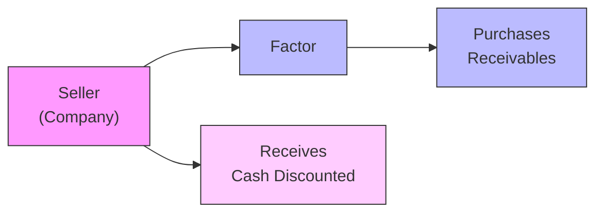
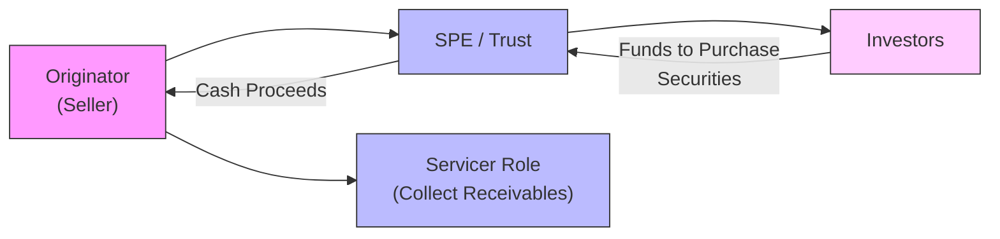

## Introduction

Factoring of receivables and securitizations can sometimes feel like mysterious backroom deals—assets that appear or disappear from the balance sheet in a blink. But, in truth, they’re more than just fancy ways to shuffle paperwork. They’re powerful tools that can transform a company’s liquidity, risk profile, and reported financial health. I still remember, early in my career, feeling baffled when I first heard a CFO casually mention “We factored those receivables.” My first reaction was, “You did what?” Eventually, after sifting through countless financial statements, I realized how crucial it is to understand these transactions inside and out—especially when analyzing a company’s real financial standing.

As you’re studying for your CFA exam (or just looking to sharpen your understanding), knowing the distinction between factoring arrangements (with or without recourse) and how securitizations are structured in special purpose entities can help you spot off-balance-sheet exposures and potential red flags. Let’s explore these topics step by step.

## Big Picture and Key Principles

Certain companies, especially those in cash-intensive sectors like manufacturing or retail, may need to convert accounts receivable into immediate cash. Factoring helps them do that. Meanwhile, securitization is a more complex scheme in which a company bundles a pool of assets—like mortgages or credit card receivables—and sells them as marketable securities to outside investors, usually through a Special Purpose Entity (SPE). While both factoring and securitization aim to enhance liquidity, the accounting treatment and the ultimate impact on the balance sheet depend on whether these transfers truly shift risk and control from the originator to the buyer.

At the root of the accounting questions are the concepts of:
• True sale and derecognition.  
• Continuing involvement and recourse.  
• Potential consolidation under IFRS or US GAAP guidance on Variable Interest Entities (VIEs).  

Understanding these frameworks is critical for accurately evaluating a firm’s risk and comparing it against peers.

## Factoring of Receivables

Factoring is when a business (commonly called the “seller”) sells its receivables at a discount to a “factor” (often a specialized finance company). The factor pays the seller up front, less a fee, and then attempts to collect the full amount from the original customers. 

### With Recourse vs. Without Recourse

• With recourse: The seller remains on the hook if the factor can’t collect from the customer. This usually implies that, from an accounting point of view, the seller retains some risk of default. If you’re analyzing a balance sheet and see that receivables have been factored “with recourse,” it suggests the seller might still have a contingent liability if customers don’t pay.  
• Without recourse: The factor bears the risk of non-payment. Once the seller transfers these receivables, it generally faces no further credit risk from those receivables.

### Sale vs. Secured Borrowing

One of the biggest debates is whether factoring should be recorded as a sale (thus removing the receivables from the balance sheet) or as a secured borrowing (which keeps the receivables on the balance sheet and records a corresponding liability). If a factoring arrangement meets the “true sale” criteria under the applicable accounting standards (e.g., IFRS 9 or FASB ASC 860), then the receivables are derecognized. If not, the transaction is treated as a loan, with the receivables serving as collateral.

Financial statement analysts look carefully at these disclosures because the classification can drastically alter leverage ratios, current ratios, and operating cash flow. It’s also crucial to check whether the factor’s fee (or the discount) is in line with typical market rates. If it’s significantly higher, it may be a signal that the receivables’ quality is low or that the company is in a liquidity pinch.

### Diagram: Factoring Overview

Below is a simplified depiction of factoring. Notice the flow of receivables from the seller to the factor, the cash that flows from the factor to the seller, and the transfer of collection risk.

## Securitizations

Securitization is a more sophisticated financial transaction where assets, such as mortgages or even future royalties, get packaged into securities. Investors in these securities hope to receive a return mainly from the cash flows on the underlying pool of assets. The company that originally owned the assets (originator) might use a Special Purpose Entity (SPE) or a Variable Interest Entity (VIE), specifically designed to hold these assets and issue securities to investors.

### How Securitization Works

• Asset Pooling: The originator gathers a pool of receivables or loans (for instance, auto loans, mortgages, credit card balances).  
• Transfer to SPE: These assets are sold (ideally meeting true sale criteria) to an SPE.  
• Issuance of Securities: The SPE issues different classes (tranches) of securities to investors, each having varying levels of risk and return.  
• Servicing: Even after the transfer, the originator could remain the servicer, collecting payments from customers and passing them on to the SPE or the investors.  

### Diagram: Securitization Flow

Here’s a visual snapshot of a typical securitization structure:

The originator gets upfront cash from the SPE (which is funded by investors). If the transfer meets derecognition criteria, the originator can remove these assets from its balance sheet, effectively improving certain metrics like return on assets and leverage ratios. However, the originator might still retain some risk (or “skin in the game”) through credit enhancements or recourse clauses, which can reintroduce some complexities.

## Derecognition and Risk Transfer

From an accounting viewpoint, the key question is: Does the transaction truly transfer control and risk to a third party, or is it more like a disguised loan? If substantial risk (e.g., default risk) remains with the originator, IFRS 9 and US GAAP guidelines may require the assets to remain on the originator’s balance sheet.

### Under IFRS 9

The key tests for derecognition are:  
• Have the contractual rights to cash flows from the asset expired?  
• Has the asset been transferred in such a way that the contractual rights to cash flows have passed to a receiving party without the originator retaining control or significant risks and rewards?  

If the originator has continuing involvement—such as guaranteeing a portion of credit losses—then partial or even full recognition of the assets may be required.

### Under US GAAP (FASB ASC 860)

ASC 860 has detailed provisions on whether the transferred assets qualify as a “true sale.” If they do not, the assets remain on the balance sheet, and the proceeds are treated as a secured borrowing. The presence of recourse or credit enhancements typically indicates the originator retains significant risk.

## Credit Enhancements and Liquidity Facilities

When analyzing securitizations, keep an eye out for provisions called credit enhancements—like overcollateralization, subordination, or guarantees—and liquidity facilities that ensure timely payment of interest and principal to investors. Such enhancements often tilt the risk back onto the originator, especially if the originator must step in when defaults rise beyond expected levels.

• Subordination involves issuing different tranches of securities. Junior tranches absorb losses first, protecting senior tranches.
• Overcollateralization is when the total principal of the underlying assets exceeds the total principal of the issued securities. This extra cushion helps cover potential losses.

If these structures fail and trigger certain obligations, the assets might have to be consolidated back onto the originator’s books. During the Global Financial Crisis, for instance, many banks ended up having to consolidate their off-balance-sheet entities once losses from subprime mortgages ballooned.

## Analytical Considerations

### 1. Liquidity vs. Leverage

Factoring and securitizations can improve liquidity by generating upfront cash. Companies can use this cash to pay down debts or reinvest in operations. But if the transactions don’t qualify for derecognition, the resulting liabilities might increase reported leverage.

### 2. Income Statement Implications

In a “true sale,” the originator may recognize a gain or loss from the sale of the asset pool (or receivables). For secured borrowing, the originator continues to recognize interest income on the receivables and interest expense on the borrowing. The difference can drastically impact margins and net income.

### 3. Investor Perception

If investors suspect that the originator is merely using these transactions to hide liabilities or shift risky assets off the balance sheet, trust could be eroded. Credit rating agencies also look into how much risk is off-loaded or retained. A high discount rate (or interest spread) demanded by investors to buy these receivables or securities may suggest the market sees the assets as riskier than the company’s official statements indicate.

### 4. Ongoing Monitoring

Always watch out for triggers in securitizations (like excessive defaults in the underlying assets). Triggers can force the sponsor to step in—sometimes requiring it to consolidate the entity on its balance sheet, significantly altering leverage and liquidity metrics.

## Case Example: With Recourse Factoring

Let’s go through a simplified numeric example to illustrate factoring with recourse:

• Company ABC has $1 million in receivables.  
• ABC factors these receivables “with recourse” to GreatFactor Inc. for 95% of face value, net of a 5% discount.  
• GreatFactor Inc. charges an additional 1% fee in the event of default.  

If ABC retains the significant risk of default, the accounting standards usually require these receivables to remain on ABC’s books, with a $950,000 loan from GreatFactor Inc. The net effect is $950,000 in cash, $1 million in accounts receivable, and $950,000 in short-term debt. On top of that, ABC must disclose the recourse obligation in its notes.

Compare this to a “without recourse” scenario:

• If ABC sells those same receivables without recourse, and the sale meets derecognition criteria, ABC would remove the $1 million from its accounts receivable and record a $50,000 expense (the discount). ABC’s balance sheet shows no additional liability (assuming no continuing involvement).  

The difference is subtle in concept but massive in terms of reported liquidity, leverage, and risk exposure.

## Common Pitfalls and Traps

• Failing to read the notes to the financial statements. Many factoring or securitization details live in the footnotes, especially regarding recourse.  
• Ignoring triggers for securitized assets. If default rates rise, the sponsor might suddenly have to provide cash or consolidate the assets.  
• Overlooking interest spreads and fees. If the discount is too big, it might be a sign that the factored receivables are riskier than they appear.  
• Misjudging the “true sale” criteria. Just because a transaction is labeled a “sale” doesn’t guarantee it’ll be treated as one in the audited financials.

## Practical Tips for Exam & Real-World Analysis

• When you see large movements in “trade receivables,” check whether factoring is involved. A precipitous drop might indicate reliance on factoring for working capital.  
• Scrutinize the difference between the carrying amount of receivables and the factoring proceeds. That difference (i.e., discount) can signal potential credit quality issues.  
• Evaluate how securitizations affect core operational risk measures and capital structure. Sometimes, the real story is hidden off the balance sheet.  
• If a sponsor mentions “we recognized a gain on sale,” confirm whether any continuing involvement or recourse might require eventual reversal if credit conditions deteriorate.  

## Further Reading and References

• FASB ASC 860 “Transfers and Servicing”  
• IFRS 9 “Financial Instruments,” sections on derecognition of financial assets  
• “Asset Securitization: Theory and Practice,” Frank J. Fabozzi (Editor)  
• Standard & Poor’s “Global Structured Finance Criteria,” S&P Global  

These references dive deeper into the concepts of factoring, securitization, and off-balance-sheet financing structures, complete with real-life case studies and advanced examples.

## Final Thoughts

Factoring and securitizations are powerful techniques that can help companies optimize capital usage, smooth out cash flows, and potentially shift risk. But they also open up a host of analytical questions regarding the “true” financial health of the originator. It’s a little like cleaning your home by pushing clutter into a closet. If the closet door still needs your support to stay shut, you’re not off the hook yet. The same applies to these off-balance-sheet items: if the risk, in some form, remains yours, it can barge back onto the balance sheet the moment things go wrong.

Familiarity with the relevant accounting standards (under IFRS and US GAAP) and a critical eye on footnote disclosures are your strongest allies in figuring out who truly bears the risk. Keep probing how these transactions are structured, and you’ll be well on your way to becoming a more discerning analyst.

---

## Factoring & Securitizations Knowledge Check



### In the context of factoring, what is the primary difference between "with recourse" and "without recourse"?

- [x] With recourse means the seller retains the risk of nonpayment; without recourse means the buyer assumes it.
- [ ] With recourse means the factor can charge higher fees; without recourse means the factor can lower fees.
- [ ] With recourse is recognized as a secured borrowing; without recourse is automatically derecognized.
- [ ] With recourse is allowed only under IFRS; without recourse is allowed only under US GAAP.

> **Explanation:** “With recourse” factoring requires the seller to bear the collection risk if customers default, whereas “without recourse” passes that risk on to the buyer.

### Which of the following best describes a key reason a company might choose to factor its receivables?

- [x] To accelerate cash flow for immediate working capital needs.
- [ ] To reduce the discount rate for its suppliers.
- [ ] To comply with IFRS 16.
- [ ] To increase revenues in the current period.

> **Explanation:** Factoring is an effective way for companies to quickly convert their accounts receivable into cash, enhancing liquidity.  

### Which accounting standard provides guidance on derecognition of financial assets under US GAAP?

- [ ] ASC 842
- [x] ASC 860
- [ ] ASC 805
- [ ] ASC 718

> **Explanation:** FASB ASC 860, “Transfers and Servicing,” contains the relevant US GAAP guidance for derecognition of transferred receivables and other financial assets.

### Under IFRS 9, which criterion is NOT directly assessed when determining whether to derecognize an asset?

- [ ] Whether the entity has transferred substantially all the risks and rewards.
- [ ] Whether the entity retains continuing involvement in the asset.
- [ ] Whether the contractual rights to the cash flows have expired.
- [x] Whether the factor’s fee is greater than 15% of the asset’s book value.

> **Explanation:** IFRS 9 focuses on assessing risk-and-reward transfer and continuing involvement, not a specific numeric threshold regarding fees.

### If a securitization fails the “true sale” test, how should it generally be reported?

- [ ] As an off-balance-sheet transaction.
- [ ] As a sale with gain recognized.
- [x] As a secured borrowing.
- [ ] As an expense in the income statement.

> **Explanation:** Failure to meet true sale criteria typically indicates the assets remain on the originator’s balance sheet, with the transaction treated as a borrowing.

### What is the main purpose of credit enhancements in a securitization?

- [x] To improve the credit quality of the securities being issued.
- [ ] To ensure the originator automatically records a gain on sale.
- [ ] To force the originator to retain more recourse liability.
- [ ] To hide defaulted assets in off-balance-sheet vehicles.

> **Explanation:** Credit enhancements (e.g., subordination, overcollateralization) allow securitized instruments to achieve higher ratings and appear more attractive to investors.

### Which of the following is a disadvantage for an originator engaging in factoring “with recourse”?

- [x] The originator still faces the risk of customers defaulting on their debts.
- [ ] The originator has no cash inflow from the factor.
- [ ] The originator’s leverage automatically drops.
- [ ] The arrangement is illegal under IFRS.

> **Explanation:** “With recourse” factoring does not fully transfer risk of nonpayment to the factor, so the seller remains exposed to that risk.

### In evaluating a company’s factoring transactions, analysts should pay special attention to:

- [x] The note disclosures explaining recourse provisions.
- [ ] The nominal value of the inventory on the balance sheet.
- [ ] The average daily trading volume of the company’s cash.
- [ ] The CFO’s personal stock options.

> **Explanation:** Footnotes usually reveal recourse obligations, discount rates, and other key details that indicate whether the factor truly assumed the risk or if it’s effectively a borrowing.

### Which of the following can trigger consolidation of a previously off-balance-sheet SPE under IFRS or US GAAP?

- [x] The originator being forced to absorb significant losses upon default of underlying assets.
- [ ] A reduction in sales of new receivables.
- [ ] A substitution of the rating agency.
- [ ] Expiration of the originator’s commercial paper.

> **Explanation:** If the originator must absorb losses under certain conditions, it implies continued control or risk retention, triggering consolidation.

### Is it possible for a company to recognize gains on sale from a securitization yet still have residual risk in the transaction?

- [x] True
- [ ] False

> **Explanation:** Even if a company recognizes a gain on sale upon transferring receivables, it may still retain risk via recourse provisions, credit enhancements, or retained interests, which could spell future liabilities if problems arise.


