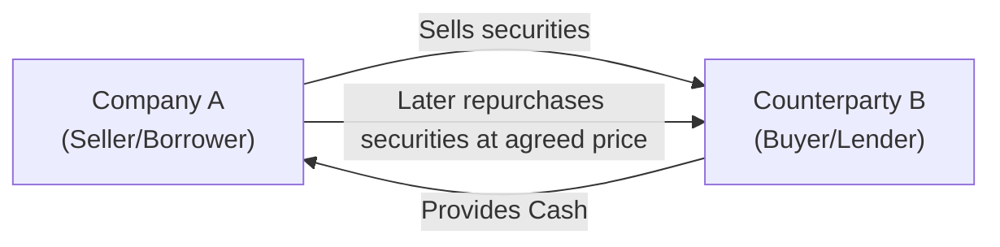

## Introduction
Ah, repos. You know, in my early days analyzing financial institutions, I remember being quite puzzled by a bank that reported remarkably low debt near the end of each quarter—only to see it jump right back up a week later. Turns out they were using repurchase agreements (repos) to briefly reduce their on-balance-sheet liabilities and goose up their ratios at crucial reporting dates. That was my first brush with “window dressing,” and boy did it highlight how repos can be used in ways that are a little too clever.

At their core, repos may seem straightforward: I sell you a security and promise to buy it back later at an agreed price. But from an accounting viewpoint, these transactions can get pretty nuanced. Depending on which side of the arrangement you’re on—and how the rules define “transfer of control”—a repo can be treated as a secured borrowing (i.e., a loan) or as a sale that removes the asset from your balance sheet. That distinction matters a lot for analyzing a company’s leverage, liquidity, and overall risk profile. In this section, we’ll dig into the mechanics of repo transactions, examine how (and why) they might remain off the balance sheet, and explore the red flags that analysts should watch out for. 

## Key Concepts in Repurchase Agreements
Repurchase agreements come in a few flavors, but the defining feature is that the seller/borrower transfers a security (typically bonds or other debt instruments) to a buyer/lender in exchange for cash. The borrower agrees to repurchase those same (or substantially similar) securities at a future date and price. Conceptually, that price difference is the “interest” or “repo rate” paid to the lender for the short-term use of cash.

• Economic Substance: A repo is often economically identical to a collateralized loan, because the party who “sells” the security still retains many of the risks and rewards of ownership.  
• Margin Requirements (or “Haircut”): Typically, the value of the collateral must exceed the loan amount by a certain percentage. This difference provides a cushion if the collateral declines in value.  
• Maturity: Many repos are overnight, though some may run for days (term repos). There’s also an “open repo,” which has no fixed maturity but can be terminated by either party.

## When Is It On-Balance-Sheet?
Accounting standards (such as IFRS 9 for financial instruments and FASB ASC 860 in the U.S.) focus on whether the seller surrenders control of the asset or not. Generally, the question is: “Does the entity still have the benefits and risks of the asset’s ownership?” 

• Collateralized Borrowing Model: If the seller/borrower retains most of the risks (like market risk, credit risk, or default risk) and the repurchase is nearly certain, then the transaction is accounted for as a loan. The securities remain on the balance sheet, and a corresponding liability is recorded.  
• True Sale and Derecognition: If the seller surrenders control and does not retain significant risks or rewards—an outcome that can be rare for standard repos—then the asset is derecognized. This would be an off-balance-sheet treatment: you’d effectively see the asset vanish from the seller’s books, replaced by whatever net proceeds/receivables remain.

## The Allure (and Risk) of Off-Balance-Sheet Classification
So, what’s the big fuss about an off-balance-sheet repo? For companies aiming to gear up or handle short-term liquidity needs without ballooning their reported liabilities, selling the securities and scoring a “true sale” treatment can temporarily reduce leverage. However, the economic effect rarely changes: the seller typically still faces the risk if the collateral suddenly plunges in value. That’s why regulators and accounting standard-setters have continuously tightened the criteria around transfers of financial assets.

If a firm tries to report a repo as a sale when the reality looks more like a loan, that can be considered a misrepresentation of its leverage and financing costs. It’s a classic risk for investors, who might not realize how reliant the firm is on short-term funding.

## Window Dressing with Repos
Ever wonder how some companies or financial institutions put their best foot forward right around the financial reporting date and then revert to their usual stance immediately afterwards? This phenomenon, known as “window dressing,” sometimes involves executing large-scale repo transactions just before the reporting date. 

• Temporary Liability Reduction: By transferring securities and claiming a sale, the firm can show lower assets and lower borrowings at period-end.  
• Reversal Post-Reporting: Shortly after the balance sheet date, the firm unwinds these transactions and the leverage sneaks right back up. 

An analyst who only glances at the period-end figures might be misled into thinking the company’s average leverage is lower than it actually is.

## Reverse Repos
If a repo is from the perspective of the borrower who sells the security, a “reverse repo” is from the perspective of the lender who buys it. In a reverse repo, you lend money against collateral, receiving securities that you agree to sell (return) later. This is common among financial institutions and central banks managing short-term liquidity. 

• Accounting Treatment for Reverse Repos: Usually recognized as a collateralized lend. The buyer/lender recognizes a receivable rather than an outright ownership of the securities if the arrangement meets the secured borrowing criteria.  
• Short-Term Liquidity Management: Reverse repos are a key tool in monetary policy and operational liquidity. They can shift yields and short-term rates in the financial markets.

## Analytical Approaches to Detect Repo-Related Window Dressing
As an analyst, you know how critical it is to see beyond the official statements. Repos can obscure the true economic exposure if all you do is read period-end numbers. Here are a few approaches to get clarity:

• Average Balance Analysis: Compare average daily or weekly asset/liability levels to the period-end snapshot. If you see big discrepancies, that might be a clue.  
• Review Footnotes and MD&A: Firms engaged in repo transactions often must disclose the size, frequency, and terms of these deals in footnotes. Pay special attention to any mention of debits/credits that reappear soon after quarter-end.  
• Look for Collateral Requirements and Margin Calls: If the margin or “haircut” is too slim, the lender might quickly call the borrower to post additional cash if the collateral value dips. That can spell trouble for the borrower’s liquidity.  
• Cash Flow Statement Clues: Operating vs. financing classification (under IFRS vs. U.S. GAAP) can highlight big swings in short-term funding. Evaluate quarter-to-quarter changes in operating or financing flows. If big lumps appear near the end of the period, that’s another red flag.

## Example: Repo Used for Short-Term Borrowing
Let’s illustrate a simple numeric example. Suppose Company A, needing $95 million in cash, “sells” $100 million worth of high-grade bonds to Lender B under a repo arrangement:

1. Company A receives $95 million in cash today, and the interest rate for this short-term arrangement is 2% on an annualized basis.  
2. One week later, Company A will buy back the bonds for $95.04 million (the extra $0.04 million is effectively the interest for one week).  
3. However, from an accounting standpoint, if Company A retains substantially all risks and rewards associated with the bonds, they remain on Company A’s balance sheet, and a $95 million liability is recorded.  
4. If the company tries to show this as a “true sale” and remove the $100 million of bonds from the balance sheet, an analyst should question whether the terms truly transfer control.

A slight difference of $5 million (the “haircut”) acts as margin for Lender B in case those securities lose value during the week. If the fair value of the bonds plummets below the agreed repurchase price, B still expects to get repaid in full—effectively evidence that the borrowing risk remains with Company A.

## Diagram: Overview of a Repo Transaction

Below is a simplified Mermaid diagram showing the flows in a repo arrangement:

• Step 1: A transfers securities to B.  
• Step 2: B gives cash (less any haircut) to A.  
• Step 3: At maturity, A returns the cash plus a fee in exchange for the securities.

## Best Practices for Assessment
Analyzing complex repo structures can be tricky, but here are some tips:

• Scrutinize Disclosure: If the firm reports “true sales” of assets with a repurchase agreement, check whether they truly gave up control. Reference IFRS 9 or FASB ASC 860 for detailed derecognition rules.  
• Understand Risk Retention: The bigger the mismatch between actual economic risk and reported liabilities, the more carefully you should treat the firm’s stated leverage and liquidity.  
• Check for Concentration: Some entities might rely heavily on repos. If market volatility spikes, margin calls could force them to scramble for cash or face default risk.  
• Trend Analysis: Compare quarter-end data to average data. If you see a consistent drop near each quarter’s close, suspect window dressing.

## Potential Pitfalls
There are plenty of ways reps can go awry:

• Gotcha #1: Overly Aggressive True Sale Treatment. If the firm claims derecognition of assets but continues to bear the majority of risk, it can misrepresent its liability structure.  
• Gotcha #2: Understating Leverage. Period-end manipulations and incomplete disclosures might hide the real level of indebtedness.  
• Gotcha #3: Liquidity Crunches. Repos usually must be rolled over frequently. If capital markets are stressed, the borrower could face a massive funding crunch.  
• Gotcha #4: Collateral Value Declines. A sharp fall in collateral value can trigger margin calls. If the borrower lacks the liquidity to meet the calls, it can spiral into default.

## References and Further Exploration
If you’re itching to dig deeper into the intricacies of repo markets and the relevant accounting guidance, check out:

• “Global Repo Market” Reports – International Capital Market Association (ICMA), at icmagroup.org  
• FASB ASC 860 “Transfers and Servicing” – Detailed guidance on when a transaction qualifies as a “true sale.”  
• IFRS 9 – Financial Instruments: Recognition and Measurement.  
• IFRS 15 – References to certain aspects of revenue from contracts involving financial assets.  
• Company Filings (10-Qs, 10-Ks in the U.S. or Annual Reports globally) – Footnote disclosures on repos or other off-balance-sheet financing. 

These resources, along with practice examples from past CFA Institute readings, can really help you untangle the more complicated aspects of repo transactions.

---

## Repo Transactions and Off-Balance-Sheet Implications: 10 Practice Questions



### Which of the following best describes a repurchase agreement (repo) in economic terms?

- [ ] An option contract to buy assets at a future date.
- [ ] A partial sale of a firm’s equity to outside lenders.
- [x] A short-term collateralized borrowing transaction.
- [ ] A permanent transfer of ownership with no subsequent obligations.

> **Explanation:** A repo is effectively a short-term loan secured by securities. The “seller” obtains cash and agrees to “repurchase” those same securities at a future date and price.

### Under U.S. GAAP (FASB ASC 860), when can a repo transaction qualify for derecognition of the underlying asset?

- [x] Only when risks and rewards of ownership fully transfer, and control is relinquished.
- [ ] Whenever the collateral is physically delivered to the lender.
- [ ] If the market value of the collateral is higher than the notional amount of the repo.
- [ ] Whenever the transaction is executed with a third-party custodian.

> **Explanation:** Derecognition occurs only if control truly passes to the transferee and the transferor does not retain the significant risks or rewards of ownership. Merely delivering collateral or involving a custodian does not suffice.

### What is the primary reason a firm might treat a repo as a “true sale” on its financial statements?

- [x] To temporarily reduce on-balance-sheet assets and liabilities.
- [ ] To fully transfer any future gains from the collateral’s price appreciation.
- [ ] To retain additional margin in the transaction.
- [ ] To convert short-term liabilities into long-term debt.

> **Explanation:** Firms sometimes treat a repo as a “true sale” for accounting purposes to remove the related asset from the balance sheet, effectively lowering reported leverage and improving liquidity metrics at period-end.

### Which of the following best describes the practice of “window dressing” in the context of repo transactions?

- [ ] A method of calculating coupon interest in a bond contract.
- [ ] A legitimate long-term financing strategy.
- [ ] Disclosing all repo transactions in quarterly footnotes.
- [x] Manipulating short-term liabilities or asset levels around reporting dates to appear financially stronger.

> **Explanation:** “Window dressing” involves strategically executing transactions (like repos) near period-end to present more favorable financial ratios or lower debt levels, thus misleading external stakeholders about true financial health.

### Which measure helps detect if a firm engages in window dressing with repo transactions?

- [ ] Comparing the Weighted Average Cost of Capital (WACC) across quarters.
- [ ] Examining the effective tax rate in the income statement.
- [x] Analyzing period-end balances versus average daily balances.
- [ ] Cross-referencing the purchasing department’s records with the treasury office.

> **Explanation:** If period-end liabilities are significantly lower than the average daily or weekly liabilities, that discrepancy may indicate the firm engages in short-term adjustments to reduce reported debt levels around the reporting date.

### In a typical repo, what is the role of margin (haircut)?

- [ ] It is the profit percentage guaranteed to the borrower.
- [x] It is the cushion ensuring the lender has adequate collateral relative to the cash loaned.
- [ ] It is a separate security deposit held by the Securities and Exchange Commission (SEC).
- [ ] It is a form of capital gains tax withheld by the lender.

> **Explanation:** The margin or “haircut” is the difference between the collateral’s market value and the cash provided, giving the lender added protection against market value declines of the pledged security.

### Under IFRS 9, how does a reverse repo typically appear on the buyer/lender’s financial statements?

- [x] As a collateralized lending transaction, with a receivable recorded.
- [ ] As an off-balance-sheet arrangement with no reporting requirements.
- [ ] As an automatic impairment of the purchased security.
- [ ] As an equity investment on the buyer’s balance sheet.

> **Explanation:** From the perspective of the buyer/lender, a reverse repo is usually recorded as a collateralized lending arrangement under IFRS 9, reflecting a receivable for the cash advanced rather than ownership of the collateral.

### A company sells securities under a repo arrangement and repurchases them a few days later. Economically, the biggest risk they face is typically:

- [x] A decline in the collateral’s market value, triggering margin calls.
- [ ] Loss of control over all future dividends if the security is equity.
- [ ] An inability to borrow additional funds from the SEC.
- [ ] Qualification for a stock-based compensation plan.

> **Explanation:** The repo’s essence is a short-term secured loan. If the collateral’s value drops, the counterparty could demand more cash (margin call). Failure to meet that call can lead to defaults or forced liquidation.

### Which warning sign might indicate aggressive off-balance-sheet financing using repos?

- [ ] Minimal short-term debt disclosed in footnotes.
- [x] Sudden declines in reported liabilities just before quarter-end without a corresponding decrease in actual financing activity.
- [ ] Increasing share prices throughout the reporting period.
- [ ] A stable daily average liability throughout the reporting period.

> **Explanation:** Abrupt liability reductions near quarter-end, with no economic rationale for reduced borrowing, suggest the possibility of off-balance-sheet maneuvering to alter the reported financial position.

### True or False: A repo transaction must always be recorded as a liability by the seller/borrower, regardless of how the contract is structured.

- [ ] True
- [x] False

> **Explanation:** Under certain conditions (i.e., if the seller/borrower truly surrenders control and significantly all risks/rewards), a repo can be reported as a sale. However, such scenarios are relatively rare in practice because most repo arrangements are, in substance, short-term loans.


