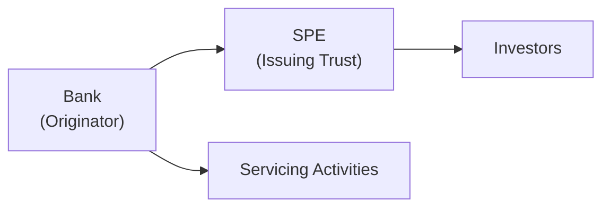
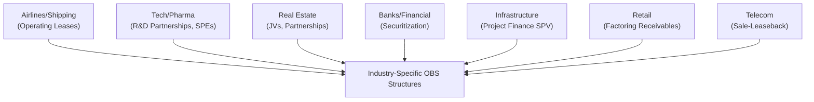

## Overview

Off-balance-sheet (OBS) financing can feel like that elusive puzzle piece: you know it’s out there, but it’s not always obvious where it’s hiding. This topic becomes especially important for a financial analyst because different industries have developed distinct ways of moving assets or liabilities beyond the attention of the main financial statements. In short, the economic reality might be overshadowed by how a transaction is structured. In this section, we’ll explore common examples in various industries—throwing in a few personal recollections and an approachable tone while still aiming for the level of rigor that CFA® exams demand.

You might recall from earlier discussions (Chapter 9, “Off-Balance-Sheet Items and Special Purpose Entities”) that certain contractual or structural choices can keep significant obligations off the face of the balance sheet. This can lead to artificially strong leverage and coverage ratios if someone isn’t digging beneath the surface. Let’s do a deep dive into how different sectors leverage these OBS approaches and talk about practical ways to identify and evaluate them.

## Airlines and Shipping: Leveraging Operating Leases

Historically, airlines would often lease airplanes in a manner that allowed them to keep those assets—and the corresponding debt—off their balance sheets. Up until IFRS 16 (and the US GAAP update ASC 842), many leases were accounted for as operating leases, which were considered “rent” rather than “debt.” The same can be said of shipping companies leasing vessels. 

• Why They Do It: Aircraft and ships are expensive, and operating leases allowed companies to avoid a mountain of debt on the balance sheet. Historically, the only place you’d see a clue was in the “Rent Expense” line on the income statement or in footnotes.

• What’s Changed: IFRS 16 put most leases on the balance sheet for lessees, requiring firms to recognize a right-of-use asset and corresponding lease liability. Nonetheless, you might still see older or transitional statements (or certain short-term lease, variable lease payment structures) that maintain some off-balance-sheet elements.

• Analytical Approach: An analyst should examine lease footnotes, disclosures on lease terms, variable lease structures, and sublease arrangements. You may want to estimate “adjusted debt” by capitalizing the lease commitments. (Check out Chapters 7.1 and 9.1 for more on lease accounting specifics and how these adjustments impact leverage ratios.)

### Quick Anecdote
I once spoke with a small regional airline CFO who proudly mentioned, “We don’t have a ton of debt.” Then he sheepishly added, “But, uh, we’re leasing over half the fleet.” That taught me the importance of digging into disclosures rather than relying on a quick glance at the balance sheet.

## Technology and Pharmaceutical: R&D Partnerships and SPEs

In technology and pharmaceutical firms—where research and development (R&D) can be the lifeblood of future growth—it’s not uncommon to see R&D partnerships or special purpose entities established to shoulder the risky, expensive early phases of development.

• R&D Partnerships: By spinning off or partnering with third parties for certain R&D projects, the parent may treat the arrangement so that the associated costs (and potential intangible assets) remain outside the parent’s consolidated statements until specific milestones are reached.

• Why It Matters: If you see a tech or pharma giant with surprising stability in R&D spending, your ears should perk up. Are they spinning out major R&D activities into an unconsolidated entity? Follow up with footnotes about intangible assets under development, cost-sharing deals, or milestone-based licensing arrangements.

• Potential Pitfalls: Over time, if these partnerships fall back into the parent’s control due to financial or governance triggers, the parent might have to retroactively consolidate, bringing in intangible asset or goodwill (and possibly expenses or liabilities) all at once. This can create major volatility in financial statements.

## Real Estate Development: Joint Ventures and Unconsolidated Partnerships

Real estate development often involves big capital outlays. Many developers form joint ventures (JVs) or unconsolidated partnerships to keep the properties’ debt and risk away from their own balance sheets:

• Why JVs?: A large property developer might team up with an institutional investor, each holding, say, a 50% interest in a new building or project. If the arrangement does not meet consolidation thresholds (under IFRS 10 or US GAAP Variable Interest Entity rules), the debt and property might remain off the developer’s consolidated accounts.

• Best-Case Example: A real estate developer invests a minor stake (like 20%) in an apartment complex partnership. They share in the upside of that property, but the lion’s share of the property’s mortgage debt might never show up on the developer’s own balance sheet, aside from the equity investment and maybe a footnote describing obligations or guarantees.

• Analytical Perspective: As a financial analyst, always review the contingencies or guarantees that the parent company may have provided to the JV’s lenders. Sometimes, the JV’s debt is effectively guaranteed by the developer even if it’s not consolidated. Chapter 9.4 (Disclosure Requirements and Red Flags) highlights the significance of carefully reading these footnotes.

## Banks and Financial Institutions: Securitization of Loans

If there’s one industry that has practically made an art form of off-balance-sheet arrangements, it’s banking. Think of mortgage-backed securities (MBS), credit card receivable securitizations, auto loan pools, or other asset-backed securities (ABS).

### Typical Bank Securitization Structure
Here’s a simple diagram of how securitization might look:

• Originator (the bank) sells a pool of loans to an SPE or trust.  
• The SPE issues securities to investors, collateralized by those loans.  
• The bank might continue servicing the loans (collecting payments on behalf of the trust).  

Under certain criteria—particularly if the bank is deemed not to retain the majority of risks and rewards—the assets can be derecognized from the bank’s balance sheet (IFRS 9 or the US GAAP’s ASC 860 guidelines). Thus, the loans vanish from the bank’s statements, leaving behind a service income line plus any residual interest.

• Why This Matters: Off-balance-sheet securitizations allow banks to maintain capital ratios that appear stronger. However, during times of turmoil (e.g., the 2008 financial crisis), repurchase obligations, liquidity facilities, or recourse provisions suddenly bring these assets and liabilities back onto the bank’s books.

## Project Finance: Large Infrastructure and Energy Projects

Infrastructure projects—like toll roads, power plants, or water treatment facilities—are often funded using an approach called project finance. A special purpose vehicle (SPV) is formed to own and operate the project. The equity sponsors and lenders rely primarily on the project’s cash flows (toll revenues, power purchase agreements, etc.) for repayment.

• Key Benefit: The sponsor’s own balance sheet may not reflect the sizable debt, because the SPV stands alone. If the sponsor does not guarantee the project debt, or the structure meets certain deconsolidation criteria, the sponsor’s balance sheet remains largely unaffected.

• Real-World Uses: You see this a lot in emerging markets or giant public-private partnerships. Government bodies contribute land or resources, private firms contribute expertise, and banks and multilateral agencies (like the World Bank) finance the project. The credit risk is (at least in theory) ring-fenced within the SPV.

• Analyst’s Issue: Always check if the sponsor provided a completion guarantee or debt service guarantee. If so, the project’s debt might effectively be the sponsor’s liability. Be sure to read the notes on financial guarantees, as these can be triggered if the project underperforms.

## Retail Companies: Factoring or Securitizing Receivables

Retailers operating loyalty programs or store-branded credit cards may factor out receivables or securitize them, thereby removing them from their balance sheets in return for immediate cash. 

• Example: A major retailer sells its credit card receivables to an SPE that issues asset-backed securities to investors. The retailer receives cash up front, improving cash flow. Because they no longer “own” the receivables, the nominal debt might not appear on the retailer’s balance sheet.

• Purpose: This can smooth out cash flow volatility and quickly access capital. However, the retailer might still bear some risk—like if returns or defaults exceed certain thresholds.

• Risks: If the factoring arrangement includes recourse, or if the retailer provides any form of guarantee, that obligation could come back to bite them. Make sure to investigate footnotes for recourse clauses.

## Telecommunications: Sale-Leaseback of Network Infrastructure

Telecom companies often have extensive infrastructure—transmission towers, fiber-optic lines, and more. One way to raise funds is to sell these physical assets to a specialized third party, then lease them back to continue usage. Historically, certain sale-leaseback structures qualified as off-balance-sheet transactions.

• Why They Do It: The telecom receives immediate cash. Meanwhile, if the lease qualifies as an operating lease, that newly minted lease liability might be smaller or structured in a way that does not blow up the balance sheet. Under current accounting standards (IFRS 16), many of these leaseback liabilities are recognized, though certain variable or short-term structures might still keep some liabilities off the primary statements.

• Red Flag Example: Suppose a telecom sells and then re-leases nearly all of its cell towers. If you notice an unusual boost in “Other Operating Income” and a suspiciously low level of fixed assets, it’s worth scrutinizing the details behind those sale-leaseback deals.

## Industry Patterns and AFAs (Areas for Analysis)

Each industry has its hallmark off-balance-sheet structures. When you’re comparing companies within an industry, pay attention to who uses the “industry-standard” approach and who might be an outlier. Differences can reflect strategy or even aggression in financial reporting. For example:

• Airline A vs. Airline B  
  – Both have large fleets, but Airline A might have capitalized more leases after IFRS 16, while Airline B might still have short-term or variable lease structures that remain off-balance-sheet. 

• Real Estate Developer X vs. Developer Y  
  – If X has formed a web of unconsolidated JVs, their reported leverage could look lower. Developer Y might have chosen to consolidate some projects, which could make their leverage ratio seem worse, even if the underlying economic stakes are similar.

• Banks with Low Balance-Sheet Loans  
  – If a bank proudly reports a decrease in “Loans Receivable,” investigate whether a major securitization was executed. The bank could still be on the hook via credit enhancements or other recourse provisions.

Being aware of these standard practices helps you figure out which footnotes deserve your attention. As you can see in Chapter 12 (Financial Reporting Quality), one of the big tasks for an analyst is to detect if a firm is engaged in earnings management or using these structures in a way that misrepresents its financial health.

## A Visual Overview

To tie it all together, here’s a simple mermaid diagram summarizing some common approaches by sector:

## Best Practices for Analysts

• Read Footnotes Thoroughly: A single line in the notes—mentioning a recourse provision or guarantee—can drastically change your assessment of a firm’s leverage.

• Adjust for Economic Reality: Where possible, add back or estimate the liabilities or assets that might be hidden. For example, approximate the present value of lease commitments if they’re still accounted for in an off-balance-sheet manner.

• Compare Across Peers: Inconsistent accounting choices in the same industry can distort ratio comparisons. Uniformly adjust your peers to a comparable standard for a meaningful analysis.

• Keep Abreast of Standards: IFRS and US GAAP keep evolving. For instance, IFRS 16 significantly changed the landscape for leases—so always watch if the firm is applying older transitional rules or using shortcuts.

• Leverage Triangulation with Cash Flow Statements: Sometimes, a big mismatch between net income and operating cash flow can hint that certain financing items might be hidden in “miscellaneous” or “other operating” categories.

## Potential Challenges

• Complex Legal Structures: Real estate and infrastructure developments often involve multiple layers of SPVs or JVs.  
• Changing Standards: You might see statements prepared under old lease rules for a transitional period. Keep an eye on the accounting standard effective dates.  
• Management Discretion: Some structures hinge on whether management can demonstrate they no longer hold the risks and rewards. Subjectivity can creep in, so you have to remain skeptical.  
• Cross-Border Differences: If you’re analyzing a multinational that reports under IFRS in one subsidiary and under local GAAP in another, or they have different business lines, consolidation rules might vary.  

## Practical Case Example

Imagine a global shipping firm (call it SeasAway Inc.) that operates container ships. Historically, it used operating leases for 75% of its fleet, but IFRS 16 forced them to recognize a big chunk of lease liabilities. The company offset some of that addition by spinning off newly acquired ships into a JV with a financing partner—thereby reducing the immediate impact on its consolidated debt. Now, in the footnotes, you see:

• 25% equity stake in the JV.  
• Guarantee that SeasAway Inc. will cover up to 50% of any deficiency in the JV’s debt service.  

On the surface, it looks like SeasAway Inc. has reduced net debt. But if the JV can’t meet payments, those obligations revert to SeasAway. As an analyst, the prudent step is to factor part of that JV debt into your adjusted leverage ratio, recognizing the contingent liability.

## References for Further Study

• Airline sector analyses and operating lease studies, IATA publications:  
  [https://www.iata.org](https://www.iata.org)

• Case studies on project finance in emerging markets, World Bank:  
  [https://www.worldbank.org](https://www.worldbank.org)

• “Equity Valuation and Analysis” by Russell Lundholm and Richard Sloan, for deeper dives into industry-specific off-balance-sheet techniques.

• RICS (Royal Institution of Chartered Surveyors) for real estate valuations and JV structures:  
  [https://www.rics.org](https://www.rics.org)

• Refer also to IFRS 10, IFRS 16, IFRS 9, and US GAAP chapters ASC 842, ASC 860 for technical guidance on consolidation, leasing, and securitizations.

## Final Thoughts

Anyway, off-balance-sheet structures aren’t inherently sinister—sometimes they’re a logical approach to manage risk, share investments, or structure big, capital-intensive projects. But if you, in your role as an analyst, just glance at the face of the balance sheet, you might be missing large chunks of the puzzle. By comparing a company’s approach to its industry peers, analyzing footnotes closely, and making suitable adjustments to reflect economic substance, you become that much better at forecasting performance and evaluating financial health.

Remember to continuously revisit prior chapters in this Volume 4 and Chapter 12 on Financial Reporting Quality for a robust toolkit in discovering hidden liabilities or questionable disclosures. The more you piece together these puzzle elements—leases, JVs, SPEs, recourse obligations—the more accurate and reliable your analysis will be.

---

## Test Your Knowledge: Off-Balance-Sheet Industry Structures



### Which of the following statements best describes why airlines historically favored operating leases for aircraft?

- [ ] They always offered lower interest rates than secured bank loans.  
- [x] They allowed airlines to avoid recognizing large debt obligations on their balance sheets.  
- [ ] They were required by government regulators to increase passenger safety.  
- [ ] They simplified sales and marketing operations.  

> **Explanation:** Before IFRS 16 and ASC 842, operating leases enabled airlines to keep aircraft off their balance sheets, effectively reducing reported debt.  

### In the technology and pharmaceutical sectors, an off-balance-sheet R&D partnership typically serves which primary purpose?

- [ ] Achieving a tax deduction for R&D without incurring upfront expenses.  
- [x] Keeping the significant costs and risks of early-stage development separate from the parent’s consolidated statements.  
- [ ] Satisfying a regulatory requirement to disclose R&D in footnotes.  
- [ ] Ensuring intangible assets are always recorded at fair value.  

> **Explanation:** Some companies use R&D partnerships or SPEs to shift the burden and risk of early R&D away from their main consolidated financial statements until certain milestones trigger consolidation.  

### Real estate developers often form joint ventures to finance projects primarily because:

- [ ] They do not have the financial resources to build on their own.  
- [ ] They must legally keep properties off their balance sheets.  
- [x] Such ventures can remain unconsolidated if they do not meet control criteria, thus reducing reported debt.  
- [ ] Real estate developers rarely trust their own teams.  

> **Explanation:** By creating JVs, a real estate developer may avoid adding significant property-related debt onto its own balance sheet, assuming consolidation criteria are not triggered under IFRS 10 or US GAAP VIE rules.  

### When banks securitize their mortgage loans into a separate special purpose entity (SPE), which of the following is a key risk for unsuspecting investors?

- [ ] The bank will have no continuing involvement in servicing the loans.  
- [ ] The bank’s balance sheet will always show an increase in intangible assets.  
- [ ] The loans are transformed into equity instruments.  
- [x] The bank may retain some recourse obligations, meaning credit risk might revert to the bank if the portfolio performs poorly.  

> **Explanation:** Even if a bank removes loans from its balance sheet, it may still have recourse obligations or credit enhancements that make it liable if the securitized assets default.  

### In a project finance setup (for large infrastructure projects), what is the main characteristic that often keeps debt off the sponsor’s balance sheet?

- [x] The project is financed within a standalone special purpose vehicle, and lenders primarily rely on project cash flows for repayment.  
- [ ] The sponsor invests equity but requires government agencies to repay all debts.  
- [x] The sponsor’s CFO personally pledges to repay the debt.  
- [ ] The sponsor’s board discloses the debt in footnotes but not on the face of the statements.  

> **Explanation:** Project finance typically involves a separate SPV whose debt is non-recourse to the sponsor, thereby enabling off-balance-sheet treatment of the debt, provided certain guarantees do not exist.  

### How do retailers benefit from factoring or securitizing their credit card receivables?

- [x] They receive immediate cash, potentially improving working capital metrics.  
- [ ] They must report higher levels of intangible assets.  
- [ ] They eliminate all future recourse to these receivables.  
- [ ] They can avoid IFRS and US GAAP rules altogether.  

> **Explanation:** By factoring or securitizing receivables, retailers gain access to cash upfront, which can enhance liquidity and smooth out cash flow volatility, although there may still be recourse or guarantee conditions to evaluate.  

### Which of these indicates a classic sign that a telecom company has likely engaged in a sale-leaseback transaction for its towers?

- [ ] A major reclassification of intangible assets to inventory.  
- [x] A spike in “Other Operating Income” and a corresponding drop in fixed assets.  
- [ ] A large new intangible asset recognized as “Licensing Rights.”  
- [ ] Negative net income with zero depreciation expense.  

> **Explanation:** An increase in operating income from asset dispositions paired with a sudden decline in the reported value of property, plant, and equipment suggests a sale-leaseback arrangement.  

### From an analyst’s viewpoint, which factor would most likely lead to “red flags” regarding off-balance-sheet activities?

- [ ] Significant intangible assets listed on the balance sheet.  
- [x] Inconsistent or unusually low leverage ratios relative to industry peers, accompanied by minimal capital assets on the balance sheet.  
- [ ] A firm disclosing a 100% equity-financed structure.  
- [ ] Excessive R&D spending on the income statement.  

> **Explanation:** An unusually low leverage ratio—especially when the business model typically requires high capital investment—may point to major off-balance-sheet financing or unconsolidated subsidiaries.  

### An analyst who wants to create an “adjusted debt figure” to factor in off-balance-sheet items should typically:

- [ ] Ignore all footnotes to avoid confusion.  
- [ ] Subtract intangible assets from total equity.  
- [x] Capitalize leases or factor in JV debt where the firm has significant economic exposure, even if reporting standards don’t recognize it on the balance sheet.  
- [ ] Only consider the debt disclosed in the CFO’s letter to shareholders.  

> **Explanation:** A common practice is to adjust leverage ratios by adding back the present value of off-balance-sheet leases and unconsolidated JV debt if the company has meaningful exposure or recourse.  

### True or False: Off-balance-sheet structures are always unethical and designed to mislead investors.

- [x] True  
- [ ] False  

> **Explanation:** While some are indeed motivated by a desire to obscure liabilities or boost reported metrics, many off-balance-sheet structures are legitimate financing or operational strategies. The key is whether these arrangements are clearly disclosed and not used to misrepresent a firm’s true financial position.  


