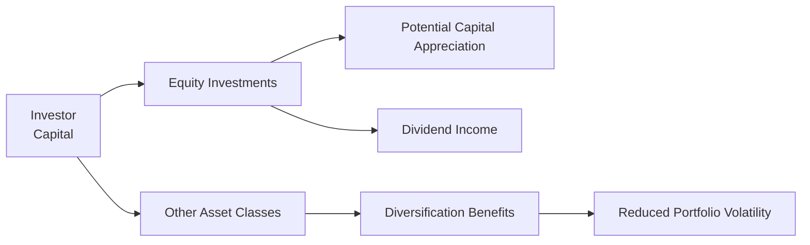

## Introduction
Sometimes, when folks hear the word “equities,” it can sound a bit intimidating—like some high-stakes, exclusive club that only professionals get to join. In reality, equities (often called “stocks”) are simply shares of ownership in a company, letting you—and me, and anyone else—have a small piece of the business’s action. That stake brings along the chance to benefit from the company’s success, whether that’s through an increase in the share price (capital appreciation) or through regular distributions of cash (dividends).

And so, here’s the big question: Why do we care about equities in our portfolios? Well, if you’re like me, you probably want your money to grow steadily over time. As we’ll see, equities play a crucial role in achieving long-term growth. They often (but not always) provide higher returns than other asset classes, such as bonds or cash. But of course, this potential for higher returns comes with greater risk and volatility. Let’s explore how we can strategically use equities to strike that right balance between risk and return.

## Equities as a Cornerstone of Ownership
When you buy a stock, you acquire a stake in the company—meaning you effectively own a slice of its assets, profits, and inherent risk. So if the company’s business grows and prospers, your equity investment can generate capital appreciation as share prices rise. Or, if the company chooses to distribute some of its earnings, you may receive dividends. And for many of us, reinvesting those dividends over the years can meaningfully compound returns.

### Capital Appreciation
Capital appreciation simply means your stock is worth more than what you paid for it. The catch? Share prices can also go down. So, if you need your money next week to fix your car or pay next month’s rent, you might have a volatile and unpredictable source of funds in equities. But if your time horizon is years—or decades—equities become a powerful growth engine in a portfolio.

### Dividends and Periodic Income
Dividends are often seen as a bonus. Some companies share their profits with shareholders in the form of dividend payouts. These can be taken as cash or reinvested back into more shares (often automatically, via a Dividend Reinvestment Plan, or DRIP). Over the long run, reinvesting dividends can be a game-changer because you’re steadily buying more shares without needing to contribute additional capital out of pocket. That compounding effect might feel slow at first but can become surprisingly potent over time.

## How Equities Fit Into a Diversified Portfolio
A well-diversified portfolio might hold a mixture of stocks, bonds, real estate, cash, and even alternative assets. Why bother mixing it all up? Because you don’t want your entire fortune riding on a single economic scenario—like a single sector boom or wave of market optimism. By combining equities with other investments that don’t move exactly in lockstep, you can potentially reduce risk and smooth out your overall returns.

### Correlation with Other Asset Classes
Correlation measures the degree to which two asset classes move together. Bonds and equities often move in different patterns in response to economic changes: for instance, bond prices may rise if interest rates fall, whereas equities may respond more directly to corporate earnings or macro signals like GDP growth. Historically, having a chunk of equities and a chunk of bonds (plus maybe some real estate or alternatives) has provided a sensible way to diversify.

When equities in your portfolio wobble, sometimes other parts of your portfolio can hold steady or even move in the opposite direction, offsetting some of the potential losses. That’s a simplified version, of course—markets are never quite that predictable. But for the purpose of prudent risk management, mixing uncorrelated (or less correlated) assets is generally a best practice.

## Matching Equities to Risk Tolerance and Time Horizon
A big piece of your investing strategy depends on how much volatility you can handle (risk tolerance) and how long you can keep your money invested (time horizon). If you’re 25 years old and saving for retirement, you might be able to stomach a more substantial allocation to equities. After all, you’ve got decades to ride out market dips and recessions. But if you’re 63 and planning to retire in a few years, you may have less time to recover from a big drop in the market. That typically means a smaller portion in equities and possibly more fixed-income assets.

### Younger or More Aggressive Investors
Younger individuals or those with a high tolerance for risk may opt for large equity allocations—even 80% or more—aiming for higher returns. Their logic is that bear markets eventually turn around, giving them time to recoup losses. Meanwhile, the higher growth potential can help build wealth faster.

### Conservative or Near-Retirement Investors
On the flip side, a more conservative investor might be content with a moderate equity allocation—say 40%—to provide growth potential without exposing the bulk of their retirement nest egg to significant losses. This might also involve focusing on dividend-paying stocks or indices that exhibit lower volatility—think “blue-chip” companies with stable earnings.

## The Value of Dividend Reinvestment
I remember the first time I reinvested my dividends. I had a small position in a utility company that paid a decent dividend. Instead of receiving a small cash sum every quarter, I turned on DRIP to buy more shares. At first, it was barely noticeable—like picking up pennies on the street. But after a few years, I had a few more shares, which in turn kicked off slightly bigger dividends, and then those dividends bought more shares. Before I knew it, my position had grown in a self-reinforcing cycle. This is the magic of compounding.

And, by the way, you can do the same thing in index funds or exchange-traded funds (ETFs). Many ETFs allow dividend reinvestment at no extra cost, which is super handy for letting compounding do its thing automatically.

## Factors That Influence Equity Prices
Equities are not priced in a vacuum. Both macroeconomic and microeconomic factors can influence how stocks trade:

- Macroeconomic Indicators: GDP growth, interest rates, inflation, and consumer spending patterns. For example, higher interest rates can be a drag on stock prices because they raise the cost of capital for companies.  
- Microeconomic Drivers: Company earnings, quality of management, product demand, competition, and corporate strategy. If a tech company launches a revolutionary new product that captures the market’s imagination, you can bet the stock price might surge.

Market behavior can sometimes be emotional (driven by investor sentiment), so you might see share prices swing widely even when fundamentals are stable. It’s all part of the equity landscape.

## Determining the Appropriate Equity Allocation
Allocating your portfolio to equities is often about linking your objectives, risk capacity, and liquidity needs. If you have near-term cash needs—like paying college tuition soon—then over-allocating to equities could be risky if a downturn hits at the wrong moment. On the other hand, if your main focus is building long-term wealth, a heavier equity allocation might be warranted.

In practice, many investors use a core-satellite approach. For instance, you may put 60% of your portfolio in broadly diversified equity funds (the “core”) and reserve another 20% for more niche equity investments (the “satellite”). The remaining 20% might be kept in bonds or cash equivalents for stability. Whatever approach you choose, it’s valuable to formalize your target allocations.

## Rebalancing and Staying on Course
Even a well-chosen portfolio can drift off track if you don’t check in occasionally. Suppose you started with 60% equities and 40% bonds. Over a strong market cycle, your equity portion might swell to 70% of your portfolio simply because equities performed better than bonds. That’s a sign you might want to sell some stocks and buy bonds, restoring the 60/40 ratio. This systematic process is called rebalancing. It helps you control risk and stay faithful to your original plan.

Below is a simplified diagram illustrating how equity investments fit into a diversified portfolio context:

Notice how equities flow alongside other asset classes. Together, they enhance diversification and potentially reduce total portfolio volatility.

## Example: Potential Growth from Dividend Reinvestment
Let’s say you invest \$10,000 in an equity fund that yields around 3% in dividends annually, and its share price grows at 5% per year. You decide to reinvest your dividends:

• Year 1:  
  - Dividend = 3% of \$10,000 = \$300  
  - Capital appreciation = 5% of \$10,000 = \$500  
  - End of Year 1 Value (reinvesting dividends) ≈ \$10,800  

• Year 2:  
  - New principal = \$10,800  
  - Dividend = 3% of \$10,800 ≈ \$324  
  - Price growth = 5% of \$10,800 ≈ \$540  
  - End of Year 2 Value ≈ \$11,664  

And so on. Each year’s dividends become part of the next year’s starting balance. Over decades, that extra compounding can play a big role in boosting your overall returns.

## Practical Takeaways for the CFA® Exam and Beyond
• Equities provide an ownership stake in a company, offering potential for both capital appreciation and dividend income.  
• They serve as a major driver of long-term growth in a diversified portfolio, but carry higher risk and volatility compared to bonds or cash.  
• The correlation of equities with other asset classes can be favorable for diversification and overall risk mitigation.  
• Matching your equity allocation to your risk tolerance and time horizon is essential—there’s no one-size-fits-all formula.  
• Dividend reinvestment can generate powerful compounding benefits.  
• Monitoring macro (economic growth, interest rates, inflation) and micro (company specific) factors is key to understanding potential equity price movements.  
• Rebalancing helps maintain your desired risk profile over time.

## Glossary
- **Equity:** A share representing proportional ownership in a company.  
- **Capital Appreciation:** The increase in the value of an asset or investment over time.  
- **Dividend:** A distribution of a portion of a company’s earnings to its shareholders.  
- **Risk Tolerance:** The degree of variability in investment returns that an individual is willing to withstand.  
- **Diversification:** An investment strategy that mixes a wide variety of investments within a portfolio to reduce risk.  
- **Correlation:** A statistical measure of how two securities move in relation to each other.  
- **Rebalancing:** The process of realigning the proportions of assets in a portfolio as markets fluctuate.  
- **Portfolio:** A grouping of financial assets such as stocks, bonds, and cash equivalents.

## References and Further Reading
- Bodie, Z., Kane, A., & Marcus, A. (2021). “Essentials of Investments.” McGraw-Hill.  
- CFA Institute. (n.d.). “Diversification: How Much Is Enough?” Available at: [https://www.cfainstitute.org/](https://www.cfainstitute.org/)  
- Reilly, F. & Brown, K. (2012). “Investment Analysis & Portfolio Management.” South-Western Cengage Learning.  

## Test Your Knowledge on Equities in a Portfolio



### Which of the following best describes the key benefit of holding equities in a portfolio?
- [ ] They ensure the portfolio has no volatility.  
- [ ] They replicate the exact movement of bond prices.  
- [ ] They eliminate the need to invest in alternative assets.  
- [x] They provide potential for capital appreciation and dividend income.  

> **Explanation:** Equities offer ownership in a company that can lead to price increases over time (capital appreciation) and periodic income (dividends).

---

### Which statement about equities is most accurate regarding risk management?
- [ ] Equities and bonds always move in the same direction.  
- [ ] Equities help reduce risk only when used as the sole asset class.  
- [x] Equities can enhance risk-adjusted returns when combined with other assets.  
- [ ] Equity risk is identical to cash risk.  

> **Explanation:** Equities typically have a different risk-return profile and can provide diversification benefits when paired with other asset classes.

---

### From a diversification standpoint, how do equities typically behave relative to bonds?
- [x] Equities generally have lower correlation with bonds than with similar growth stocks.  
- [ ] Equities track bond performance exactly.  
- [ ] Equities always move in the opposite direction of bonds.  
- [ ] Equities and bonds are perfectly correlated.  

> **Explanation:** While equities and bonds sometimes move together, historically they often exhibit lower correlation, making them useful for diversification.

---

### For investors with a longer time horizon and higher risk tolerance, which of the following allocation strategies might be most appropriate?
- [x] A relatively high percentage of equities to benefit from potential higher returns.  
- [ ] A small percentage of equities, mostly focusing on short-term bonds.  
- [ ] Zero equities, fully invested in cash.  
- [ ] No diversification strategy at all.  

> **Explanation:** Longer horizons let investors ride out short-term fluctuations in the stock market, positioning them to capture equities’ historically higher returns.

---

### How does dividend reinvestment typically affect an investor’s returns over the long term?
- [ ] It has no impact on long-term returns.  
- [x] It can significantly boost returns through compounding.  
- [ ] It only matters for large-cap stocks.  
- [ ] It is illegal without specific regulatory approval.  

> **Explanation:** By reinvesting dividends, an investor purchases more shares, which can generate more dividends in the future—leading to a compounding effect.

---

### Which macroeconomic factor is most likely to influence equity valuations?
- [x] Interest rate levels set by central banks.  
- [ ] The color of corporate branding.  
- [ ] The personal opinion of non-shareholders.  
- [ ] Random coin tosses.  

> **Explanation:** Interest rates significantly affect corporate borrowing costs and investor risk preferences, impacting equity valuations.

---

### A portfolio has grown from 60% equities to 75% equities due to strong market performance. Rebalancing typically involves:
- [x] Selling some equities and buying other assets like bonds to return to the target allocation.  
- [ ] Buying more equities to accelerate growth.  
- [ ] Firing the portfolio manager.  
- [ ] Making no changes ever.  

> **Explanation:** Rebalancing reverts the portfolio to its intended risk profile (for example, 60/40) rather than letting equity exposure grow unchecked.

---

### An investor with low risk tolerance nearing retirement might:
- [ ] Allocate nearly 100% of their portfolio to high-volatility tech stocks.  
- [ ] Sell most of the bonds to ramp up equities.  
- [x] Keep a modest equity allocation while emphasizing more stable assets like bonds.  
- [ ] Invest solely in alternative assets with no track record.  

> **Explanation:** Near-retirement individuals often hold a smaller equity component to reduce volatility and protect principal.

---

### When analyzing a stock, which factor would fall under “microeconomic” drivers?
- [ ] Changes in international trade law.  
- [ ] Fluctuations in annual inflation rates.  
- [x] Company earnings projections and quality of management.  
- [ ] Broad supply-and-demand balances in global oil markets.  

> **Explanation:** Microeconomic factors are specific to the company itself, such as earnings, product lines, and managerial decisions.

---

### True or False: Equities can completely eliminate risk in a portfolio.
- [x] False  
- [ ] True  

> **Explanation:** Equities do not eliminate risk; in fact, they carry meaningful volatility. However, when used as part of a balanced strategy, they help improve the potential for higher long-term returns.


