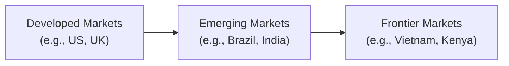

## Understanding Emerging and Frontier Markets

Equity investors often get excited about the “next big thing,” and, in many instances, that phrase points to emerging and frontier market equities. These markets tend to offer substantial growth potential—think youthful demographics, growing middle classes, and accelerating industrialization—coupled with, let’s be frank, higher volatility and unique risks. In this section, we’ll dig into what differentiates emerging markets (such as Brazil or India) from frontier markets (such as Vietnam or Kenya), how both fit into a global equity portfolio, and what to watch out for in terms of regulation, liquidity, and due diligence.

### Why These Markets Matter

Let’s say you’re building a diversified equity portfolio that already has exposure to the U.S., Western Europe, and perhaps Japan. Traditionally, those are the big, developed players. However, maybe you’re also intrigued by the fast-paced expansion in China or you’ve been hearing rumors of robust consumer demand in South Africa. Adding equity positions from these newer growth hubs can offer diversification benefits. Markets in Brazil, India, Indonesia, or frontier economies like Vietnam and Lebanon might not move in lockstep with the S&P 500. Plus, strong demographic factors—like a growing middle class—could drive future corporate earnings growth.  

On the other hand, it’s important to keep your risk radar switched on. Regulatory environments in these countries can be more fluid, and currency impacts can complicate returns. Still, many investors look to emerging and frontier markets to capture higher returns in exchange for higher risk.

### Distinguishing Emerging and Frontier Markets

There’s some debate about how firms like MSCI, S&P Dow Jones Indices, or FTSE classify a market as “emerging” or “frontier.” Typically, it hinges on factors like market size, liquidity, and accessibility—this includes trading volume, daily turnover, and how straightforward it is for foreign investors to enter and exit the market.

- Emerging Markets: These are countries experiencing rapid growth and industrialization, but that may not have all the structural features of fully developed economies. For instance, India’s capital markets are sizable, but certain segments remain less mature compared to advanced markets like the U.S. or Germany.  
- Frontier Markets: Even smaller and less liquid than emerging markets, frontier markets often have fewer tradeable securities and more limited disclosure. While that can mean higher risk, it might also present compelling growth opportunities as their economies develop and governance standards improve over time.

From a practical standpoint, frontier markets might have narrower bid-ask spreads (in percentage terms they can be quite wide, but in absolute liquidity terms they can be fairly thin markets) and heavier processing fees, while emerging markets tend to be more developed than that, though still well behind major markets like the U.S.

### Quick Visual Overview

Below is a simple Mermaid diagram illustrating the relationship between developed, emerging, and frontier markets:

### Growth Potential and Demographics

A prime attraction of emerging and frontier markets is the growth narrative. Many of these economies embrace:

- Younger populations.  
- Rapid urbanization and industrialization.  
- Growing middle-class consumer bases.  
- Expansion in infrastructure, technology, and financial services.

For instance, if you’ve walked around Mumbai in India, you might have observed more construction cranes than you can count, reflecting robust infrastructure development. While these shifts can drive corporate earnings, the markets remain susceptible to political or policy changes, such as abrupt currency controls or unexpected regulatory hurdles.

### Key Risk Considerations

1. Political & Regulatory Risk  
   Governments in emerging and frontier markets can shift policy abruptly. A new administration might impose capital controls or revise investment rules overnight. This can be nerve-wracking for foreign investors.  

2. Currency Risk  
   Currencies in these markets can be volatile, so any returns in local currency could be eroded by depreciation relative to your home currency. Hedging costs, liquidity, and forward market availability can all vary significantly.  

3. Economic Instability and Reduced Transparency  
   Sometimes economic data is less reliable. Corporate documents might not be as robust, and auditing practices may not always align with international best practices. A company’s annual report can be incomplete or delayed. You often need deeper due diligence.  

4. Liquidity Constraints  
   Frontier markets in particular commonly face lower daily trading volumes and wider bid-ask spreads. Attempting to exit a large position quickly can move the market price against you or cause significant transaction costs.  

5. Settlement and Infrastructure Issues  
   Settlement times can be longer; custodial and clearing institutions might not be as advanced. Some frontier markets may have T+5 or less efficient settlement systems, which complicates position management.

### The Importance of Due Diligence

“Due diligence” is one of those finance catchphrases that usually translates into “Look carefully, really carefully!” For emerging and frontier markets, it is even more critical:

- Company-level research: Verify the management’s track record, competitive position, and official filings.  
- Macroeconomic environment: Watch out for high inflation, unsustainable deficits, and political climate.  
- Regulatory environment: Understand repatriation rules, possible taxes on foreign investors, and the enforceability of contracts.

I recall a situation a colleague shared about investing in a small frontier-market bank. The bank’s financials looked promising—strong deposit growth, decent net interest margins. But lurking beneath the surface was a new regulatory change around minimum capital requirements. Ultimately, that bank faced a capital shortfall and had to raise funds at disadvantageous terms, which significantly diluted existing shareholders. Moral of the story: keep an eye on changing policies as you do your fundamentals.

### Liquidity Constraints

Especially in frontier markets, let’s not sugarcoat it: liquidity can dry up. You might see a 2%–3% bid-ask spread even for what’s considered a “blue chip” local stock. Suddenly, if the market environment changes or political unrest flares, volumes might drop, and the spreads might widen further. From a portfolio management standpoint, plan for potential lock-ups of capital. If you have a short-term horizon, illiquid frontier markets can become tough.  

### How Index Providers Classify Markets

Index providers such as MSCI or FTSE periodically reassess countries to see whether they still meet criteria. For example, countries must demonstrate:

- Minimum levels of liquidity and market capitalization.  
- Sufficient openness to foreign investors (capital flows).  
- Adequate regulatory framework and classification status.

A shift in classification, say from frontier to emerging (or vice versa), can cause significant fund flows as passive products tracking an “emerging markets” index no longer incorporate those securities, or newly incorporate them. For instance, when MSCI upgraded Qatar from frontier to emerging market status several years ago, the Qatari market experienced a surge of inflows. Of course, such inflows can create short-term spikes in valuations, so it’s important to keep an eye on reclassification announcements.

### Potential Diversification Benefits

From a portfolio perspective, emerging and frontier markets—while correlated with global markets—can still offer pockets of diversification. For example, an agriculture-based frontier market might have an economic cycle less aligned with a technology-driven developed market. But correlation structures can shift during global crises, when all equity markets might drawdown in tandem. Historically, though, if you measure correlations over multiple years, you can sometimes see that emerging and frontier equities provide additional diversification benefits.  

### Infrastructure and Settlement Systems

Imagine trying to settle a transaction for a Kenyan stock if the local settlement system is offline or has limited connectivity. Or dealing with a local currency that can’t be freely converted. These are real issues. Frontier markets may require that foreign investors hold separate local custody accounts, or they might have daily foreign exchange conversion caps.  

This is where a solid prime broker or custodian can be your best friend. The right partnership can help you navigate local market requirements, handle corporate actions, and manage the settlement process. Always ensure that your broker has experience in the market you’re trading in and that you confirm the custodian’s reliability.

### Practical Example: Investing in a Frontier Consumer Goods Company

Let’s say you’re evaluating a consumer goods firm in Kenya. The brand is well known domestically. You believe that as urbanization rises in Kenya and neighboring countries, demand for packaged and processed products will grow. You’ve built a discounted cash flow (DCF) model with strong revenue growth assumptions based on demographic trends.  

But you should also factor in the following:  
- Kenya’s currency (KES) volatility: If the KES weakens against the USD, your USD-based returns are diminished.  
- Political situation: Upcoming elections might cause a slowdown in consumer spending or volatility in the stock market.  
- Liquidity: If you wish to sell a sizable position quickly, can the local market handle it? If not, the impact cost might be large.  
- Regulatory shifts: Government might impose new labeling requirements or fines that affect profit margins.

### Best Practices and Common Pitfalls

• Start Small and Diversify: Try not to allocate a disproportionate chunk of your portfolio to a single frontier region. Spread your bets.  
• Keep an Eye on Valuations: Don’t be lured just by a “growth story.” Make sure valuations—price multiples, DCF assumptions—are in a sensible range.  
• Monitor Corporate Governance: Board independence and transparency might not be as robust as in developed markets. Sometimes controlling shareholders hold large stakes or dual-class shares that limit minority rights.  
• Hedge Currency if Feasible: If currency derivatives are available and cost-effective, you might manage your FX exposure. But be aware that local hedging can be expensive.  
• Manage Liquidity Risk: In times of crisis, frontier markets can seize up. Make sure your liquidity profile aligns with your investment horizon.

### Conclusion

Emerging and frontier market equities inject excitement and potentially eye-catching returns into a portfolio. But, let’s be real: they come with unique obstacles—lack of transparency, political risk, currency fluctuations, liquidity constraints, you name it. A thoughtful approach that factors in robust due diligence, risk mitigation strategies, and awareness of local quirks can help unlock the potential of these markets in a global equity allocation.  

### Final Exam Tips

• Check Classification Requirements: A scenario might describe a country on the cusp of reclassification—be ready to discuss how that might affect fund flows and valuations.  
• Incorporate Currency Risk: Exam item sets could require you to calculate total returns after accounting for currency movements.  
• Factor in Political & Regulatory Shifts: If a question references a sudden change in capital controls, be prepared to integrate that into your analysis of liquidity or cost of capital.  
• Evaluate Due Diligence Measures: You may be asked how to handle weaker accounting standards or greater potential for fraudulent financial reporting.  
• Time Management: Keep a watchful eye on the complexities. If a question sets up a frontier market scenario with unusual settlement rules, that’s probably a hint you should address settlement risk.

## Glossary

• **Emerging Markets:** Nations with social or business activity in the process of rapid growth and industrialization (e.g., India or Brazil).  
• **Frontier Markets:** Smaller and less liquid markets than emerging markets (e.g., Vietnam or Kenya).  
• **Bid-Ask Spread:** The difference between the highest price a buyer is prepared to pay and the lowest price a seller is willing to accept.  
• **Fund Flows:** Net inflows or outflows of capital into investment vehicles like mutual funds or ETFs; can affect prices if flows are large.  
• **Index Provider (MSCI, FTSE):** Firms that create indices serving as performance benchmarks or bases for ETF investments.  
• **Settlement System:** The infrastructure that handles the transfer of securities and payments between buyers and sellers.  
• **Currency Convertibility:** The ease with which a country’s currency can be exchanged for another currency.  
• **Due Diligence:** Thorough appraisal of a company or market to gauge its real financials, risk exposures, and growth prospects.

## References

- MSCI. (n.d.). “Emerging Markets Index Metrics.” Available at: [https://www.msci.com/](https://www.msci.com/)  
- CFA Institute Research Foundation. “Investing in Frontier Markets.”  

## Practice Questions: Emerging and Frontier Market Equities Mastery



### Which factor(s) primarily distinguish(es) frontier markets from emerging markets?

- [ ] Higher trading volumes and stricter regulations.
- [ ] Lower economic growth and inflation.
- [x] Smaller market capitalization and less liquidity.
- [ ] More stable regulatory frameworks and currency controls.

> **Explanation:** Frontier markets typically have smaller market capitalizations, lower liquidity, and less mature regulatory structures than emerging markets.

### A country on the verge of moving from frontier to emerging market status typically expects what immediate consequence?

- [x] Significant inflows from index-tracking funds.
- [ ] Consistent devaluation of its currency.
- [ ] Decrease in bid-ask spreads due to reduced market interest.
- [ ] Regulatory rollback limiting foreign investment.

> **Explanation:** Once a country is reclassified to emerging status, it usually joins major emerging market indices. Passive index funds then allocate capital to it, often causing near-term inflows.

### Currency convertibility in an emerging or frontier market is critical because:

- [ ] It guarantees stable returns.
- [x] It affects investors’ ability to repatriate funds.
- [ ] It always lowers transaction costs for investors.
- [ ] It permanently removes political risk.

> **Explanation:** If a country enforces strict currency controls or lacks convertibility, it can be difficult (and in some cases impossible) for foreign investors to convert local currency proceeds back into their home currency.

### A potential advantage of including frontier market equities in a global portfolio is:

- [x] Possible diversification benefits due to lower correlations.
- [ ] Guaranteed higher returns than developed markets.
- [ ] Minimal volatility risk.
- [ ] Immediate acceptance in all major stock indices.

> **Explanation:** Frontier market equities can, at times, exhibit lower correlations with developed markets, thus potentially offering diversification benefits. However, they come with higher risk and no guarantee of higher returns.

### When performing due diligence on an emerging market issuer, which factor is often a heightened concern compared to developed market equities?

- [ ] The presence of highly standardized accounting practices.
- [x] Access to reliable and timely corporate financial disclosures.
- [ ] Stringent capital adequacy standards by regulators.
- [ ] Absence of any currency effects.

> **Explanation:** Emerging market companies often have less consistent or less accessible financial disclosures compared to developed market firms, necessitating deeper investigative research.

### The bid-ask spread in many frontier markets tends to be:

- [ ] Negligible, as robust trading volumes keep spreads narrow.
- [ ] Exactly the same as in well-established global exchanges.
- [x] Wider, reflecting lower liquidity and higher transaction costs.
- [ ] Nonexistent, because trading is conducted entirely off-exchange.

> **Explanation:** Because of thinner liquidity and less market depth, frontier markets often see relatively large bid-ask spreads.

### An investor worried about abrupt changes in government leadership and policy in an emerging market is concerned about:

- [x] Political risk.
- [ ] Counterparty risk.
- [ ] Operational risk.
- [ ] Inflation hedging risk.

> **Explanation:** Political risk encompasses abrupt changes in regulations, leadership transitions, and any government actions that can disrupt market conditions.

### If MSCI downgrades a country from emerging to frontier, one immediate effect might be:

- [x] Automatic selling by funds tracking emerging market indices.
- [ ] Mandatory currency devaluation set by the central bank.
- [ ] Immediate improvement in settlement infrastructure.
- [ ] Elimination of foreign investor access.

> **Explanation:** A downgrade from emerging to frontier often leads to forced selling by passive investment vehicles that track the emerging market benchmark, as the country’s equities are dropped from that index.

### What is a primary reason that emerging and frontier equity markets may offer higher growth potential?

- [x] Rapid urbanization and industrialization can boost corporate earnings.
- [ ] Strict capital controls keep foreign investment out of the country.
- [ ] They have more robust legal structures than developed markets.
- [ ] Their currencies are pegged to hard currencies like USD or EUR.

> **Explanation:** Rapid industrialization, expanding infrastructure, and favorable demographics often underlie the higher growth potential in emerging and frontier markets.

### Frontier markets generally have lower correlations with developed markets, which can:

- [x] Enhance portfolio diversification.
- [ ] Completely eliminate risk from a portfolio.
- [ ] Replace the need for investment in developed markets.
- [ ] Ensure higher overall returns in any phase of the business cycle.

> **Explanation:** Including lower-correlation assets (like some frontier markets) may improve diversification benefits within a portfolio. It doesn’t guarantee higher returns or risk elimination, but it can help reduce overall portfolio volatility.


