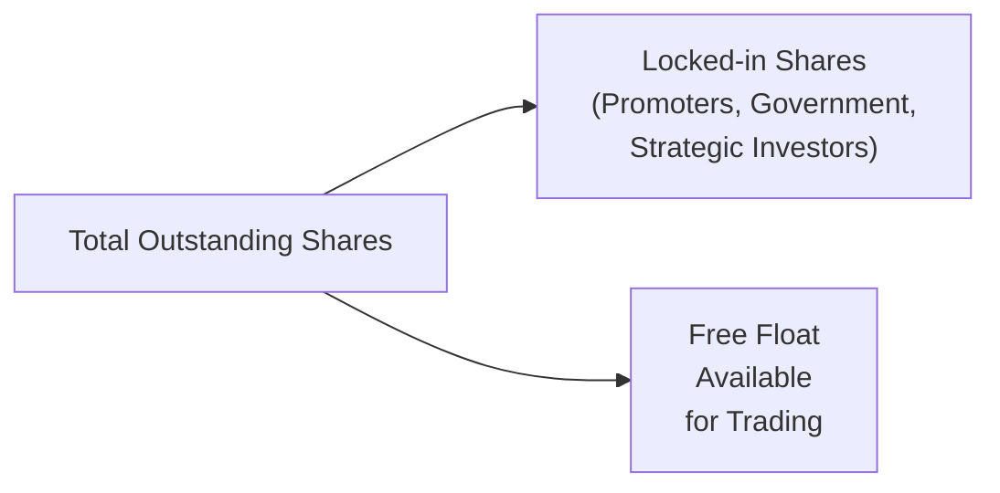

## Overview and Importance

Free float—and the liquidity it fosters—stands at the heart of an effective equity market. In essence, free float is that subset of a company’s outstanding shares readily available for trading in the open market. Any shares locked away by corporate insiders, governments, or long-term strategic investors are generally excluded from the float because they rarely change hands.

The size and nature of a company’s free float help shape its level of liquidity, or the degree to which shares can be easily bought and sold without causing significant price distortions. This relationship is critical for investors aiming to manage trading costs and minimize price impact when establishing or unwinding positions. As we explore free float and liquidity in detail, we’ll discover how they drive the core mechanics of market structure, valuation, indexing, and day-to-day trading activity.

## Defining Free Float

Free float can be expressed as:

Free Float = (Total Outstanding Shares) – (Restricted Shares)

Restricted shares could include:  
• Shares held by company promoters or founders and not meant to be traded.  
• Stakes owned by governments as part of a privatization effort with lock-up clauses.  
• Shares owned by strategic investors or business partners, where sale is restricted by contractual agreements or other conditions.  

The number of shares that remain after removing these restricted holdings constitutes the free float. This metric is generally expressed as a percentage of total outstanding shares.

### Quick Example

∙ Imagine a firm with 50 million total outstanding shares.  
∙ Of these, 10 million are owned by insiders and remain almost certainly off-limits for trading.  
∙ Another 5 million might be restricted through lock-up arrangements.  

Hence, free float = 50 million – (10 million + 5 million) = 35 million shares, which is 70% of the total outstanding shares. 

That 70% ratio often appears in equity research reports, disclosing to investors how readily tradable shares truly are.

## Relationship Between Float and Liquidity

### Liquidity Basics
Liquidity in equity markets refers to how quickly securities can be bought or sold at a stable market price. In highly liquid stocks, a trader can purchase or liquidate a substantial position without causing dramatic price fluctuations. Conversely, in illiquid markets, even moderately sized orders may push the price significantly.

A larger free float typically coincides with better liquidity conditions because:  
1. There are more shares available for trading.  
2. Greater participation from a broader range of investors often narrows bid-ask spreads.  
3. Continuous buying and selling activity fosters more robust price discovery.

### Low-Free-Float Challenges
Stocks with a very small free float can experience heightened volatility and wider bid-ask spreads—forces that make it harder for traders or portfolio managers to enter and exit positions without incurring higher costs. A well-intentioned buy order or sell order can, in effect, create a temporary liquidity shock, driving prices drastically up or down.

This dynamic often surfaces in emerging or frontier markets (see Section 1.10 of this text for more details) where promoters or local governments retain large ownership stakes, leaving fewer shares for active market participants.

## Visualizing Free Float Allocation

Below is a simple diagram illustrating how total outstanding shares break into restricted and floating shares:

In this diagram, “Locked-in Shares” include any shares not typically available to the voting public market, while “Free Float” remains easily obtainable through stock exchanges.

## Regulatory Considerations: Public Float Requirements

Many stock exchanges or regulatory authorities mandate a minimum level of public float for a company to be listed. This approach targets two main goals:

• Transparency: A broader shareholder base can lead to more robust disclosure practices and accountability.  
• Liquidity: Regulators want listings that generate an active secondary market, benefiting both investors and the exchange’s reputation for orderly trading.

For instance, certain major exchanges worldwide may require that at least 10–25% of a company’s shares be publicly traded. Failure to maintain this threshold could force a delisting unless the firm addresses the shortfall by issuing additional shares or having insiders reduce their positions.

## The Role of Lock-Up Periods

A lock-up period is an interval—often following an initial public offering (IPO)—during which company insiders, venture capitalists, or early-stage investors are contractually prohibited from selling their shares. These restrictions, common in equity offerings, aim to stabilize the stock price by limiting insider selling and building market confidence.

• During the lock-up, the free float is effectively smaller.  
• Once it expires, the company’s free float can expand instantly if insiders and early-stage investors decide to sell their stakes.  

This sudden expansion in tradable shares may put downward pressure on the price if the market perceives an increase in sell orders. Conversely, if insiders retain their holdings and demonstrate confidence, share prices might remain stable despite the expanded float.

### Example: Observing a Post-IPO Lock-Up

Consider a high-profile technology IPO. On the day of listing, only 20% of the total outstanding shares are made available for trading. Six months later, the lock-up expires, freeing an additional 10% of shares. This effectively raises the free float from 20% to 30%. If insiders rush to sell for profit or diversification, the market could face downward pressure. However, if they remain optimistic, only a fraction of those newly unlocked shares may come to market, and prices may hold steady.

## Free Float–Adjusted Indexes

Most major equity benchmarks—think MSCI and FTSE Russell—adopt free float–adjusted methods in their index construction. The rationale is straightforward: an index aims to track the performance of truly tradeable shares rather than untradeable insider stakes. Weighting stocks according to their publicly available shares can give a more accurate picture of market movements and reduce the distortive effect of large insider positions.

### Index Weighting Example

Assume two companies, each with $10 billion in total market capitalization.  
• Company A has 80% of its shares in free float.  
• Company B has only 40% in free float.  

Using free float–adjusted weighting, Company A’s float-adjusted market cap is $8 billion (80% of $10 billion), whereas Company B’s is $4 billion. In a float-adjusted index, Company A will have twice the weight of Company B. This difference can be significant when indexes consider stock additions or deletions, influencing portfolio managers tracking that index.

## Price Discovery and Market Efficiency

### Tighter Spreads and Robust Trading
A healthy free float typically promotes narrower bid-ask spreads, as a more balanced set of buyers and sellers competes to transact. Tighter spreads foster efficient price discovery—where share prices immediately adjust to new and relevant information. For market participants who watch intraday price movements closely or engage in high-frequency trading (see Chapter 2.5), a robust free float can reduce the risk of large, sudden price swings triggered by moderate-sized orders.

### Thin Float and Volatility
Conversely, extremely thin floats can sow volatility. Even well-intended, modest volume trades might temporarily move share prices away from fundamentals, at least until other market participants step in to rebalance. This phenomenon can be troublesome for long-term investors such as pension funds, endowments, or large portfolios that risk “moving the market” simply by buying or selling in normal course.

## Liquidity Metrics and Considerations

1. Share Turnover Ratio:  
   • Defined as trading volume over a given period divided by the average number of shares outstanding (or free-floating shares).  
   • A higher turnover ratio suggests that shares change hands more frequently, indicating higher liquidity.  

2. Average Daily Volume (ADV):  
   • Expressed in share count or currency volume (e.g., average daily dollar volume).  
   • Many portfolio managers review ADV to see if a market’s size can handle their trades without excessive price impact.  

3. Bid-Ask Spread:  
   • The narrower the spread, the less costly it is for a trader to buy or sell.  
   • Stocks with higher free float usually exhibit narrower spreads due to a richer order book.  

4. Market Depth:  
   • Represents how much volume can be transacted within a given price range without significantly moving the price.  
   • Securities with deeper markets also tend to have larger floats, as more shares are available and more participants are placing buy and sell orders.

### A Practical Illustration

Suppose a portfolio manager needs to purchase $5 million worth of shares in a mid-sized company. If the company’s free float is substantial, there is a higher likelihood that her buy order can be filled quickly, with minimal price slippage. Conversely, if the free float is tightly held and daily volume is low, the manager may need to split her order into smaller “chunks” over multiple days to avoid pushing the price up. This scenario can increase both the direct trading costs and the time risk that the desired exposure is not established promptly.

## Strategic Significance for Investors

### 1. Portfolio Construction
Investors constructing diversified portfolios might seek large, liquid stocks with deeper free floats to simplify entry and exit. That doesn’t mean smaller or lower-float stocks are automatically avoided; rather, managers must weigh the potential for higher returns against the challenges of illiquidity.

### 2. Risk Management
Short-term volatility can spike in low-float stocks, especially around earnings releases, corporate actions, or macro events. Portfolio managers who trade positions in these environments face bigger slippage risks. Stress testing and scenario analysis (see Chapter 8.4) help estimate how certain trades might affect prices under varied liquidity conditions.

### 3. Arbitrage and Event-Driven Strategies
In event-driven strategies—merger arbitrage, spin-offs, or activists building stakes—awareness of free float is key. A low float could lead to quick price surges if investors anticipate corporate actions or attempt to corner the market, while a higher free float suggests more trading equilibrium.

## Personal Perspectives

Many seasoned analysts can recall cases where a seemingly simple trade in a stock with thin float turned into a surprising roller coaster. It can be a humbling experience to watch your carefully planned order push the price away before you even finish filling half of it. That’s a real lesson in how free float and liquidity are not merely abstract concepts—they deliver tangible effects on everyday trading decisions.

## Common Pitfalls to Avoid

• Ignoring Lock-Up Expirations  
  Underestimating the effect of significant lock-up expirations can lead to big surprises. Always factor in large share releases that could hit the market.  

• Failing to Adjust for Free Float  
  Relying on total market capitalization, without removing restricted holdings, may overestimate the tradeable size of a company.  

• Overlooking Concentrated Holdings  
  Even if a stock’s free float appears sizable, large concentrated shareholders can effectively reduce the “operational” float by holding positions that they rarely trade.  

• Misjudging Volatility in Low-Float Stocks  
  Focusing exclusively on historical volatility while ignoring the stock’s float structure can be risky. Quick shifts in ownership might disrupt the trading landscape profoundly.

## Putting It All Together

Free float and liquidity considerations play a fundamental role in equity investment analysis, from day-to-day trading mechanics and risk management to index design and price discovery. A deeper free float generally broadens participation, fosters more stable markets, and enables cost-efficient trade execution. However, it’s essential to remember the influence of lock-up periods, regulatory requirements, and concentrated ownership in shaping the real free float of any equity.

Ultimately, a robust understanding of free float, liquidity metrics, and the interplay between them is vital for navigating modern equity markets—whether you’re a long-term investor or an active trader. Analysts and portfolio managers who continuously monitor free float changes stand a better chance of capturing opportunities and avoiding adverse price impacts.

## References and Further Reading

• Tiwari, A.K., & Kyaw, N.N.A. (2016). “Market Liquidity and Stock Returns.” The Quarterly Review of Economics and Finance.  
• FTSE Russell. (n.d.). “Free Float Methodology.” Available at: [https://www.ftserussell.com/](https://www.ftserussell.com/)  

--------------------------------------------------------------------------------

## Exam Tips

• Understand the Composition of Free Float: Know how to identify restricted shares (insiders, governments, strategic holdings) versus shares that are freely tradeable.  
• Watch Lock-Up Expirations: Potential expansions in free float due to lock-up releases can affect price stability.  
• Familiarize Yourself with Liquidity Metrics: Practice share turnover ratio and bid-ask spread calculations. You may see these appear in item sets or short-answer formats.  
• Relate to Market Efficiency: Recall how limited float can produce greater volatility and hamper price discovery.  
• Interpret Float-Adjusted Indexes: Recognize how indexing methodologies account for only the shares that are genuinely available in the market.  
• Time Management in Constructed-Response Questions: If asked to evaluate liquidity, show how to measure it (e.g., turnover ratio) and link it to free float considerations.

--------------------------------------------------------------------------------

## Test Your Knowledge: Free Float and Liquidity Quiz



### Which of the following best defines “free float” for a publicly listed company?
- [ ] Total outstanding shares including restricted shares.  
- [x] The portion of outstanding shares available for trading by the general public.  
- [ ] Government holdings plus insider shares.  
- [ ] The average daily volume of a company’s shares traded.  

> **Explanation:** Free float excludes restricted or locked-in shares held by insiders, governments, or long-term strategic holders.

### Which effect is a larger free float most likely to have on a company’s stock?
- [ ] Increased likelihood of forced delisting.  
- [ ] Higher bid-ask spreads.  
- [ ] Lower market capitalization.  
- [x] Enhanced liquidity and narrower bid-ask spreads.  

> **Explanation:** A higher free float typically improves liquidity and narrows the bid-ask spreads, as more shares are available for the public market.

### After an IPO, a lock-up period expires, causing insiders to be allowed to sell their shares. What is the most direct impact on the free float?
- [ ] No direct impact since insiders rarely sell.  
- [x] Increase in free float after the lock-up, as more shares become freely tradable.  
- [ ] Permanent freeze on additional share issuance.  
- [ ] Total outstanding shares immediately double in size.  

> **Explanation:** Expiration of lock-up periods often raises the free float by converting restricted insider shares into tradeable shares.

### Which of the following is the primary reason index providers use free float–adjusted methodologies?
- [ ] To exclude all small-cap securities from the index.  
- [ ] To exact a penalty on companies with strategic ownership blocks.  
- [x] To more accurately reflect the shares that are truly available for investors to trade.  
- [ ] To reduce tracking error in bond indexes.  

> **Explanation:** Major benchmark providers often adjust for float to ensure their indexes represent the actual “tradable” market.

### What typically happens when a stock with a relatively low free float faces a significant buy order?
- [ ] The bid-ask spread collapses.  
- [ ] The lock-up period restarts.  
- [x] The trading price may rise sharply due to limited available supply.  
- [ ] Market depth immediately increases.  

> **Explanation:** Limited tradable supply can amplify price moves if there’s sudden buying pressure.

### Suppose a company has 100 million outstanding shares, with 20 million owned by insiders under a strict lock-up. If no other restrictions apply, what is the approximate free float percentage?
- [ ] 20%  
- [ ] 80%  
- [x] 80% (80 million shares are free)  
- [ ] 100%  

> **Explanation:** The 20 million locked-in shares are excluded from the 100 million total, leaving 80 million freely tradeable shares, or 80% free float.

### Which of the following regulatory goals is best served by minimum public float requirements?
- [ ] Improving a company’s yield on earnings.  
- [x] Promoting market transparency and liquidity.  
- [ ] Shifting tax burdens away from insiders.  
- [ ] Forcing artificially higher prices.  

> **Explanation:** Exchanges and regulators enforce minimum float thresholds primarily to ensure sufficient liquidity and market transparency.

### A share turnover ratio compares:
- [x] Trading volume over a period to the number of shares outstanding (or free float).  
- [ ] Total market cap to company revenue.  
- [ ] The percentage of shares held by insiders to the total number of shares.  
- [ ] Required return to dividend yield.  

> **Explanation:** The share turnover ratio is a primary gauge of liquidity, reflecting trading frequency relative to overall shares in circulation.

### Why might a large institutional investor prefer stocks with higher free float?
- [ ] They always have higher dividend yields.  
- [x] It is easier for the investor to build and exit positions without moving the price too much.  
- [ ] Free float automatically ensures guaranteed capital gains.  
- [ ] Low-float stocks do not offer tax advantages.  

> **Explanation:** A high float boosts liquidity, making it simpler and cheaper for large investors to enter or exit positions without large price impact.

### True or False: A lock-up period automatically includes all shareholders, not just insiders or early investors.
- [ ] True  
- [x] False  

> **Explanation:** Lock-up periods typically apply to specific groups (e.g., founders, pre-IPO investors)—not to all shareholders.


