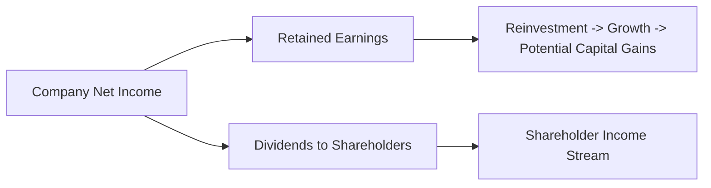

## Overview

Ever had that moment when a friend or classmate mentions, “I just banked a nice dividend check this quarter,” and you wonder whether you’re missing out by seeking capital gains only? Well, that’s precisely the core of this conversation: the split between capital gains (the profit you pocket when a stock’s price appreciates and you sell) and dividend income (regular payouts that some companies choose to distribute). Each has distinct appeals, tax treatments, and strategic considerations for individual investors and for institutional portfolios. Let’s clarify these concepts and highlight how they fit into an overall equity investment framework, especially in the context of building and managing a diverse portfolio.

## Basic Definitions and Investor Preferences

Capital gains represent the uplift in share price from when you purchased a stock to when you sell it. If you buy a share for USD 50 and sell it for USD 60, the USD 10 difference is your capital gain. In contrast, dividend income is a portion of the company’s profits paid to shareholders. This might be paid in cash or, sometimes, in the form of additional shares (stock dividends). 

Income-oriented investors often favor dividend-yielding stocks because these investors may rely on consistent cash flow to fund living expenses or meet spending rules in retirement. Growth-oriented investors, on the other hand, might prefer companies that reinvest earnings to expand their operations, target new markets, or fund acquisitions. These strategies hopefully drive share prices up over time, delivering capital gains.

But it’s not so cut-and-dried. Companies can use share repurchases as an alternative to paying dividends. A buyback reduces the total number of shares outstanding, which may increase the value of the remaining shares and benefit those looking for capital appreciation. As a prospective investor, you’ve got a choice: do you want that immediate cash return (i.e., dividends), or do you want to hold out for price appreciation in the long run (capital gains)? There’s no universal right answer—everything depends on an investor’s goals, risk tolerance, and even tax environment.

## Dividends: Signal of Corporate Health or Just a Tradition?

Some folks see dividend payouts as a powerful signal. If a company reliably declares and pays dividends, especially if they’ve got a record of raising their dividend annually, that consistency can imply financial stability. People often perceive such companies to have strong free cash flow and high corporate governance standards. However, it’s not always guaranteed—some companies may continue dividends even if they’re straining themselves to appear stable. That’s the so-called “dividend puzzle” outlined by Black (1976), the puzzle being: why pay dividends if they can be relatively tax-inefficient for shareholders?

Regardless, stable or growing dividends often attract investors looking for an income stream (think retirees who want to pay bills using dividend checks). Plus, consistent dividends can impose capital discipline on management by forcing them to return excess cash to investors rather than funneling it into questionable projects.

## Capital Gains: The Growth Perspective

Capital gains come into the equation when a firm focuses on retaining earnings to invest in new products, expansions, or M&A opportunities. This route aims to fuel future revenue growth and profitability, presumably driving the share price upward. The trade-off: no immediate cash payout for seeds that might bear fruit in the future. For growth-oriented investors or those willing to hold a stock for many years, capital gains can vastly outweigh potential dividend income.

Still, capital gains are never guaranteed. You might think you’re investing in a future Apple or Amazon and, well, sometimes the market changes course, or the strategic plan hits roadblocks, or new competitors erode that moat. This is why capital gains can be more volatile, typically requiring careful fundamental analysis of the company’s prospects, competitive standing, and management quality. 

## The Ex-Dividend Date and Price Behavior

Ex-dividend day is when new buyers no longer have the right to receive the declared dividend. If a dividend is declared for shareholders of record on July 15, then the stock’s ex-dividend date is usually a couple of business days before that. On the morning of the ex-dividend date, all else being equal, a stock’s price typically opens lower by approximately the dividend amount. For instance, if the declared dividend is USD 0.50 per share, the stock’s price might drop by around USD 0.50 at the open.

That price adjustment can seem confusing at first—some new investors think they can buy just before the ex-dividend date, claim the dividend, and sell immediately for a quick profit. Unfortunately, the market adjusts the price to reflect the upcoming payout. The drop in price typically neutralizes that advantage. So, timing purchases around the ex-dividend date rarely yields a free lunch. 

## Share Repurchases: The Alternative to Dividends

A share repurchase (often called a buyback) is when a company decides to use its available cash to buy back its own shares from the market. That might sound a bit odd—why would a company purchase its own stock? The logic is that a buyback can concentrate ownership by reducing the outstanding share count, boosting key metrics like earnings per share (EPS) and return on equity (ROE). Sometimes, it sends a signal that management believes the shares are undervalued; it can also serve as a tax-efficient way to return value to shareholders, especially in jurisdictions where capital gains face less harsh taxation than dividends.

From a capital gains perspective, a buyback can nudge the share price higher. Firms sometimes prefer share repurchases to dividends precisely because it may reward investors indirectly, without forcing those investors to recognize an immediate taxable event. However, this approach has controversies. Critics argue that share buybacks can be used to artificially prop up metrics tied to executive compensation or short-term performance goals, sometimes at the expense of genuine long-term investments. 

## Tax Treatment Across Jurisdictions

Taxes often loom large in the conversation. One reason some companies don’t pay dividends is that, in many jurisdictions, dividends are taxed at higher rates compared to capital gains. Meanwhile, in other jurisdictions, dividends have preferential rates if they’re “qualified” or meet specific holding period requirements. Some locations also grant zero or very low taxes on dividend income. For capital gains, certain governments impose steep taxes on short-term capital gains but offer reduced rates or even no tax on long-term gains (for example, if you hold a position for more than one year). 

Institutional investors—like pension funds and endowments—often face different tax treatments than individuals. Sometimes they’re tax-exempt or have special rules enabling them to accumulate dividends tax-free or at reduced rates. This environment can drive investor clientele effects, where a certain group invests in high-dividend stocks because the tax consequences are minimal for them, while others avoid dividends in favor of capital gains.

For exam preparation, keep in mind that understanding how taxes interact with equity returns is crucial: the net return is what matters. Changes in tax policy can shift corporate dividend strategies (or share repurchase strategies). 

## Trade-Offs Between Immediate Income and Long-Term Growth

So, which is better: receiving dividends now or waiting for potential capital gains later? The answer really hinges on your personal or institutional objectives. Some investors—like retirees—need to pay the bills, so they want immediate income. Others, especially younger or more growth-driven investors, focus on reinvestment and compounding, expecting larger gains over time.

From a corporate perspective, a firm that pays a high dividend might be perceived as stable, but it might be forgoing expansion opportunities. Conversely, a company that reinvests all earnings might rely on an assumption it can generate higher returns internally than investors could get if they reinvested dividends themselves.

## A Visual Overview

Below is a very simple illustration in Mermaid to show how company net income can flow into dividends or be retained to fuel capital gains:

The high-level takeaway: income is either paid out (creating dividend income) or reinvested (potentially boosting the share price over time).

## Putting Theory into Practice: A Brief Case Study

Imagine two fictional tech firms, ByteGig Inc. and DividendRail Ltd.:

• ByteGig Inc. is in rapid expansion mode, passionately plowing every spare dollar back into R&D. They pay no dividend, consistently fueling new product launches. Over five years, ByteGig’s share price surges an annualized 12%. 

• DividendRail Ltd. pays a 4% annual dividend yield. Their share price grows more modestly—only around 6% per year—but the combined total return (capital gains plus dividend yield) can sometimes match or even exceed ByteGig’s total return, depending on reinvestment rates and overall market conditions. 

If you’re an income investor who wants predictable cash flow, DividendRail might look more attractive. But if you have a longer horizon and want pure growth, ByteGig’s reinvestment strategy might deliver heftier price increases—though with no regular payouts. 

Either route can be valid, and as a portfolio manager, you might hold both stocks in a balanced equity portfolio, perhaps with a slight tilt based on your client’s risk profile and income needs.

## Risk Factors and Volatility

It’s easy to assume that high-dividend stocks are always safer. But that’s not necessarily true. If a company’s dividend yield is abnormally high, that might reflect underlying problems—like a falling stock price or unsustainably high payout ratios. Meanwhile, growth stocks reliant on capital gains can be extremely volatile, subject to changes in market sentiment or broader macroeconomic shifts.

In the broader context of equity investments:

• Defensive or utility-type stocks often pay stable dividends, but their capital appreciation potential may be limited.  
• Growth sectors, such as technology or biotech, can exhibit dramatic price movements, generating significant capital gains or losses.  

A well-rounded portfolio might blend both dividend-paying and growth-oriented equities to manage risk and return objectives effectively.

## Exam Tips: Connecting to Portfolio Construction

In the CFA program, you’ll often see questions requiring you to balance out client objectives (income needs, return targets) against constraints (liquidity, time horizon, tax status). Here are a few ways capital gains vs. dividends show up:

• Constructed-Response Scenarios: You might be asked to formulate an investment policy statement (IPS) for a client seeking a particular income target. Knowing how to incorporate dividends vs. potential share price appreciation is key.  
• Item Sets on Equity Valuation: You may see valuations that incorporate the dividend discount model (DDM) or a free cash flow approach. Understanding whether dividends are paid and how that influences required returns or growth assumptions is critical.  
• Portfolio Rebalancing: Dividend reinvestment strategies, ex-dividend price adjustments, and share repurchases can pop up in exam questions linking market microstructure to portfolio-level returns.  

A good strategy for the exam: practice identifying the precise trade-off that a question might present. They’ll often focus on tax rates (comparing immediate taxation on dividends vs. the possible deferral of taxes on capital gains until realization) or on behavioral factors (like how clients might prefer the “bird in the hand” approach of immediate dividends).

## Common Pitfalls

• Expecting “free dividends” with no price adjustment on the ex-dividend date.  
• Overlooking the effect of share repurchases—some investors miss that buybacks may alter the fundamental valuation metrics.  
• Ignoring your personal or client’s tax situation when deciding between dividend payers or growth stocks.  
• Confusing stable dividends with guaranteed safety. A high payout ratio can be a red flag if it approaches unsustainable levels.  

## Best Practices and Strategies

• Always consider total return: For some clients, a mix of dividend yields and capital gains is the sweet spot.  
• Remember that the asset’s overall value matters. If you need liquidity but own primarily non-dividend-paying stocks, you may need to sell shares to meet living expenses.  
• Monitor ex-dividend dates if your strategy is delicate around timing. For short-term traders, significant price changes can occur around these dates.  
• Look at share repurchase announcements—they may precede share price appreciation, but confirm the underlying fundamentals first.  
• Keep your eyes on legislation changes: tax rates on dividends and capital gains shift over time and can drastically alter long-term returns.  

## Personal Reflection and Anecdote

I once had a colleague who went all-in on a high-yield telecom stock, claiming the dividend checks were “paying for her monthly groceries.” She felt that even if the price dropped, her dividend income would remain steadfast. But then the company lowered the dividend after a sudden downturn in revenues, and the franchise brand lost luster in the marketplace. The share price plummeted—meaning not only was the dividend cut, but she also incurred a sizable capital loss. That taught us both that no dividend strategy is foolproof. Focusing just on the yield can lead to ignoring underlying fundamentals and the company’s strategic trajectory.

## Glossary

Capital Gain: The profit realized by selling an asset at a price higher than its original purchase cost.

Dividend Income: A portion of a company’s earnings distributed to shareholders (can be in cash or additional shares).

Ex-Dividend Date: The cutoff date after which a new buyer of a stock is not entitled to receive the declared dividend.

Share Repurchase (Buyback): A company buying back its own shares from the marketplace, potentially increasing the value of remaining shares by reducing the total shares outstanding.

Dividend Yield: Annual dividends per share divided by the current market price per share, expressed as a percentage.

Income-Oriented Investor: An investor who favors securities offering stable income streams, such as dividends or interest.

Growth-Oriented Investor: An investor who focuses on stocks with the potential for above-average capital appreciation.

Reinvestment Rate: The rate at which dividends or interest can be reinvested to compound returns.

## References and Further Exploration

• Modigliani, F., & Miller, M.H. (1961). “Dividend Policy, Growth, and the Valuation of Shares.” The Journal of Business.  
• Black, F. (1976). “The Dividend Puzzle.” Journal of Portfolio Management.  
• Official CFA Institute Curriculum, particularly the sections on equity valuation and portfolio management.  
• Global IFRS and US GAAP standards for reference on how dividends and share buybacks are reflected in financial statements.  
• CFA Institute Code and Standards on fiduciary duty—especially relevant when considering how best to meet a client’s income or growth objectives in an ethical, transparent manner.

## Final Exam Tips

• Be prepared to compare and contrast an equity investment strategy that caters to income needs (dividend stocks) vs. one that seeks maximal growth (capital gains).  
• Practice scenario-based questions: e.g., how changes in dividend payout ratio or share repurchase announcements might affect stock valuation and client portfolios.  
• Pay attention to how the ex-dividend date is tested—calculations around price drops, required returns, and tax implications frequently appear.  
• Understand the interplay of taxes, especially capital gains taxes vs. dividend taxes, and how that shapes investor preference.  
• Review real-world corporate announcements and consider how share buybacks and dividend changes can shift market sentiment.

Remember, both capital gains and dividends can be essential for achieving a diversified equity portfolio that meets specific objectives. Adjust your analysis based on each client’s unique constraints, time horizon, and market outlook.

---

## Test Your Knowledge: Capital Gains vs. Dividend Income Quiz



### Which of the following best describes a capital gain?

- [ ] When a company decides to reinvest profits instead of paying dividends.
- [ ] The total return combining share price changes and dividends. 
- [x] The profit realized upon selling a stock at a higher price than the purchase cost.
- [ ] The difference between a stock’s market price and its 52-week low.

> **Explanation:** A capital gain occurs when you sell an asset for more than its original cost. Share price changes and dividends together make up total return, but a capital gain explicitly refers to the profit from the sale of a security at a higher price.

### On the ex-dividend date, a stock’s price typically:

- [ ] Surges upward by the dividend amount. 
- [x] Drops roughly by the amount of the dividend payment.
- [ ] Remains the same because dividend announcements are already priced in.
- [ ] Falls exactly twice the dividend amount.

> **Explanation:** On the ex-dividend date, new buyers lose the right to the declared dividend, so the stock’s price generally adjusts downward by approximately the dividend amount.

### A firm that focuses on retaining earnings for growth is most likely looking to:

- [x] Increase future share prices (capital gains) by reinvesting in the business.
- [ ] Issue more dividends with each quarterly report.
- [ ] Sell off parts of the business to local startups.
- [ ] Lower its earnings per share ratio deliberately.

> **Explanation:** Retaining earnings allows a company to fund strategic projects and expansions, often fueling share price appreciation over the long term.

### Which of the following investor types would most likely prefer dividend-paying stocks?

- [x] An investor seeking a regular income stream.
- [ ] An investor aiming to maximize total return over 30 years without cash needs.
- [ ] A company looking to finance new expansions via internal funds.
- [ ] A venture capital fund seeking early-stage tech investments.

> **Explanation:** Dividend-paying stocks tend to be favored by those seeking consistent income, such as retirees or companies that require stable cash flows rather than reinvestment.

### Which mechanism can a company use as an alternative to paying dividends, potentially boosting the stock’s price by reducing share count?

- [ ] Spinoff. 
- [x] Share repurchase (buyback). 
- [ ] Stock split. 
- [ ] Rights offering.

> **Explanation:** A share repurchase is an alternative method of returning capital to shareholders by decreasing the outstanding shares, often leading to higher EPS and possibly a higher stock price.

### Considering tax implications, some investors prefer share repurchases over dividends because:

- [x] Capital gains from selling shares might be taxed at a lower rate than dividends. 
- [ ] Share repurchases eliminate any tax liabilities for investors.
- [ ] Dividends are always taxed at a higher rate than capital gains in all jurisdictions.
- [ ] Tax rates are the same for both dividends and capital gains in every country.

> **Explanation:** In many jurisdictions, capital gains (especially long-term) are taxed more favorably than dividend payouts, making buybacks a potentially more tax-efficient way to return value.

### Suppose a retiree needs steady income. Which approach might they favor?

- [x] Investing in a stable, dividend-paying portfolio.
- [ ] Exclusively holding high-volatility growth stocks.
- [x] Diversifying with both dividend and growth stocks for various market cycles.
- [ ] Holding only short-term treasury bills.

> **Explanation:** The retiree likely needs regular income, so a reliable dividend-paying portfolio can help. However, a strategy blending both dividend and growth stocks could reduce risk and preserve purchasing power.

### An ex-dividend price drop is canceled out if:

- [ ] The dividend is less than local currency equivalent of one dollar. 
- [ ] The investor purchased the stock one day after the ex-dividend date.
- [x] Other market factors drive the price up, offsetting the drop in practice.
- [ ] The company immediately announces a share split.

> **Explanation:** The direct mechanical effect on the ex-div price is offset by the market if, for instance, positive news or broader market moves push the price upward. The typical rule of thumb is that prices drop by about the dividend amount, but real-world factors can override or modify that movement.

### What is a potential hazard of chasing stocks with abnormally high dividend yields?

- [ ] They are never available for purchase on major exchanges.
- [x] The high yield might reflect financial troubles or unsustainable payout ratios.
- [ ] Such stocks typically have zero capital appreciation over time.
- [ ] They automatically get delisted if the yield stays high for 12 months.

> **Explanation:** A sky-high dividend yield can be a red flag, possibly because of a depressed share price or payouts higher than a company’s ongoing earnings.

### From an exam perspective, which statement is correct?

- [x] Understanding tax implications for dividends vs. capital gains can be critical in constructing an exam-ready portfolio solution.
- [ ] Dividend yields are irrelevant for the CFA exam. 
- [ ] Capital gains are always simpler to analyze than dividends.
- [ ] Ex-dividend pricing never appears in exam question scenarios.

> **Explanation:** The exam often focuses on tax effects, ex-dividend date pricing adjustments, and how dividend policy influences portfolio performance—these topics can appear in item sets or in constructed-response questions.


