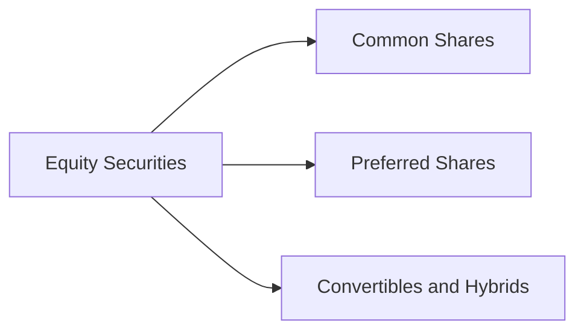

## Introduction

Well, if you’re anything like me, the first time you stumbled across all these different equity share classes—common shares, preferred shares, Class A, Class B, convertible preferred—you probably thought, “Wait, why so many flavors?” After all, shouldn’t shares be just, well, shares? Truth is, the corporate world likes to craft equity like a chef preparing a tasting menu, carefully customizing each class to reflect different degrees of voting power, dividend policy, and governance rights. This variety arises from corporate strategies, shareholder preferences, and sometimes plain old historical quirks.

In this section, we’ll examine the major classifications of equity securities, from “plain vanilla” common shares to specialized hybrids that blend debt and equity features. Our goal? To give you a thorough appreciation—and maybe even a bit of excitement—about why having multiple share types actually helps companies and investors balance risk, control, and returns. We’ll also connect these details to your upcoming CFA exam considerations: understanding how various equity structures may appear in scenario-based questions is vital at Level III, but quite frankly, it’s also foundational knowledge for Level I.

## Overview of Equity Classifications

Before diving into the specifics, let’s visualize how equity securities can be categorized:

Equity securities represent ownership in a company. They generally entitle the holder to a portion of a firm’s profits, and they often come with voting rights that can sway corporate decisions such as electing directors or approving major mergers. However, the level of control and portion of profits can vary dramatically across different share classes.

## Common Shares

Common shares are the most prevalent form of equity. They are typically what you buy when you go to a stock exchange and place an online order to invest in a well-known firm.

• Voting Rights: Common shares usually come with voting rights (e.g., one vote per share). Holders help shape corporate policy, elect the board of directors, and vote on major company matters like mergers and acquisitions.  
• Variable Dividends: Dividends on common stock are not guaranteed. Companies decide—often on a quarterly basis—how much to pay to shareholders. If a company’s profits dip, dividends can be reduced or skipped altogether.  
• Residual Claim on Assets: In the unhappy event of liquidation, common shareholders stand last in line. First come creditors, then bondholders, then preferred shareholders, and only then do common shareholders claim any remaining assets.  
• Risk–Return Profile: Because of this residual claim feature, common shares can be riskier than other forms of financing like debt or preferred shares, but they also offer higher potential returns if the company grows rapidly.

### Multiple Classes of Common Shares

Some companies issue multiple classes of common shares, such as Class A and Class B, each with different voting rights. One class might have super-voting power, enabling founders or certain strategic investors to maintain control, while another class might carry fewer votes but still receives the same dividend rate. This can cause confusion among new investors—“A or B? Which one do I buy?”—so always be sure to confirm the voting structure.

## Preferred Shares

Preferred shares typically come with fewer governance perks (for instance, no or limited voting rights) but promise more stable returns:

• Fixed Dividend: Preferred shares often pay a set dividend rate, which makes them appealing to investors looking for predictable income, similar to periodic coupon payments on a bond.  
• Higher Claim on Assets: Preferred shareholders get priority over common shareholders in liquidation scenarios or if dividends are paid.  
• Limited Voting Rights: Usually, preferred shareholders do not vote on corporate matters unless the firm fails to pay their dividends for a specified period.  
• Stability vs. Growth: Because preferred shares generally lack upside participation beyond their fixed dividend, they tend to have less price volatility than common stock. However, they don’t share in the big gains that can come from a rising common share price.

### Convertible Preferred

Convertible preferred shares are a type of hybrid security. They offer the investor a fixed preferred dividend but with the potential to convert into common shares later, often at a predetermined conversion ratio. This lets the investor benefit from upward price movements in the company’s common equity while initially enjoying a measure of downside protection (the fixed dividend). In your eventual advanced CFA exam scenarios, you might be asked to gauge whether it’s optimal to convert, given certain stock price scenarios or changing capital structure conditions.

## Hybrid Securities and Other Combinations

Companies sometimes get creative with financing. For instance:

• Convertible Bonds: Technically debt securities, they can transform into common shares if the issuer’s stock trades above a specified threshold.  
• Participating Preferred: Beyond a guaranteed dividend, these shares participate in extra dividends if the company’s profits surpass a certain level. They also may have claims on liquidation proceeds above the par value.  
• Warrants or Rights: Not shares in themselves, but they grant the holder the right to buy shares at a specific price.

These exotic instruments can sound complicated, but they all tread the line between the safer, fixed-payment world of bonds and the high-potential, higher-risk realm of common shares.

## Liquidity Features and Their Impact

Picture this: You’re holding shares in a small private firm that’s revolutionizing the packaging industry. That sounds amazing—until you realize the shares aren’t listed on any exchange and you can’t easily trade them. Liquidity risk is real.

• Major Exchanges vs. Over-the-Counter (OTC): Shares listed on a major exchange (like the NYSE or LSE) often provide easier, more liquid trading. Investors can buy or sell without significantly affecting the share price.  
• Thinly Traded Securities: In an OTC or small-exchange environment, the bid–ask spread can be wide, and large orders can swing prices dramatically. This illiquidity can lead to higher volatility and difficulties in exiting positions quickly.  
• Marketability vs. Valuation: Highly liquid shares often fetch higher valuations—this is partly because investors demand a discount for holding illiquid assets.

## Tailoring Equity Securities for Governance and Control

Have you ever wondered how Mark Zuckerberg manages to keep control over Meta despite holding a relatively small portion of its total outstanding equity? Super-voting or “founder” shares make this possible. Companies often tailor their equity structure by offering:

• Super-Voting Shares: Granting multiple votes per share, allowing founders and early investors to maintain decision-making control.  
• Dual-Class Structures: Where Class A shares might have one vote each, but Class B shares might have 10 votes each. This approach is popular in the tech sector for preserving founder influence.  
• Strategic Privileges: Certain shares might have board representation rights or veto authority over significant corporate matters.  

For advanced CFA exam contexts, understanding how these control mechanisms affect minority shareholder rights and corporate governance is essential. From an ethics standpoint, dual-class structures can create conflicts of interest: the controlling group might set policies favoring themselves at the expense of other shareholders.

## Dividend Policies

Some companies pride themselves on paying consistent dividends year after year, while others offer sporadic or no dividends at all:

• Stable Dividend Policy: Common in mature industries, where a company targets a constant or steadily growing payout.  
• Residual Policy: Companies distribute what’s left over after meeting all capital expenditure and working capital needs.  
• Hybrid Policy: A mix between stable and residual approaches, with a base dividend that’s rarely cut and an additional variable portion depending on profitability.  
• Dividend Growth or No Dividend: Tech startups often skip dividends altogether and reinvest earnings to fuel growth (looking at you, many Silicon Valley players). That approach can lead to significant capital gains if the strategy succeeds.

A firm’s dividend policy can significantly impact share price and investor appeal. For instance, many institutional investors have investment guidelines that emphasize dividend-paying stocks, especially in low-yield environments. In your portfolio management practice or exam question scenario, you might have to evaluate how dividend policy shifts the risk-return profile of a client’s equity allocation.

## Private Equity and Transfer Restrictions

Not all shares float freely on public markets. Private equity investments often involve:

• Lock-Up Periods: Investors may be restricted from selling their shares for a set timeframe.  
• Restrictive Covenants: Share transfer might require permission from other stakeholders, limiting marketability.  
• Liquidity Events: Exits often occur via IPO, direct listing, or merger/acquisition, rather than daily share trades.

Because of these constraints, private-equity valuations typically incorporate a discount for lack of marketability. If you’re comparing private and public equity in a portfolio context, keep an eye on the extra liquidity risk in private holdings and how that influences required returns.

## Practical Considerations for Portfolio Managers

As you progress in your CFA studies (right toward Level III, if you haven’t already), you’ll find scenario-based questions that revolve around an investor’s equity portfolio structure. Perhaps a client wants stable dividends, minimal volatility, and partial inflation protection. You might then select preferred shares or large-cap, dividend stalwarts. Or your client might be a growth-oriented venture capitalist who invests in convertible securities in early-stage tech start-ups. Smart portfolio managers weigh the interplay between control, liquidity, dividend stability, and capital appreciation potential.

## Ethical and Regulatory Dimensions

From a governance standpoint, the CFA Institute’s Code of Ethics and Standards of Professional Conduct often emphasize fairness and transparency toward all shareholders. 

• Disclosure: Full disclosure of voting structures (including super-voting shares) is fundamental to equitable markets.  
• Conflict Management: If a firm’s founding owners hold disproportionate voting power, regulators and analysts monitor whether minority shareholders are protected from possible abuses.  
• IFRS vs. US GAAP Differences: In financial statements, classification of preferred shares may vary. Under IFRS, certain preferred instruments might be classified as debt if they involve mandatory payouts. Knowledge of these nuances helps you interpret equity coverage ratios consistently across different reporting regimes.

## Key Takeaways and Common Pitfalls

• Don’t Overlook Voting Structure: Different share classes can substantially alter your influence and risk, especially in M&A scenarios.  
• Beware of Liquidity Traps: Even fundamentally strong companies can have illiquid shares that are tough to sell.  
• Dividend Policy Influences Valuation: A stable dividend is sometimes prized by certain investors, but it can limit the firm’s reinvestment capacity.  
• Mind Hybrid Features: Convertible securities or participatory preferred can be powerful, but they can also complicate capital structure and analysis.  
• Marketability Restrictions Matter: Particularly relevant in private equity or thin markets.

## Glossary Highlights

• Common Shares: Equity securities with voting rights and variable dividends.  
• Preferred Shares: Equity with a fixed dividend and higher asset claim than common shares, typically no regular voting rights.  
• Super-Voting Shares: High-vote shares enabling founders to preserve control.  
• Convertible Securities: Instruments (often preferred shares or bonds) that can convert into common shares.  
• Hybrid Security: Part debt, part equity, offering both fixed payment features and ownership benefits.  
• Voting Rights: Shareholder entitlements to vote on corporate issues, from electing directors to approving major transactions.  
• Marketability: The ease of selling or transferring ownership.  
• Dividend Policy: Ongoing plan dictating how and when a firm distributes profits to shareholders.

## References and Further Reading

- CFA Institute. (n.d.). “Equity Securities.” Available at: [https://www.cfainstitute.org/](https://www.cfainstitute.org/)  
- Megginson, W.L., & Smart, S.B. (2009). “Introduction to Corporate Finance.” Cengage Learning.  
- CFA Institute Code of Ethics and Standards of Professional Conduct, available at: [https://www.cfainstitute.org/en/ethics-standards](https://www.cfainstitute.org/en/ethics-standards)  

## Final Exam Tips

1. Look for scenario-based questions that force you to distinguish among share classes (e.g., common vs. convertible preferred) when constructing a client’s portfolio.  
2. Be mindful of how dividends feed into valuation models (e.g., Dividend Discount Model, or DDM).  
3. Practice analyzing multi-class structures: how might advanced weighting or super-voting shares affect corporate governance decisions and minority shareholders’ interests?  
4. Understand the interplay between liquidity (and related discounts) and expected returns, particularly for private or thinly traded shares.  
5. Stay consistent with the CFA Institute Code and Standards by ensuring complete transparency and fairness in all client-facing communications about equity structures.

------------------------------

## Test Your Knowledge of Equity Classifications and Features



### Which of the following best describes an advantage of preferred shares over common shares?

- [ ] They generally provide higher long-term capital appreciation.  
- [x] They offer a more predictable dividend stream.  
- [ ] They have guaranteed voting rights on all corporate matters.  
- [ ] They typically trade at lower prices than common shares.  

> **Explanation:** Preferred shares usually come with a fixed or more predictable dividend stream than common shares, and they have a higher claim on assets in the event of liquidation. However, they typically do not guarantee voting rights.

### In a dual-class share structure, which statement is most accurate?

- [x] One class often has more voting rights than the other.  
- [ ] Both classes always receive the same dividend per share.  
- [ ] The classes must trade at exactly the same price.  
- [ ] There is typically no difference in voting or dividend rights across share classes.  

> **Explanation:** Dual-class structures are designed so one class (often founders’ shares) holds multiple votes per share, allowing core stakeholders to maintain control.

### A convertible preferred share provides what key benefit to the investor?

- [ ] Immunity from changes in interest rates.  
- [x] Participation in common share price appreciation upon conversion.  
- [ ] Guaranteed voting rights on every corporate action.  
- [ ] Ability to pay a lower purchase price than common stock at issuance.  

> **Explanation:** The unique feature of convertible preferred is the opportunity to convert into common stock and participate in potential price gains, while initially receiving a stable dividend.

### When a corporation goes bankrupt, which group is generally paid last?

- [ ] Secured creditors  
- [ ] Preferred shareholders  
- [ ] Bondholders  
- [x] Common shareholders  

> **Explanation:** Common shareholders hold a residual claim on assets, so they only receive proceeds after all other claims (secured creditors, bondholders, and preferred shareholders) are satisfied.

### Which scenario best illustrates a “marketability restriction”?

- [x] Shares in a private firm that cannot be sold without board approval.  
- [ ] Shares in a large public company trading daily on the NYSE.  
- [ ] Low trading volume in an illiquid penny stock.  
- [ ] Lock-up periods for newly issued public shares that have expired.  

> **Explanation:** A marketability restriction occurs when the ability to transfer or sell shares is contractually limited, as often happens in private equity agreements.

### Super-voting shares typically exist primarily to:

- [ ] Provide extra dividends to minority shareholders.  
- [ ] Ensure all shareholders have equal rights.  
- [x] Help founders or major shareholders maintain control.  
- [ ] Generate higher stock prices in the public market.  

> **Explanation:** Super-voting shares are usually issued so founders or key insiders can retain voting control, even if their economic stake shrinks.

### What is a typical reason for companies to pay stable dividends?

- [x] They seek to signal financial strength and reduce investor uncertainty.  
- [ ] They want to dissuade new investors from purchasing shares.  
- [x] They are legally required to pay the same dividend every year.  
- [ ] They aim to maintain a fixed balance sheet ratio.  

> **Explanation:** Companies use stable dividends to signal predictable performance and to meet expectations of certain investor clienteles. There is no requirement for them to pay the same dividend forever, but once a stable policy is established, changes carry strong market signals.

### Which is most likely for a firm with a “residual” dividend policy?

- [x] It pays dividends only after funding all profitable investment projects.  
- [ ] It commits to increasing dividends by a fixed percentage each year.  
- [ ] It never pays dividends at all.  
- [ ] It prioritizes dividend payments over capital expenditures.  

> **Explanation:** Under a residual dividend policy, the firm uses retained earnings to finance projects first, then distributes any remainder to shareholders as dividends.

### What is one main disadvantage of preferred shares for investors?

- [ ] They typically have lower claim on assets than common shares.  
- [ ] They have no legal protections whatsoever.  
- [x] They usually do not offer the same upside potential as common shares.  
- [ ] They cannot be converted into common shares under any circumstances.  

> **Explanation:** Preferred shares generally lack the unlimited capital appreciation potential found in common shares. While they do enjoy priority over common shares for dividends, they’re less likely to see the significant price gains that common shares might experience.

### True or False: Private equity shares are always more liquid than publicly traded shares.

- [x] True  
- [ ] False  

> **Explanation:** This statement is actually false. Private equity holdings are typically far less liquid due to transfer restrictions and lack of a public trading market.  


