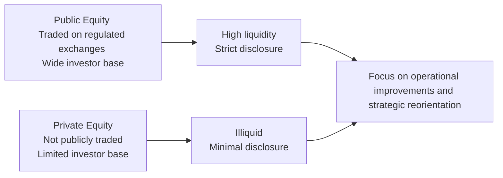

## Overview and Context

When people hear the word “equity,” they often imagine the bustling floors of the world’s major stock exchanges, with screens flashing constantly changing share prices. That mental image—of live markets tracking share values second by second—is basically the realm of public equity. Meanwhile, there’s a whole other dimension to investing in firms that don’t list on any public exchange: private equity. Private equity can be downright fascinating, though it sometimes feels mysterious because it’s not always as accessible as publicly traded stocks.

Anyway, let’s walk through the major contrasts of these two realms, from how they’re structured to their risk and return characteristics. I’ll also sprinkle in some personal anecdotes and experiences along the way—like the time I had a friend who was fixated on an early-stage startup’s Series A fundraise to the extent that he was literally staying up all night researching possible angel investor platforms. (He even joked about taking out a second mortgage to get in on the ground floor. Don’t worry; he didn’t.)

## Key Differences in Market Access

### Public Equity
Public equity is the total ownership—through listed shares—of companies traded on authorized exchanges like the NYSE, NASDAQ, LSE, or any other recognized market. Shares are:
- Highly liquid: You can buy or sell them quickly (in seconds or minutes, typically).
- Accessible: Retail investors, small institutions, and large asset managers can all participate freely.
- Transparent in price: Market quotations update in real-time, reflecting investor sentiment and supply-demand dynamics throughout the trading day.

### Private Equity
By contrast, private equity refers to ownership in companies whose shares do not trade on public markets. These include:
- Venture capital (VC) for early-stage or high-growth startups.
- Leveraged buyouts (LBOs), focusing on mature companies often financed heavily by debt.
- Growth equity or minority investments in more established private companies.

Private equity tends to be illiquid, with higher investment minimums and limited investor pools. Buying in means a more hands-on relationship with management—since owners often have seats on the board or direct influence on the strategy.

## Structures and Investment Lifecycle

In public equity, you might hold a position for a few weeks, months, or years. But you can always decide to click “sell” if the stock exchange is open. In private equity, investment horizons often stretch to five, seven, or even ten years, depending on the fund’s mandate. You commit capital that gets “called” gradually, and you typically can’t exit at will.

Why the long holding period? Private equity investments often aim to unlock value through operational improvements, strategic pivoting, or brand repositioning. Think about a venture capital fund: it might invest in five or ten promising startups, expecting only a few to really take off. But for those that succeed, the payoff can be enormous. Meanwhile, a buyout fund might purchase an underperforming division of a large conglomerate, bring in specialists to reorganize the business, and eventually sell it at a higher valuation.

Here’s a simple diagram to give a quick snapshot of how public equity and private equity compare in a flowchart:

## Regulatory Disclosure Requirements

Public companies generally live under the bright lights of regulatory oversight. They file 10-Ks and 10-Qs in the United States (under SEC rules) or their equivalents in other jurisdictions. This means robust disclosure: financial statements, risk updates, executive compensation details, major shareholding changes, and more. Such transparency broadens the investor base but also demands compliance infrastructure. In a sense, public markets are a fishbowl—everyone sees (almost) everything.

On the private side? Well, private equity–backed companies have fewer mandatory disclosure requirements and thus lower compliance costs. That said, private equity investors typically conduct deep due diligence and require regular (but private) reporting. The general public rarely gets to see these details, which is part of why you might not hear about a certain fast-growing tech firm until it’s on the verge of an IPO or major acquisition.

## Hands-On Involvement and Value Creation

### Public Equity Involvement
Public equity investors, especially large institutional players or activist hedge funds, can influence management through proxy votes and lobbying efforts. But smaller retail investors typically don’t have as much direct influence. Market sentiment—sometimes driven by macroeconomic data, earnings announcements, or even social media chatter—plays a large role in daily price fluctuations.

### Private Equity Involvement
Private equity investors, by contrast, usually sit in the driver’s seat when it comes to strategic decisions. They’re the folks who might bring in a specialized CEO, reorganize the supply chain, or push for a new product strategy. The operational improvements and realignment that happen behind the scenes are often the key drivers of return, rather than just waiting for share prices to drift higher with the broader market.

I remember a colleague telling me about a private equity fund that completely overhauled a specialty retail chain, focusing on in-store technology, store layout, and better inventory management. The chain eventually went from borderline bankruptcy to a successful trade sale. That’s classic private equity value creation in action.

## Risk-Return Profiles

### Public Equity Risk-Return
For public equities, risk is often correlated with market volatility, sector concentration, and the overall macro environment. Beta, standard deviation, and other metrics typically reflect market movements. Historically, average annual returns for public equities have been strong over the long term but can be quite volatile year to year.

### Private Equity Risk-Return
Private equity invests in concentrated positions, often in untested or distressed companies. The potential returns can be quite high, but the risk includes:
- Illiquidity: You can’t always sell easily.
- Operational risk: The entire business model might be flawed, or key employees may leave, or the new strategy might fail to gain traction.
- Financing risk: If there’s a lot of debt in an LBO, a small revenue dip can pose big repayment problems.

Still, the illiquidity premium—an extra return investors demand for tying up their money—can be substantial if the investment works out. Some growth companies financed by venture capital funds have produced eye-popping gains at IPO or buyout.

## Exit Strategies

### Public Equity
Public market investors exit simply by selling the stock on the exchange. That’s the hallmark of liquidity. If sentiment sours, share prices may drop, but at least you’ll likely find a buyer—though perhaps at a disappointing price.

### Private Equity
Exiting private equity might involve:
- IPO: Transitioning from private to public can deliver significant upside.
- Trade Sale: Selling the company to a strategic buyer or a competitor.
- Secondary Market Sale: Sometimes private equity fund stakes or shares in a private company are sold to another fund or investor, though these secondary transactions can be more complicated.

If none of these exit routes are attractive, investors may remain locked in longer than anticipated. That’s the trade-off for (potentially) higher returns.

## Importance of Secondary Private Equity Markets

Historically, if you invested in private equity, you were stuck until the fund winded down or the company was sold or listed. Nowadays, limited secondary markets exist where accredited investors or specialized intermediaries exchange shares in private companies. This is still a niche space—prices might be less transparent, trades can take months to complete, and due diligence is challenging. But it’s growing steadily, which might eventually enhance liquidity in the private domain.

## Market Sentiment vs. Operational Improvements

One of the biggest differences is how returns are generated and influenced. In public equity, daily share prices fluctuate based on market sentiment, political news, interest rates, macro data, and technical factors. Even if a company’s fundamentals are strong, a broader market downturn can push its share price lower. Conversely, private equity returns are more insulated from immediate sentiment swings because there is no official daily marking to market. Private company valuations adjust periodically, often based on significant milestones or valuation events (e.g., fundraising rounds or a new set of audited financials).

## Common Pitfalls and Best Practices

- **Overestimating Liquidity:** Investors sometimes assume they can exit a private equity position whenever they choose, which is rarely the case.
- **Ignoring Disclosure Risks:** Public equity is highly regulated, so there’s a lot of transparency. In private equity, investors must rely on internal data from the company or the private equity firm.
- **Inadequate Diversification:** Private equity stakes can be very concentrated. Unsophisticated investors might put too many eggs in one basket and suffer heavily if that single investment goes south.
- **Underestimating Managerial Influence:** If you’re used to public equities, you might forget that private equity managers can effect major operational changes. That’s a critical driver of returns (or losses).

## Practical Example: Leveraged Buyout of a Consumer Goods Firm

Imagine you’re analyzing a consumer goods company that a private equity firm just scooped up in a leveraged buyout:

1. The purchase is funded 70% by debt, secured by the target’s balance sheet.  
2. The private equity sponsors plan to cut redundant factories, optimize distribution, and rebrand product lines within 24 months.  
3. Over a five-year horizon, they aim to expand margins and revenue to justify a sale to a larger competitor or a public listing.  

If everything goes right, the firm’s value doubles or triples. But if the economy sputters, consumer demand softens, or the rebranding misfires, the heavy debt load could cause insolvency. That’s the payoff structure of private equity in a nutshell—high risk, but also high potential reward.

## Conclusion and Exam Relevance

For CFA® Level I candidates, understanding public vs. private equity is crucial for building foundations in corporate finance and portfolio management. You’ll see references to these concepts throughout your studies, especially with regard to capital market structures, the risk-return spectrum, and fundamental investment analysis.

At the more advanced Levels II and III, you’ll dive deeper into private equity valuation, portfolio construction, and how institutional investors allocate capital among public equities, private funds, and other alternative assets. You might get scenario-based exam questions asking you to identify the key differences between investing in a publicly traded industrial conglomerate versus an LBO-focused private equity fund.

## Final Exam Tips

- **Know the Terminology:** LBO, VC, leveraged finance, illiquidity premium—these terms often show up in item sets or short-answer questions.  
- **Relate to Financial Statements:** Understand how publicly traded companies’ statements differ from those in private deals (e.g., reduced transparency in private equity).  
- **Time Management in Essay Questions:** If an exam question compares exit strategies for public vs. private equity, outline them briefly but clearly. Don’t get bogged down in excessive detail.  
- **Focus on Risk-Return Trade-Offs:** Articulate that higher returns in private equity typically come with liquidity constraints and more concentrated risk.  
- **Leverage Real-World Examples:** If a question prompts you to illustrate how private equity invests, mentioning key steps—due diligence, capital calls, capital structure adjustments—can show your mastery.  

## References

- Metrick, A., & Yasuda, A. (2021). “Venture Capital and the Finance of Innovation.” Stanford University Press.  
- Salozzo, D. (2018). “Understanding Private Equity.” The Journal of Private Equity.

## Practice Questions: Public vs. Private Equity



### Exam Question 1
Which of the following is generally a key characteristic of public equity markets?

- [x] High liquidity
- [ ] Low disclosure requirements
- [ ] Minimal regulatory oversight
- [ ] Indefinite lock-up periods

> **Explanation:** Public equity markets typically have high liquidity because shares can be bought or sold on regulated exchanges, often within seconds.

### Exam Question 2
Compared to public equity, which of the following best describes a typical private equity investment?

- [ ] Low minimum investment
- [ ] High frequency of share price updates
- [x] Longer holding periods and less liquid
- [ ] Access to all retail investors

> **Explanation:** Private equity investments are known for their long holding periods and lower liquidity compared to public equity.

### Exam Question 3
In a leveraged buyout (LBO), what key element often characterizes the financing structure?

- [x] High proportion of debt financing
- [ ] High dividend payouts throughout the holding period
- [ ] Full equity financing from the private equity sponsor
- [ ] Reliance exclusively on public stock issuance

> **Explanation:** LBOs typically use a high level of debt financing to purchase the target company, aiming to amplify returns through leverage.

### Exam Question 4
Which of the following statements is generally true regarding regulatory disclosures?

- [x] Public firms face stricter disclosure requirements than private firms
- [ ] Private firms must file public quarterly reports
- [ ] Public firms are exempt from periodic reporting in most jurisdictions
- [ ] Private firms have more burdensome public disclosures

> **Explanation:** Public companies must adhere to strict disclosure and reporting standards, whereas private companies have fewer public filing obligations.

### Exam Question 5
What is the primary driver of value creation in many private equity deals?

- [ ] Daily market sentiment
- [x] Operational improvements and strategic repositioning
- [ ] Passive index tracking
- [ ] Frequent dividend payouts

> **Explanation:** Private equity returns often derive from active involvement in management, operational efficiency, and strategic realignment.

### Exam Question 6
Which of the following best describes a primary reason some investors choose private equity?

- [ ] They can easily sell their shares at any time
- [ ] They prefer more stringent regulatory filings
- [ ] They seek stable returns with little risk
- [x] They pursue potentially higher returns from illiquidity premium

> **Explanation:** Private equity investors often accept illiquidity in hopes of earning a premium over public equity returns.

### Exam Question 7
A venture capital fund is most likely to invest in which type of company?

- [ ] Seasoned blue-chip corporations listed on a major exchange
- [x] Early-stage startups needing growth capital
- [ ] Mature companies with low debt
- [ ] Large firms primarily seeking to issue public debt

> **Explanation:** Venture capital funds usually focus on nurturing young companies with high growth potential.

### Exam Question 8
In which of the following scenarios might a company choose an IPO as an exit strategy?

- [x] Strong growth prospects, stable earnings, and high investor demand
- [ ] Comparable public companies trade at distress multiples
- [ ] There is zero appetite from retail or institutional investors
- [ ] The business model has failed market tests

> **Explanation:** Successful companies with robust growth, predictable revenues, and market enthusiasm often opt for an IPO to realize gains.

### Exam Question 9
What is a secondary market for private equity?

- [ ] A platform that allows retail investors to buy shares in a public company
- [x] A platform or arrangement where existing private equity stakes can be sold to other investors
- [ ] A government market to trade distressed bonds
- [ ] A method for public companies to raise debt capital

> **Explanation:** Secondary markets for private equity let current investors transfer stakes to new investors, providing some liquidity in an otherwise illiquid asset class.

### Exam Question 10
True or False: Private equity investors typically receive comprehensive public disclosures every quarter similar to public company shareholders.

- [ ] True
- [x] False

> **Explanation:** Private equity disclosures are not publicly mandated in the same way as public company filings. Investors participate in more limited, private reporting, rather than public quarterly statements.


