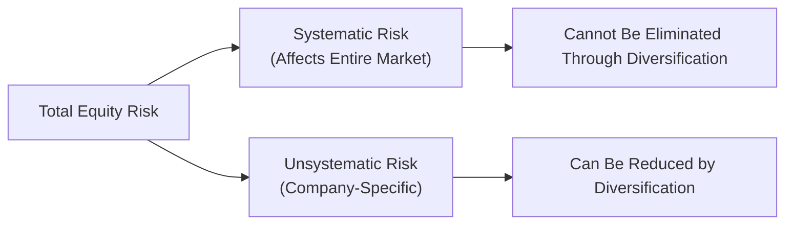

## Overview
Equities can be exciting—imagine holding shares in a young technology company that doubles in value in just a few months! But, as wonderful as those gains are, the journey can also include moments of, well, genuine heart palpitations when markets swing the other way. This section helps you balance the thrill of potential returns with a clear-eyed understanding of the risks involved.

We will dissect the difference between risk factors that affect the entire market (systematic) and those specific to an individual company or industry (unsystematic). We’ll see how specific tools like volatility, beta, and various downside risk metrics come into play. And—because you can’t talk about risk without talking about returns—we’ll explore the drivers of equity returns, including how macroeconomic conditions, corporate earnings, leverage, and investor sentiment influence stock performance.

## Systematic vs. Unsystematic Risk
One weekend, I overheard two investors chatting at a coffee shop: one was adamant that her entire portfolio was recession-proof simply because she picked “safe” stocks. The other pointed out that when the whole market drops, even “safe” stocks can take a hit. That’s systematic risk in action—no matter how good an individual business is, it’s still a part of the broader market ecosystem.

- Systematic Risk (Market Risk):  
  This is the risk inherent to the entire market or market segment. Economic recessions, global pandemics, interest rate shifts, or geopolitical tensions are prime examples. Systematic risk can be mitigated—but not eliminated—through techniques such as hedging or strategic asset allocation. Standard tools like the Capital Asset Pricing Model (CAPM) incorporate systematic risk through the concept of beta (β).

- Unsystematic Risk (Company-Specific Risk):  
  This is the risk unique to a specific company or industry. It might be a product recall or a scandal involving top management. The comforting news is that you don’t have to shoulder all of it if you diversify across a range of companies and industries.  
  In practice, unsystematic risk is nearly fully diversifiable: by holding a sufficiently large collection of stocks with low correlation among them, you minimize the impact of any single company’s meltdown or windfall on your total portfolio.

Below is a simple diagram to show how total equity risk breaks down into systematic and unsystematic components:

## Measuring Equity Risk
Effectively managing risk requires clear measurement. A few main approaches dominate equity risk evaluation:

### Volatility (Standard Deviation of Returns)
Volatility is often used as a stand-in for overall risk, reflecting how widely returns vary around their mean:


\sigma = \sqrt{\frac{1}{N-1} \sum_{i=1}^{N} \left(R_i - \bar{R}\right)^2}


• A higher standard deviation (σ) means prices can swing more wildly, potentially creating larger gains or losses.  
• Volatility doesn’t distinguish upside and downside moves—it treats both as risk.  

### Beta (β)
Beta measures a stock’s sensitivity relative to the overall market:


\beta_i = \frac{\mathrm{Cov}(R_i, R_m)}{\mathrm{Var}(R_m)}


• A β of 1.0 implies the stock moves in line with the market.  
• A β greater than 1.0 suggests higher sensitivity; the stock may amplify market movements.  
• A β less than 1.0 suggests lower sensitivity; the stock may move less dramatically compared with the overall market.

Beta is an important input in the CAPM, which estimates the expected return on a stock by linking it to the risk-free rate plus the equity risk premium, scaled by β.

### Downside Risk Metrics (e.g., Value at Risk)
Value at Risk (VaR) provides an estimate of the potential loss in a portfolio over a specified time frame at a given confidence level (often 95% or 99%). For instance, if a daily VaR at 95% confidence is \$10,000, there is only a 5% probability that daily losses will exceed \$10,000 under “normal” market conditions.

Some practitioners also use lower partial moments or conditional value at risk (CVaR), more advanced tools that specifically focus on negative outcomes rather than just overall variance.

## Drivers of Equity Returns
What causes equity prices to go up or down? Think of it as an ever-evolving mood board combining:

• Company Fundamentals: If corporate earnings keep beating analysts’ expectations, the stock price often follows suit. On the flip side, downward revisions to earnings can create negative pressure.  
• Broader Economic Trends: Economic expansion, rising GDP, or bullish consumer sentiment can fuel demand for stocks, whereas recessions or tightening monetary policy can dampen enthusiasm.  
• Sector/Industry Performance: If you invest in energy stocks and oil prices soar, your holdings may do well—even if the broader market is lukewarm.  
• Market Sentiment: Investor psychology can be pivotal. Optimistic “risk-on” attitudes can lift share prices, while fear-driven “risk-off” climates can send stocks falling, sometimes irrespective of an individual company’s true fundamentals.

## The Impact of Leverage
Leverage is like a high-powered magnifying glass: it can bring you closer to your goals—or it can scorch your portfolio if you’re not careful. Companies that use debt financing (beyond a certain point) or rely on high levels of fixed financial costs can produce outsized returns on equity when everything is going well. However, the same leverage can magnify losses if revenues fall short of debt servicing needs. 

From an equity investor’s perspective, companies with high leverage can see their share prices skyrocket during boom times, while they may suffer precipitous drops in earnings and valuation during downturns. Monitoring financial statement disclosures (under IFRS or US GAAP) and analyzing leverage ratios (like Debt/Equity or Interest Coverage) can help gauge how leverage might influence the stock’s risk profile.

## Fundamental and Technical Analysis
Most professional analysts combine “fundamental” and “technical” perspectives to refine their return expectations.

- Fundamental Analysis:  
  Focuses on company-specific factors—revenues, margins, cash flows, competitive advantages—to arrive at an intrinsic valuation. You might model a discounted cash flow (DCF) or a price-to-earnings (P/E) ratio approach. Principled corporate governance and transparent financial reporting (aligned with the CFA Institute’s ethical standards) bolster fundamental analysis.

- Technical Analysis:  
  Emphasizes price trends and patterns. Traders look to historical price data, trading volume, and various charting signals (e.g., moving averages, support/resistance levels) to predict near-term price movements. While many fundamental analysts remain skeptical, technical signals often reflect investor sentiment shifts that can spark rapid moves in stock prices.

## Macroeconomic Performance, Industry Cycles, and Global Events
No stock operates in a vacuum. Employment trends, inflation rates, currency movements, or even major political changes can directly influence the entire stock market, affecting factors like:

• Corporate revenue potential (e.g., cyclical vs. non-cyclical goods)  
• Consumer spending power  
• Company profit margins (squeezed by rising commodity prices or labor costs)  
• Investor confidence or risk appetite  

Global issues—such as geopolitical tensions, trade disputes, pandemics—can abruptly transform outlooks. The 2020 pandemic, for instance, hammered certain travel and hospitality equities almost overnight while boosting at-home entertainment and e-commerce companies.

## The Historical Equity Risk Premium
The equity risk premium (ERP) is the excess return over a risk-free rate that investors demand for taking on the added (nontrivial) risk of equities. Historically, depending on the research period and methodology, equities have outperformed safe assets (like short-term government bills) by a few percentage points annually. However, it’s crucial to remember:

• Past performance does not guarantee future returns.  
• Shifting market conditions (e.g., historically low interest rates, changing inflation expectations) can impact the ERP.  
• ERP estimates vary, but common ranges might be 3% to 6% over the long-term horizon.

## Glossary
• **Systematic Risk:** Potentially affects the entire market, cannot be eradicated through diversification.  
• **Unsystematic Risk:** Company-specific; can be largely removed by holding a diversified portfolio.  
• **Volatility (σ):** A measure of price fluctuations over time.  
• **Beta (β):** A measure of a stock’s sensitivity to overall market moves.  
• **Value at Risk (VaR):** Estimates how much one might lose with a certain probability over a set period.  
• **Equity Risk Premium:** Extra return demanded by investors for holding equities instead of risk-free assets.  
• **Leverage:** Borrowing to amplify returns (and potentially amplify losses).  
• **Fundamental Analysis:** Valuation based on economic and financial metrics.  
• **Technical Analysis:** Evaluates price charts, trends, and volume indicators.

## Best Practices and Common Pitfalls
• **Emphasize Diversification:** Relying on a handful of stocks is risky; broadening your portfolio can soften the blow of any single adverse event.  
• **Keep an Eye on Macroeconomics:** Even the strongest fundamentals can be undone by a major recession or interest rate spike.  
• **Don’t Chase High Beta Blindly:** A stock with a beta of 2.0 might double your wins, but it can also double your losses.  
• **Use Leverage Prudently:** Both companies and investors should consider stress tests to see how leverage might behave in adverse scenarios.  
• **Know the Limits of Historical Data:** Yesterday’s patterns might not fit tomorrow’s realities—adapt to changing economic, technological, and political landscapes.

## Final Exam Tips
1. **Constructed Response on Systematic and Unsystematic Risk:** You may be asked to discuss how you would mitigate a certain risk factor—be sure to distinguish clearly between market-wide and company-specific exposures.  
2. **Item Sets on Calculating Beta and Volatility:** Remember your formulas. Also, be comfortable discussing the practical implications of high or low β.  
3. **Scenario Analysis with VaR:** Expect questions that give scenarios (e.g., 95% VaR levels). Show you can interpret what the VaR figure means and describe how it might guide risk management decisions.  
4. **Equity Risk Premium Estimations:** You could be asked to compare different methods (historical vs. forward-looking).  
5. **Macro Events and Industry Cycles:** Don’t forget the big picture. The exam might ask how an oil price shock or a slowdown in consumer spending influences various sectors.  
6. **Practice Interpreting Charts:** Even if you lean heavily on fundamental analysis, you may see a question referencing technical indicators, so be prepared to discuss potential short-term market sentiments.  
7. **Ethical Considerations in Returns Forecasting:** Demonstrate awareness of the CFA Institute Code of Ethics when presenting forward-looking returns to clients.

## References
- Fama, E.F., & French, K.R. (2004). “The Capital Asset Pricing Model: Theory and Evidence.” Journal of Economic Perspectives.  
- Damodaran, A. (2012). “Investment Valuation.” Wiley.  
- Official CFA Institute Curriculum, 2025 Edition (Level I).  
- CFA Institute Code of Ethics and Standards of Professional Conduct.  

## Test Your Knowledge: Risks and Returns of Equity Investments



### 1. Which of the following best describes systematic risk?  
- [ ] The portion of a stock’s total risk that can be diversified away.  
- [ ] The risk of a firm’s CEO leaving.  
- [x] The component of risk that affects the entire market and cannot be eliminated through diversification.  
- [ ] The risk that affects only the healthcare sector.  

> **Explanation:** Systematic risk is market-wide risk that cannot be removed through diversification.

### 2. Which measure focuses on the sensitivity of a stock’s returns to overall market movements?  
- [ ] Volatility (σ)  
- [x] Beta (β)  
- [ ] Value at Risk (VaR)  
- [ ] Return on Equity (ROE)  

> **Explanation:** Beta measures how much a stock’s returns move relative to the overall market.

### 3. An investor holds a highly concentrated portfolio of technology stocks. This investor experiences large drops when a particular tech firm faces regulatory issues. What type of risk is being realized?  
- [ ] Systematic risk  
- [x] Unsystematic risk  
- [ ] Interest rate risk  
- [ ] Liquidity risk  

> **Explanation:** Regulatory issues affecting one tech firm represent an unsystematic risk unique to that firm or sector, which could otherwise be mitigated by diversification.

### 4. Which of the following best describes the equity risk premium?  
- [ ] The difference between the stock’s price and its book value.  
- [x] The additional return that equity investors require over the risk-free rate.  
- [ ] The premium paid for risk-free government bonds.  
- [ ] The spread offered by corporate bonds over treasury bonds.  

> **Explanation:** The equity risk premium is the extra return that investors demand for holding stocks over risk-free assets.

### 5. A stock with a beta (β) of 1.5 is likely to:  
- [x] Experience returns that are more volatile than the overall market.  
- [ ] Experience the same level of volatility as the overall market.  
- [ ] Move inversely to the market.  
- [ ] Not be affected by market-wide factors.  

> **Explanation:** A beta of 1.5 suggests that the stock is 50% more volatile than the market in upward or downward moves.

### 6. Which of the following is most effective at reducing unsystematic risk in a portfolio?  
- [ ] Buying stocks only during bull markets.  
- [ ] Short selling stocks with high beta.  
- [ ] Using technical indicators to forecast price changes.  
- [x] Diversifying across different sectors and industries.  

> **Explanation:** Unsystematic risk (company-specific risk) is best reduced by diversifying across different assets.

### 7. When an analyst uses historical price patterns and volume indicators to form an opinion about future stock movements, she is performing:  
- [ ] Fundamental analysis  
- [x] Technical analysis  
- [ ] Economic analysis  
- [ ] Behavioral finance analysis  

> **Explanation:** Technical analysis involves studying patterns in price and volume to anticipate future movements.

### 8. If a portfolio has a 95% daily VaR of $1 million, it means:  
- [x] There is a 5% chance that the portfolio will lose more than $1 million in a day.  
- [ ] The portfolio will never lose more than $1 million in a day.  
- [ ] The portfolio is guaranteed to gain at least $1 million in 95% of trading days.  
- [ ] VaR is not relevant for daily assessments.  

> **Explanation:** A 95% VaR of $1 million indicates a 1-in-20 chance that losses will exceed $1 million under normal conditions.

### 9. Which of the following macroeconomic changes usually benefits equities?  
- [x] Strong GDP growth and rising consumer confidence  
- [ ] Increasing interest rates and a contracting economy  
- [ ] High inflation and tightening monetary policy  
- [ ] A currency collapse in a key export market  

> **Explanation:** Growing GDP and consumer optimism often boost corporate earnings and, in turn, stock prices.

### 10. True or False: Leverage in a firm’s capital structure can increase both the potential returns and potential losses to equity holders.  
- [x] True  
- [ ] False  

> **Explanation:** Leverage magnifies outcomes; it can amplify gains in good times and losses during downturns.


