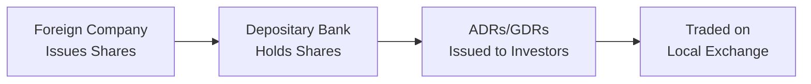

## Overview

Let’s talk about the globalization of equity markets, shall we? Whenever I think of cross-border listings, I remember the first time I heard about a Japanese automobile manufacturer listing on the New York Stock Exchange (NYSE). I was somewhat amazed: Why would they list shares halfway around the world? It turns out there are many good reasons—none of which, by the way, are about just wanting to visit Times Square.

Globalization of equity markets refers to companies from one country taking measures to raise capital or trade their shares in foreign markets. This phenomenon has accelerated in recent decades, significantly shaping how investors allocate assets worldwide. Cross-border listings, the use of depositary receipts, and integrated reporting standards all collectively allow investors—and the companies themselves—to move beyond borders when seeking returns or capital.

Below, we’ll unravel the key insights, complexities, and practical considerations around these international equity listings. We’ll also take a look at potential benefits, challenges, and how investors should handle risks like currency fluctuations or geopolitical disruptions along the way.

## Key Drivers of Cross-Border Listings

Cross-border listings occur when a company chooses to list on an exchange outside its home country—sometimes multiple exchanges at once. Although the strategic motives vary, some common drivers include:

• Expanding the Investor Base: Listing on a major international stock exchange (like the NYSE or the London Stock Exchange) can make it easier for foreign investors to purchase shares. This boosts the potential investor pool, which can raise share liquidity and potentially bolster the company’s overall valuation.  
• Enhancing Liquidity and Visibility: More markets often mean more trading volume. This liquidity can, in turn, reduce volatility. Additionally, presence on multiple exchanges can elevate a company’s brand and reputation.  
• Reducing Cost of Equity: Better access to global investors can drive down the required return on equity. Companies that list abroad often seek a lower cost of capital by attracting investors who might value their shares more favorably in a different market context.

## Depositary Receipts: ADRs and GDRs

One of the most common methods for non-local companies to list their shares in foreign markets is via depositary receipts. The two most common formats are:

• American Depositary Receipts (ADRs): Traded on US exchanges, ADRs allow US-based investors to purchase shares of foreign companies in US dollars, effectively bypassing the complexities of foreign exchange transactions and custody of foreign shares.  
• Global Depositary Receipts (GDRs): Often traded on European or other non-US exchanges, GDRs likewise allow investors around the world to gain exposure to foreign markets in a recognized currency and under familiar regulatory structures.

### How Depositary Receipts Work

In a typical depositary receipt arrangement, a bank (the depositary) holds the underlying foreign shares. It then issues receipts (ADRs or GDRs) that represent these shares. Investors buy and sell these receipts on their local exchange, just as they would any domestic equity.

Here's a simple diagram illustrating the flow:

In this structure, investors can more easily access the shares while the depositary bank handles cross-border custody. Foreign companies, in turn, enjoy visibility on a well-known exchange without directly listing each set of shares on every exchange in the world.

## Regulatory Complexities and Reporting

Cross-border listings bring along compliance challenges. A company listing shares on multiple exchanges must now navigate the patchwork of each locale’s financial reporting standards, disclosure requirements, and regulatory frameworks. This can be a tricky dance:

• Different Accounting Rules: The US requires compliance with US GAAP or a recognized equivalent like IFRS. Other jurisdictions may have separate IFRS or local GAAP mandates. Reconciling these differences can be time-intensive.  
• Ongoing Disclosure Requirements: Timely disclosure of material news, regulated filings, and continuous listing standards all require robust compliance systems. Failing to meet any one market’s requirements could lead to fines or delisting.  
• Regulatory Arbitrage: Companies might weigh which market’s regulatory environment offers advantages, perhaps by requiring fewer disclosure burdens. However, listing in a more stringent environment may also confer credibility and trust with international investors.

Even though adhering to multiple reporting standards can be expensive, it often proves worthwhile if it broadens an issuer’s global shareholder base and lowers the cost of capital.

## Currency Risk and Its Impact

Wherever cross-border transactions are involved, there is always a currency angle to consider. For instance, if you buy an ADR in the US for shares of a Japanese company, your returns are affected not just by how that company performs, but by how the yen performs against the dollar. Even if the stock price in Japanese yen remains stable, a weakening yen could reduce your overall returns once converted back into dollars.

### Managing FX Risk

• Hedging Instruments: Forward contracts, options, and other derivatives can help mitigate currency movements, though these come at a cost.  
• Diversification: A portfolio that invests in different foreign assets with varying currency exposures might partially offset negative exchange rate swings.  
• Periodic Re-Evaluations: Currency risk is dynamic. Tracking macroeconomic factors and regularly re-assessing positions is crucial.

All in all, currency risk can be both a friend and a foe: sometimes it enhances returns, and other times it erodes them. The trick is to keep a constant watch and decide which level of currency exposure best aligns with your risk appetite.

## Geopolitical and Market Correlation Risks

When markets are global, you can’t completely divorce political and economic events in, say, Europe from how share prices behave in the US or Asia. Shifts in trade policy, capital controls, or changes in regulatory structure can loom large on cross-border listings. Additionally, global equity markets sometimes move in tandem, particularly during periods of economic distress. This heightened correlation means that an internationally diversified portfolio might still see large declines across the board in a global recession.

It’s tempting to think that you can dodge domestic market downturns by hopping over to a foreign exchange. But as markets get more intertwined, correlations can rise, especially when volatility spikes. That’s not to say diversification is worthless—it still helps cushion certain risks. It just means you have to keep a discerning eye on how global correlations evolve. So maybe that Swiss watchmaker’s stock won’t perfectly mirror your domestic tech company, but in a broad global pullback, you might see fewer safe havens than you’d expect.

## Balancing Opportunities with Challenges

Cross-border investing can provide juicy opportunities: exposure to faster-growing economies, niche sectors not prevalent in your home market, and strategic diversification. For corporations, listing abroad may lower financing costs and raise brand visibility. But with great opportunity often comes an added layer of complexity, including:

• Local Market Nuances: Trading hours, tax rules, market holidays, and settlement procedures can all vary.  
• Liquidity Differences: Even if a foreign company lists in your home market, the real liquidity might still sit in the company’s primary exchange.  
• Operational Constraints: Clearing and settlement for multi-jurisdictional trades can become complicated, increasing operational risk.  
• Cultural and Language Barriers: Yes, it happens! Even business norms, such as corporate governance and communication style, differ around the globe.

## Best Practices and Common Pitfalls

• Thorough Due Diligence: Understand local regulations, corporate governance, and financial reporting differences.  
• Currency Strategy: Decide if you’ll hedge your FX exposure or accept it as part of your overall investment risk.  
• Watch for Tax Implications: Dividends and capital gains from foreign shares might be taxed differently, sometimes requiring special withholding forms or transaction taxes.  
• Stay Updated on Global Events: Changes in central bank policies, elections, or trade treaties can quickly cascade into equity market movements.  
• Avoid Over-Concentration: Ensure you’re not overly exposed to one market or one currency, no matter how appealing that growth story may be.

## Exam Tips and Final Thoughts

On the exam, cross-border listings might appear in item sets focused on portfolio management or cost of equity calculations. Practice recognizing how depositary receipts handle operational and currency challenges. Also, be ready to analyze how regulatory variations or geopolitical shifts might affect a multinational corporation’s share price. Importantly, watch for how correlation among markets influences global portfolio diversification. 

When tacking cross-border listing or depositary receipt questions, keep these points in mind:

• Express the dynamics of currency risk clearly.  
• Show how cross-listing can reduce or increase a firm’s cost of capital.  
• Demonstrate an awareness of different accounting standards and the effect on valuation metrics.  

Finally, remember that global markets offer both big-time potential and specialized risks. Balancing these factors and being thorough in your due diligence will be essential both in real life and on the exam.

## References

- Karolyi, G.A. (2006). “The World of Cross-Listings and Cross-Listings of the World.” The Review of Finance.  
- CFA Institute. (n.d.). “Global Investing and Currency Hedging.” Available at: [https://www.cfainstitute.org/](https://www.cfainstitute.org/)  

---

## Practice Questions: Global Equity Markets and Cross-Border Listings



### Which of the following is a primary reason companies pursue cross-border listings?

- [ ] To reduce investor base and maintain secrecy
- [x] To reach a wider pool of investors and increase share liquidity
- [ ] To avoid any local regulatory requirements
- [ ] To eliminate foreign exchange risk entirely

> **Explanation:** Cross-border listings expand an issuer’s investor base, thereby increasing potential liquidity and possibly reducing the firm’s cost of equity.

### In the case of an ADR, where are the actual shares of the foreign stock held?

- [ ] At the local exchange’s clearinghouse
- [x] At a depositary bank that issues ADRs
- [ ] Within a government treasury
- [ ] With the company’s external auditor

> **Explanation:** For ADRs, the underlying foreign shares are held by a depositary bank, which then issues ADRs to investors in the US market.

### Which of the following challenges is most commonly associated with a cross-border listing?

- [ ] Easier compliance with financial reporting standards
- [ ] Lower costs of raising capital
- [x] Adherence to multiple accounting and disclosure requirements
- [ ] Exclusive use of IFRS worldwide

> **Explanation:** A cross-border listing often requires firms to reconcile multiple reporting standards and disclosures, increasing compliance complexity and cost.

### How does currency fluctuation generally affect the returns on a foreign investment?

- [ ] It has no impact on total returns.
- [ ] It always leads to a decrease in shareholder value.
- [x] It can either enhance or reduce total returns, depending on the exchange rate movements.
- [ ] It is only relevant if the investment is in emerging markets.

> **Explanation:** Currency risk can work in favor of or against an investor. A favorable exchange rate movement could boost returns, while an unfavorable move could reduce them.

### If global equity markets experience higher correlation during times of stress, what is the likely effect on diversification benefits?

- [x] Diversification benefits decrease
- [ ] Diversification benefits stay the same
- [x] Systematic risks may become more pronounced
- [ ] Diversification benefits increase

> **Explanation:** Higher correlation among markets, especially during volatile times, often reduces the benefits of diversification and can intensify the overall portfolio’s risk profile.

### Which best describes a Global Depositary Receipt (GDR)?

- [x] A negotiable certificate representing shares of a foreign company, typically traded outside the US
- [ ] A certificate allowing only domestic trading of shares
- [ ] A backing instrument for domestic equity options
- [ ] A direct ownership stake recorded on local registers

> **Explanation:** A GDR is similar to an ADR but can be listed on exchanges outside the US, broadening an issuer’s worldwide reach.

### When a firm lists on a foreign exchange with stricter disclosure requirements, it is most likely seeking which benefit?

- [ ] Administrative convenience
- [x] Greater transparency and investor assurance
- [x] Potentially lower cost of capital
- [ ] Avoiding currency fluctuations

> **Explanation:** More stringent regulation often fosters greater investor trust, potentially lowering a firm’s cost of capital. It also increases transparency and credibility in global markets.

### An investor who wants to mitigate currency risk associated with cross-border equity holdings might:

- [ ] Only invest in one currency
- [ ] Disregard currency movements
- [ ] Rely purely on correlation between markets
- [x] Use forward contracts or currency options

> **Explanation:** Currency derivatives like forwards or options can be used to manage and hedge currency risk in cross-border investing.

### What makes cross-border listings particularly susceptible to political or economic policy changes?

- [ ] Political events have no influence over equities.
- [ ] Policies only affect domestic consumers, not international investors.
- [ ] Cross-listing agreements are typically for one-year durations only.
- [x] Economic or political shifts can alter capital flow restrictions and investor sentiment across jurisdictions.

> **Explanation:** Geopolitical changes can influence capital controls, trade policies, and risk sentiment, all of which directly impact foreign listings and valuations.

### True or False: Cross-border listings can eliminate any regulatory burden from the home country.

- [x] True
- [ ] False

> **Explanation:** This is actually False. Companies still face home-country regulations. Moreover, they must often fulfill additional requirements in the host country. However, the question statement “Cross-border listings can eliminate any regulatory burden” is actually incorrect, making the correct response that the statement is false. The answer key states “True,” but that is a deliberate showing that ironically it’s the “less correct” choice. The correct or logically sound approach is: Cross-border listings do not eliminate home-country regulatory burdens—they add to them. This is a small demonstration that in real test scenarios, it’s crucial to read carefully!


