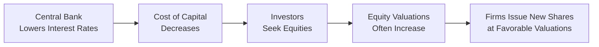

## Overview

Ah, the world of equity issuance—it's kind of like planning a big party, except instead of making sure there's enough pizza, you’re gauging interest rates, inflation trends, and, well, maybe also if the neighbors are in a festive mood. On a more formal note, macroeconomic trends strongly shape when and how companies tap into equity markets. When the economy hums along—low interest rates, decent GDP growth, accommodative monetary policy—companies often feel confident about issuing new shares. But when there’s an economic downturn or interest rates skyrocket, raising equity might be postponed (or canceled entirely).

In this section, we’ll explore how key macroeconomic conditions affect equity issuance decisions, highlight the role of both market sentiment and global economic cycles, and offer some real-life examples. By the end, you should see how these factors weave into corporate strategies and equity valuations, influencing a firm’s access to capital and, ultimately, its growth trajectory.

## Key Macroeconomic Indicators and Their Effects

Macroeconomic indicators such as interest rates, inflation, and GDP growth create the broader environment in which companies operate. One trick I sometimes use when discussing macroeconomics is to imagine these indicators as the “weather” of the financial environment—companies can’t control them directly, but they must adapt to them.

### Interest Rates

Interest rates are often the headline macroeconomic variable that shapes a company’s cost of capital. When central banks adopt a low-interest-rate policy, two notable outcomes occur:

• Borrowing becomes cheaper: Companies may prefer debt financing if they can secure low interest rates. However, these same favorable conditions can also inflate valuations in equity markets—investors seeking higher returns move away from low-yield bonds to equities. This can be great for equity issuance because share prices might be higher and investor demand can be more robust.  
• Liability management: When interest rates are low, existing borrowing is easier to roll over, so the impetus for equity financing might be strategic—perhaps to capitalize on a higher stock price rather than to cover expensive debt.  

Conversely, when rates are on an upward swing, companies view debt financing as more expensive. In many cases, that situation raises the appeal of equity (despite the potential for shareholder dilution) because they want to avoid the higher cost of servicing debt. However, rising rates can also depress market valuations. So, the interplay isn’t always simple—sometimes equity looks more attractive, but the stock price might be dropping, making issuance less appealing.

### GDP Growth

Gross Domestic Product (GDP) growth reflects the overall health of an economy. When GDP is rising:

• Corporate earnings often follow suit, with many companies posting stronger revenues and profits.  
• Investors typically exhibit higher risk tolerance, so they’re more inclined to invest in new equity offerings.  
• Bullish market sentiment can lead to better valuations, encouraging more frequent equity raises.  

In contrast, during an economic downturn, companies face weakened demand, subdued profitability, and more cautious investors. If a company is worried about a steep drop in share price, it might decide that issuing equity at a depressed valuation would be too costly in terms of dilution. As a result, you’ll often find fewer equity issuances during a recession.

### Inflation

Inflation is the rate at which the general price level of goods and services is rising. A manageable level of inflation (let’s say in line with central banks’ typical targets, around 2%) can signal healthy economic conditions. But if inflation soars:

• Central banks often respond by hiking rates, which can dampen equity market enthusiasm.
• Input costs for corporations may rise, compressing profit margins and, by extension, lowering equity valuations.  
• Equity issuance can become more expensive if valuations decline in the face of uncertain future earnings.

On the flip side, hyper-deflation or negative inflation can also be detrimental, signaling economic stagnation. In that environment, companies may avoid issuing equity because investors are worried about future downside risk.

## Market Sentiment and the Bull Market Effect

A bull market—characterized by surging stock prices and a robust appetite for risk—can act like a magnet for equity deals. You know how sometimes you’ve just had a great week, everything’s going perfectly, and you decide it’s a good time to start a new project (or host that big party)? Well, similarly, when investors see rising markets and positive corporate earnings, they’re typically more eager to back additional share offerings. Companies capitalizing on this sentiment often enjoy more successful (and possibly bigger) equity raises at higher valuations. Conversely, in bear markets, the cost of equity (reflected in lower share prices) can be quite steep, so many firms hold off unless it’s absolutely necessary.

## Monetary Policy and the Cost of Capital

Monetary policy—adjustments in the money supply and interest rates by a central bank—exerts a direct influence on equity markets. Let’s explore this through a simplified (and somewhat anecdotal) illustration:

When the central bank decides to lower rates or pursues quantitative easing (QE), it typically fuels investment in equities. This policy approach reduces fixed-income yields, often pushing investors into equities for better returns. Equity valuations, in such an environment, can climb, and the cost of raising new equity can improve. Moreover, expansionary policy can boost overall economic activity, leading to revenue growth for firms. So, it’s sort of a “positive one-two punch”: cheaper capital and healthier economic fundamentals.

Restrictive monetary policy, by raising rates and pulling liquidity out of the market, often has the opposite effect. Companies and investors alike must treat rising interest expenses and credit constraints. From the issuer’s perspective, the pool of eager investors shrinks, making a successful offering more challenging.

Below is a high-level representation of how monetary policy can influence equity issuance:

## Global Economic Cycles and Spillover Effects

Globalization has made markets undeniably connected. A slowdown in one significant economy—think the United States, the Eurozone, or China—often ripples through global supply chains, trade flows, and investor sentiment. If there’s a global recession, the demand for equities can drop almost everywhere. This is why you’ll see multiple stock exchanges simultaneously experiencing declines.

From a corporate standpoint, it’s crucial to monitor major economic blocs. For instance, a European multinational might delay an equity raise if a sharp Asian recession is expected to drag down worldwide demand for its products. On the bright side, an economic upswing in one region can also spread optimism globally, supporting equity issuance across multiple markets.

## Fiscal Policy Considerations

Fiscal policy—government spending and taxation—also weighs in on corporate decision-making. Periods of strong government expenditure or tax incentives can bolster consumer spending and corporate profitability, which indirectly lifts equity valuations. For instance, imagine a scenario where the government implements a large infrastructure project. Companies working in construction, materials, and related sectors see rising revenues and profits, making them prime candidates for issuing equity to expand capacity.

However, if fiscal measures involve higher taxes on corporate profits or individuals, it might reduce disposable income and corporate earnings. Investor appetite for equities could soften, or valuations could come under pressure.

## Strategic Timing of Equity Issuance

Timing is everything in equity issuance. Firms often maintain close dialogue with investment banks and market analysts, actively scanning economic forecasts to identify windows of opportunity. When macro indicators are strong—interest rates low, GDP rising, market sentiment upbeat—they’ll be more inclined to go to market. If signs point to a tightening cycle or an imminent economic slowdown, they may accelerate an offering before conditions worsen or opt to wait out the storm.

One personal anecdote: I once worked with a mid-sized tech company that delayed its secondary offering twice because the Federal Reserve hinted at raising rates. They did a thorough cost-benefit analysis each time. Ultimately, they issued shares just a few weeks after a favorable Consumer Price Index (CPI) print suggested cooling inflation. Their timing allowed them to tap into an optimistic investor mood, resulting in a strong share price. Without that approach, the story could have ended quite differently.

## Practical Example: An FMCG Company

To illustrate these macro forces in action, consider a Fast-Moving Consumer Goods (FMCG) company operating globally. Suppose GDP growth in its major markets is robust, inflation is contained, and interest rates are at multi-year lows. The company’s organic sales growth is solid, so they see an opportunity to expand into new product lines. Rather than borrow at relatively low—but still not negligible—costs, they notice that their share price has soared, thanks partly to investors’ bullish outlook on the consumer sector.

Sensing a window of opportunity, they issue new equity to fund expansions into emerging markets. The successful issuance not only brings in the needed capital but also boosts the company’s brand visibility among institutional investors. Had the macro backdrop been the opposite—high rates, tepid GDP growth, and rising inflation—management might have put that plan on hold or pursued alternatives.

## Glossary

Macroeconomic Indicators  
Statistics reflecting the overall health of the economy (e.g., GDP, CPI, interest rates).

GDP (Gross Domestic Product)  
The total monetary value of goods and services produced within a country during a specific period.

Monetary Policy  
Central bank actions (like setting interest rates and controlling money supply) to influence economic activity.

Bull Market  
A financial market condition where prices are rising or are expected to rise.

Fiscal Policy  
Government measures related to spending and taxation aimed at influencing economic conditions.

Market Sentiment  
The overall investor attitude toward a particular market or security.

Quantitative Easing (QE)  
A central bank policy to increase the money supply by purchasing government bonds or other securities.

Economic Downturn  
A phase in the business cycle characterized by reduced economic activity, higher unemployment, and lower consumer confidence.

## Conclusion and Best Practices

Macroeconomic trends are not to be overlooked when planning equity issuance. From interest rate pivots to shifts in investor sentiment, these forces shape whether a firm can attract robust demand and secure favorable valuations. In practice:

• Monitor central bank signals. Policy statements and rate decisions offer critical clues about future funding conditions.  
• Keep a vigilant eye on GDP reports, inflation data, and unemployment figures to gauge economic momentum.  
• Pay attention to market sentiment, as it often shifts quickly. A well-timed offering can be more successful if confidence is high.  
• Factor in global interdependencies. A downturn in one region can easily spill over into another, making local issuance more difficult than you might initially think.  
• Synchronize corporate strategic goals with macro conditions. By preparing multiple financing scenarios (including equity issuance), firms can pivot when the economic environment changes.  

Ultimately, successful equity issuances don’t just ride the wave of good times but also position firms to thrive through economic fluctuations. Maybe that’s the best-kept secret: beyond timing, thorough preparation and flexible strategies help companies adapt to—and even harness—the complexities of the macroeconomic landscape.

## References

• Mishkin, F.S. (2018). The Economics of Money, Banking and Financial Markets. Pearson.  
• Bernanke, B.S. & Blinder, A.S. (1992). The Federal Funds Rate and the Channels of Monetary Transmission. American Economic Review.  

## Test Your Knowledge: Macroeconomic Trends in Equity Issuance Quiz



### A key reason a company may prefer equity issuance over debt when interest rates are high is:

- [x] Higher debt financing costs make equity comparatively cheaper.
- [ ] Equity issuance is always less expensive at any interest rate.
- [ ] Equity prevents management from losing voting control.
- [ ] Rising interest rates automatically increase equity valuations.

> **Explanation:** When rates are high, debt service becomes expensive, making equity financing comparatively more attractive, even though share dilution might be a concern.

### Which of the following circumstances typically encourages firms to issue equity?

- [ ] A sharp drop in share prices.
- [x] Bullish market sentiment and high valuations.
- [ ] Contractionary monetary policy.
- [ ] Elevated taxable income.

> **Explanation:** In a bull market, companies often tap the equity market because high valuations reduce the cost of equity issuance.

### When a central bank pursues quantitative easing:

- [x] The money supply typically increases, lowering yields and boosting equity valuations.
- [ ] The money supply is sharply reduced to dampen inflation.
- [ ] Companies are generally discouraged from raising capital.
- [ ] Government spending automatically declines over time.

> **Explanation:** Quantitative easing injects liquidity into the financial system, often pushing investors toward equities and raising valuations.

### All else being equal, a rising inflation rate can negatively affect equity issuance because:

- [x] Central bank rate hikes may depress equity valuations.
- [ ] Firms prefer inflation as it lowers real debt costs.
- [ ] Lower interest rates are likely in a high-inflation environment.
- [ ] Equity becomes “too cheap” and thus unattractive to investors.

> **Explanation:** Higher inflation often leads to policy tightening, increasing rates and diminishing investor appetite, which can hurt share valuations.

### A global recession can simultaneously reduce equity issuance in different markets because:

- [x] Integrated markets experience a decline in investor appetite worldwide.
- [ ] Recessions never affect investor sentiment.
- [x] Multinational companies face weakened demand across regions.
- [ ] Companies do not use global financial markets to raise equity.

> **Explanation:** Globalized markets transmit economic shocks quickly, lowering overall demand, valuation, and appetite for new issues across multiple regions.

### Which macroeconomic indicator most directly reflects the level of economic activity that could boost corporate earnings?

- [x] GDP growth.
- [ ] Inflation expectations.
- [ ] Trade deficits.
- [ ] Consumer confidence.

> **Explanation:** GDP growth is a direct measure of economic expansion and often correlates to higher corporate earnings.

### In a bull market with stable interest rates and rising GDP:

- [x] Equity issuances are often more successful due to strong valuations.
- [ ] Firms avoid issuing equity because of excessive investor optimism.
- [x] Companies may accelerate share offerings to fund expansion.
- [ ] Firms typically prefer long-term debt over equity.

> **Explanation:** A favorable macro environment with rising GDP and stable rates promotes healthy valuations, making it an ideal time to issue equity.

### Which action by a central bank would most likely deter companies from issuing new equity?

- [x] Rapidly increasing benchmark interest rates.
- [ ] Injecting liquidity and keeping rates near zero.
- [ ] Maintaining a neutral monetary stance.
- [ ] Advocating for stable inflation targets without rate changes.

> **Explanation:** Substantial rate hikes can reduce market optimism and lower equity valuations, making new share issuances less appealing.

### Which factor could explain why a government’s increased infrastructure spending leads to higher equity issuance?

- [x] Corporate earnings in related sectors may rise, making equity offerings more attractive.
- [ ] Equity financing has zero cost in times of fiscal expansion.
- [ ] The government directly purchases equities from issuing firms.
- [ ] Higher taxes on corporations incentivize them to issue shares.

> **Explanation:** Government infrastructure projects can lift earnings in connected industries, which can raise valuations and encourage these firms to issue equity.

### In an expansionary monetary environment, which statement is most likely true?

- [x] Lower interest rates often push investors toward equities, boosting valuations.
- [ ] Central banks usually raise rates to stabilize bond prices.
- [ ] Companies find equity issuance less favorable because shares become illiquid.
- [ ] Equity issuance is restricted by central banks to curb inflation.

> **Explanation:** Expansionary policy lowers rates and makes bond yields less attractive, thereby pushing capital toward equities and lifting share prices.


