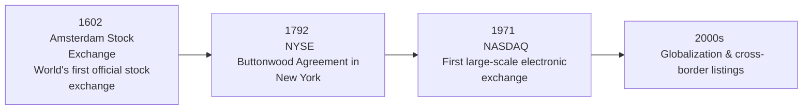

## Origins of Early Stock Exchanges
Let’s take a trip—figuratively, of course—back to the roots of organized equity markets. Believe it or not, history credits the Amsterdam Stock Exchange, founded in 1602 by the Dutch East India Company (VOC), as the world’s first official stock exchange. Now, I’ve always found it fascinating how folks back then managed to set up a marketplace—minus our nifty computer systems—that allowed investors to buy and sell partial ownership shares (equities) in a globally operating firm like the VOC. It’s akin to an archaic version of the multinational corporation.

In these early days, equities were mostly traded on specialized curbs and marketplaces, with personal interactions dictating pricing and liquidity. If a merchant yelled out an asking price at the exchange and a buyer approved, well, that was about as close to “trade execution” as you’d get. Over time, these norms—like setting standard settlement periods or standardizing share certificates—became the basis for modern, more complex securities markets.

The Amsterdam model spread across Europe, inspiring the subsequent formation of stock exchanges in London and Paris. Each exchange developed its own set of listing regulations and trading practices, shaping how modern equity markets would handle disclosure, transparency, and investor protection.

## The Industrial Revolutions and Corporate Expansion
Fast-forward a bit, and you’ll see how industrial revolutions supercharged the need for capital. The first major wave of industrialization—featuring steam power and mechanized production in the 18th and 19th centuries—prompted massive equity issuances. Companies needed financing to build factories, develop railroads, and exploit natural resources on a larger scale. Equity markets provided a convenient avenue to pool widespread capital from thousands of investors. 

Then came additional waves of transformation: electricity, mass-produced automobiles, telecommunication, and the internet. Each epoch created new industries that demanded fresh infusions of equity capital. Investors, seeing the potential for growth, flocked in droves. Equity ownership no longer fit the mold of a small group of “insiders” alone; it started to become a real possibility for a growing middle class.

## The Rise of Electronic Trading
Maybe you recall the days—well, some of us do—when images of traders in colorful jackets shouted orders across a bustling trading floor. That method still symbolizes the older “open-outcry” trading. Then came the1971 birth of NASDAQ in the United States, the first major electronic exchange. NASDAQ effectively replaced the traditional trading floor with a network of computers that matched buy and sell orders. Over time, more exchanges adopted electronic platforms, bringing about:

• Faster execution speeds.  
• Reduced frictional costs (lower commissions/spreads).  
• Better market transparency (everyone sees the same quotes).  
• Greater accessibility (especially for retail investors with an internet connection).  

This modernization let institutional investors, professional traders, and even average folks benefit from quicker, more efficient transactions. While some lamented the loss of the personal color of trading pits, the net effect was to broaden market participation globally. 

Here is a simple diagram illustrating the milestone transitions of stock exchanges:

## Historic Bull and Bear Markets
Equity markets, as you might imagine, don’t always go up (that’s a bit of an understatement). Major bull markets—periods of sustained growth—have shaped investor optimism and fueled capital formation. Famous episodes such as the Roaring Twenties (1920s) in the United States turned everyday individuals into stock buyers, a novelty at the time. This era illustrated just how powerful a bull run could be, with new technologies (automobiles, household appliances) inspiring frenzied speculation.

But each bull market has its counterpart. Markets correct, sometimes violently, in “bear” cycles—periods of falling prices. The 1929 Crash ended the Roaring Twenties with a bang, ushering in the Great Depression. Then there was the Dot-Com Bubble of the late 1990s, when tech stocks soared upon mere mention of an “internet strategy.” Eventually, it all came crashing down, wiping out billions of dollars in wealth practically overnight. More recently, the Global Financial Crisis (spanning 2007–2009) started with a housing market meltdown yet ballooned into a full-blown global crisis.

From the viewpoint of a potential CFA candidate, these booms and busts are essential to remember: they shape regulations, investor sentiment, and the way professionals approach risk management. There’s a reason these crises are so heavily studied: each one sets the stage for the next set of rules and investor safeguards.

## Market Crashes and Regulatory Reforms
Every major crash in equity markets has prompted some sort of regulatory introspection. The 1929 Crash, for example, led to a slew of US legislation: the Securities Act of 1933 and the Securities Exchange Act of 1934. The goal was to establish transparent reporting and to deter fraud. Prior to these rules, widespread manipulation and insider dealings were more common. 

Similarly, the 2008 Global Financial Crisis triggered more modern reforms, such as the Dodd-Frank Wall Street Reform and Consumer Protection Act in the United States, aiming to increase oversight of financial institutions. The broader point is: whenever markets blow up, governments and regulators try to figure out how to patch the holes.

Of course, the success of these reforms can be debated. All the same, the underlying rationale remains fairly consistent: high-level investor protection fosters trust, and trust is vital for well-functioning capital markets.

## Globalization and Cross-Border Flows
In the 20th century, improved communication technologies (remember the telegraph, telephone, and eventually the internet) reduced the friction associated with international investing. Today, many major companies are listed on multiple exchanges—commonly known as cross-listings—to gain broader access to investors worldwide.

For example, a U.S. firm might cross-list in London or Hong Kong, enabling local investors there to purchase its shares with less hassle. This has furthered the globalization of equity investing, letting pension funds in Europe (for instance) hold shares in Japanese or American firms with relative ease. With globalization came major capital inflows and outflows across borders: in some sense, stock markets are no longer purely local phenomena but part of a global network.

## Emergence of Institutional Investors
Gone are the days when Mom-and-Pop retail investors single-handedly propelled the market. Institutional investors—like pension funds, endowments, insurance companies, and hedge funds—now represent a significant portion of global trading volume. These large players not only invest on behalf of clients or members but also drive industry standards. They lobby for regulatory changes, push for corporate governance improvements, and often set the tone for investment trends (e.g., the increased focus on ESG).

Why does it matter so much? Because institutions can move huge blocks of shares, impacting prices and liquidity in ways a single investor can’t. They also have the resources to conduct in-depth research, engage in activism when corporate governance is lacking, and shape product offerings (think specialized exchange-traded funds, derivatives, etc.). That means the entire market dynamic can shift when institutions decide to rotate from stocks to bonds, or from domestic to international equities.

## Putting It All Together
Viewed through a long lens—from the 17th-century advent of stock exchanges up to modern high-frequency, electronic-driven platforms—equity market evolution is truly remarkable. It has been powered by industrial and technological revolutions, shaped by booms and busts, and refined by successive waves of regulation. Today’s markets may look unrecognizable to a 17th-century Dutch merchant; but at their core, they serve the same purpose: connecting capital seekers with capital providers while reflecting the complex interplay of regulation, technology, and investor psychology.

If there’s one takeaway, it’s that equity markets do not exist in a vacuum. They’re reactions to (and catalysts for) broader economic, political, and technological changes. And yes, they’re shaped by ever-changing participant behavior—be it bullish optimism, panicky sell-offs, or the new wave of big institutional trades.

## Key Glossary Terms
• Stock Exchange: An organized marketplace where securities such as equities are issued and traded.  
• Bull and Bear Markets: “Bull” for rising markets, “Bear” for falling ones.  
• Electronic Trading: Computer-based execution of trades, superseding traditional floor-based systems.  
• Market Crash: A sudden, dramatic decline in stock prices across much of the market.  
• Securities Act: Regulatory legislation designed to increase transparency and protect investors.  
• Institutional Investors: Organizations investing on behalf of their members or clients (e.g., banks, pensions).  
• Global Financial Crisis (2008): A severe worldwide economic crisis triggered by the U.S. housing market collapse.  
• Dot-Com Bubble (1990s): A period of excessive speculation on internet-based businesses, ending in a drastic market drop.

## References and Further Reading
• Goetzmann, W.N. (2016). “Money Changes Everything: How Finance Made Civilization Possible.” Princeton University Press.  
• Kindleberger, C.P. & Aliber, R.Z. (2011). “Manias, Panics, and Crashes.” Palgrave Macmillan.  

• For official CFA curriculum readings related to equity market structures, see the CFA Institute’s Level I and II readings on “Equity Investments.”  
• For a deeper dive into regulations, see the websites of the U.S. Securities and Exchange Commission (SEC) and other major global regulators.

## Test Your Knowledge: Historical Perspectives on Equity Market Evolution



### Which of the following best describes the first official stock exchange?
- [ ] The London Stock Exchange created in the 1680s.
- [ ] The New York Stock Exchange founded under the Buttonwood Agreement.
- [x] The Amsterdam Stock Exchange, established in the early 1600s.
- [ ] The Paris Bourse during the Napoleonic Wars.

> **Explanation:** The Amsterdam Stock Exchange (founded in 1602) is widely recognized as the first organized (official) stock exchange, formed by the Dutch East India Company to trade its shares.

### Which statements about the Industrial Revolution’s impact on equity markets are correct?
- [x] Large-scale capital needs spurred more frequent use of equity financing.
- [x] Steam power supported the establishment of new industries, boosting the stock market.
- [ ] It caused governments to ban equity trading for fear of speculation.
- [ ] It reduced the demand for equity financing.

> **Explanation:** The growth in mechanized industries created the need for significant capital, which firms sought by issuing equities. This led to a broader pool of investors and expanded equity markets.

### What is the key characteristic that differentiates electronic trading from traditional open-outcry systems?
- [x] Trades are executed via computer-based platforms rather than a physical “pit.”
- [ ] It prevents trades by retail participants.
- [ ] It requires face-to-face negotiation with a broker.
- [ ] It exclusively accommodates large institutional block orders.

> **Explanation:** Electronic trading replaces the traditional floor-based open-outcry approach with automated order matching, offering more efficient and standardized transaction processing.

### Which major event spurred the introduction of multiple U.S. securities laws in the 1930s?
- [ ] The Dot-Com Bubble.
- [ ] The 1987 Black Monday crash.
- [ ] The Global Financial Crisis of 2008.
- [x] The 1929 stock market crash.

> **Explanation:** The 1929 crash preceded significant reforms to restore market confidence, such as the U.S. Securities Act of 1933 and the Securities Exchange Act of 1934.

### Which of the following are typically considered improbable but high-impact events in equity markets?
- [x] Financial “black swan” events.
- [ ] Slow and steady bull markets.
- [x] Sudden “flash crashes.”
- [ ] Constant incremental price nudges.

> **Explanation:** “Black swan” events and “flash crashes” can cause massive, unforeseen disruptions. Steady, incremental changes do not usually fall into the category of high-impact outliers.

### Which factor most contributed to the globalization of equity markets?
- [x] Advances in communication technology reducing geographic barriers.
- [ ] A general decline in investor interest for cross-border opportunities.
- [ ] Governments banning foreign ownership of companies.
- [ ] The elimination of all transaction taxes worldwide.

> **Explanation:** Improved communication and technological connectivity fueled the global expansion of equity investing by making cross-border transactions more seamless.

### Which of the following outcomes is most associated with the growth of institutional investors?
- [x] Greater influence on corporate governance.
- [ ] Less demand for advanced equity research.
- [x] Larger block trades that can rapidly move share prices.
- [ ] A sharp decline in pension funds’ involvement in equity markets.

> **Explanation:** When large entities like pension funds, insurance companies, or hedge funds enter equity positions, they can influence corporate policies and trading dynamics due to their substantial assets under management.

### Which frenzy in the late 1990s is best described as a rapid rise in stock valuations followed by collapse, largely affecting technology companies?
- [ ] The Tulip Mania of the 17th century.
- [ ] The Roaring Twenties surge in automotive shares.
- [x] The Dot-Com Bubble.
- [ ] The electric utility bubble.

> **Explanation:** The Dot-Com Bubble involved tech companies that soared on speculation surrounding internet-based business models, only to collapse when high expectations were not met.

### What was a key regulatory outcome of the 1929 Crash for U.S. markets?
- [x] Requirement of periodic financial disclosures by listed firms.
- [ ] Complete elimination of margin trading.
- [ ] Legal prohibition on short-selling stocks.
- [ ] A ban on investment in foreign equities.

> **Explanation:** Perhaps the most pivotal legacy of the 1929 Crash was transparent and standardized financial disclosure for listed companies, enforced by the newly established SEC.

### True or False: Institutional investors, such as pension funds and hedge funds, now account for a significant share of trading volume in modern equity markets.
- [x] True
- [ ] False

> **Explanation:** Institutional investors collectively manage vast sums of capital and dominate a sizable proportion of equity trading worldwide, influencing market prices and liquidity.


