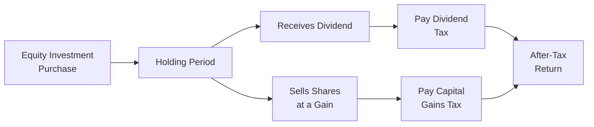

## Introduction

I remember a friend once asked me, “Does holding my stocks for just a couple of weeks make a difference on taxes?” and, well, the short answer was, “Yes, it totally can!” The way dividends and capital gains are taxed can significantly affect an investor’s take-home returns. And, as with many aspects of equity investing, tax rules can get far more complicated the deeper you dig—especially if you invest worldwide or have varied holding periods. 

This section explores the main ways taxes come into play with equity investments. We’ll talk about how dividends and capital gains are often treated (and taxed!) differently, why holding periods might change your tax rate, and how you can sometimes use tax-advantaged accounts to reduce your burden. We’ll also discuss complexities like foreign withholding taxes, the rise of share buybacks as an alternative to dividends, and even estate considerations. Let’s unravel each topic in a slightly relaxed, friend-to-friend style, but still cover enough detail for those seeking a thorough financial analysis.

## Key Tax Considerations

### Differences in Dividend and Capital Gains Taxation

Many investors assume that, if you earn money in the stock market, it’s all taxed the same way. But the reality is more nuanced:

• Dividends are often treated differently from capital gains.  
• Some jurisdictions classify dividends as ordinary income, and you pay tax at your marginal rate.  
• Others provide a special (and usually lower) tax rate on “qualified” dividends or certain distributions.

Capital gains—basically the profit when you sell a stock for more than you bought it—are also taxed differently across regions. Some countries impose a flat capital gains tax, while others exempt certain categories of investors or set special rules for short-term vs. long-term holding periods. In some cases, if an investor with significant holdings qualifies for certain beneficial regimes (e.g., retirement account structures), the capital gains might be taxed at a very low rate or potentially not taxed until withdrawal.

The difference in tax treatment between dividends and capital gains is central to deciding the best approach for distributing returns to shareholders. Companies that pay consistent dividends make it easy for investors to see a steady source of cash flow, but it also means these investors could be subject to immediate tax obligations. Meanwhile, if companies opt to retain earnings or use share buybacks, shareholders effectively receive benefits in a different (and sometimes more tax-efficient) form.

### Holding Periods: Short-Term vs. Long-Term

In many parts of the world, including the United States, short-term capital gains are taxed at higher rates than long-term capital gains. “Short-term” often means a holding period of one year or less. “Long-term” typically means you held the security for more than one year. For example:

• Short-Term Capital Gains: Taxed at ordinary income tax rates, which might be relatively high for many investors.  
• Long-Term Capital Gains: Often enjoy preferential (lower) rates.  

If you’re in a jurisdiction that differentiates between these two categories, it might be wise to think about your trading strategy. Let’s say you consider selling your stock when it has been held for 11 months and a week. That’s probably a short-term gain. If you wait another three weeks, you might qualify for a lower long-term rate (assuming the price stays strong). This difference can be significant if you’re dealing with a sizable position. However, of course, there can be a risk that the stock price falls in the interim. Taxes shouldn’t be the only driver of your trading decisions, but they definitely deserve a seat at the table.

### Withholding Taxes for Cross-Border Dividends

If you ever purchase stocks in foreign markets, you might face withholding taxes on dividends. This means the foreign government automatically takes a slice of your dividend income before it even reaches you. For instance, some countries impose a 15% or 30% withholding tax on dividends paid to foreigners. In some situations, you can reclaim a portion of those taxes via your domestic tax authority if your country has a favorable double taxation treaty. 

Nevertheless, the process can be cumbersome:

• You often need to file specific forms.  
• Your broker or custodial bank might help with the process, or you might have to navigate the system alone.  
• Timing is another factor—some reclaims can take months or years.

Withholding taxes directly reduce your immediate dividend income. When analyzing foreign stocks, it’s crucial to account for these potential extra levels of taxation when forecasting net returns. Be mindful of the foreign tax credit or related provisions in your home country that might offset any withholding.

### Share Buybacks as an Alternative

Companies sometimes decide to reward shareholders via share repurchases (buybacks) rather than dividends. Why might that be? A share buyback generally reduces the number of shares outstanding, which can increase earnings per share (EPS) and potentially support higher share prices. Shareholders who choose to sell back some shares might realize capital gains, which, depending on local tax rules and their personal holdings, could be more tax-friendly than regular dividend payments.

Here’s a simplified illustration:

• Suppose a company has $10 million in excess cash.  
• Instead of paying a dividend, the company uses it to buy back shares.  
• If you hold your shares (not sell them in the buyback), your percentage ownership in the company might increase marginally if some other shareholders tender their shares.  
• And if the company’s stock price goes up over time, you may realize capital gains whenever you eventually sell.

The key advantage is that investors can control the timing of their capital gains recognition by choosing when to sell. With dividends, you typically have less control—the dividend is paid out, and you owe tax on it that year, unless you hold in a tax-sheltered account.

### Tax-Advantaged Accounts

One of the best ways to mitigate taxes on equity investments (in many jurisdictions) is to hold them inside a tax-advantaged account. Let’s see how it might look:

• Retirement Accounts: Plans such as an IRA or 401(k) in the United States, or pension schemes in other countries, often let you grow your investments tax-deferred or tax-free until retirement.  
• Educational Savings Accounts: Some countries allow tax benefits for educational savings, so investment growth used for education might not be subject to normal capital gains or dividend taxes.

Tax-advantaged accounts allow you to delay or even avoid taxes, which can accelerate the compounding of returns. For long-term equity investing, that deferral benefit can be huge. However, remember that these accounts often come with contribution limits, withdrawal restrictions, or required minimum distributions, so they’re not always as flexible as a regular brokerage account.

### Estate and Inheritance Tax Considerations

When high net worth investors pass away, their estates can incur hefty taxes—sometimes known as estate taxes or inheritance taxes. Equity holdings might be subject to these taxes, which can vary significantly by country or state. For instance:

• The U.S. has a federal estate tax on assets above a certain threshold, including stocks.  
• Some other nations both impose and waive inheritance taxes based on local rules and treaties.

In estate planning, thoughtful investors look for ways to structure equity holdings (e.g., through trusts, insurance vehicles, or philanthropic donations) so that beneficiaries aren’t overwhelmed by tax bills. Some might also explore transferring shares well in advance or using estate-freezing techniques to lock in today’s share prices. 

### Integrating Tax Planning into Equity Strategy

Let’s be honest, nobody invests just to pay taxes. The ultimate objective is to grow real wealth over time. That’s why tax planning should never be an afterthought. From deciding which account to use for your equity purchases to choosing when to realize gains or losses, focus on after-tax returns rather than purely the gross returns.

• Tax-Loss Harvesting: If your equities decline in value, you might sell them at a loss to offset other gains in the same tax year (or potentially carry forward losses to offset future gains).  
• Portfolio Rebalancing: Sometimes rebalancing triggers capital gains. Doing so in a tax-advantaged account can help avoid an immediate tax hit.  

And let’s not forget the importance of staying on top of changing tax laws. Moves by legislators can shift the tax landscape quickly, which can upend the assumptions you made even a year ago.

## Practical Examples and Illustrations

### Example 1: Dividends vs. Capital Gains

Imagine you bought 100 shares of Company A for $50 each, so total cost basis of $5,000. Over one year, the stock’s price rises to $60:

• If you sell now, you realize a capital gain of $1,000. If that is a long-term capital gain taxed at, say, 15%, you pay $150 in taxes, netting $850.  
• If the company had instead paid a dividend of $2 per share, you get $200 in dividends. If dividend income is taxed at 25%, you owe $50, netting $150. Meanwhile, your unrealized capital gain remains $1,000 (assuming the share price adjusts only partially for dividend).  

Which scenario is better? It depends on your personal tax rate, the investment’s future prospects, and whether you’re in a tax-advantaged account. 

### Example 2: Withholding Taxes on Foreign Dividends

Consider you’re a U.S. investor purchasing shares of a Swiss company that pays an annual dividend of CHF 1 per share. Before you see a dime, the Swiss authorities may withhold 35%. This leaves you with CHF 0.65 per share. If you qualify for a partial refund or a foreign tax credit, you might eventually offset some portion of that withheld amount, but the process can be lengthy and require extra paperwork. 

The net effect is that if your broker statement lists you receiving CHF 0.65 per share, it doesn’t reflect the portion potentially reclaimable, nor does it reflect the final U.S. tax liability. These complexities can creep up quickly, so you want to plan accordingly.

### Example 3: Share Buyback Implications

Picture a scenario: You hold shares in a tech company that decides to allocate $1 billion to buy back common stock rather than pay a dividend. If the stock price climbs post-buyback, the only time you’d owe taxes is when you sell. Meanwhile, if you hold those shares for more than a year after the buyback, any resulting gain might qualify for favorable long-term capital gains rates (depends on your tax code).  

This difference can be pivotal for investors seeking to time their tax liabilities or who prefer to hold shares indefinitely. It’s part of the reason share buybacks have become popular in certain markets.

## Diagram: Tax Flows in Equity Investing

Below is a simplified Mermaid diagram illustrating the flow of dividends vs. capital gains and how they interact with an individual investor’s tax situation.

From the purchase of equity (A), investors can hold (B) and receive dividends (C) or sell for capital gains (D). Each route carries its own tax liability—(E) for dividends, (F) for capital gains—ending in after-tax returns (G).

## Best Practices and Pitfalls

• Do not let the “tax tail wag the investment dog.” Don’t hold a losing stock just for fear of paying taxes on gains elsewhere.  
• Keep impeccable records of purchase prices (cost basis) and holding periods. Tax authorities often require precise data to confirm short-term vs. long-term rates.  
• Be aware of wash-sale rules (in some jurisdictions) that disallow claiming a tax loss if you repurchase a substantially identical stock within a certain timeframe.  
• Explore possible tax treaties and credits for international diversification. The benefits may differ drastically among different countries.  
• Consider checking local estate rules if you have large holdings. Proactive planning can save your heirs from a complex legal and tax ordeal.  

## After-Tax Return Calculation

A simplified formula for after-tax returns on an equity investment could be represented as:


\text{After-Tax Return} 
= (\text{Price Sold} - \text{Price Bought} - \text{Transaction Costs}) \times (1 - T_{cg}) + (\text{Dividends} \times (1 - T_{div}))


Where:

• \\(T_{cg}\\) = Applicable capital gains tax rate.  
• \\(T_{div}\\) = Applicable dividend tax rate.  

Of course, real-world scenarios may involve multiple partial sales, varied holding periods, or re-invested dividends, so the actual formula can get messy quickly.

## Conclusion and Exam Tips

When it comes to equity investing, taxes are a big deal. Carefully planning the timing of your trades, leveraging tax-advantaged accounts, understanding that short-term vs. long-term gap, and exploring alternative corporate actions are all critical elements in managing your overall wealth. If you invest internationally, definitely get familiar with withholding taxes and double taxation treaties. 

For exam preparation, imagine scenario-based questions: you might see a question that compares the after-tax returns of a high-dividend strategy vs. a growth strategy with minimal dividends. Or maybe you’re asked about different portfolio rebalancing methods and how to reduce a tax hit. Expect to demonstrate not only that you understand these concepts but also how to apply them within various real-life contexts. 

Stay agile: tax laws can and do change. The CFA curriculum tests whether you grasp the principles—like the difference between short-term and long-term gains, potential benefits of share buybacks, or how withholding taxes might be reduced through tax treaties or foreign tax credits.

## References

• Poterba, J. M., & Weisbenner, S. J. (2001). “Capital Gains Tax Rules, Tax-Loss Trading, and Turn-of-the-Year Returns.” Journal of Finance.  
• PwC. (n.d.). “Worldwide Tax Summaries.” Available at: [https://www.pwc.com/](https://www.pwc.com/)  
• CFA Institute (2025). CFA® Program Curriculum Level I, Vol. 5: Equity Investments.

-----

## Test Your Knowledge: Tax Implications in Equity Investing



### Which of the following statements describes a difference between dividend taxation and capital gains taxation?

- [ ] Dividends are never taxed while capital gains are always taxed.  
- [x] Dividends may be taxed immediately as income in some jurisdictions, whereas capital gains are taxed when realized.  
- [ ] Capital gains always have higher tax rates than dividends.  
- [ ] Dividend income is only taxable in tax-advantaged retirement accounts.  

> **Explanation:** In many tax systems, dividends are taxed as income when received, while capital gains are taxed upon realization (sale). The specific tax rates vary by jurisdiction.

### What is typically the key advantage of a share buyback compared to a dividend distribution?

- [ ] It allows investors to avoid paying any taxes indefinitely.  
- [x] It may give investors more control over the timing of their tax liability.  
- [ ] It completely eliminates short-term capital gains.  
- [ ] It results in tax-free earnings for all shareholders.  

> **Explanation:** Share buybacks often allow shareholders to choose if and when they sell, giving them some control over timing and potential preferential long-term capital gains rates.

### Why might a long-term shareholder prefer a company to engage in share buybacks rather than paying regular dividends?

- [ ] Because the long-term shareholder is always exempt from dividend taxes.  
- [ ] Because share buybacks automatically convert all gains into losses for tax offsets.  
- [x] Because the shareholder can continue to hold the shares and potentially defer capital gains taxes until they decide to sell.  
- [ ] Because share buybacks increase ordinary income in the current year.  

> **Explanation:** By avoiding dividends in favor of buybacks, shareholders who hold their shares can usually defer capital gains until they decide to sell—which may be more tax-efficient, especially in certain jurisdictions.

### If you hold a stock for 11 months and then sell it for a profit, how is this typically taxed in jurisdictions like the United States?

- [ ] As a long-term capital gain.  
- [x] As a short-term capital gain, potentially at a higher rate.  
- [ ] As tax-free income.  
- [ ] As dividend income.  

> **Explanation:** In many countries, including the U.S., holding a security for a year or less generally means gains are short-term and often taxed at ordinary income rates.

### Which of the following is a correct statement regarding foreign withholding taxes on dividends?

- [x] Some portion of the foreign dividend may be withheld at the source, and you might offset that with a foreign tax credit.  
- [ ] Withholding taxes only apply if you trade on margin.  
- [ ] Withholding taxes ensure that dividends remain tax-free in the investor’s home country.  
- [ ] All countries exempt foreign shareholders from withholding taxes.  

> **Explanation:** Many countries require a percentage of dividend payments to foreign shareholders to be withheld. Investors in some jurisdictions can reclaim part or all of these withholdings via tax credits or treaties.

### Which type of account often provides tax-deferred or tax-free growth for equity investments?

- [x] Tax-advantaged retirement accounts, such as an IRA or 401(k).  
- [ ] Margin accounts at a standard broker.  
- [ ] Cash accounts used strictly for foreign equities.  
- [ ] Corporate checking accounts.  

> **Explanation:** Many jurisdictions offer retirement-focused investment accounts (e.g., IRAs) that provide tax benefits, allowing for deferral or exemption of taxes until funds are withdrawn or under certain other conditions.

### An investor sells a security at a loss primarily to reduce current taxable capital gains. What practice does this scenario illustrate?

- [ ] Wash-sale rule.  
- [x] Tax-loss harvesting.  
- [ ] Carryforward planning.  
- [ ] Dividend imputation.  

> **Explanation:** Tax-loss harvesting involves selling securities at a loss to offset taxable gains, thus reducing the investor’s overall tax liability.

### Which of the following best reflects “after-tax return”?

- [ ] Return before paying any capital gains or dividend taxes.  
- [x] The investment’s gross return minus any applicable taxes and transaction costs.  
- [ ] A theoretical number used only for accounting purposes.  
- [ ] Pre-expense ratio performance.  

> **Explanation:** After-tax return is the net result of growth or income from an asset once all tax obligations and costs have been accounted for.

### If an investor receives a foreign dividend with a 30% withholding tax, how might they recoup some of the withheld amount?

- [ ] By requesting a refund directly from the company’s Board of Directors.  
- [ ] By accumulating the dividends in a U.S. margin account.  
- [x] By applying for a foreign tax credit if a tax treaty exists.  
- [ ] By holding the shares in a non-taxable trust.  

> **Explanation:** Many countries allow residents to claim a foreign tax credit for taxes withheld in a foreign jurisdiction, particularly if there is a double taxation treaty in place.

### True or False: Estate taxes on equity holdings only apply if the shares were purchased more than one year prior to the owner’s death.

- [x] True
- [ ] False

> **Explanation:** This can be true in some jurisdictions where estate or inheritance tax obligations apply to assets (such as stocks) if they exceed exemption thresholds—though each jurisdiction’s rules differ concerning holding periods and thresholds. Always check relevant local rules.


