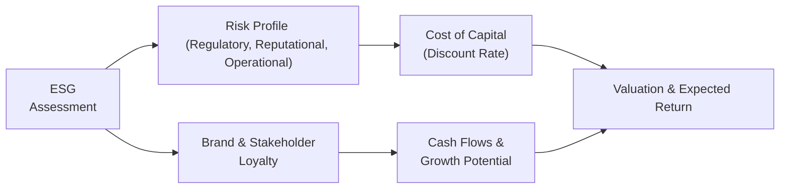

## Introduction
ESG (Environmental, Social, and Governance) factors have surged in importance in the modern investment landscape, leaving many of us (myself included) scrambling to figure out exactly how they fit in with our traditional equity analysis. Maybe you’ve heard folks say, “Well, it’s not just about good intentions or philanthropy—ESG can really affect the bottom line.” And it’s true. ESG considerations can shift risk profiles, alter cost structures, and shape long-term return potential. 

This section explores how ESG criteria can influence the equity risk–return relationship, offering a deep dive into each dimension (Environmental, Social, and Governance), along with practical examples. We’ll mix in industry best practices, a few personal reflections, references to major frameworks, and some advanced insights specifically tailored for CFA Level III exam preparation. We’ll also look at challenges and pitfalls (because goodness knows there are some), and close with exam tips and sample questions so you can ace any scenario-based item set on ESG. 

## Why ESG Matters
At a high level, ESG factors represent non-traditional but materially relevant considerations that can impact a company’s cash flow stability, strategic direction, and capacity to meet long-term obligations. For instance:
- Environmental issues can trigger large fines or investment outlays if regulations tighten unexpectedly. 
- Social issues such as poor labor practices can hamper brand reputation or lead to costly supply-chain disruptions.
- Governance failures can result in misaligned incentives, corruption, or even massive scandals that pulverize share prices overnight.

When we talk about ESG, we’re essentially adding another layer to risk management, acknowledging that the world doesn’t just revolve around the next quarter’s earnings. For advanced portfolios, this means adjusting discount rates, analyzing intangible assets, and even rewriting the way we forecast risk premiums. 

## Breaking Down ESG Factors

### Environmental Considerations
Environmental factors might include carbon emissions, pollution, water use, deforestation, and broader resource management. These affect operational efficiency, regulatory compliance costs, and overall corporate reputation. I remember hearing a senior analyst joke, “Nothing puts a dent in your cost of capital like a good old-fashioned oil spill.” It was tongue-in-cheek, but there’s truth there: the negative publicity, potential fines, and lawsuits can wreak havoc on cash flows and brand equity.

Key areas:
- Carbon footprint: A measure of greenhouse gas emissions. Companies with heavy footprints might face higher taxes or offset requirements.
- Resource usage: Overconsumption or inefficient energy use can increase costs and expose firms to supply disruptions.
- Regulatory risk: Rapid changes in environmental regulations can force expensive capital investments. 

### Social Considerations
Social factors focus on a company’s relationship with external and internal stakeholders. Things like diversity and inclusion, labor standards, customer welfare, and data privacy all fit here.

Common social metrics:
- Employee satisfaction: High turnover can lead to operational inefficiencies, training costs, and disruption in the corporate culture. 
- Product safety: Recalls or liability lawsuits can crush brand loyalty and earnings.
- Community engagement and human rights standards: Strong engagement may boost goodwill, while weak adherence can provoke consumer boycotts or legal action.

### Governance Considerations
Governance centers on how a company is directed and controlled. When governance is strong—think independent boards, transparent disclosures, robust internal controls, equitable treatment of shareholders—companies often benefit from lower cost of capital and fewer surprises.

Crucial governance traits:
- Board independence and diversity: Helps mitigate conflicts of interest. 
- Shareholder rights: More equitable structures discourage mismanagement. 
- Executive compensation: Misaligned incentive structures can increase short-term risk-taking at the expense of long-term value.
- Audit and risk controls: Weak oversight often leads to fraud or misleading financial statements.

## How ESG Influences Equity Risk and Return
ESG performance can impact both the numerator and denominator of equity valuations—in other words, it can alter cash flows, growth rates, and discount rates. Here is a simple conceptual breakdown in a Mermaid diagram:

When ESG considerations are factored in:
- A company with high environmental compliance and strong social values might experience consistent demand, fewer disruptions, and more stable cash flows. This stability often translates to a lower equity risk premium (i.e., lower cost of equity). 
- Firms with questionable governance or poor social track records might face higher volatility due to lawsuits or boycotts. Investors then require a higher risk premium, increasing the company’s cost of capital and depressing valuation multiples in the process.

### ESG as a Double-Edged Sword
ESG integration doesn’t always imply superior performance on every time horizon. There are short-run trade-offs to think about—for example, you might exclude a certain profitable industry on ethical grounds, potentially underperforming a broad market benchmark if the sector rallies near-term. But from a long-view perspective, strong ESG practices can reduce tail risk events and enhance corporate resilience.

## Trends in Institutional Adoption
Over the past decade, large institutional investors—sovereign wealth funds, pension funds, endowments—have been incorporating ESG mandates into their portfolio policies. The UN-backed Principles for Responsible Investment (PRI) and stewardship codes in major markets (like the UK and Japan) have accelerated this movement. 

This broad-based investor support tends to lower the cost of capital for ESG leaders and raise it for laggards. Firms that display strong ESG credentials can access cheaper financing, attract stable shareholders, and, as a result, enjoy potentially higher valuations.

## ESG Integration Techniques
In practical portfolio management for CFA Level III–style scenarios, you might employ a variety of ESG integration strategies that stretch beyond simple screening (like excluding certain “sin” stocks in tobacco or gambling). Additional methods include:

- Best-in-class approach: Rank companies based on ESG scores within each sector. You still invest across sectors but favor those with top ESG performance. 
- Thematic investing: Focus on specific trends such as clean energy, healthcare access, or gender diversity.
- Active ownership and engagement: Voting by proxy, participating in shareholder resolutions, and directly engaging management to push for better ESG compliance or transparency.
- Regulatory compliance checks: Evaluating how well companies report their climate risks or board structures, sometimes referencing guidelines from bodies like the Task Force on Climate-related Financial Disclosures (TCFD).

## Practical Example: Apparel Company with Social Issues
Let’s take a hypothetical apparel firm that outsources manufacturing to regions with minimal labor protections. An equity analyst might discover subpar working conditions in the supply chain. From a purely financial perspective, cheap labor can boost short-term margins. However, from an ESG lens:
- Reputational risk: Public revelations could diminish consumer loyalty. 
- Regulatory fines: Market watchers might anticipate governments stepping in with new labor standards or penalties, thus increasing future expenses.
- Brand value erosion: Ethical consumers might shift to competitors, undermining longer-run revenue growth. 

In advanced valuation modeling, you’d reflect these ESG risk factors by adjusting revenue growth, margin assumptions, and even the discount rate, given higher overall uncertainties and potential brand damage.

## Best Practices and Common Pitfalls
• Thorough Materiality Assessment: Investors often fail to identify which ESG factors are truly material for a given sector (e.g., water usage matters a lot for a beverage company but less so for a software firm).  
• Avoid “Greenwashing”: Companies sometimes paint a misleadingly rosy picture of their environmental or social performance. Scrutinize data sources, third-party audits, and consistency across disclosures.  
• Engage with Management: Ask direct questions about ESG issues, risk mitigation, and board oversight. Passive acceptance of ESG scoring can lead to big blind spots.  
• Watch for Data Gaps: The ESG data landscape isn’t standardized yet, meaning the same company can have wildly different ESG scores from different rating agencies. It’s wise to triangulate.  
• Understand Regulatory Context: A top ESG name in one country might be middle-of-the-pack in another. Local regulations and cultural norms can affect everything from board structure to environmental reporting.  

## Analytical Techniques and Considerations
In the context of a Level III exam item set, you might be asked to:
- Calculate the cost of equity for two companies with different ESG scores, factoring in a small premium or discount.
- Conduct scenario analysis and demonstrate how changes in carbon pricing or labor regulations could affect net present value (NPV).
- Discuss how an active equity manager would incorporate engagement strategies to improve governance or social metrics. 
- Evaluate an equity investment strategy that excludes high-emission industries. You’ll need to weigh potential performance shortfalls vs. the mitigation of tail risks and alignment with client mandates.

### Simple Formulas for ESG-Adjusted Valuation 
A straightforward approach is to modify the discount rate (r) when using the Dividend Discount Model (DDM) or the Free Cash Flow to Equity (FCFE) model.

Let:
r = R_f + β(E[R_m] – R_f) + α_ESG

Where:  
• R_f is the risk-free rate.  
• β is the firm’s sensitivity to market returns.  
• (E[R_m] – R_f) is the equity risk premium.  
• α_ESG is an ESG-related risk premium or discount. If a company has strong ESG metrics that reduce risk, α_ESG could be negative, effectively lowering r. Conversely, a weak ESG profile raises r.  

Of course, on the exam, any requirement to integrate α_ESG would stem from the scenario narrative or an academic study. Always link your assumptions back to the given data rather than using arbitrary numbers.

## Potential Challenges
Implementing robust ESG analysis is not without obstacles:
- Disclosure Variability: Corporate ESG reports can be incomplete or just plain confusing.
- Data Issues: Lack of universally accepted standards leads to inconsistent ESG scoring.
- Short-Term vs. Long-Term Horizon: Clients may focus on next-quarter returns, whereas ESG payoffs often manifest over years.
- Conflicts with Fiduciary Duty: In some jurisdictions, managers worry that ignoring high-yielding but potentially non-compliant companies might conflict with their duty to maximize returns. However, regulatory guidance has generally moved toward recognizing ESG as part of prudent risk management.  

## Exam Tips
1. Know Your Materiality: If the item set describes a coal-fired power plant in a region tightening climate regulations, be prepared to adjust your cost of capital upward or discount your projected cash flows further. 
2. Practice Scenario Analysis: The exam loves scenario analysis for environmental or social disruptions. Show your skill in adjusting assumptions to reflect reputational hits, lawsuits, or new disclosures.  
3. Master Corporate Governance Red Flags: Governance issues come up often in CFA case studies. Memorize common red flags like a dominant CEO controlling the board, unusual related-party transactions, or repeated audit restatements.  
4. Be Ready for Engagement Strategies: If the question is about an active manager’s approach, emphasize direct dialogue with management, proxy voting, and influencing board structure or compensation policies.  
5. Use Real-World Examples: When asked to justify an approach to an ESG factor, referencing typical real-world frameworks (like TCFD or the PRI) can strengthen your argument. 

## References and Further Reading
- CFA Institute: “ESG Integration in Equity Analysis”  
  (https://www.cfainstitute.org)  
- UN Principles for Responsible Investment (PRI)  
  (https://www.unpri.org)  
- MSCI Research: “Can ESG Add Alpha?”  
  (https://www.msci.com)  
- Friede, Busch, & Bassen. “ESG and Financial Performance: Aggregated Evidence from More than 2000 Empirical Studies,” Journal of Sustainable Finance & Investment (2015) 

--------------------------------------------------------------------------------

## Test Your Knowledge: ESG Factors and Equity Risk & Return



### Which of the following is the best example of a material environmental factor affecting an equity investment in a mining company?

- [ ] Executive compensation structure.
- [ ] Gender diversity on the board.
- [x] Water usage and pollution management.
- [ ] Employee turnover rates in head office roles.

> **Explanation:** For mining firms, water usage and pollution management have direct impacts on regulatory compliance, operational costs, and reputational risks, thereby influencing the cost of capital and future cash flows.

### A company with strong ESG practices and minimal reputational risks is most likely to experience which of the following effects on its required rate of return?

- [ ] No effect, as traditional financial metrics drive the required rate of return.
- [x] A lower equity risk premium, resulting in a reduced required rate of return.
- [ ] A higher equity risk premium due to stricter corporate policies.
- [ ] Unchanged cost of capital but higher operating expenses.

> **Explanation:** Sound ESG practices can lower a firm’s perceived risk, often translating into a lower equity risk premium. This reduces the overall required rate of return.

### Which of the following governance practices often signals misalignment between management and shareholder interests?

- [ ] Regular sustainability reporting.
- [ ] Separate CEO and Chair roles.
- [ ] Transparent board member selection.
- [x] Excessive use of dual-class shares granting disproportionate voting power.

> **Explanation:** Dual-class share structures can create significant misalignment, granting controlling shareholders (such as founders) disproportionate influence compared to their actual equity stake.

### How might a company’s weak labor standards impact its share price in the long run?

- [ ] By boosting short-term profitability permanently.
- [x] By increasing reputational and operational risks, thereby reducing long-term growth and share price.
- [ ] By eliminating the need for regulatory compliance.
- [ ] By attracting a broader customer base through cost leadership.

> **Explanation:** Poor labor standards can lead to higher lawsuits, boycotts, or regulatory penalties, ultimately damaging brand value and eroding the firm’s share price over time.

### When adjusting a Discounted Cash Flow (DCF) model for ESG considerations, which factor is most commonly modified?

- [ ] Capital structure to include more equity financing.
- [ ] Growth rate in perpetuity.
- [x] The discount rate (required rate of return).
- [ ] The company’s dividend payout ratio.

> **Explanation:** ESG considerations frequently manifest in the required rate of return, reflecting changes to the firm’s risk profile. Investors adjust discount rates accordingly.

### Which ESG integration strategy involves comparing and selecting the highest ESG-rated companies within each industry?

- [ ] Thematic investing.
- [ ] Impact investing.
- [x] Best-in-class approach.
- [ ] Negative screening.

> **Explanation:** A best-in-class approach ranks companies by ESG performance within each industry, including only top performers without entirely excluding complete sectors.

### An investor is assessing a firm’s exposure to environmental regulations. Which pitfall is most likely if the investor does not perform a thorough materiality analysis?

- [ ] Overstating the firm’s revenue growth prospects.
- [x] Emphasizing immaterial factors that do not truly impact valuation.
- [ ] Missing out on short-term trading opportunities in unrelated industries.
- [ ] Double-counting capital expenditures in the discounted model.

> **Explanation:** Without materiality analysis, the investor could overemphasize less relevant risks or environmental metrics, ignoring the truly material factors that could affect the valuation.

### Which of the following statements best describes the rationale for including ESG in equity valuation?

- [x] ESG factors can alter both the expected cash flows and the risk profile, thereby affecting intrinsic value.
- [ ] ESG only serves philanthropic goals and does not affect financial performance.
- [ ] ESG integration always underperforms non-ESG strategies.
- [ ] ESG is irrelevant for publicly traded companies.

> **Explanation:** ESG analysis captures non-traditional risks and value drivers, influencing both cash flows and required returns, which can materially shift intrinsic valuations.

### What might cause differences in ESG ratings between two major rating agencies for the same company?

- [x] Different rating methodologies and emphasis on various ESG metrics.
- [ ] Conclusive evidence that the company is committing fraud.
- [ ] Government regulations forbidding uniform ESG disclosures.
- [ ] Mandatory alignment of all ratings with TCFD recommendations.

> **Explanation:** Since each agency may weigh or interpret ESG factors differently, it’s common for the same company to have varying ESG ratings.

### True or False: ESG factors are entirely separate from a company’s financial performance and have minimal bearing on its long-term valuation.

- [ ] True
- [x] False

> **Explanation:** ESG factors are increasingly recognized as integral to a company’s overall risk-return profile, with material impacts on both short-term operations and long-term valuation.


