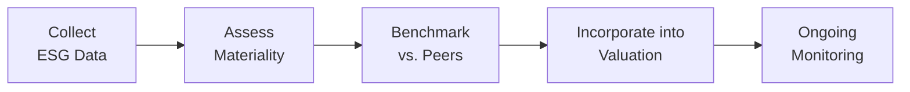

## Overview of ESG Data Integration

So, let’s dive in. When it comes to analyzing a company or an industry, we usually obsess over financial metrics—revenues, margins, patterns in free cash flow, you name it. But these days, purely financial data doesn’t always cut it. We’ve seen some surprising shocks in markets related to environmental incidents, labor disputes, or questionable governance practices. These things can blindside you if you haven’t done your homework on the ESG front.

ESG stands for Environmental, Social, and Governance. Yes, it’s a big, broad umbrella, and some folks might think it’s just about “doing good.” But from an investor’s perspective, strong ESG performance can be a signal of risk management or even a competitive advantage. Weakness in ESG factors, on the other hand, can lead to operational, regulatory, and reputational risks that translate into real financial losses.

## Why ESG Matters in Equity Research

I remember a conversation I had with a portfolio manager who tracked multiple oil and gas companies. She looked thoroughly exhausted—there had just been a major spill at one of the firms she covered, and overnight the share price plummeted. Now, she knew that company’s financial statements like the back of her hand. But she admitted that she’d overlooked some red flags in the firm’s environmental protocols. That experience reminded me that ESG issues can be as relevant to future cash flows as typical cost-of-goods-sold numbers.

When you integrate ESG data into your equity analysis:

• You get a more complete picture of risk and opportunity.  
• You can identify companies with strong governance that might prevent catastrophic events.  
• You may discover intangible assets—like brand loyalty or innovative green tech—that aren’t fully captured in financials.  

## Common ESG Data Sources

You know, in the old days, you’d have to manually dig through corporate responsibility reports, sit through endless management Q&A, and attempt to standardize the data yourself. Thankfully, there are third-party data providers who make life easier (at least somewhat). Among the popular ESG ratings providers are:

• MSCI ESG Ratings  
• Sustainalytics  
• Refinitiv  
• ISS (Institutional Shareholder Services)  

These providers compile information from public disclosures, media coverage, NGO reports, and more. They analyze everything from greenhouse gas (GHG) emissions and board diversity to controversies like labor disputes. They then distill it into a rating or score you can use as a quick reference.

Here’s a simple table illustrating some of the focus areas of these major providers:

| Provider      | Key Focus Areas                               | Output Format                         |
|---------------|-----------------------------------------------|---------------------------------------|
| MSCI ESG      | Climate change, governance, controversies     | Letter ratings (AAA–CCC)             |
| Sustainalytics| Risk exposure, management, controversies      | Risk scores (0–100; lower = better)  |
| Refinitiv     | Emissions, innovation, diversity, controversies | Numeric ESG scores                   |
| ISS           | Proxy voting, board structure, policy alignments | Numeric or categorical scores        |

None of these are perfect. You might spot inconsistencies between rating agencies—one might rate a firm highly while another sees notable governance risk. That’s why it’s often helpful to compare multiple sources and dig deeper into the raw data where possible.

## Identifying Material ESG Factors

Not all ESG issues matter equally to every company. A water usage scandal might be huge for a beverage manufacturer but negligible for a digital advertising firm. This concept of “materiality” is essential. Materiality basically means: “Does this factor significantly influence a company’s financial performance or valuation?” If it does, it’s material.

In many industries, greenhouse gas emissions and carbon intensity are big deals—especially in energy, mining, utilities, and heavy manufacturing. Meanwhile, companies in tech or finance might place more emphasis on data security, privacy, or employee diversity. Social issues such as supply chain transparency and labor rights often loom large in clothing and consumer electronics.

## Peer Benchmarking and Industry Analysis

A great way to gauge whether a firm’s ESG profile is strong, weak, or average is to compare it against its industry peers. For instance, in the automotive sector, you might look at average fleet emission levels. For pharmaceuticals, you’d compare drug pricing practices and patient access programs. Peer benchmarking helps highlight outliers. Sometimes, a firm’s relatively poor rating draws attention to higher compliance risks or costly regulatory fines down the road.

### Example: Energy Sector Carbon Intensity

Let’s say we have three hypothetical energy companies:

• Company A: 120 metric tons of CO₂ per $1M in revenue  
• Company B: 70 metric tons of CO₂ per $1M in revenue  
• Company C: 95 metric tons of CO₂ per $1M in revenue  

In the industry, the peer average might be around 100. So, Company B stands out favorably, while Company A looks like it could face higher carbon taxes or negative investor sentiment if regulations tighten. Even a single number like this can be eye-opening when stacked against peers.

## Gathering ESG Data—A Quick Process Flow

Below is a simple flow diagram illustrating how many analysts structure their ESG data gathering and integration into the investment process:

1. Collect ESG Data: Pull from company reports, sustainability disclosures, and third-party provider scores.  
2. Assess Materiality: Determine which factors truly matter for the specific company or industry.  
3. Benchmark vs. Peers: See if the company is an outperformer or laggard on key metrics.  
4. Incorporate into Valuation: Adjust discount rates, cash flows, or growth forecasts.  
5. Ongoing Monitoring: Update your analysis as new data emerges and corporate circumstances change.  

## Scenario Analysis for ESG Risks and Opportunities

Look, we can all get starry-eyed about a company’s carbon neutrality declaration, but it’s wise to ask: what if carbon regulations become more stringent? Scenario analysis helps you imagine different plausible futures. Maybe in the “strict regulation” scenario, carbon taxes rise by 50%, leading to a direct hit on operating margins for high-intensity emitters. Or perhaps a major shift in consumer preference toward ethically sourced products might boost sales for companies with robust supply chain transparency.

Here’s a mini numeric scenario analysis:
- Baseline scenario: The company’s carbon tax is $10 per metric ton, leading to annual compliance costs of $30 million.  
- Stricter regulation scenario: Carbon tax jumps to $30 per metric ton, ballooning compliance costs to $90 million.  

If this additional $60 million cost is enough to wipe out half of the company’s earnings, you’d see a dramatic change in the valuation. By building a range of ESG-related scenarios, you can better understand the downside risk—or upside potential—associated with certain ESG dynamics.

## Incorporating ESG into Valuation Models

We often apply the standard discounted cash flow approach: project future free cash flows (FCF), discount them back to present value, and sum it all up. But guess what? If you think a company faces elevated ESG risk—like big pending lawsuits over environmental damage or deep-seated governance problems—then you might increase your required rate of return (i.e., cost of equity). A poor ESG performer may warrant a higher discount rate to reflect greater uncertainty or volatility.

Alternatively, strong ESG performers could see improved brand loyalty, better customer retention, deeper stakeholder trust, or even a lower cost of capital because of less regulatory risk. That might justify more optimistic growth assumptions or a reduced discount rate.

### Very Simple Example

Imagine a base-case scenario for a mid-sized manufacturing firm:

• Forecast annual FCFE: $50 million (constant)
• Cost of equity: 10%
• Present Value of Perpetuity: FCFE / Cost of equity = $50M / 0.10 = $500M

Now let’s say you realize the firm might face a potential environmental fine or mandatory equipment upgrade that could erode its cash flows. You decide to raise the cost of equity to 11%.

• Revised Present Value of Perpetuity: $50M / 0.11 ≈ $455M

That’s a $45M difference in implied equity value just for factoring in some ESG uncertainty. And if there’s also a hit to FCFE itself, the valuation gap widens even more.

## Detecting Greenwashing

One big worry is whether a company’s ESG claims are genuine. Sometimes you’ll spot a glaring mismatch between a firm’s ambitious “We plan to be carbon neutral by 2030!” statement and the reality of rising emissions. This mismatch can indicate greenwashing, where a firm tries to appear more environmentally friendly than it truly is. Evaluating disclosures carefully—along with third-party assessments, controversies reported in the media, and historical data—can help you spot these discrepancies.

## Engaging with Companies

If you’re an active investor, one way to validate the numbers is simply to ask questions. Call up investor relations or management, attend shareholder meetings, or send in your questions about that “bold sustainability program.” This is often called active ownership—shareholders use their equity stake to push for clarity or better performance on ESG issues.

You might dig into why the board hasn’t set measurable diversity targets. Or where the CFO sees the biggest climate-related risks. Even a single conversation can reveal whether the leadership is serious about ESG or just repeating talking points.

## Practical Case Study: Tech Industry Data Security

Let’s consider a data security fiasco that a technology firm might face—say, a major data breach that exposes millions of users’ personal information. You might see:

• Social Impact: Loss of user trust, negative social media sentiment, potential regulatory fines.  
• Governance Issues: Inadequate board oversight, questionable internal controls, or misalignment of executive incentives.  
• Financial Consequences: Lawsuits, regulatory penalties, brand damage leading to lost sales.  

From an ESG perspective, the “S” and the “G” end up translating into quite a big financial hit. This should factor into your revenue assumptions, your operating margin, or your discount rate—especially if repeated incidents or management negligence become apparent.

## Best Practices and Common Pitfalls

Best Practices:
- Use multiple ESG data sources to cross-check information.  
- Identify industry-specific KPIs that really matter (e.g., carbon intensity in energy, employee turnover in retail).  
- Perform scenario analyses on both the upside (new green product lines) and the downside (regulatory penalties).  
- Incorporate ESG insights into both qualitative assessments and quantitative models—don’t just bolt it on at the end.

Common Pitfalls:
- Over-reliance on a single ESG score or rating.  
- Failing to differentiate between immaterial and material ESG factors.  
- Believing unrealistic corporate promises. If the firm’s statements conflict with real-world data, investigate.  
- Ignoring social or governance factors just because they can be harder to quantify.

## Additional Diagrams or Tables

Beyond the simple flowchart we showed, you might consider a table that lists potential ESG factors to integrate into your DCF model. For example:

| ESG Factor              | Possible Model Adjustment              |
|-------------------------|----------------------------------------|
| Carbon Intensity        | Increase projected operating costs due to carbon taxes |
| Governance Quality      | Adjust terminal growth rate for improved or worsened outlook |
| Data Security Concerns  | Raise discount rate to reflect litigation risk          |
| Positive Brand Reputation | Lower marketing costs or raise revenue growth assumptions |

## References and Further Exploration

For anyone wanting to take a deeper dive, here are some reputable resources:

- SASB (Sustainability Accounting Standards Board) Industry Guides: www.sasb.org  
- GRI (Global Reporting Initiative) Standards: www.globalreporting.org  
- “Integrating ESG Data into Equity Valuation,” by Refinitiv: www.refinitiv.com  
- CFA Institute: “Handbook on ESG Integration”: www.cfainstitute.org  

You’ll find industry-specific standards in the SASB guides, frameworks for comprehensive disclosures from GRI, and practical tips from Refinitiv on weaving ESG insights into equity models. The CFA Institute’s materials also provide excellent best practices and case studies.

And there you have it. By weaving ESG data into your company and industry analyses, you’re more likely to anticipate risks and capture opportunities that purely financial analysis might miss. Learning to do this thoroughly can be a real team effort—so keep collaborating with colleagues, management teams, and even sustainability experts. Over time, you’ll develop a sense for which ESG metrics truly matter in a given context, and that should put you in a stronger position as an analyst or portfolio manager.

## Test Your Knowledge: Integrating ESG Data into Equity Research



### Which of the following best describes the concept of materiality in ESG analysis?

- [ ] Refers to a company's net profit margin.
- [ ] The extent to which a factor is purely philanthropic in nature.
- [x] The significance of a factor in influencing an investor’s decision-making.
- [ ] Whether the company provides an annual sustainability report.

> **Explanation:** Materiality in ESG analysis concerns whether a particular ESG issue has a meaningful impact on a company’s financial performance and thus is important to an investor’s decision-making process.

### When benchmarking ESG performance, why is it crucial to compare companies within the same industry?

- [ ] Different industries use different accounting standards.
- [x] ESG factors vary in relevance and risks across industries.
- [ ] It reduces the role of external auditors in rating the companies.
- [ ] It eliminates any need for data standardization.

> **Explanation:** Certain ESG issues are more pertinent in one industry than another (e.g., carbon emissions for energy firms vs. data security for tech firms). Comparing within the same industry allows for more accurate peer benchmarking.

### A technology firm experiences a major data breach. Which ESG factors would likely be most impacted?

- [ ] Environmental footprint and carbon intensity.
- [x] Social trust and governance oversight.
- [ ] Waste management practices.
- [ ] Supply chain transparency.

> **Explanation:** A data breach primarily reflects social issues (loss of user trust, privacy concerns) and governance oversight (board and executive accountability). These factors have financial consequences in terms of lawsuits and lost revenue.

### How can scenario analysis enhance the integration of ESG considerations?

- [ ] By eliminating the need for traditional valuation models.
- [x] By examining potential futures if environmental or social regulations tighten.
- [ ] By guaranteeing a lower cost of capital.
- [ ] By making ESG data providers obsolete.

> **Explanation:** Scenario analysis allows analysts to forecast how tightening regulations or social shifts might affect costs, revenues, or market positions, creating various potential outcomes rather than relying on a single forecast.

### Which is a practical way to integrate ESG concerns into a discounted cash flow (DCF) valuation?

- [x] Adjusting the discount rate upward for higher perceived ESG risks.
- [ ] Adding a fixed ESG penalty after calculating terminal value, regardless of industry.
- [ ] Ignoring ESG factors when the firm is profitable.
- [x] Changing growth assumptions if ESG improvements boost competitiveness.

> **Explanation:** ESG considerations can manifest as higher risks (justifying a higher discount rate) or growth opportunities (justifying improved growth rates). Both approaches may be valid depending on the firm’s ESG profile.

### Which of the following statements about greenwashing is correct?

- [x] It refers to companies overstating their environmental or social achievements.
- [ ] It describes a firm’s process for recycling its products efficiently.
- [ ] It involves third-party ESG rating agencies presenting biased data.
- [ ] It is a legal term for ESG tax benefits.

> **Explanation:** Greenwashing happens when companies project a false or overstated image of sustainability or ethical practices.

### In the energy sector, what KPI is often highlighted when analyzing a company’s environmental impact?

- [ ] Share buyback volume.
- [x] Carbon intensity or CO₂ emissions per unit of revenue.
- [ ] Board gender diversity.
- [ ] Research and development spending as a percentage of revenue.

> **Explanation:** For energy companies, carbon intensity is a key metric because it captures how much greenhouse gas the company emits relative to its revenue, highlighting both risk and environmental footprint.

### Which of the following best defines “active ownership” in ESG investing?

- [ ] A strategy where investors only buy shares in fully sustainable companies.
- [ ] Passive investment in index funds with high ESG ratings.
- [x] An approach where shareholders engage with company management to influence ESG policies.
- [ ] Abstaining from voting in important shareholder meetings.

> **Explanation:** Active ownership involves using one’s shareholder rights—voting, proposing topics for discussion, and direct engagement—to steer the company toward stronger ESG policies.

### When would external ESG ratings from agencies like MSCI or Sustainalytics be considered insufficient on their own?

- [x] When assessing subtle company-specific risks or verifying data in areas the rating may not cover deeply.
- [ ] When working with large-cap companies due to their established market position.
- [ ] When the industry is entirely regulated by government authorities.
- [ ] When the analyst has little knowledge of financial statements.

> **Explanation:** ESG ratings can sometimes miss nuances, and there can be discrepancies among providers. Digging into detailed disclosures or controversies may reveal a more accurate risk profile.

### True or False: ESG integration in equity research can include adjusting a company’s growth rate, cost of equity, or both, depending on the firm’s ESG performance.

- [x] True
- [ ] False

> **Explanation:** Strong ESG performance might bolster customer loyalty and revenue growth, just as poor ESG performance can raise risks through increased costs or reputational damage, affecting the cost of equity.


