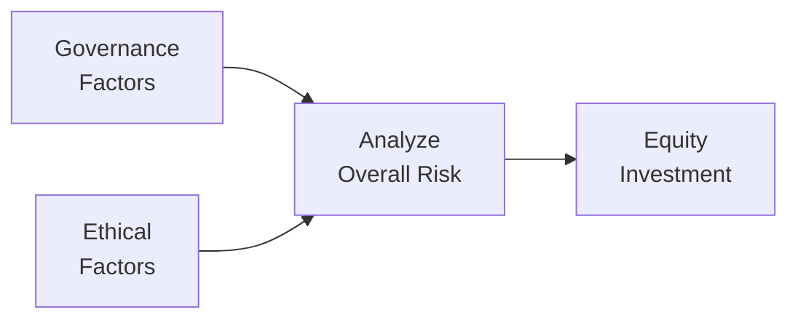

## Introduction

Let’s be honest: sometimes, deciding which company shares to buy can feel more like detective work than finance. You know, you start digging into annual reports, proxy statements, and all those footnotes—and next thing you know, you’re trying to figure out whether the board of directors is actually independent or just stuffed with an executive’s friends. Governance issues and ethical concerns can make a huge difference when you’re looking at a particular equity. After all, if a firm's leadership is up to no good, the share price could plummet faster than you can say, “What just happened?”

From a CFA Level I perspective, understanding ethical and governance matters is about learning how to identify red flags, interpret signals from management, evaluate board structures, and appreciate how good oversight might protect shareholder value. This section takes a closer look at these issues, which are not only relevant to smaller private companies but can affect big, global businesses, too.

## Significance of Governance and Ethics in Equity Selection

Governance in the corporate context essentially deals with how decisions are made, how rights and responsibilities are distributed among different parties (shareholders, board members, managers), and how performance accountability is enforced. Good governance aligns the interests of managers and shareholders, making sure neither side exploits the other. But when governance fails, watch out. Managerial entrenchment can happen, meaning top executives might be practically impossible to remove—even if they’re doing a terrible job. That can lead to corruption, misalignment of incentives, or a complete lack of oversight.

Similarly, ethical considerations reach beyond the boardroom and into a company’s day-to-day operations. Imagine a firm embroiled in a bribery scandal or caught falsifying its financial reports. Not only does that put the company at legal risk, but it damages its reputation. At the portfolio level, these issues can hammer shareholder value. So, yeah—this stuff matters.

## Board Composition and Structure

Board composition can make or break a company's governance profile. For instance, if the board is chock-full of directors who have personal ties to the CEO, or worse, are the CEO’s family members, you can guess how "independent" their decisions might be. In contrast, having a board with a high proportion of independent directors, diverse skill sets, and a variety of professional backgrounds can create a balanced environment for overseeing management.

Broadly, when analyzing a board:

• Independence: More independent directors mean fewer conflicts of interest.  
• Diversity: A mix of genders, ethnicities, and professional experiences often leads to more robust decision-making.  
• Expertise: Board members with strong financial, industry, or managerial backgrounds can help the firm navigate complexities.  

If you notice a board that’s basically a mirror of the CEO’s preferences—maybe people from the same social circles or a lack of any real financial experts—well, that might be a signal to think twice about making an investment.

## Executive Compensation and Performance Incentives

Let’s talk money—executive compensation. It’s not inherently evil for top managers to earn large sums, but the structure of that compensation can influence their behavior. For instance, do their incentives encourage them to pursue short-term stock price gains at the expense of long-term value? Or are they rewarded for steady, sustainable growth?

Many companies link CEO/management pay to performance targets like earnings-per-share or share price appreciation. If these targets are short-sighted, managers might be tempted to cut R&D or get creative with accounting to meet quarterly benchmarks. Conversely, well-designed compensation plans can encourage strategic thinking and prudent risk-taking. Some examples of performance-linked pay:

• Stock Options and Restricted Stock: Aligns management incentives with share performance over time.  
• Bonuses Tied to ESG Metrics: Encourages corporate behaviors that value environmental, social, and governance outcomes.  
• Long-Term Incentive Plans (LTIPs): Rewards sustained growth rather than quick wins.  

When analyzing compensation, always ask: Are managers getting rich regardless of performance, or do they earn more only if the company and its shareholders benefit?

## Shareholder Rights and Protections

When you buy a company’s stock, you expect certain rights, like voting on major corporate matters or receiving dividends if declared. But not all shares give equal voice. Some firms adopt dual-class share structures, under which founders or insiders have superior voting rights compared to ordinary shareholders. That can be great for preserving a visionary founder’s control, but it also can hamper accountability. Many institutional investors consider these setups a red flag if the controlling shareholders are indifferent to broader investor interests.

Cross-shareholding arrangements—where firms own each other's stock—can also reduce transparency and amplify potential conflicts of interest. This structure can shield poor management from the checks and balances typically offered by an active shareholder base.

“Say on Pay” is another interesting mechanism. Even though these votes are often advisory only, they’re a strong governance indicator. If shareholders vote a big “no” to management’s pay plan but the board ignores it, that’s a sign the board might not be listening at all.

## Ethical Concerns Across Operations

So, how does “ethics” fit in here? Ethics encompasses a firm’s approach to social responsibility, transparency, and adherence to laws, regulations, and societal norms. It includes:

• Anti-corruption measures: Firms operating in emerging markets may face heightened bribery risks.  
• Transparent reporting: A culture of honesty fosters investor trust.  
• Fair labor practices: Exploitative labor conditions can lead to boycotts, reputational damage, and legal trouble.  
• Product safety standards: Cutting corners with safety can cause product recalls or lawsuits.  

I once analyzed an industrial equipment manufacturer with a so-so board. The governance looked fine on paper. But it turned out the company was using questionable chemicals in its manufacturing process and concealing the potential health hazards. The moment that detail got out, the share price tumbled almost 40% within a few weeks, as lawsuits and negative media coverage piled up. The lesson: never ignore potential ethical hazards just because the board meets certain best-practice guidelines. The actual corporate culture matters, too.

## Governance Metrics and Disclosure

Information on governance is often right there in a company’s proxy statement (in many jurisdictions, that’s the primary document used before shareholder meetings), corporate bylaws, or annual reports. The proxy statement typically discloses:

1. Board Responsibilities and Composition  
2. Executive Compensation Policies  
3. Potential Conflicts of Interest  
4. Voting Procedures and Shareholder Proposals  

Beyond these, third-party providers compile corporate governance scores or ratings by evaluating multiple data points, like board diversity, compensation structures, and ownership concentration. Although these proprietary scores can’t be the sole decider, they offer a helpful snapshot of how a firm stacks up against peers.

## Common Red Flags to Spot

Here’s a quick (and hopefully handy) list of governance and ethical red flags you might encounter:

• Dual-Class Shares with Abnormally High Voting Power: Founder or insider control to an extreme.  
• Frequent Auditor Changes: Possibly indicates management “hunting” for friendly auditors.  
• Lack of Board Independence: Most directors with ties to the CEO or controlling shareholder.  
• History of Controversies or Litigation: Repeated legal trouble can signal deeper cultural problems.  
• Complex Cross-Shareholding: Obscures real ownership, can entrench control.  
• Sudden Executive Departures: Might be benign, or might indicate internal power struggles or ethical complaints.  

One local tech company was famous in my hometown for having a founder who basically ran the show like a personal fiefdom. Minority shareholders never had their say, and well, it didn’t end happily—eventually, the stock delisted following an accounting scandal. Governance, ethics: again, it matters.

## Fallout from Corporate Scandals

When a scandal hits—whether it’s a data breach, accounting fraud, or environmental disaster—the share price can tank. Take the example of some well-known automotive or tech companies that faced huge fines or mass product recalls due to unethical or unsafe practices. The direct cost of remedying the problem (paying fines, fixing flaws, or settling lawsuits) is only part of the story. The bigger blow might be to the firm’s brand, consumer trust, and staff morale. In the worst-case scenario, the firm may never fully recover.

For us, as aspiring (or practicing) analysts, this underscores why it’s so crucial to weigh the intangible aspects of a firm’s risk profile. Don’t just check the financial metrics—look at the track record of leadership integrity, the board’s engagement, and the corporate culture.

## Governance Screens and Institutional Requirements

Large institutional investors (like pension funds and insurance companies) often adopt formal governance screens. Before investing in a new stock, they might require:

• Independent Boards: Over half of the board seats occupied by independent directors.  
• Separation of CEO and Chair Roles: Minimizes concentration of power.  
• Clear Succession Planning: Reduces surprises if executives depart.  
• Well-Defined Codes of Conduct: Anti-fraud, anti-bribery, whistleblower policies, etc.  

Moreover, certain funds prefer investing in companies that score high on ESG ratings. Some might even exclude businesses that fail to meet minimal governance or ethical standards. As a result, you’ll sometimes see companies carry out “board refreshment” or adopt these policies shortly before going public or seeking large institutional capital—basically, they want to appear squeaky clean for potential big investors.

## Activist Investors and Governance Reforms

Activist investors—hedge funds or groups of shareholders—often buy stakes in companies they believe are undervalued and push for changes. These changes can be operational (like cutting costs or selling non-core divisions) but may also be governance-driven, such as:

• Replacing ineffective board members.  
• Adopting more shareholder-friendly bylaws.  
• Overhauling executive compensation structures.  

While activists can come across as disruptive, they often act as catalysts for positive change—especially if the existing board or management has been negligent. This intersection between governance and activist investing highlights how crucial oversight is to a company’s strategic direction.

## Putting It All Together (With a Flowchart!)

Below is a simple depiction of how ethical and governance considerations feed into the equity selection process:

This flowchart reminds us that governance and ethical factors aren’t isolated checkboxes; they interact with the financial and strategic analysis you’re already doing. A strong governance profile coupled with sound ethics can lower the risk premium you might otherwise assign to a stock. Alternatively, questionable governance and shady ethics can signal higher risk or even disqualify the investment outright, depending on your criteria.

## Strategies and Best Practices

1. Conduct Thorough Due Diligence.  
   Delve into proxy statements, board member bios, compensation reports, and any ethical controversies.  
2. Stay Alert to Changing Signals.  
   Board reorganization can be a positive sign, whereas frequent CFO turnover might be a red flag.  
3. Use Independent Ratings and Screens.  
   While not foolproof, third-party governance scores offer useful, if broad, perspectives.  
4. Engage with Management if Possible.  
   Some institutional investors use their voting power or direct discussions with management to push for improvements.  
5. Diversify.  
   Even the best research can’t predict future crises. Spread risk across multiple investments.  

## Conclusion and Takeaways

Ethical and governance issues are central to responsible and strategic equity selection. Strong governance can promote accountability, transparency, and aligned incentives, protecting investors from blow-ups. Ethical lapses, on the other hand, can destroy a company’s goodwill and do irreversible damage to an investment portfolio. By proactively spotlighting potential red flags—like dual-class share structures or questionable executive pay schemes—and by relying on robust governance data, investors can improve their decision-making.  

In the end, combining financial analysis with careful governance and ethical considerations puts you on a path toward truly sustainable value creation in equity investments.

## References and Further Reading

• CFA Institute: “The Corporate Governance of Listed Companies: A Manual for Investors”  
• OECD Principles of Corporate Governance (http://www.oecd.org)  
• “Corporate Governance: The New Paradigm,” by Martin Lipton et al., Harvard Law School Forum on Corporate Governance  
• ICGN Global Governance Principles (http://www.icgn.org)  

---

## Test Your Knowledge: Ethical and Governance Issues in Equity Selection



### Which of the following is the best indicator that a company’s board of directors may be truly independent?

- [ ] The CEO personally selected most of the directors.  
- [x] Most directors have no direct financial or familial ties to management.  
- [ ] A major shareholder has veto power over board appointments.  
- [ ] The directors are from friendly competitor firms in the same industry.  

> **Explanation:** Independence typically implies directors do not have significant personal or professional relationships with the executives, ensuring unbiased oversight.

### What is one key objective of linking executive compensation to long-term performance metrics?

- [ ] To remove accountability for short-term actions.  
- [x] To align management with sustainable, shareholder-focused goals.  
- [ ] To discourage risk-taking entirely.  
- [ ] To ensure executives are paid for each project milestone.  

> **Explanation:** Linking compensation to long-term metrics, such as multi-year performance targets, balances managerial decision-making between short-term and strategic objectives, aligning management's interests with those of shareholders.

### A dual-class share structure typically raises concerns because:

- [x] It grants disproportionate voting power to a special class of shares, possibly entrenching certain shareholders.  
- [ ] It reduces the liquidity of the overall equity market.  
- [ ] It disqualifies the company from listing on major exchanges.  
- [ ] It ensures fair treatment of minority shareholders.  

> **Explanation:** Dual-class shares often let founders or insiders maintain control despite holding a smaller economic stake, potentially undermining minority rights.

### Which of the following might be considered a reliable external resource for evaluating a company’s governance?

- [x] Third-party governance rating agencies.  
- [ ] The company’s own marketing department.  
- [ ] Word of mouth from social media influencers.  
- [ ] A single analyst’s personal blog.  

> **Explanation:** Independent and recognized governance rating agencies compile objective data points into metrics for comparison, offering a more balanced perspective than marketing materials or personal blogs.

### What is the primary concern if a company frequently changes its external auditors?

- [ ] They are ensuring the audit firm doesn’t get complacent.  
- [ ] They are diversifying corporate relationships.  
- [x] They may be “opinion shopping” to find a compliant auditor.  
- [ ] They are trying to cut costs in the audit process.  

> **Explanation:** Companies changing auditors repeatedly could be searching for someone willing to overlook questionable accounting issues, which is a governance red flag.

### Why might a pension fund place constraints on investing in firms with weak governance?

- [ ] Pension funds are legally prohibited from all forms of risk.  
- [x] Weak governance can increase risk of scandals and financial mismanagement, jeopardizing investment returns.  
- [ ] Weak governance usually leads to higher dividends, lowering portfolio payouts.  
- [ ] Because the CFA Institute Code prohibits them.  

> **Explanation:** Institutional investors often have fiduciary duties to protect capital, so they may avoid companies with insufficient oversight or high operational risks.

### When is “Say on Pay” most effective as a governance mechanism?

- [x] When management and the board take shareholder feedback seriously, making adjustments as necessary.  
- [ ] When shareholders are guaranteed binding authority to set perquisite budgets.  
- [x] When the vote on executive compensation is both transparent and encouraged by the board.  
- [ ] When executive salaries are too high, forcing an immediate pay reduction.  

> **Explanation:** Shareholder votes on pay can be impactful if boards actually integrate the feedback into compensation decisions and maintain transparency around the process.

### What is the main reason that unethical behavior can destroy shareholder value?

- [ ] Fines and penalties are typically covered by insurance.  
- [x] Reputational damage and legal ramifications can lead to a significant loss of market confidence.  
- [ ] The risk of detection is extremely low.  
- [ ] Unethical firms typically pay high dividends to compensate investors.  

> **Explanation:** Unethical behavior can result in fines, lawsuits, and reputational damage, causing investors and customers to flee, thus eroding long-term firm value.

### Which of the following statements about managerial entrenchment is most accurate?

- [x] It makes removing underperforming management difficult even if shareholders demand changes.  
- [ ] It helps ensure management stability and fosters strong leadership.  
- [ ] It is resolved automatically with well-structured stock options.  
- [ ] It is irrelevant for large-cap companies.  

> **Explanation:** Managerial entrenchment means management is safeguarded from removal, possibly prioritizing their own interests over the company’s well-being.

### True or False: Activist investors always harm a company’s governance by forcing short-term actions.

- [x] True  
- [ ] False  

> **Explanation:** This statement is false. While some activists focus on near-term gains, many others push for governance reforms (like board reconstitution or improved oversight) that can enhance long-term value.


