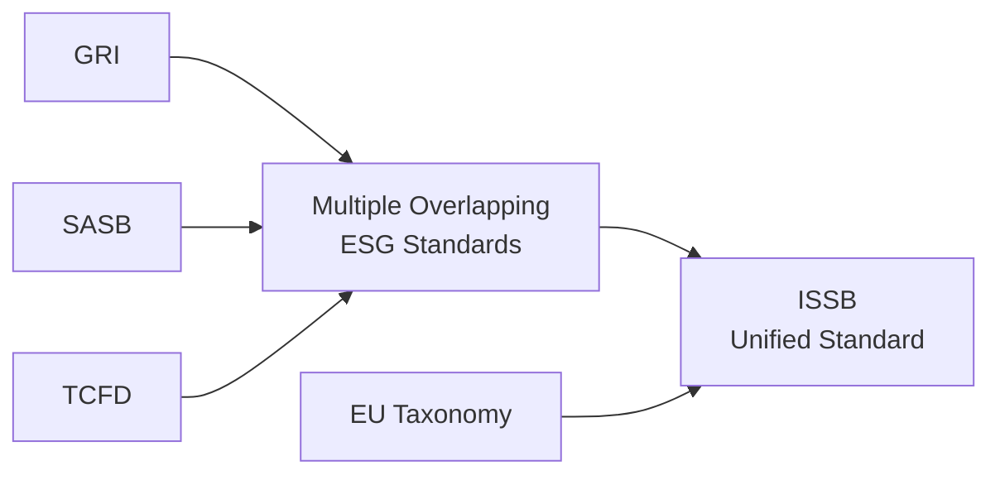

## Introduction
Investing with environmental, social, and governance (ESG) considerations is now firmly in the mainstream. A growing number of asset managers, pension funds, and individual investors want more clarity regarding the ESG profile of the companies they invest in—whether related to greenhouse gas emissions, labor rights, or board independence. This global push for transparency has spurred regulatory bodies around the world to craft new rules, guidelines, and frameworks. Frankly, these can be overwhelming at times. But hey, it’s also kind of exciting: We’re witnessing the evolution of financial markets as sustainability risks morph into key factors that can make or break investing decisions.

In this article, we’ll explore the key global trends and regulatory developments in ESG investing, with an emphasis on how they shape equity markets and portfolio management. We’ll tackle a mishmash of overlapping frameworks, highlight emerging best practices, and—most importantly—provide plenty of context on their real-world impacts. Let’s jump right in.

## Overview of Evolving Regulatory Landscape
Sometimes it feels like ESG regulations are arriving faster than smartphone updates. Different regions, from the European Union (EU) to the United States (US) to Asia-Pacific, are sharpening their disclosure requirements. The pace of evolution is quick, and ignoring these updates can be risky—especially if you’re a global investor racing to keep your portfolios compliant and strategically positioned.

### European Union (EU)
The EU has long been at the forefront of ESG regulations. Key initiatives include the Sustainable Finance Disclosure Regulation (SFDR) and the EU Taxonomy:

• SFDR demands that asset managers and financial institutions disclose how they integrate ESG factors into their investment processes. They also need to reveal if and how they consider “principal adverse impacts,” meaning the potential negative effects of their investments on sustainability goals.

• The EU Taxonomy is like a classification cheat sheet detailing which economic activities are labeled as “environmentally sustainable.” When a European fund manager markets a product as “green,” the EU Taxonomy sets the criteria.

• Related initiatives, such as the European Green Deal, aim for economy-wide changes, steering capital toward climate-neutral activities and setting stricter emissions targets.

### United States
If you’re operating in the US, you’re probably aware of the Securities and Exchange Commission (SEC)’s emerging focus on ESG. While not as formalized as the EU approach, the SEC has been signaling that new mandates could arise around climate disclosures, board diversity, and broader ESG risk factors. This includes:

• Potential new rules requiring public companies to disclose material climate risks and greenhouse gas emissions.

• Calls for standardization of ESG-related fund labeling, ensuring that products marketed as “ESG” or “sustainable” meet certain criteria.

• Greater scrutiny of alleged “greenwashing,” where fund managers or corporations overstate their ESG credentials.

### Asia-Pacific
Asia-Pacific regions are taking a diverse approach. Some markets, like Japan, Hong Kong, and Singapore, already mandate certain climate disclosures—often influenced by frameworks such as the Task Force on Climate-related Financial Disclosures (TCFD). Others are still exploring guidelines. In emerging economies, progress can be slower, reflecting different policy priorities and market maturity levels. Over time, though, a global push from major investors in the region is expected to accelerate alignment with popular ESG reporting frameworks.

### Emerging Markets
In many emerging markets—Latin America, Africa, parts of Asia—ESG regulation is advancing but still has a lot of catching up to do. Local regulators are increasingly aware that international capital demands robust ESG disclosures. But enforcement can be patchy. If you invest in emerging-market equities, keep a close eye on market-specific developments, as they can create both risks and opportunities. For instance:

• Brazilian regulators require listed companies to disclose adherence (or lack thereof) to the Brazilian Corporate Governance Code, which includes certain ESG elements.

• South Africa has a history of integrated reporting initiatives, reflecting the King IV Code on governance.

But, well, the alignment with global frameworks is still evolving. One day, we might see consistent global ESG reporting, but we’re not quite there yet—especially in emerging markets.

## The Push Toward Unified Standards
No conversation about ESG regulation is complete without mentioning the many frameworks that have emerged to guide corporate reporting. From Global Reporting Initiative (GRI) guidelines to the Sustainability Accounting Standards Board (SASB), to the TCFD’s climate-related disclosures, companies are juggling a lot. After all, each framework has its own angle, metrics, or objectives.

Enter the International Sustainability Standards Board (ISSB), established by the IFRS Foundation to develop a globally accepted standard for sustainability reporting. The ISSB aims to provide a comprehensive baseline that can complement existing frameworks. The intent is to unify overlapping standards and reduce confusion for issuers and investors.

Below is a high-level mermaid diagram showing how these frameworks might fit together. It’s simple but should give you a sense of the puzzle:

In the proposed future, a single ISSB standard could simplify life for everyone by giving:

• Companies one clear format to publish credible sustainability data.  
• Investors consistent metrics to compare ESG performance across firms.  
• Regulators fewer conflicting or duplicated disclosures to enforce.

## Climate Disclosures and Stress Testing
Increasingly, regulators are zeroing in on climate-specific disclosures—sometimes requiring financial institutions to use scenario analysis and stress testing. The TCFD recommends that companies assess performance under hypothetical conditions like “What if carbon prices triple over the next five years?” or “What if major customers shift to low-carbon suppliers?”

For example, a European bank might be asked to estimate the losses it could take on fossil-fuel-exposed loans if carbon taxes jump significantly. The bank’s equity investors, in turn, get a direct window into how climate policy could affect profitability and solvency. This kind of transparency can lead to more refined valuations of high-carbon vs. low-carbon assets.

## Greenwashing Concerns and Investor Protection
Greenwashing happens when an organization puts forth an inflated or outright misleading impression of its ESG performance. It could be a product label including a trendy adjective like “responsible” or “green,” without much substance behind it. Regulators are intent on reducing greenwashing because it erodes trust in ESG markets and distracts capital from truly sustainable projects.

• The EU’s SFDR and Taxonomy are prime examples of how regulators try to curb greenwashing: If a firm markets a product as “Article 9” (dark green), it must meet stringent sustainability criteria.

• In the US, the SEC has begun enforcement actions against companies that misrepresent their ESG strategies or overstate their “greenness.”

• Across Asia, regulators are also stepping in with guidelines for ESG-labeled financial products, ensuring that the marketing is consistent with the actual holdings or strategies.

Ultimately, clamping down on greenwashing is an investor-protection measure. Regulators want an even playing field, so that genuinely ESG-focused firms get credit for their efforts.

## Impact on Equity Valuation and Competitive Landscape
Regulatory shifts aren’t just compliance checkboxes. They can reconfigure entire industries, changing which business models remain competitive. For instance:

• Energy companies used to rely heavily on carbon-intensive operations, but new disclosure rules can highlight climate risks, shifting investor preferences. Share prices might drop if shareholders see that future carbon taxes or stricter emission regulations will weigh on profitability.

• Apparel manufacturers with questionable supply chain labor practices might face social backlash once new ESG disclosures become mandatory. This can lead to reputational harm and push investors away.

• Tech companies arguably benefit from their relatively lower natural resource usage (compared to heavy industries), yet they must still address data privacy (a governance and social issue) and e-waste concerns.

As you can see, ESG regulation can tilt the competitive landscape, influencing which equities remain attractive under new social or environmental norms.

## Best Practices for Investors
Given that ESG regulations can influence both the risk profile and market valuation of equities, portfolio managers and analysts need a clear approach. Here are some suggestions:

• Stay Current on Regulatory Changes: Monitor new ESG rules in your target regions. This can be as simple as subscribing to regulatory updates from the European Commission, SEC, or local stock exchanges.

• Integrate ESG into Valuation Models: For instance, you might incorporate a higher discount rate for stocks with significant climate risks that lack mitigating strategies.

• Evaluate ESG Data Fidelity: Look for discrepancies in what a company says vs. what the data show. Ask questions like, “Are they simply restating TCFD guidelines, or are they effectively implementing them?”

• Encourage Disclosure: If you have a large shareholding, consider engagement tactics such as writing letters, attending shareholder meetings, or proposing ESG-related resolutions that push companies to expand and improve their reporting.

• Beware of “ESG Blanket Statements”: Avoid relying on broad labels like “sustainable fund” without checking deeper into methodology, underlying holdings, and alignment with recognized standards.

## Personal Observations
I recall chatting with a friend who works in the sustainability department of a large asset manager. It was eye-opening hearing about the internal scramble whenever a new regulation hits—everyone from compliance to portfolio management tries to figure out the short-term reporting changes while ensuring they don’t overpromise or mislabel funds. It really brought home the day-to-day complexities that can get overshadowed by the big headlines. So, yes, these policies can feel like big macro forces, but they filter down to everyday tasks—analyzing emissions data, verifying supplier codes of conduct, and so on.

## Example: Estimating Regulatory Impact on a Hypothetical Oil & Gas Firm
Let’s take a simple numeric example to see how regulatory changes might affect equity valuation. Suppose you’re analyzing a hypothetical oil & gas producer:

• Current stock price: $30.  
• Expected earnings per share (EPS) next year: $3.  
• The firm’s cost of equity: 10%.  
• Growth rate: 2%.  

Without further ESG concerns, a simple dividend discount model or free cash flow approach might produce a certain fair value—say $35 per share.

Now, let’s assume regulators announce a carbon tax that directly impacts the firm’s cash flow, reducing expected EPS by 10% next year. Instead of $3 in EPS, that’s $2.70. Also assume your growth rate drops to 1% because you expect more taxes in coming years. Importantly, you might revise the cost of equity to 11% due to higher perceived risk. Suddenly, your fair value estimate might drop below $30, implying the stock is overvalued under the new regulatory environment. That’s a simplified example, but it shows how regulatory changes can quickly reshape a security’s risk and return profile.

## Final Exam Tips
For CFA candidates, ESG is not just an add-on concept. You might see it directly tested in item set questions or integrated into a broader portfolio management scenario. Keep in mind:

• Familiarize Yourself with Key Frameworks: Know the basics of SFDR, TCFD, ISSB, and EU Taxonomy. You should be able to discuss how each might affect valuation or risk management.

• Connect ESG to Standard Equity Valuation Approaches: Recognize how new disclosures or climate risk stress tests could affect beta, cost of equity, or growth assumptions.

• Use Scenario Analysis in Exam Answers: If a question references new climate regulations, discuss how you’d model the potential impacts on a company’s future cash flows or revenue streams.

• Beware of Overgeneralizing: Realize that sector and geographic nuances can be decisive in your final analysis.

## References for Further Exploration
• European Commission: “EU Sustainable Finance” (https://ec.europa.eu)  
• IFRS Foundation: “ISSB Updates” (https://www.ifrs.org)  
• Securities and Exchange Commission (SEC): https://www.sec.gov (search ESG/climate rule proposals)  
• “Global ESG Regulation Trends and Their Impact on Equity Markets,” World Bank Policy Research Papers  

## Practice Questions: ESG Investing Regulatory Trends



### Which statement best characterizes the EU’s Sustainable Finance Disclosure Regulation (SFDR)?

- [ ] It applies only to banks domiciled in EU member states.
- [ ] It mandates that companies in the EU reduce 50% of their greenhouse gas emissions by 2030.
- [x] It requires asset managers to disclose sustainability risks and impacts within their investment processes.
- [ ] It deals exclusively with labeling solar energy products as sustainable solutions.

> **Explanation:** SFDR imposes sustainability disclosure requirements on asset managers and financial institutions, ensuring that investment processes, sustainability risks, and potential adverse impacts are disclosed to investors.

### Why is the EU Taxonomy considered significant for sustainable investing?

- [ ] It measures the ESG score of each listed EU stock.
- [x] It provides a classification system for economic activities deemed environmentally sustainable.
- [ ] It replaces all other existing ESG standards worldwide.
- [ ] It penalizes companies that do not meet TCFD guidelines.

> **Explanation:** The EU Taxonomy is a classification system guiding which economic activities qualify as environmentally sustainable, shaping how funds can label themselves “green” or “sustainable.”

### What is the primary goal of the ISSB under the IFRS Foundation?

- [ ] To develop carbon trading platforms for asset managers.
- [ ] To enforce mandatory corporate social responsibility campaigns for multinational firms.
- [x] To create a globally accepted baseline for sustainability reporting standards.
- [ ] To replace national government policies on ESG disclosures entirely.

> **Explanation:** The ISSB aims to unify global sustainability reporting standards, offering a baseline that companies and regulators can adopt to reduce confusion and enhance comparability.

### A key motivation behind TCFD’s climate-related disclosure recommendations is to:

- [ ] Increase tax revenues from carbon-producing companies.
- [ ] Ensure all companies abide by an identical emissions cap.
- [ ] Mandate ethical labor practices across global supply chains.
- [x] Encourage companies to integrate climate scenario analysis and risk assessment into standard financial reporting.

> **Explanation:** TCFD promotes detailed climate-related disclosures, including scenario analysis, allowing companies and investors to better understand and manage climate risks.

### Which of the following is a potential direct outcome when regulators mandate stricter ESG disclosures?

- [x] Investors may revise valuations based on newly revealed climate risks.
- [x] Companies could face higher compliance costs to report ESG data accurately.
- [ ] Equity market volatility becomes impossible to measure or hedge against.
- [ ] The cost of equity never changes because ESG does not affect required returns.

> **Explanation:** Stricter ESG disclosures lead to fuller transparency (impacting valuations) and necessitate potentially costly processes for credible ESG data reporting. 

### What is one reason investors care about greenwashing regulations?

- [x] To differentiate legitimately sustainable investments from those with overstated ESG practices.
- [ ] To ensure companies lower their dividend payouts.
- [ ] To prevent short sellers from profiting on mislabeled funds.
- [ ] To replace mandatory corporate governance codes entirely.

> **Explanation:** Greenwashing hides the true ESG performance of firms, so clamping down on misleading claims helps investors align their capital with genuinely sustainable investments.

### Which statement best describes ESG regulation in emerging markets?

- [ ] It is absent in all markets outside North America.
- [x] It exists but often lags behind developed markets, with enforcement varying significantly by country.
- [ ] It surpasses European standards in most Latin American countries.
- [ ] It is solely focused on climate change and not corporate governance issues.

> **Explanation:** While emerging-market regulators are introducing ESG rules, they frequently trail developed markets in scope and enforcement, and progress is uneven across regions.

### How can mandatory climate stress testing impact a firm’s share price?

- [x] By revealing the firm’s potential vulnerability to high carbon taxes or stricter regulations.
- [ ] By guaranteeing a price increase since investors prefer more transparent companies.
- [ ] By immediately forcing the firm to delist from public markets.
- [ ] By removing any future need for external ESG audits.

> **Explanation:** When a firm’s stress testing outcomes show high climate risk exposure, investors may view it as riskier, adjusting the share price accordingly.

### What is the possible effect of climate regulations on an oil & gas producer’s valuation?

- [ ] No effect, since carbon taxes do not impact free cash flow.
- [x] A downward revision if carbon-emitting activities incur new costs or taxes.
- [ ] A permanent share price increase due to guaranteed government protection.
- [ ] A neutral effect because energy companies do not disclose ESG metrics.

> **Explanation:** New carbon taxes or stricter emissions requirements can erode profit margins and growth prospects, potentially lowering the oil & gas firm’s equity valuation.

### A portfolio manager modifies her cost of equity assumption upward after a new ESG regulatory announcement. This suggests that:

- [x] She expects higher risk due to potential compliance costs or market shifts.
- [ ] She is factoring in overly optimistic growth rates.
- [ ] She wants to reduce disclosure obligations.
- [ ] She expects an immediate, guaranteed rise in the underlying stock price.

> **Explanation:** Raising the cost of equity typically indicates that the manager sees higher investment risk, which might stem from new ESG regulations affecting a company’s operations and profitability.


